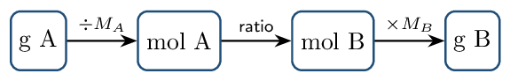

# Guided Notes

*Chapter 3 • Stoichiometry*  
Zumdahl §3.1–3.11 • PDF pp. 110–167 • 4 blocks

[← all lessons](../index.md)

---

> 📌 **How this chapter fits the AP course**
>
> The front half (§3.1–3.7) is CED Unit 1 territory — moles, molar mass,
> percent composition, empirical formulas. The back half (§3.8–3.11) is
> *Unit 4* content you won't formally meet until much later: balancing,
> mass-to-mass calculations, limiting reactant, percent yield. Working the
> whole chapter now front-loads the single most reusable skill in chemistry.
> Every unit from 4 onward assumes you can do stoichiometry without thinking.

## Counting by Weighing Zumdahl §3.1–3.5

> 📌 **By the end you can…**
>
> - Explain why chemists count particles by weighing them.
> - Convert fluently among mass, moles, and number of particles.

**Read:** Zumdahl §3.1–3.5 • PDF pp. 110–123

> 📌 **Retrieval warm-up**
>
> 1. Neutrons in ⁶⁵Cu: **\_\_\_\_\_\_**
> 2. Formula for calcium phosphate: **\_\_\_\_\_\_**
> 3. Sig figs in 0.03060 g: **\_\_\_\_\_\_**

#### INSTRUCTION A • The mole and molar mass 25 min

### Counting by weighing `ZUM §3.1–3.3`

`SP 5`

You cannot count atoms individually, so you count them the way a bank counts
pennies — by **\_\_\_\_\_\_**. That requires knowing the
average mass of one particle, which is what the periodic table gives you.

The mole is a counting unit:
$1\ \text{mol} =$ **\_\_\_\_\_\_** $\qquad (N_A,\ \text{Avogadro's number})$

#### Atomic mass is a weighted average

Because elements are mixtures of isotopes, the tabulated mass is
$\bar m =$ **\_\_\_\_\_\_**

⁶³Cu (62.93 u, 69.15%) and ⁶⁵Cu (64.93 u, 30.85%) give
**\_\_\_\_\_\_** — closer to 63 because that isotope
dominates.

#### Molar mass

The molar mass $M$ in g/mol is numerically the atomic
(or formula) mass. Build it by summing:

Ca(NO₃)₂: $40.08 + 2(14.01) + 6(16.00) =$
**\_\_\_\_\_\_**

> ⚠️ **AP trap**
>
> Count the atoms *inside* parentheses times the subscript outside.
> Ca(NO₃)₂ has 2 N and 6 O, not 1 N and 3 O. This single slip wrecks more
> stoichiometry problems than any other.

#### GUIDED PRACTICE • Conversions in both directions 15 min

1. Moles in 36.0 g of H₂O:
   **\_\_\_\_\_\_**
2. Mass of 0.500 mol of NaCl:
   **\_\_\_\_\_\_**
3. Molecules in 2.00 mol of CO₂:
   **\_\_\_\_\_\_**
4. Moles of O atoms in 1.00 mol of Ca(NO₃)₂:
   **\_\_\_\_\_\_**

#### INSTRUCTION B • Solving problems systematically 20 min

### Where are we going? How do we get there? `ZUM §3.5`

`SP 5`

Zumdahl's framing, worth adopting: before computing, write
*where are we going* (the target quantity and unit) and *what do
we know*. Then build the path.

> 📘 **Worked example: multi-step conversion**
>
> How many hydrogen atoms are in 25.0 g of C₃H₈?
> 
> $$ \begin{align*}   M(\text{C₃H₈}) &= 3(12.01) + 8(1.008) = 44.09\,\mathrm{g/mol}\\   n &= \frac{25.0}{44.09} = 0.567\,\mathrm{mol}\ \text{C₃H₈}\\   n_{\text{H}} &= 8 \times 0.567 = 4.54\,\mathrm{mol}\ \text{H}\\   N_{\text{H}} &= 4.54 \times 6.022\times10^{23} = 2.73\times10^{24}\ \text{atoms} \end{align*} $$
> 
> Every step passes through moles. There is no shortcut from grams to atoms.

#### APPLICATION • Reverse problems 20 min

1. A sample of N₂ contains $3.01\times10^{23}$ molecules. Find its
   mass.
   *(working space)*
2. A 5.00 g sample of an unknown metal contains
   $4.58\times10^{22}$ atoms. Identify the metal.
   *(working space)*

> 📌 **Exit ticket**
>
> Which contains more atoms: 10.0 g of He or 10.0 g of Ne?
> Justify without a calculator. 
> 
> \_\_\_\_\_\_\_\_\_\_\_\_\_\_\_\_\_\_\_\_

## Formulas from Composition Data Zumdahl §3.6–3.7

> 📌 **By the end you can…**
>
> - Compute percent composition from a formula.
> - Determine empirical and molecular formulas from percent composition
>    or combustion data.

**Read:** Zumdahl §3.6–3.7 • PDF pp. 123–132

> 📌 **Retrieval warm-up**
>
> 1. Molar mass of (NH₄)₂SO₄:
>    **\_\_\_\_\_\_**
> 2. Moles in 4.4 g CO₂: **\_\_\_\_\_\_**
> 3. Atoms in 0.25 mol Fe: **\_\_\_\_\_\_**
> 4. Mass of 2.0 mol O₂: **\_\_\_\_\_\_**

#### INSTRUCTION A • Percent composition 25 min

### From formula to percentages `ZUM §3.6`

`SP 5`

$\%\ \text{element} =$ **\_\_\_\_\_\_**

C₂H₅OH ($M = 46.07$): $\%\,\text{C} = \dfrac{24.02}{46.07}\times100 =$
**\_\_\_\_\_\_**

A useful check: the percentages must total
**\_\_\_\_\_\_**.

#### GUIDED PRACTICE • Percent composition drill 15 min

1. $\%\,\text{N}$ in NH₃: **\_\_\_\_\_\_**
2. $\%\,\text{O}$ in H₂SO₄: **\_\_\_\_\_\_**
3. Mass of Fe in 100.0 g of Fe₂O₃:
   **\_\_\_\_\_\_**

#### INSTRUCTION B • Empirical and molecular formulas 20 min

### The four-step determination `ZUM §3.7`

`SP 5`

1. Assume **\_\_\_\_\_\_** — percents become grams.
2. Convert each mass to **\_\_\_\_\_\_**.
3. Divide all by the **\_\_\_\_\_\_**.
4. Not whole numbers? Multiply all by a small
   **\_\_\_\_\_\_**.

> 📘 **Worked example: a phosphorus oxide**
>
> 43.64% P, 56.36% O; molar mass 283.88 g/mol.
> 
> $$ \begin{align*}   \text{P}&: \frac{43.64}{30.97} = 1.409 &   \text{O}&: \frac{56.36}{16.00} = 3.523\\   \text{P}&: \frac{1.409}{1.409} = 1 &   \text{O}&: \frac{3.523}{1.409} = 2.5 \end{align*} $$
> 
> $\times2 \to$ empirical P₂O₅ ($M_{\text{emp}} = 141.94$).
> $\dfrac{283.88}{141.94} = 2$, so the molecular formula is P₄O₁₀.

> ⚠️ **AP trap**
>
> Zumdahl states the rounding rule explicitly: values like 9.92 and 1.08
> *should* be rounded; values like 2.25, 4.33, and 2.72
> *should not*. Those are signals to multiply by 4, 3, and 4
> respectively — never round a .25/.33/.5/.67/.75.

#### Molecular from empirical

$\text{multiplier} =$ **\_\_\_\_\_\_**

#### APPLICATION • Combustion analysis 20 min

Burning a hydrocarbon in excess O₂ converts all C to CO₂ and all H
to H₂O. Working backward gives the formula.

A 0.1000 g sample of a compound containing only C, H, and O burns
to give 0.1466 g CO₂ and 0.0600 g H₂O. Its
molar mass is 60.05 g/mol.

1. Mass of C (all of it came from the CO₂):
   **\_\_\_\_\_\_**
2. Mass of H (from the H₂O):
   **\_\_\_\_\_\_**
3. Mass of O — explain why it must be found *by difference*.
   \_\_\_\_\_\_\_\_\_\_\_\_\_\_\_\_\_\_\_\_
4. Empirical and molecular formulas: 
   *(working space)*

> 📌 **Exit ticket**
>
> A compound is 40.0% C, 6.7% H, 53.3% O with molar mass
> 180 g/mol. Find both formulas.
> 
> \_\_\_\_\_\_\_\_\_\_\_\_\_\_\_\_\_\_\_\_

## Equations and Mass Relationships Zumdahl §3.8–3.10

> 📌 **By the end you can…**
>
> - Balance chemical equations and state what the coefficients mean.
> - Carry out mass-to-mass stoichiometric calculations.

**Read:** Zumdahl §3.8–3.10 • PDF pp. 132–142

> 📌 **Retrieval warm-up**
>
> 1. Empirical formula of C₆H₁₂O₆: **\_\_\_\_\_\_**
> 2. $\%\,\text{H}$ in CH₄: **\_\_\_\_\_\_**
> 3. Moles in 9.0 g Al: **\_\_\_\_\_\_**

#### INSTRUCTION A • Balancing and what it means 25 min

### Chemical equations `ZUM §3.8–3.9`

`SP 1`

A balanced equation expresses conservation of
**\_\_\_\_\_\_** (hence mass). You may change
**\_\_\_\_\_\_** but never
**\_\_\_\_\_\_** — changing a subscript changes the
substance.

#### Coefficients are mole ratios

2 H₂ + O₂ → 2 H₂O reads: 2 mol H₂ react with
**\_\_\_\_\_\_** mol O₂ to give **\_\_\_\_\_\_** mol
H₂O. It does *not* say 2 grams.

> 📘 **Worked example: combustion of propane**
>
> Balance C₃H₈ + O₂ → CO₂ + H₂O.  
> 
> Carbon first: 3 C on the left $\to$ 3 CO₂. Hydrogen: 8 H $\to$
> 4 H₂O. Now count oxygen on the right: $3(2) + 4(1) = 10$ O $\to$
> 5 O₂.
> C₃H₈ + 5 O₂ → 3 CO₂ + 4 H₂O
> Strategy: save the element that appears in the most compounds (usually O)
> for last.

Balance these:

1. Fe + O₂ → Fe₂O₃:
   **\_\_\_\_\_\_**
2. Al + HCl → AlCl₃ + H₂:
   **\_\_\_\_\_\_**
3. C₂H₆ + O₂ → CO₂ + H₂O:
   **\_\_\_\_\_\_**

#### GUIDED PRACTICE • Mole-ratio reasoning 15 min

For N₂ + 3 H₂ → 2 NH₃:

Moles of H₂ needed for 2.0 mol N₂:
        **\_\_\_\_\_\_**

Moles of NH₃ from 0.50 mol N₂:
        **\_\_\_\_\_\_**

Moles of N₂ needed for 5.0 mol NH₃:
        **\_\_\_\_\_\_**

#### INSTRUCTION B • The mass-to-mass road 20 min

### Stoichiometric calculations `ZUM §3.10`

`SP 5`

The middle arrow is the only step that uses the
**\_\_\_\_\_\_**. Everything else is molar mass.

> 📘 **Worked example: mass to mass**
>
> What mass of O₂ is needed to burn 22.0 g of C₃H₈?
> 
> $$ 22.0\ \text{g} \times \frac{1\ \text{mol}}{44.09\ \text{g}}   \times \frac{5\ \text{mol } \text{O₂}}{1\ \text{mol } \text{C₃H₈}}   \times \frac{32.00\ \text{g}}{1\ \text{mol}} = 79.8\,\mathrm{g} $$

#### APPLICATION • Full stoichiometry 20 min

For 2 Al + 3 Cl₂ → 2 AlCl₃:

Mass of AlCl₃ from 5.40 g Al (excess Cl₂):
        

*(working space)*

Mass of Cl₂ consumed: 

*(working space)*

Check your two answers against conservation of mass.
        

\_\_\_\_\_\_\_\_\_\_\_\_\_\_\_\_\_\_\_\_

> 📌 **Exit ticket**
>
> Why can't you convert grams of A directly to grams of B using the
> coefficients? 
> 
> \_\_\_\_\_\_\_\_\_\_\_\_\_\_\_\_\_\_\_\_

## Limiting Reactant and Percent Yield Zumdahl §3.11

> 📌 **By the end you can…**
>
> - Identify the limiting reactant and compute theoretical yield.
> - Use a BCA table to track a reaction to completion.
> - Calculate percent yield.

**Read:** Zumdahl §3.11 • PDF pp. 142–153

> 📌 **Retrieval warm-up**
>
> 1. Balance: H₂ + O₂ → H₂O:
>    **\_\_\_\_\_\_**
> 2. Moles in 28.0 g N₂: **\_\_\_\_\_\_**
> 3. Mole ratio O₂:CO₂ in C₃H₈ + 5 O₂ → 3 CO₂ + 4 H₂O:
>    **\_\_\_\_\_\_**
> 4. Molar mass of NH₃: **\_\_\_\_\_\_**

#### INSTRUCTION A • The sandwich problem 25 min

### Limiting reactant `ZUM §3.11`

`SP 5`

Zumdahl's analogy: with 8 slices of bread, 9 slices of meat, and 5 slices of
cheese, and a sandwich needing 2 bread $+$ 3 meat $+$ 1 cheese, you can make
**\_\_\_\_\_\_** sandwiches. The
**\_\_\_\_\_\_** runs out first — even though you started with
*more* of it than anything else.

> 📌 **Note**
>
> The limiting reactant is not the one with the smallest amount. It is the one
> that runs out first *given the ratio the reaction demands*. You must
> compare against the coefficients.

#### Method: compare moles of product each reactant could make

Whichever reactant yields **\_\_\_\_\_\_** product is limiting, and
that smaller number is the theoretical yield.

> 📘 **Worked example: ammonia synthesis**
>
> 25.0 g N₂ and 5.00 g H₂ react:
> N₂ + 3 H₂ → 2 NH₃.
> 
> $$ \begin{align*}   n(\text{N₂}) &= 25.0/28.02 = 0.892\,\mathrm{mol} \to 2(0.892) = 1.78\,\mathrm{mol}\ \text{NH₃}\\   n(\text{H₂}) &= 5.00/2.016 = 2.48\,\mathrm{mol} \to \tfrac23(2.48) = 1.65\,\mathrm{mol}\ \text{NH₃} \end{align*} $$
> 
> H₂ gives less $\to$ H₂ is limiting; theoretical yield
> $= 1.65 \times 17.03 = 28.1\,\mathrm{g}$ NH₃.

#### GUIDED PRACTICE • BCA tables 15 min

A BCA table (Before / Change / After) tracks moles through a
reaction. Changes are always in the coefficient ratio.

For N₂ + 3 H₂ → 2 NH₃ starting with 5 mol N₂ and 9 mol H₂:

|  | N₂ | 3 H₂ | 2 NH₃ |
|---|---|---|---|
| **Before** | 5 | 9 | 0 |
| **Change** | **\_\_\_\_\_\_** | **\_\_\_\_\_\_** | **\_\_\_\_\_\_** |
| **After** | **\_\_\_\_\_\_** | **\_\_\_\_\_\_** | **\_\_\_\_\_\_** |

The limiting reactant is the one whose **After** value is
**\_\_\_\_\_\_** — here, **\_\_\_\_\_\_**.

#### INSTRUCTION B • Percent yield 20 min

### Theoretical vs actual `ZUM §3.11`

`SP 5`

$\%\ \text{yield} =$ **\_\_\_\_\_\_**

Real yields fall short because of side reactions, incomplete reaction, and
losses during **\_\_\_\_\_\_**.

> ⚠️ **AP trap**
>
> Percent yield above 100% is not a triumph — it signals impure or wet
> product, or a measurement error. And theoretical yield must always come from
> the *limiting* reactant; computing it from the excess reactant is the
> most common error on this topic.

#### APPLICATION • Complete analysis 20 min

15.0 g Fe reacts with 12.0 g S:
Fe + S → FeS.

Identify the limiting reactant. 

*(working space)*

Theoretical yield of FeS: 

*(working space)*

Mass of excess reactant remaining: 

*(working space)*

If 20.1 g FeS is actually isolated, find the percent
        yield. 

*(working space)*

> 📌 **Exit ticket**
>
> A student computes theoretical yield from the excess reactant and gets a
> percent yield of 68%. Is the true percent yield higher or lower than 68%?
> Explain. 
> 
> \_\_\_\_\_\_\_\_\_\_\_\_\_\_\_\_\_\_\_\_

---

*AP Chemistry course materials • student edition • CC BY-NC-SA 4.0*
