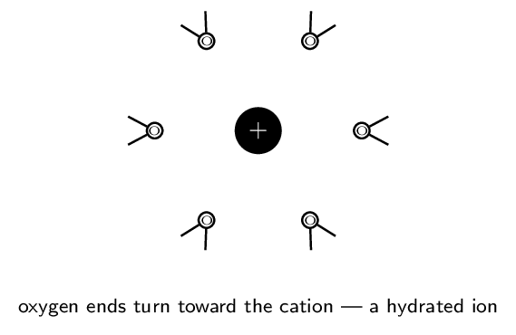

# Guided Notes

*Chapter 4 • Types of Chemical Reactions and Solution Stoichiometry*  
Zumdahl §4.1–4.11 • PDF pp. 168–225 • 5 blocks

[← all lessons](../index.md)

---

> 📌 **How this chapter fits the AP course**
>
> This is the closest the textbook comes to covering an entire CED unit in one
> place: nearly all of **Unit 4 (Chemical Reactions)** lives here, and
> §4.1–4.3 backfill the solution and molarity content of **Unit
> 3.7–3.8**. Three skills introduced here are used continuously for the rest
> of the year — writing *net ionic equations*, assigning
> *oxidation states*, and doing *solution stoichiometry*, which
> becomes titration math in Unit 8.
> 
> One caution: §4.10's full half-reaction balancing in acidic and basic
> solution goes beyond what the CED requires. It is marked
> **ENRICHMENT** in Block 5 — valuable, but not tested.

## Water, Solutions, and Electrolytes Zumdahl §4.1–4.3

> 📌 **By the end you can…**
>
> - Explain why water dissolves ionic and polar substances, at the
>    particle level.
> - Classify solutes as strong electrolytes, weak electrolytes, or
>    nonelectrolytes and predict conductivity.
> - Calculate molarity, prepare solutions, and perform dilutions.

**Read:** Zumdahl §4.1–4.3 • PDF pp. 169–182

> 📌 **Retrieval warm-up**
>
> 1. Geometry and polarity of H₂O: bent; polar
> 2. Formula for ammonium sulfate: (NH₄)₂SO₄
> 3. Moles in 58.44 g NaCl: 1.000 mol

#### INSTRUCTION A • Why water is the universal solvent 25 min

### The structure behind the behavior `ZUM §4.1`

`SP 1`

Water's power as a solvent is a direct consequence of two structural facts
you already know from Unit 2. First, each O–H bond is strongly
polar, because oxygen's electronegativity far exceeds
hydrogen's. Second, the molecule is bent, so those two
bond dipoles do *not* cancel — water carries a substantial net
dipole, with a partial negative charge on oxygen and
partial positives on the hydrogens.

That permanent dipole is the whole story. When an ionic solid is placed in
water, the water molecules orient themselves around each ion: oxygen ends
point toward cations, hydrogen ends point toward
anions. The resulting ion–dipole attractions
release enough energy to compete with the lattice energy holding the crystal
together. If ion–dipole attraction wins, the solid
dissolves and the ions become hydrated — each surrounded by
a shell of oriented water molecules.

> 📌 **Note**
>
> Dissolving is a *competition*, not a guarantee. The lattice must be
> pulled apart (costs energy) and the ions must be hydrated (releases energy).
> When hydration cannot pay for the lattice, the salt stays solid — which is
> exactly what the solubility rules in Block 2 summarize empirically.

#### GUIDED PRACTICE • Predicting from structure 15 min

1. Which end of a water molecule approaches a Cl- ion, and why?
   
2. Would you expect CCl₄ to dissolve NaCl? Justify.
   

#### INSTRUCTION B • Electrolytes: three behaviors 20 min

### Strong, weak, and non `ZUM §4.2`

`SP 1`

Conductivity is a *measurement of ion concentration*. A solution
conducts only if mobile ions are present, so a conductivity test sorts
solutes into three classes:

| **Class** | **What happens in water** | **Examples** |
|---|---|---|
| Strong electrolyte | dissociates or ionizes completely | soluble salts (NaCl); strong acids (HCl, HNO₃,
  H₂SO₄); strong bases (NaOH, KOH) |
| Weak electrolyte | ionizes only slightly — an equilibrium | weak acids (HC₂H₃O₂); weak bases (NH₃) |
| Nonelectrolyte | dissolves as intact molecules | sugar, ethanol; and *water itself* |

> 📘 **Worked example: two acids, two behaviors**
>
> **Hydrochloric acid** is a strong acid. In water:
> HCl(aq) → H+(aq) + Cl-(aq)
> The single arrow means essentially every HCl molecule has come apart.
> A 0.10 M solution contains 0.10 M H+.
> 
> **Acetic acid** is a weak acid. In water:
> HC₂H₃O₂(aq) ⇌ H+(aq) + C₂H₃O₂-(aq)
> The double arrow means the reaction reaches equilibrium with only about 1%
> of the molecules ionized. A 0.10 M solution contains roughly
> 0.001 M H+ — one hundred times less, and it lights the
> conductivity bulb only dimly.

> ⚠️ **AP trap**
>
> “Strong” and “concentrated” are unrelated words. *Strong* describes
> the *fraction* that ionizes (a property of the substance);
> *concentrated* describes how much solute is present (a property of the
> solution). A dilute HCl solution is still a strong acid; a concentrated
> acetic acid solution is still weak.

#### APPLICATION • Molarity, dilution, and preparation 20 min

### Concentration `ZUM §4.3`

`SP 5`

$M =$ $\dfrac{\text{moles of solute}}{\text{liters of solution}}$

Note carefully: liters of *solution*, not liters of solvent. This is
why you dissolve the solid first and *then* add water up to the mark.

> 📘 **Worked example: preparing a standard solution**
>
> Prepare 500.0 mL of 0.250 M Na₂CO₃
> ($M = 105.99\,\mathrm{g/mol}$).
> 
> $$ \begin{align*}   n &= (0.5000\ \text{L})(0.250\ \text{mol/L}) = 0.125\,\mathrm{mol}\\   m &= (0.125)(105.99) = 13.2\,\mathrm{g} \end{align*} $$
> 
> Weigh 13.2 g, dissolve in roughly 300 mL of water,
> transfer to a 500 mL volumetric flask, then add water
> *to* the calibration mark and invert to mix.

> 📘 **Worked example: dilution from a stock solution**
>
> How much 16 M HNO₃ is needed to make
> 250. mL of 0.50 M?
> 
> $$ V_1 = \frac{M_2V_2}{M_1} = \frac{(0.50)(250.)}{16} = 7.8\,\mathrm{mL} $$
> 
> Dilution changes volume but not moles of solute, which
> is why $M_1V_1 = M_2V_2$ works. (Always add acid *to* water, never the
> reverse.)

#### Ion concentrations in electrolyte solutions

Because strong electrolytes dissociate completely, the ion concentrations
follow directly from the formula:

1. 0.10 M Na₂SO₄: $[\text{Na+}] =$
   0.20 M, $[\text{SO₄²⁻}] =$
   0.10 M
2. 0.25 M Al(NO₃)₃: $[\text{NO₃-}] =$
   0.75 M

> 📌 **Exit ticket**
>
> A 0.10 M solution of substance X barely lights a conductivity
> bulb; 0.10 M of substance Y lights it brightly. What can you
> conclude about each, and what can you *not* conclude?

## Precipitation Reactions and Solubility Zumdahl §4.4–4.5, 4.7

> 📌 **By the end you can…**
>
> - Use solubility rules to predict whether a precipitate forms.
> - Predict products by ion interchange and write balanced equations.
> - Carry out stoichiometry for precipitation reactions.

**Read:** Zumdahl §4.4–4.5, 4.7 • PDF pp. 182–192

> 📌 **Retrieval warm-up**
>
> 1. $[\text{Cl-}]$ in 0.20 M CaCl₂:
>    0.40 M
> 2. Strong or weak electrolyte: HNO₃?
>    strong
> 3. Dilute 10.0 mL of 6.0 M to
>    60.0 mL: 1.0 M
> 4. Nonelectrolyte example: sugar / ethanol

#### INSTRUCTION A • The solubility rules 25 min

### Zumdahl's Table 4.1 `ZUM §4.5`

`SP 4`

These rules are empirical — they summarize what experiment shows, in
rough order of reliability. Learn them in order; the later rules are the
ones with the important exceptions.

|  | **Soluble** | **Notable exceptions** |
|---|---|---|
| 1 | Most nitrate (NO₃-) salts | none worth
  memorizing |
| 2 | Salts of alkali metals (Li+, Na+, K+, Rb+,
  Cs+) and NH₄+ | none |
| 3 | Most Cl-, Br-, I- salts | Ag+, Pb²⁺, Hg₂²⁺ |
| 4 | Most SO₄²⁻ salts | BaSO₄, PbSO₄, Hg₂SO₄, CaSO₄ |
| 5 | Most hydroxides are only *slightly* soluble | soluble: NaOH, KOH; marginal:
  Ba(OH)₂, Sr(OH)₂, Ca(OH)₂ |
| 6 | Most S²⁻, CO₃²⁻, CrO₄²⁻, PO₄³⁻ salts are only
  slightly soluble | except those with the cations from
  rule 2 |

> 📌 **Note**
>
> Rules 1 and 2 are the two you can lean on hardest: *anything* paired
> with nitrate, an alkali metal, or ammonium dissolves. When scanning a
> possible product, check those two first — they resolve most questions
> instantly.

#### GUIDED PRACTICE • Soluble or not? 15 min

1. KNO₃: soluble (rules 1 and 2)
2. AgCl: insoluble (rule 3 exception)
3. BaSO₄: insoluble (rule 4 exception)
4. (NH₄)₂S: soluble (rule 2 beats rule 6)
5. CaCO₃: insoluble (rule 6)

#### INSTRUCTION B • Predicting products by ion interchange 20 min

### What forms when solutions are mixed? `ZUM §4.5`

`SP 4`

Zumdahl is candid that predicting products is one of the hardest things a
beginning student is asked to do. The procedure that makes it tractable:

1. List the ions actually present after mixing (remember: strong
   electrolytes are already dissociated).
2. Form the two possible new pairings by
   interchanging cation and anion. A solid must be
   electrically neutral, so pair cation with
   anion only.
3. Check each possibility against the solubility rules.
4. Anything insoluble is the precipitate; the rest stays
   dissolved.

> 📘 **Worked example: Zumdahl's chromate reaction**
>
> Mix K₂CrO₄(aq) and Ba(NO₃)₂(aq). Ions present:
> K+, CrO₄²⁻, Ba²⁺, NO₃-.
> 
> Interchange gives two candidates: KNO₃ and BaCrO₄.
> Rules 1 and 2 make KNO₃ soluble. Rule 6 makes BaCrO₄ insoluble
> (barium is not an alkali metal). So a yellow solid of BaCrO₄ forms:
> K₂CrO₄(aq) + Ba(NO₃)₂(aq) → BaCrO₄(s) + 2 KNO₃(aq)
> The K+ and NO₃- ions stay dispersed in solution. Remove the solid
> and evaporate the water, and they would reassemble into solid KNO₃.

> 📘 **Worked example: no reaction**
>
> Mix NaCl(aq) and KNO₃(aq). Candidates: NaNO₃ and KCl.
> Both are soluble by rules 1–3. **No precipitate forms** — the
> solution simply contains four kinds of ion. Write “no reaction.” Being
> willing to answer “nothing happens” is part of the skill.

#### APPLICATION • Precipitation stoichiometry 20 min

The mass of precipitate is an ordinary stoichiometry problem — with one
extra front step: convert volume and molarity into
moles.

> 📘 **Worked example**
>
> What mass of AgCl forms when 50.0 mL of
> 0.200 M AgNO₃ is mixed with excess NaCl?
> 
> $$ \begin{align*}   n(\text{Ag+}) &= (0.0500)(0.200) = 0.0100\,\mathrm{mol}\\   &\text{Ag+ + Cl- → AgCl(s)} \quad (1{:}1)\\   m(\text{AgCl}) &= (0.0100)(143.32) = 1.43\,\mathrm{g} \end{align*} $$

1. 25.0 mL of 0.100 M BaCl₂ is mixed
   with excess Na₂SO₄. Find the mass of BaSO₄
   ($M = 233.39$).
   *(working space)*
2. Explain why the answer does not depend on how much Na₂SO₄ was
   added, provided it is in excess. 

> 📌 **Exit ticket**
>
> Predict whether mixing Pb(NO₃)₂(aq) and KI(aq) produces a
> precipitate. Name it and cite the rule.

## Ionic Equations Zumdahl §4.6

> 📌 **By the end you can…**
>
> - Write formula, complete ionic, and net ionic equations.
> - Identify spectator ions and explain why they are omitted.

**Read:** Zumdahl §4.6 • PDF pp. 188–190

> 📌 **Retrieval warm-up**
>
> 1. Soluble or not: PbSO₄? insoluble
> 2. Products of AgNO₃(aq) + KCl(aq):
>    AgCl(s) + KNO₃(aq)
> 3. Moles of Ag+ in 20.0 mL of
>    0.150 M AgNO₃:
>    3.00e-3 mol

#### INSTRUCTION A • Three equations, three levels of honesty 25 min

### From formula to net ionic `ZUM §4.6`

`SP 1`

The formula equation is convenient but, as Zumdahl puts it, “does not give
a correct picture of what actually occurs in solution.” Three levels:

| **Formula equation** | every substance written as a neutral compound |
|---|---|
| **Complete ionic** | every strong electrolyte
  written as separated ions |
| **Net ionic** | only the species that
  actually react |

> 📘 **Worked example: the same reaction, three ways**
>
> **Formula:**
> K₂CrO₄(aq) + Ba(NO₃)₂(aq) → BaCrO₄(s) + 2 KNO₃(aq)
> **Complete ionic** — dissolve every strong electrolyte:
> 2 K+(aq) + CrO₄²⁻(aq) + Ba²⁺(aq) + 2 NO₃⁻(aq) → BaCrO₄(s) + 2 K+(aq) + 2 NO₃⁻(aq)
> K+ and NO₃- appear unchanged on both sides. They are
> spectator ions. Cancel them:  
> 
> **Net ionic:**
> Ba²⁺(aq) + CrO₄²⁻(aq) → BaCrO₄(s)

#### The rule that governs everything: what gets split?

- **Split** (write as ions): soluble salts, strong acids, strong
   bases — i.e. all strong electrolytes.
- **Keep together**: solids (s), liquids (l), gases
   (g), weak electrolytes, and
   nonelectrolytes.

> ⚠️ **AP trap**
>
> Water is a *nonelectrolyte* — never write it as H+ + OH- in an
> ionic equation. And a weak acid such as HC₂H₃O₂ stays intact even
> though it is aqueous, because it barely ionizes. Splitting a weak acid is
> the most common net-ionic error.

#### GUIDED PRACTICE • Write all three 15 min

For Pb(NO₃)₂(aq) + 2 NaI(aq) → PbI₂(s) + 2 NaNO₃(aq):

1. Complete ionic: 
2. Spectator ions: Na+ and NO₃-
3. Net ionic: Pb²⁺(aq) + 2 I⁻(aq) → PbI₂(s)

#### INSTRUCTION B • Why net ionic equations matter 20 min

### The same reaction, many disguises `ZUM §4.6`

`SP 6`

The net ionic equation strips away everything incidental, which reveals that
apparently different reactions are the *same* reaction.

> 📘 **Worked example: one net ionic, three formula equations**
>
> All three of these produce the identical net ionic equation
> Ag+(aq) + Cl⁻(aq) → AgCl(s):
> 
> $$ \begin{align*}   \text{AgNO₃(aq) + NaCl(aq) & → AgCl(s) + NaNO₃(aq)}\\   \text{AgNO₃(aq) + KCl(aq) & → AgCl(s) + KNO₃(aq)}\\   \text{AgC₂H₃O₂(aq) + NH₄Cl(aq) & → AgCl(s) + NH₄C₂H₃O₂(aq)} \end{align*} $$
> 
> The spectators differ; the chemistry does not. This is why a chemist writes
> the net ionic equation — it names the actual event.

#### APPLICATION • Net ionic reasoning 20 min

Write the net ionic equation for mixing Na₂CO₃(aq) and
        CaCl₂(aq). 

Mixing NaNO₃(aq) and KCl(aq) gives no net ionic equation
        at all. Explain what that means physically.
        

A student writes Ba²⁺ + SO₄²⁻ → BaSO₄(s) for the reaction of
        Ba(OH)₂(aq) with H₂SO₄(aq). What did they miss?
        

> 📌 **Exit ticket**
>
> Why is HC₂H₃O₂(aq) written as a whole molecule in a net ionic equation
> while HCl(aq) is written as separated ions?

## Acid–Base Reactions Zumdahl §4.8

> 📌 **By the end you can…**
>
> - Define acids and bases in Arrhenius and Bronsted–Lowry terms.
> - Write net ionic equations for strong and weak acid neutralizations.
> - Perform titration stoichiometry.

**Read:** Zumdahl §4.8 • PDF pp. 192–199

> 📌 **Retrieval warm-up**
>
> 1. Net ionic for AgNO₃(aq) + NaCl(aq):
>    Ag+ + Cl⁻ → AgCl(s)
> 2. Do you split H₂O in an ionic equation?
>    no
> 3. Strong acid example: HCl, HNO₃,
>    H₂SO₄
> 4. Moles in 35.0 mL of 0.200 M:
>    7.00e-3 mol

#### INSTRUCTION A • Two definitions, one behavior 25 min

### Arrhenius and Bronsted–Lowry `ZUM §4.8`

`SP 1`

- Arrhenius: an acid produces H+ in
   water; a base produces OH-.
- Bronsted–Lowry: an acid is a proton
   donor; a base is a proton
   acceptor. This is broader — it covers
   NH₃, which produces OH- without containing it.

#### The strong acids and bases worth memorizing

Strong acids: HCl, HBr, HI, HNO₃, H₂SO₄,
HClO₄.   

Strong bases: hydroxides of group 1 plus
Ca(OH)₂, Sr(OH)₂, Ba(OH)₂.   

Everything else you meet this year is weak.

#### GUIDED PRACTICE • Classify 15 min

HNO₃: strong acid

NH₃: weak base

HF: weak acid

KOH: strong base

#### INSTRUCTION B • Neutralization at the ion level 20 min

### Two cases, two net ionic equations `ZUM §4.8`

`SP 6`

> 📘 **Case 1: strong acid + strong base**
>
> Mix HCl(aq) and NaOH(aq). The mixed solution contains
> H+, Cl-, Na+, OH-. Would NaCl precipitate? Rules 2
> and 3 say no — so Na+ and Cl- are spectators. But H+ and
> OH- cannot coexist in quantity, because water is a nonelectrolyte:
> H+(aq) + OH⁻(aq) → H₂O(l)
> **Every** strong-acid/strong-base neutralization has this same net
> ionic equation.

> 📘 **Case 2: weak acid + strong base**
>
> Mix HC₂H₃O₂(aq) and KOH(aq). Acetic acid is a weak electrolyte,
> so it stays intact:
> HC₂H₃O₂(aq) + OH⁻(aq) → C₂H₃O₂⁻(aq) + H₂O(l)
> The whole acid molecule appears, because the hydrogen is transferred
> directly rather than being freely available beforehand. Only K+ is a
> spectator.

> ⚠️ **AP trap**
>
> The two cases give *different* net ionic equations, and telling them
> apart requires knowing whether the acid is strong or weak. Memorize the six
> strong acids — everything else is weak, and stays whole.

#### APPLICATION • Titration stoichiometry 20 min

A titration adds a solution of known concentration (the
titrant) until the reaction is exactly complete — the
equivalence point, signaled by an
indicator colour change.

> 📘 **Worked example**
>
> It takes 27.4 mL of 0.150 M NaOH to
> neutralize 25.0 mL of HCl. Find $[\text{HCl}]$.
> 
> $$ \begin{align*}   n(\text{OH-}) &= (0.0274)(0.150) = 4.11e-3\,\mathrm{mol}\\   &\text{H+ + OH⁻ → H₂O} \quad (1{:}1) \Rightarrow n(\text{H+}) = 4.11e-3\,\mathrm{mol}\\   [\text{HCl}] &= \frac{4.11\times10^{-3}}{0.0250} = 0.164\,\mathrm{M} \end{align*} $$

20.0 mL of H₂SO₄ requires
        32.0 mL of 0.250 M NaOH. Find
        $[\text{H₂SO₄}]$. Careful with the ratio. 

*(working space)*

        

Why does the diprotic acid change the arithmetic?
        

> 📌 **Exit ticket**
>
> Write the net ionic equation for HF(aq) reacting with NaOH(aq),
> and explain why it differs from the HCl/NaOH case.

## Oxidation–Reduction Reactions Zumdahl §4.9–4.11

> 📌 **By the end you can…**
>
> - Assign oxidation states using the standard rules.
> - Identify what is oxidized, what is reduced, and name the agents.
> - Balance simple redox equations; perform redox titration
>    stoichiometry.

**Read:** Zumdahl §4.9–4.11 • PDF pp. 199–212

> 📌 **Retrieval warm-up**
>
> 1. Net ionic for strong acid + strong base:
>    H+ + OH⁻ → H₂O
> 2. Moles of H+ in 25.0 mL of 0.100 M
>    H₂SO₄: 5.00e-3 mol
> 3. Charge on the sulfate ion: $2-$

#### INSTRUCTION A • Oxidation states 25 min

### Bookkeeping for electrons `ZUM §4.9`

`SP 5`

An oxidation state is the *imaginary* charge an atom would carry
if every shared pair were awarded entirely to the more electronegative
partner. It is a bookkeeping device, not a real charge — but it lets us
track where electrons go.

|  | **Rule** | **Note** |
|---|---|---|
| 1 | Free element: 0 | Na, O₂, P₄ |
| 2 | Monatomic ion: equal to its charge | Na+ is $+1$ |
| 3 | Oxygen: $-2$ | except peroxides ($-1$) |
| 4 | Hydrogen: $+1$ | except metal hydrides ($-1$) |
| 5 | Fluorine: $-1$ | always |
| 6 | Sum $=$ 0 for a neutral compound, or the
  ion charge for an ion | this is the equation you
  actually solve |

> 📘 **Worked example: three species, Zumdahl's own**
>
> **CO₂**: assign O first at $-2$ each ($-4$ total). The molecule is
> neutral, so C must be $+4$. *Reality check:* $(+4) + 2(-2) = 0$.
> 
> **SF₆**: no rule for sulfur, so start with F at $-1$ each ($-6$
> total). S must be $+6$. Check: $(+6) + 6(-1) = 0$.
> 
> **NO₃-**: three O at $-2$ gives $-6$. The ion's charge is $-1$, so
> N must be $+5$. Check: $(+5) + 3(-2) = -1$. ✓

> 📌 **Note**
>
> Non-integer oxidation states can occur. In Fe₃O₄, four oxygens give
> $-8$, so three irons must total $+8$ — each is $+8/3$. That looks strange,
> but the rules deliberately treat all three iron atoms as equivalent when the
> compound is really $2\,\text{Fe³⁺} + 1\,\text{Fe²⁺}$ per formula unit.

#### GUIDED PRACTICE • Assign the underlined element 15 min

S in H₂SO₄: $+6$

Cr in Cr₂O₇²⁻: $+6$

Mn in MnO₄-: $+7$

N in NH₃: $-3$

C in CH₄: $-4$

#### INSTRUCTION B • Identifying redox and naming agents 20 min

### Who lost, who gained `ZUM §4.9`

`SP 6`

A reaction is redox if any element's oxidation state
changes.

|  | **Oxidation** | **Reduction** |
|---|---|---|
| Electrons | lost | gained |
| Oxidation state | increases | decreases |
| The species itself is the | reducing agent | oxidizing agent |

> ⚠️ **AP trap**
>
> The agent labels are counterintuitive by design: the substance that
> *is oxidized* is the *reducing* agent, because it hands its
> electrons to something else and thereby reduces it. Read the label as
> “the thing that causes reduction.” **OIL RIG** — Oxidation Is Loss,
> Reduction Is Gain.

> 📘 **Worked example: full analysis**
>
> 2 Al(s) + 3 Cl₂(g) → 2 AlCl₃(s)
> Al goes $0 \to +3$: it **lost** electrons, so it was **oxidized**
> and is the **reducing agent**.
> Cl goes $0 \to -1$: it **gained** electrons, so it was
> **reduced** and is the **oxidizing agent**.
> Both reactants are free elements at $0$ — a reliable sign that a reaction
> is redox.

#### APPLICATION • Redox titration 20 min

For Zn(s) + Cu²⁺(aq) → Zn²⁺(aq) + Cu(s), identify what is
        oxidized, reduced, and both agents. 

In an iron analysis, Fe²⁺ is titrated with MnO₄-:
        5 Fe²⁺ + MnO₄⁻ + 8 H+ → 5 Fe³⁺ + Mn²⁺ + 4 H₂O
        A sample requires 18.0 mL of 0.0200 M
        KMnO₄. Find the moles of Fe²⁺. 

*(working space)*

        

Verify that manganese is reduced in that equation by computing its
        oxidation state on both sides.
        

> 📌 **ENRICHMENT — beyond the CED**
>
> Zumdahl §4.10 develops full *half-reaction balancing* in acidic and
> basic solution, adding H₂O, H+, and OH- to balance oxygen and
> hydrogen. The current AP framework does not require this — it asks you to
> *identify* redox and balance simple cases. Learn it if you want the
> complete picture (it is genuinely useful for Unit 9 electrochemistry), but
> do not spend exam-prep time on it.

> 📌 **Exit ticket**
>
> In 2 H₂ + O₂ → 2 H₂O, identify the oxidizing agent and justify with
> oxidation states.

---

*AP Chemistry course materials • student edition • CC BY-NC-SA 4.0*
