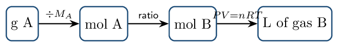

# Guided Notes

*Chapter 5 • Gases*  
Zumdahl §5.1–5.9 • PDF pp. 226–281 • 5 blocks

[← all lessons](../index.md)

---

> 📌 **How this chapter fits the AP course**
>
> Most of this chapter you have already met: §5.2–5.3, 5.5, 5.6, and
> 5.8 are CED topics **3.4–3.6**, taught in Unit 3. Read those sections
> as *deeper practice*, not new material.
> 
> Two things here are genuinely new. **§5.4 gas stoichiometry** closes
> the loop between Chapter 3's mole ratios and gas volumes — it is the
> reason to work this chapter. And **collecting a gas over water**
> (§5.5) is a standard laboratory technique that appears on the AP exam and
> is covered nowhere else.
> 
> §5.7 (Graham's law of effusion) is marked **ENRICHMENT** — it is not
> on the current CED. §5.10 (atmospheric chemistry) is skipped entirely.

## Pressure and the Empirical Gas Laws Zumdahl §5.1–5.2

> 📌 **By the end you can…**
>
> - Explain what gas pressure is and convert among its units.
> - State Boyle's, Charles's, and Avogadro's laws and use each.

**Read:** Zumdahl §5.1–5.2 • PDF pp. 227–235

> 📌 **Retrieval warm-up**
>
> 1. Convert 25 °C to kelvin: 298 K
> 2. Moles in 32.0 g O₂: 1.00 mol
> 3. KMT: average kinetic energy depends only on:
>    temperature

#### INSTRUCTION A • What pressure is, and how we measure it 25 min

### Pressure `ZUM §5.1`

`SP 1`

Pressure is force per unit area. For a gas it arises
from countless particle collisions with the container walls — each
collision is tiny, but there are on the order of $10^{23}$ particles.

Atmospheric pressure is literally the weight of the
air above you, which is why it falls with altitude.

#### Torricelli's barometer

Invented in 1643: a tube of mercury inverted in a dish. Atmospheric pressure
pushing down on the dish holds the column up. At sea level the column
averages 760 mm of mercury.

> 📌 **Note**
>
> The famous crushed-can demonstration is the same physics. Boiling water
> fills a can with steam; capping and cooling condenses that steam to a few
> drops of liquid, leaving almost nothing inside to push outward. Atmospheric
> pressure — which was always there — then crushes the can. Nothing
> “sucked” it; the inside simply stopped pushing back.

#### Units you must be able to convert

$1\,\mathrm{atm} =$ 760 mmHg $=$ 760 torr $= 101325\,\mathrm{Pa} =$ 101.325 kPa

#### GUIDED PRACTICE • Pressure conversions 15 min

1. 2.50 atm in torr: 1900 torr
2. 380 mmHg in atm: 0.500 atm
3. 202.65 kPa in atm: 2.000 atm

#### INSTRUCTION B • Three empirical laws 20 min

### Boyle, Charles, and Avogadro `ZUM §5.2`

`SP 5`

Each law fixes two variables and relates the other two:

| **Law** | **Held constant** | **Relationship** | **Working form** |
|---|---|---|---|
| Boyle | $n$, $T$ | $P$ and $V$ inversely | $P_1V_1 = P_2V_2$ |
| Charles | $n$, $P$ | $V$ and $T$ directly | $V_1/T_1 = V_2/T_2$ |
| Avogadro | $P$, $T$ | $V$ and $n$ directly | $V_1/n_1 = V_2/n_2$ |

> ⚠️ **AP trap**
>
> Charles's and Avogadro's laws are ratios, so temperature *must* be in
> kelvin. Celsius has an arbitrary zero: doubling from 10 °C to
> 20 °C is not doubling the absolute temperature at all — it is
> 283 K to 293 K, a 3.5% rise.

> 📘 **Worked example 1: Boyle**
>
> A 5.00 L sample at 1.20 atm is compressed to
> 2.00 L at constant temperature.
> 
> $$ P_2 = \frac{P_1V_1}{V_2} = \frac{(1.20)(5.00)}{2.00} = 3.00\,\mathrm{atm} $$
> 
> Sanity check: the volume shrank, so the pressure must rise. It did.

> 📘 **Worked example 2: Charles**
>
> A balloon holds 2.50 L at 27 °C. What is its volume
> at 127 °C, pressure constant?
> 
> $$ V_2 = V_1\frac{T_2}{T_1} = 2.50 \times \frac{400.}{300.} = 3.33\,\mathrm{L} $$
> 
> Using Celsius would have given $2.50 \times 127/27 = 11.8\,\mathrm{L}$ —
> more than three times too large. This is why the conversion matters.

#### APPLICATION • Combining the laws 20 min

Any two states of a fixed gas sample are related by the
combined gas law:
$\frac{P_1V_1}{T_1} =$ $\dfrac{P_2V_2}{T_2}$

1. A gas occupies 4.00 L at 2.00 atm and
   300. K. Find its volume at 1.00 atm and
   450. K.
   *(working space)*
2. Explain, using particle collisions, why halving the volume at
   constant temperature doubles the pressure.
   

> 📌 **Exit ticket**
>
> A rigid steel cylinder of gas is heated from 300 K to
> 600 K. What happens to its volume and its pressure?

## The Ideal Gas Law Zumdahl §5.3

> 📌 **By the end you can…**
>
> - Apply $PV = nRT$ in all rearrangements.
> - Compute gas density and molar mass from $P$, $T$, and $M$.

**Read:** Zumdahl §5.3 • PDF pp. 235–241

> 📌 **Retrieval warm-up**
>
> 1. 1.50 atm in torr: 1140 torr
> 2. Boyle's law relates which two variables?
>    $P$ and $V$
> 3. 127 °C in kelvin: 400. K
> 4. Molar mass of CO₂: 44.01 g/mol

#### INSTRUCTION A • One equation containing all three laws 25 min

### $PV = nRT$ `ZUM §5.3`

`SP 5`

$PV = nRT \qquad   R =$ 0.08206 L·atm/mol/K

$R$ carries units, and those units dictate everything else: pressure in
atm, volume in L,
temperature in K. Convert *before* substituting,
never after.

#### Standard temperature and pressure

STP is 0 °C and
1 atm. At STP one mole of any ideal gas occupies
the molar volume:
$V = \frac{nRT}{P} = \frac{(1)(0.08206)(273.15)}{1} =$ 22.42 L

> 📌 **Note**
>
> That 22.42 L applies *only* at STP. Students who memorize it and then
> use it at 25 °C get answers about 9% low. When conditions are
> not STP, go back to $PV = nRT$.

#### GUIDED PRACTICE • Rearrangement drill 15 min

1. Solve for $n$: $n = PV/RT$
2. Volume of 2.50 mol at 1.50 atm, 300. K:
   41.0 L
3. Pressure of 0.250 mol in 5.00 L at
   273 K: 1.12 atm
4. Moles in 10.0 L at 2.00 atm and
   350. K: 0.696 mol

#### INSTRUCTION B • Density and molar mass 20 min

### Two useful derivations `ZUM §5.3`

`SP 5`

Since $n = m/M$, substituting into $PV = nRT$ gives
$d = \frac{m}{V} =$ $\dfrac{PM}{RT}$ $\qquad\text{and}\qquad   M =$ $\dfrac{dRT}{P}$

You do not need to memorize these if you can derive them — but you must be
able to get there quickly.

> 📘 **Worked example 1: density of a known gas**
>
> Find the density of CO₂ at STP.
> 
> $$ d = \frac{PM}{RT} = \frac{(1.00)(44.01)}{(0.08206)(273.15)} = 1.96\,\mathrm{g/L} $$
> 
> Equivalently: one mole (44.01 g) occupies 22.42 L, and
> $44.01/22.42 = 1.96$. Both routes should agree — use the second as a
> check.

> 📘 **Worked example 2: identifying an unknown gas**
>
> An unknown gas has a density of 1.34 g/L at STP.
> 
> $$ M = d \times 22.42 = 1.34 \times 22.42 = 30.0\,\mathrm{g/mol} $$
> 
> Candidates at 30 g/mol: NO (30.01) or C₂H₆ (30.07). Density alone
> cannot distinguish them — you would need another property.

> ⚠️ **AP trap**
>
> Gas density depends on pressure and temperature, unlike the density of a
> solid or liquid. Quoting “the density of CO₂” without stating
> conditions is meaningless. Denser gas = higher molar mass *only when
> $P$ and $T$ match*.

#### APPLICATION • Working backwards 20 min

1. A 0.500 g sample of a gas occupies 288 mL
   at 25 °C and 1.00 atm. Find its molar mass.
   *(working space)*
2. Two identical balloons at the same $T$ and $P$ hold helium and
   argon. Compare their masses and their densities, with reasoning.
   

> 📌 **Exit ticket**
>
> Why does a helium balloon rise while an identical balloon of CO₂ sinks?
> Answer in terms of density.

## Gas Stoichiometry Zumdahl §5.4

> 📌 **By the end you can…**
>
> - Include gas volumes in stoichiometric calculations.
> - Choose correctly between the molar volume shortcut and $PV = nRT$.

**Read:** Zumdahl §5.4 • PDF pp. 241–245

> 📌 **Retrieval warm-up**
>
> 1. Molar volume at STP: 22.42 L
> 2. $d$ of O₂ at STP: 1.43 g/L
> 3. Moles in 50.0 g CaCO₃ ($M=100.09$):
>    0.500 mol

#### INSTRUCTION A • Volumes join the mole map 25 min

### The extended road map `ZUM §5.4`

`SP 5`

Chapter 3 routed everything through moles. Gases simply add one more
on-ramp and off-ramp:

Only the middle arrow uses the balanced equation. The last arrow has two
possible tools:

- At STP: multiply by 22.42 L/mol
   — fast.
- Any other conditions: use $V = nRT/P$.

> 📘 **Worked example 1: Zumdahl's quicklime problem**
>
> Calculate the volume of CO₂ at STP produced by decomposing
> 152 g of CaCO₃:
> CaCO₃(s) → CaO(s) + CO₂(g)
> 
> $$ \begin{align*}   n(\text{CaCO₃}) &= \frac{152}{100.09} = 1.52\,\mathrm{mol}\\   n(\text{CO₂}) &= 1.52\,\mathrm{mol} \quad (1{:}1)\\   V &= 1.52 \times 22.42 = 34.1\,\mathrm{L} \end{align*} $$

> 📘 **Worked example 2: not at STP**
>
> What volume of O₂ at 25 °C and 1.00 atm is needed to
> burn 10.0 g of CH₄?
> CH₄ + 2 O₂ → CO₂ + 2 H₂O
> 
> $$ \begin{align*}   n(\text{CH₄}) &= \frac{10.0}{16.04} = 0.623\,\mathrm{mol}\\   n(\text{O₂}) &= 2(0.623) = 1.25\,\mathrm{mol}\\   V &= \frac{nRT}{P} = \frac{(1.25)(0.08206)(298)}{1.00} = 30.5\,\mathrm{L} \end{align*} $$
> 
> The molar-volume shortcut would have given 28.0 L — wrong by
> 8%, because these are not standard conditions.

#### GUIDED PRACTICE • Gas stoichiometry drill 15 min

1. 2 KClO₃(s) → 2 KCl(s) + 3 O₂(g). What volume of O₂ at
   STP comes from 12.25 g KClO₃ ($M = 122.55$)?
   *(working space)*
2. N₂(g) + 3 H₂(g) → 2 NH₃(g). All gases at the same $T$ and
   $P$: what volume of H₂ reacts with 5.0 L of
   N₂? 15 L

> 📌 **Note**
>
> That second problem needed no molar masses at all. At fixed $T$ and $P$,
> volume is proportional to moles (Avogadro), so gas volumes combine in the
> same ratio as the coefficients. This shortcut works *only* when every
> substance involved is a gas at the same conditions.

#### APPLICATION • Limiting reactant with gases 20 min

4.00 L of H₂ and 4.00 L of O₂, both at
1.00 atm and 273 K, react to form water.

1. Write the balanced equation.
   2 H₂ + O₂ → 2 H₂O
2. Identify the limiting reactant using volumes directly.
   
3. What volume of O₂ remains unreacted?
   2.00 L

> 📌 **Exit ticket**
>
> Why can you compare gas volumes directly to find a limiting reactant, but
> never compare gas masses that way?

## Partial Pressures and Gas Collection Zumdahl §5.5

> 📌 **By the end you can…**
>
> - Apply Dalton's law and mole fractions.
> - Correct for water vapor when a gas is collected over water.

**Read:** Zumdahl §5.5 • PDF pp. 245–251

> 📌 **Retrieval warm-up**
>
> 1. Volume of 0.500 mol at STP:
>    11.2 L
> 2. N₂ + 3 H₂ → 2 NH₃: 6 L H₂ needs how much
>    N₂? 2 L
> 3. Molar mass from $d$ at STP: $M = d \times 22.42$

#### INSTRUCTION A • Dalton's law 25 min

### Each gas acts independently `ZUM §5.5`

`SP 5`

In an ideal gas, particles do not interact — so each component exerts
pressure as if the others were absent:
$P_{\text{total}} =$ $P_1 + P_2 + P_3 + \cdots$

Zumdahl derives the mole-fraction relationship directly from $n = P(V/RT)$:
since each $n_i$ is proportional to $P_i$ with the same constant,
$\chi_1 = \frac{n_1}{n_{\text{total}}} =$ $\dfrac{P_1}{P_{\text{total}}}$ $\qquad\Rightarrow\qquad   P_1 =$ $\chi_1 P_{\text{total}}$

> 📌 **Note**
>
> The identity of the gases is irrelevant. Three moles of helium and three
> moles of SF₆ — molar masses 4 and 146 — contribute exactly the same
> partial pressure at the same $T$ and $V$. Pressure counts
> *particles*, not mass.

> 📘 **Worked example 1**
>
> A vessel holds 0.30 mol N₂, 0.20 mol O₂, and
> 0.50 mol He at a total pressure of 2.00 atm.
> 
> $$ \chi_{\text{N₂}} = \frac{0.30}{1.00} = 0.30   \qquad P_{\text{N₂}} = 0.30 \times 2.00 = 0.60\,\mathrm{atm} $$
> 
> Check: the three partial pressures (0.60, 0.40, 1.00) sum to 2.00. Always
> verify this.

#### GUIDED PRACTICE • Partial pressure drill 15 min

A 10.0 L flask at 300. K contains 0.400 mol
Ar and 0.600 mol Ne.

Total pressure: 2.46 atm

$P_{\text{Ar}}$: 0.985 atm

If all the Ne escaped, $P_{\text{Ar}}$ would be:
        unchanged, 0.985 atm

#### INSTRUCTION B • Collecting a gas over water 20 min

### The laboratory correction `ZUM §5.5`

`SP 4`

A gas produced in a reaction is often collected by displacing water from an
inverted container. The collected sample is then a
mixture: the gas you made, plus
water vapour.

$P_{\text{total}} = P_{\text{gas}} +$ $P_{\text{H₂O}}$ $\qquad\Rightarrow\qquad   P_{\text{gas}} = P_{\text{total}} - P_{\text{H₂O}}$

The vapour pressure of water depends only on
temperature and is read from a table:

| $T$ ( | deg;C) | 15 | 20 | 25 | 30 | 35 |
|---|---|---|---|---|---|---|
| $P_{\text{H₂O}}$ (torr) | 12.8 | 17.5 | 23.8 | 31.8 | 42.2 |

> 📘 **Worked example 2: hydrogen over water**
>
> Hydrogen is collected over water at 25 °C. The total pressure is
> 755 torr and the volume is 0.250 L. How many moles of
> H₂ were collected?
> 
> $$ \begin{align*}   P_{\text{H₂}} &= 755 - 23.8 = 731\,\mathrm{torr} = 0.962\,\mathrm{atm}\\   n &= \frac{PV}{RT} = \frac{(0.962)(0.250)}{(0.08206)(298)} = 9.83e-3\,\mathrm{mol} \end{align*} $$
> 
> Forgetting the correction would have overstated the answer by about 3%.

> ⚠️ **AP trap**
>
> The correction is always a *subtraction* — the water vapour is
> inflating your reading. Students who add it, or who skip it entirely, report
> too much gas. Any AP question mentioning “collected over water” is
> signalling that this step is required.

#### APPLICATION • Full collection analysis 20 min

Oxygen from the decomposition of KClO₃ is collected over water at
20 °C. The total pressure is 742 torr; the volume is
0.500 L.

Partial pressure of O₂ in torr and atm:
        724.5 torr $=$ 0.9539 atm

Moles of O₂ collected: 

*(working space)*

        

Mass of KClO₃ that decomposed, given
        2 KClO₃ → 2 KCl + 3 O₂ ($M = 122.55$). 

*(working space)*

        

> 📌 **Exit ticket**
>
> Why does the vapour pressure of water in a collection tube depend on
> temperature but not on which gas is being collected?

## Kinetic Molecular Theory and Real Gases Zumdahl §5.6–5.9

> 📌 **By the end you can…**
>
> - State the KMT postulates and connect them to the gas laws.
> - Predict and explain deviations from ideal behaviour.

**Read:** Zumdahl §5.6–5.9 • PDF pp. 251–264

> 📌 **Retrieval warm-up**
>
> 1. $P_{\text{H₂O}}$ at 25 °C: 23.8 torr
> 2. $P_A$ if $\chi_A = 0.25$, $P_{\text{tot}} = 4.0\,\mathrm{atm}$:
>    1.0 atm
> 3. Volume of 2.00 mol at STP:
>    44.8 L
> 4. Gas collected over water: add or subtract $P_{\text{H₂O}}$?
>    subtract

#### INSTRUCTION A • The model 25 min

### KMT postulates `ZUM §5.6`

`SP 1`

An ideal gas consists of particles that:

are in constant random motion;

have negligible volume relative to the container;

exert no attractive forces on one another;

collide elastically;

have average kinetic energy proportional to
        absolute temperature.

$KE_{\text{avg}} = \tfrac32 RT \ \text{per mole}   \qquad   u_{\text{rms}} =$ $\sqrt{\dfrac{3RT}{M}}$

> 📌 **Note**
>
> Read the speed equation carefully: at a given temperature, every gas has the
> *same* average kinetic energy, but speed depends on molar mass. Heavier
> molecules must move more slowly to carry the same energy — speed scales as
> $1/\sqrt{M}$.

#### GUIDED PRACTICE • Explaining laws with the model 15 min

Why does pressure rise when temperature rises at constant volume?
        

Rank average speed at the same $T$: He, N₂, CO₂.
        He $>$ N₂ $>$ CO₂

> 📌 **ENRICHMENT — beyond the CED**
>
> **Graham's law of effusion** (§5.7). Effusion is escape through a tiny
> hole. Graham found the rate varies inversely with the square root of molar
> mass:
> 
> $$ \frac{\text{rate}_1}{\text{rate}_2} = \sqrt{\frac{M_2}{M_1}} $$
> 
> Zumdahl's example: H₂ (2.016) versus UF₆ (352.02) gives
> $\sqrt{352.02/2.016} = 13.2$ — hydrogen effuses about 13 times faster.
> This is not a current CED topic, though the underlying idea
> (lighter $\Rightarrow$ faster) certainly is.

#### INSTRUCTION B • Where the ideal model fails 20 min

### Real gases `ZUM §5.8–5.9`

`SP 6`

Two postulates break under stress, and they push $PV/nRT$ in
*opposite* directions:

| **Failed postulate** | **Conditions** | **Effect** |
|---|---|---|
| Particles have no volume | high pressure | gas cannot compress as predicted; $PV/nRT$
  $>1$ |
| No attractive forces | low temperature | attractions soften wall collisions, lowering $P$; $PV/nRT$
  $

Rank by expected deviation from ideality at the same conditions:
        He, N₂, H₂O. Justify.
        

A gas shows $PV/nRT = 0.95$ at moderate pressure and
        200 K. Which postulate is failing, and what happens if
        the sample is warmed to 500 K?
        

> 📌 **Exit ticket**
>
> State the two conditions under which any real gas behaves most ideally, and
> give the reason for each.

---

*AP Chemistry course materials • student edition • CC BY-NC-SA 4.0*
