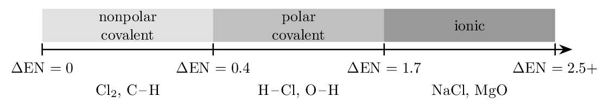
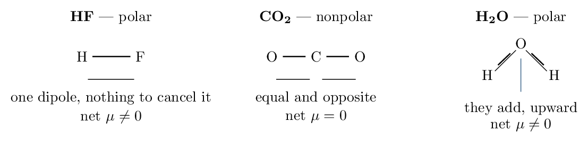
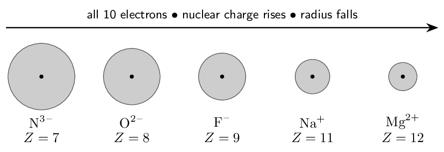
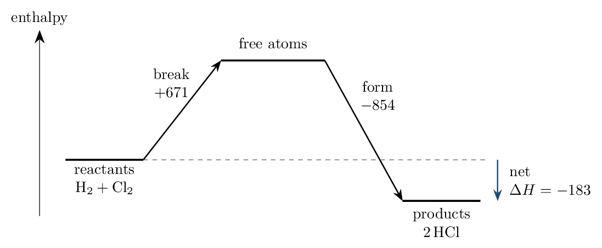
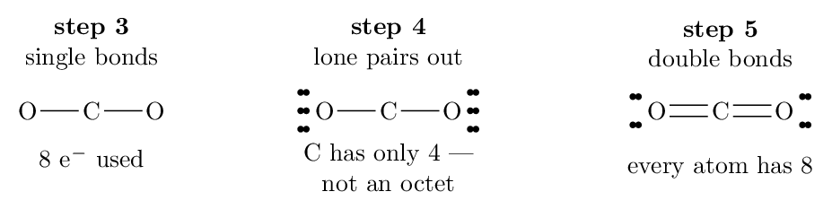
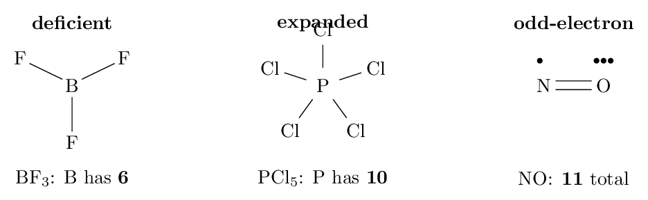
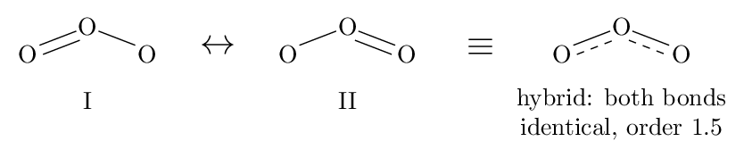
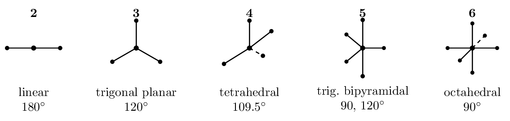
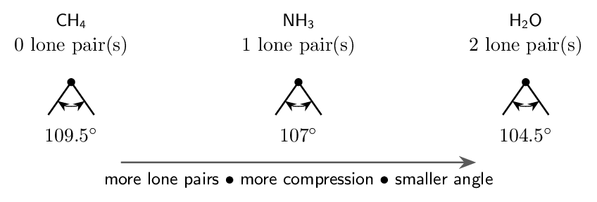

# Self-Study • Chapter 8, I do / You do

*Chapter 8 • Bonding: General Concepts*  
Zumdahl §8.1–8.13 • PDF pp. 390–445 • ten ladders, four questions each

[← all lessons](../index.md)

---

> 📌 **How to use these notes — read this first**
>
> Each skill is a **ladder**: a fully worked example in the
> solid-framed box, then **four** YOUR TURN questions in the dashed
> box — same skill, new numbers, no help.
> 
> 1. **Work all four** before checking anything.
> 2. Check against the gray *check:* line. All four right on the
>    first try earns the tick on the tracker (last page).
> 3. Any misses: re-read the worked example, then redo the missed ones
>    from a blank page.
> 
> **This is the longest chapter in the book, and the most drawable.**
> Ten ladders here, with a figure for every idea that has a shape. Draw
> each figure yourself as you read it — bonding is the one topic where
> copying the picture *is* the studying.
> 
> **One caution about the word “octet”.** In Ladders 6–9 it is the
> rule you are applying, and using it is correct. In Ladders 3–5 it is
> *not* an explanation: lattice energies, ion sizes, and bond
> strengths are explained by **Coulomb's law** — charge, distance,
> shielding. Saying an ion forms “because it wants a full shell” names
> the pattern instead of explaining it, and earns nothing.

## Ladder 1 • Bond type from
electronegativity

`ZUM §8.1–8.2`

Electronegativity is an atom's pull on the electrons in a bond.
It rises across a period and falls down a group — for the Coulombic
reasons from Chapter 7 — so fluorine (4.0) is the highest and the
alkali metals the lowest.

The *difference* between two bonded atoms decides the bond type:

The boundaries are *guidelines*, not laws — bonding is a
continuum, and 1.7 is a convention rather than a cliff. A faster rule of
thumb: metal $+$ nonmetal is ionic, nonmetal $+$ nonmetal is covalent.

> 📘 **I do: classifying four bonds**
>
> Electronegativities: H 2.1, C 2.5, N 3.0, O 3.5, F 4.0, Cl 3.0,
> Na 0.9, Mg 1.2.
> 
> | **Bond** | **$\Delta$EN** | **Type** | **Which atom is $\delta-$?** |
> |---|---|---|---|
> | H-F | $4.0-2.1 = 1.9$ | polar covalent (nearly ionic) | F |
> | C-H | $2.5-2.1 = 0.4$ | essentially nonpolar | C, barely |
> | Na-Cl | $3.0-0.9 = 2.1$ | ionic | Cl (a full Cl-) |
> | O-O | $3.5-3.5 = 0$ | nonpolar covalent | neither |

**Two things to notice.** H-F at 1.9 sits just past the ionic
boundary yet HF is a molecular gas — which is exactly why the number
is a guideline. And the C-H bond, at 0.4, is treated as nonpolar
throughout organic chemistry; that approximation is why hydrocarbons do
not dissolve in water.

> ✏️ **YOUR TURN 1 — four questions**
>
> Use the electronegativities above, plus S 2.5, Br 2.8, Al 1.5.
> 
> 1. Classify N-H and say which atom carries $\delta-$.
>    *(working space)*
> 2. Classify Mg-O. 
>    *(working space)*
> 3. Rank C-F, C-O, C-N by increasing bond polarity.
>    *(working space)*
> 4. H-Cl and H-F are both polar. Which is more polar, and
>    why?
>    *(working space)*
> 
> > **check:** (a) polar covalent, $\Delta$EN $= 0.9$; N is $\delta-$    
> (b) ionic, $\Delta$EN $= 2.3$     (c) C-N $ C-F     (d) H-F — larger $\Delta$EN

## Ladder 2 • Dipole moments and molecular
shape

`ZUM §8.3`

A polar *bond* does not guarantee a polar *molecule*. Bond
dipoles are vectors: they can cancel.

**The test, in two steps:** are the bonds polar? and does the
*shape* let the dipoles cancel? Both must be answered.

> 📘 **I do: same bonds, opposite answers**
>
> CO₂ and H₂O both contain strongly polar bonds
> ($\Delta$EN $= 1.0$ and $1.4$). Why is only one of them a polar
> molecule?
> 
> **CO₂** is **linear**. The two C=O dipoles point
> directly away from each other along one axis, equal in size and opposite
> in direction, so their vector sum is exactly zero. The molecule is
> **nonpolar** despite having two of the most polar bonds in the
> chapter.
> 
> **H₂O** is **bent** at 104.5 °. The two
> O-H dipoles point from each H toward the O, and because they are not
> opposed they add to a net dipole pointing up through the oxygen. The
> molecule is **polar** — which is why water dissolves salts,
> has a high boiling point, and lines up in a microwave.
> 
> **The generalization worth carrying:** a molecule with identical
> outer atoms and *no lone pairs* on the central atom is symmetric,
> so its dipoles cancel. Add a lone pair — or make the outer atoms
> different — and the symmetry breaks.

> ✏️ **YOUR TURN 2 — four questions**
>
> 1. Is CCl₄ (tetrahedral) polar? Explain. 
>    *(working space)*
> 2. Is NH₃ (trigonal pyramidal) polar? Explain.
>    *(working space)*
> 3. CH₃Cl is tetrahedral like CCl₄. Is it polar?
>    *(working space)*
> 4. Can a molecule with nonpolar bonds ever be polar?
>    *(working space)*
> 
> > **check:** (a) no — symmetric, dipoles cancel     (b) yes — the
> lone pair breaks the symmetry     (c) yes — the outer atoms differ
>     (d) no

## Ladder 3 • Ion sizes and isoelectronic
series

`ZUM §8.4`

Forming an ion changes the electron count but never the nuclear charge.
Everything follows from that.

- **Cations are smaller** than their parent atoms: electrons
   are removed, often emptying the outer shell entirely, and the
   unchanged nuclear charge now pulls on fewer electrons.
- **Anions are larger**: added electrons increase
   electron–electron repulsion in the valence shell while the
   nuclear charge stays put, so the cloud expands.
- In an isoelectronic series — same electron count —
   size falls as nuclear charge rises.

> 📘 **I do: ordering an isoelectronic series**
>
> Rank S²⁻, Cl-, K+, and Ca²⁺ by size, largest
> first, and justify.
> 
> **First establish they are isoelectronic.** $16+2 = 18$,
> $17+1 = 18$, $19-1 = 18$, $20-2 = 18$. All have 18 electrons — the
> argon configuration — so **shielding is identical** across the
> set. That is what makes the comparison clean.
> 
> **Now the only variable left is nuclear charge:** 16, 17, 19, 20.
> 
> $$ \text{S²⁻} > \text{Cl-} > \text{K+} > \text{Ca²⁺} $$
> 
> **Why:** each ion holds the same 18 electrons, but calcium's
> **20 protons** pull them in far harder than sulfur's **16**.
> More nuclear charge on an unchanged electron cloud means a smaller
> radius.
> 
> **Note what the explanation did not say:** nothing about full
> shells or stability. Every ion here has the same full shell — that is
> precisely the point, and it is why only Coulomb's law can distinguish
> them.

> ✏️ **YOUR TURN 3 — four questions**
>
> 1. Which is larger, Fe²⁺ or Fe³⁺? Why?
>    *(working space)*
> 2. Which is larger, Br or Br-? Why? 
>    *(working space)*
> 3. Rank N³⁻, O²⁻, F- by size and justify in one
>    sentence.
>    *(working space)*
> 4. K+ and Cl- are isoelectronic. Explain why the cation
>    is the smaller one.
>    *(working space)*
> 
> > **check:** (a) Fe²⁺     (b) Br-     (c) N³⁻ $>$
> O²⁻ $>$ F-     (d) potassium has more protons on the same
> 18 electrons

## Ladder 4 • Lattice energy

`ZUM §8.5`

Lattice energy is the energy released when gaseous ions come
together into a crystal — large and negative, and the reason ionic
solids have high melting points. It is pure Coulomb's law:

$$ E \;\propto\; \frac{Q_1 Q_2}{r} $$

**Charge dominates.** Doubling a charge doubles the numerator;
changing ionic radius moves the denominator only modestly. So when
comparing two compounds, look at charges first and only use size as a
tie-breaker.

> 📘 **I do: two comparisons, charge then size**
>
> **(a) Which has the larger lattice energy, NaCl or
> MgO?**
> 
> NaCl pairs $1+$ with $1-$: the product $Q_1Q_2$ has magnitude 1.
> MgO pairs $2+$ with $2-$: magnitude 4. On top of that, Mg²⁺
> and O²⁻ are both smaller than Na+ and Cl-, shrinking $r$
> as well.
> 
> **MgO**, by a wide margin — roughly four times, and its
> melting point (2852 °C) towers over sodium chloride's
> (801 °C). Both factors push the same way.
> 
> **(b) Which has the larger lattice energy, NaCl or
> NaBr?**
> 
> Here the charges are identical ($1+$, $1-$), so charge cannot decide it
> and size becomes the tie-breaker. Bromide is larger than chloride, so
> $r$ is larger and the energy smaller: **NaCl**.
> 
> **The order of operations:** compare $Q_1Q_2$ first. Only if it
> ties do you compare $r$. Reversing that order is how students conclude
> that LiF beats MgO.

> ✏️ **YOUR TURN 4 — four questions**
>
> 1. Larger lattice energy: KCl or CaO? Why?
>    *(working space)*
> 2. Larger lattice energy: LiF or KF? Why?
>    *(working space)*
> 3. Larger lattice energy: MgO or MgS? Why?
>    *(working space)*
> 4. Which melts higher, NaF or MgF₂? Connect your answer
>    to lattice energy.
>    *(working space)*
> 
> > **check:** (a) CaO     (b) LiF     (c) MgO    
> (d) MgF₂ — larger cation charge, larger lattice energy

## Ladder 5 • Bond energies and $\Delta H$

`ZUM §8.8`

**Breaking a bond always costs energy; forming one always releases
it.** There are no exceptions, and the whole calculation follows:

$$ \boxed{\;\Delta H \approx \sum(\text{bonds broken})    - \sum(\text{bonds formed})\;} $$

Uphill to tear everything apart, further downhill to build the products.
The net is the difference — and the answer is an *estimate*,
because a tabulated bond energy is an average over many molecules.

> 📘 **I do: hydrogen chloride, then a reality check**
>
> Estimate $\Delta H$ for H₂(g) + Cl₂(g) → 2HCl(g).
> Bond energies (kJ/mol): H-H 432, Cl-Cl 239, H-Cl 427.
> 
> **Bonds broken** — one of each reactant bond:
> 
> $$ 432 + 239 = 671\,\mathrm{kJ} $$
> 
> **Bonds formed** — two H-Cl:
> 
> $$ 2(427) = 854\,\mathrm{kJ} $$
> 
> **Net:**
> 
> $$ \Delta H \approx 671 - 854 = \mathbf{-183~kJ} $$
> 
> **Reality check.** The measured value is -184.6 kJ
> — agreement to under 1%, which is unusually good. Expect 5–10% for
> larger molecules, because the tables average a bond over every compound
> it appears in, and a C-H bond in methane is not identical to one in
> ethanol.
> 
> **Sign sanity:** more energy came out than went in, so the reaction
> is exothermic and $\Delta H$ is negative. If your answer is positive for
> a combustion, you have reversed the subtraction.

> ✏️ **YOUR TURN 5 — four questions**
>
> Bond energies (kJ/mol): C-H 413, O=O 495, C=O 799,
> O-H 467, N#N 941, H-H 432, N-H 391.
> 
> 1. Estimate $\Delta H$ for
>    CH₄(g) + 2O₂(g) → CO₂(g) + 2H₂O(g).
>    *(working space)*
> 2. Estimate $\Delta H$ for
>    N₂(g) + 3H₂(g) → 2NH₃(g).
>    *(working space)*
> 3. The measured value for (a) is -802 kJ. Why does
>    the estimate differ?
>    *(working space)*
> 4. Is breaking the N#N bond endothermic or exothermic, and what
>    does its size (941) tell you about nitrogen gas?
>    *(working space)*
> 
> > **check:** (a) -824 kJ     (b) -109 kJ
>     (c) tabulated bond energies are averages     (d) endothermic;
> N₂ is very unreactive

## Ladder 6 • Drawing Lewis structures

`ZUM §8.9–8.10`

Five steps, in this order, every time:

1. Count **total valence electrons** (add for a negative
   charge, subtract for a positive one).
2. Place the **least electronegative atom** at the centre —
   never hydrogen, which forms only one bond.
3. Join everything with **single bonds**, then subtract
   $2$ electrons per bond.
4. Distribute the remainder as **lone pairs on the outer
   atoms** first, completing their octets.
5. If the centre is short of an octet, **make multiple bonds**
   by moving outer lone pairs into the bond.

> 📘 **I do: the nitrate ion, NO₃-**
>
> **Step 1 — count.** N contributes 5, each O contributes 6, and the
> $1-$ charge adds one more:
> 
> $$ 5 + 3(6) + 1 = 24\,\mathrm{} $$
> 
> **Step 2 — centre.** Nitrogen is less electronegative than oxygen,
> so N sits in the middle with three O around it.
> 
> **Step 3 — single bonds.** Three N-O bonds use
> $3 \times 2 = 6$ electrons, leaving $24 - 6 = 18$.
> 
> **Step 4 — lone pairs outward.** Each oxygen needs three lone
> pairs to reach an octet: $3 \times 6 = 18$ electrons. All 24 are now
> placed.
> 
> **Step 5 — check the centre.** Nitrogen has only the three
> bonding pairs, or 6 electrons. Short of an octet, so move one lone pair
> from an oxygen into a bond, making one N=O double bond. Nitrogen now
> has 8.
> 
> **Final:** one N=O and two N-O, with the whole thing in
> brackets carrying a $1-$ charge. That the double bond could equally have
> gone to any of the three oxygens is the subject of Ladder 9.
> 
> **The count is the check.** If your finished structure does not use
> exactly 24 electrons, it is wrong regardless of how it looks.

> ✏️ **YOUR TURN 6 — four questions**
>
> 1. Total valence electrons in CH₄, and draw it.
>    *(working space)*
> 2. Total valence electrons in NH₄+, and draw it.
>    *(working space)*
> 3. Draw CO and state the bond order. 
>    *(working space)*
> 4. Draw SO₂ and say how many lone pairs sit on the sulfur.
>    *(working space)*
> 
> > **check:** (a) 8     (b) 8 — subtract one for the $+$ charge    
> (c) 10 electrons, a triple bond     (d) 18 electrons, one lone pair on
> S

## Ladder 7 • Exceptions to the octet rule

`ZUM §8.11`

Three kinds, and each is recognizable on sight.

- **Electron deficient** — Be and B are content with 4 and 6.
- **Expanded octet** — *only* for central atoms in
   period 3 or below, which have empty $d$ orbitals available.
   Nitrogen can never expand; phosphorus can.
- **Odd electron** — an odd total makes an octet arithmetically
   impossible. These species are radicals and highly reactive.

> 📘 **I do: deciding whether an expansion is allowed**
>
> **Why does PCl₅ exist but NCl₅ not?**
> 
> Both phosphorus and nitrogen are group 5A with five valence electrons,
> so on paper both might bond to five chlorines. But nitrogen is in
> **period 2**: its valence shell is $n = 2$, which contains only
> $2s$ and $2p$ orbitals — room for eight electrons and no more. Five
> bonds would require ten.
> 
> Phosphorus is in **period 3**. Its valence shell has $3s$, $3p$
> *and* empty $3d$ orbitals, which can accommodate the extra pair. Ten
> electrons around phosphorus is therefore possible.
> 
> **The rule in one line:** an expanded octet requires an available
> $d$ subshell, so it is possible from period 3 downward and impossible
> in period 2. Any structure you draw with ten electrons on N, O, F or C
> is wrong.
> 
> **Count PCl₅ to confirm:** $5 + 5(7) = 40$ valence electrons.
> Five P-Cl bonds use 10; the remaining 30 form three lone pairs on
> each chlorine. Phosphorus ends with 10 electrons — an expanded octet,
> legitimately.

> ✏️ **YOUR TURN 7 — four questions**
>
> 1. How many electrons surround the sulfur in SF₆, and why is
>    that allowed?
>    *(working space)*
> 2. How many surround the boron in BH₃? 
>    *(working space)*
> 3. Why can OF₂ not have an expanded octet? 
>    *(working space)*
> 4. NO₂ has 17 valence electrons. What does that odd number
>    tell you?
>    *(working space)*
> 
> > **check:** (a) 12 — sulfur is period 3     (b) 6     (c) oxygen is
> period 2, no $d$ orbitals     (d) it is a radical, so no octet is
> possible

## Ladder 8 • Formal charge

`ZUM §8.12`

When more than one Lewis structure obeys the rules, formal charge
picks the best one:

$$ \text{FC} = (\text{valence electrons})    - (\text{lone electrons}) - \tfrac{1}{2}(\text{bonding electrons}) $$

Equivalently: count the atom's own dots, plus one electron from each
bond, and subtract from its group valence.

**The preference rules, in order:**

1. Formal charges as close to **zero** as possible.
2. Any negative formal charge on the **most electronegative**
   atom.
3. Avoid like charges on adjacent atoms.

> 📘 **I do: choosing between two structures for CO₂**
>
> Both structures below use all 16 valence electrons and give every atom
> an octet. Formal charge decides.
> 
> **Structure A — O=C=O.**
> 
> $$ \text{C}: 4 - 0 - \tfrac{1}{2}(8) = \mathbf{0} \qquad    \text{each O}: 6 - 4 - \tfrac{1}{2}(4) = \mathbf{0} $$
> 
> **Structure B — O#C-O.**
> 
> $$ \text{C}: 4 - 0 - \tfrac{1}{2}(8) = \mathbf{0} $$
> 
> $$ \text{triple-bonded O}: 6 - 2 - \tfrac{1}{2}(6) = \mathbf{+1} \qquad    \text{single-bonded O}: 6 - 6 - \tfrac{1}{2}(2) = \mathbf{-1} $$
> 
> **Verdict: A.** Every formal charge is zero, satisfying rule 1
> outright. B is not *illegal* — it obeys the octet rule and the
> electron count — but it separates charge unnecessarily, and worse,
> puts a *positive* charge on oxygen, the second most electronegative
> element in the table.
> 
> **The check that catches arithmetic slips:** formal charges must
> sum to the overall charge on the species. Structure A: $0+0+0 = 0$.
> Structure B: $0 + 1 - 1 = 0$. Both sum correctly, so the comparison is
> between two valid structures rather than one valid and one botched.

> ✏️ **YOUR TURN 8 — four questions**
>
> 1. Formal charge on N in NH₄+ (four bonds, no lone pairs).
>    *(working space)*
> 2. Formal charge on B in BF₃ (three bonds, no lone pairs).
>    *(working space)*
> 3. In the NO₃- structure from Ladder 6, give the formal charge
>    on the double-bonded O and on a single-bonded O.
>    *(working space)*
> 4. Verify that your answers to (c), together with N's formal charge
>    of $+1$, sum to the ion's charge.
>    *(working space)*
> 
> > **check:** (a) $+1$     (b) $0$     (c) $0$ and $-1$ each    
> (d) $+1 + 0 + 2(-1) = -1$

## Ladder 9 • Resonance

`ZUM §8.12`

When several equally good Lewis structures differ *only* in where
the multiple bonds and lone pairs sit, none is correct alone. The real
molecule is a single resonance hybrid — an average.

> ⚠️ **AP trap**
>
> The molecule does **not** flip between the structures. A resonance
> hybrid is one unchanging species whose electrons are
> delocalized; the separate drawings are a limitation of Lewis
> notation, not a description of anything happening in time.

> 📘 **I do: what resonance predicts, and how we know**
>
> **Ozone, O₃**, has 18 valence electrons and can be drawn with
> the double bond on either side. Neither drawing alone is right.
> 
> **The prediction.** If the true structure is an average, the two
> O-O bonds must be **identical** — each one and a half bonds
> — with a length between a single and a double bond.
> 
> **The evidence.** A pure O-O single bond is about
> 148 pm and a pure O=O double bond about
> 121 pm. Both bonds in ozone measure
> 128 pm — equal to each other, and between the two
> reference values. Exactly what the hybrid predicts and what neither
> individual structure predicts.
> 
> **Nitrate does the same thing.** NO₃- has three equivalent
> structures, so all three N-O bonds are identical with bond order
> $4/3$. Had the ion really contained one double and two single bonds, one
> bond would be measurably shorter — and it is not.
> 
> **Bond order in a hybrid:** total bonds shared, divided by the
> number of positions. Ozone: 3 bonds over 2 positions $= 1.5$. Nitrate:
> 4 over 3 $\approx 1.33$.

> ✏️ **YOUR TURN 9 — four questions**
>
> 1. How many resonance structures does SO₂ have, and what is
>    its S-O bond order?
>    *(working space)*
> 2. The carbonate ion CO₃²⁻ has three equivalent structures.
>    Give the C-O bond order.
>    *(working space)*
> 3. Predict how the three C-O bond lengths in carbonate
>    compare, and why.
>    *(working space)*
> 4. A student says ozone “rapidly switches between its two
>    structures”. Correct them.
>    *(working space)*
> 
> > **check:** (a) two; order 1.5     (b) $4/3 \approx 1.33$    
> (c) all three identical     (d) it does not switch — the electrons
> are delocalized

## Ladder 10 • VSEPR: predicting shape

`ZUM §8.13`

Electron domains — bonds (single, double or triple each count once)
and lone pairs — repel and get as far apart as possible. Count the
domains on the central atom and the geometry follows.

**Lone pairs are the twist.** They occupy a domain and set the
*electron* geometry, but you cannot see them — the
*molecular* shape names only the atoms. And because a lone pair is
held by one nucleus rather than shared between two, it spreads out more
and **squeezes the bond angles down**:

> 📘 **I do: four domains, three different shapes**
>
> All three molecules below have **four** electron domains, so all
> three have a **tetrahedral electron geometry**. Their molecular
> shapes differ entirely.
> 
> |  | **Bonds** | **Lone pairs** | **Molecular shape** | **Angle** |
> |---|---|---|---|---|
> | CH₄ | 4 | 0 | tetrahedral | 109.5 | thinsp; | deg; |
> | NH₃ | 3 | 1 | trigonal pyramidal | 107 | thinsp; | deg; |
> | H₂O | 2 | 2 | bent | 104.5 | thinsp; | deg; |

**Why the angle shrinks down the column.** A bonding pair is shared
between two nuclei, which holds it in a relatively narrow region. A lone
pair answers to only one nucleus, so it spreads wider and pushes harder
on everything around it. One lone pair compresses the remaining angles a
little; two compress them more.

**Why the shape names differ.** Electron geometry counts all four
domains; molecular shape names only where the *atoms* are. You
cannot see a lone pair, so H₂O is called bent, not tetrahedral —
even though its four domains are arranged tetrahedrally.

> ✏️ **YOUR TURN 10 — four questions**
>
> 1. Domains, electron geometry, and molecular shape for BF₃.
>    *(working space)*
> 2. Same three for SO₂ (one lone pair on S). 
>    *(working space)*
> 3. Same three for CO₂. 
>    *(working space)*
> 4. PCl₃ and BCl₃ both have three bonded atoms, but only
>    one is polar. Which, and why?
>    *(working space)*
> 
> > **check:** (a) 3, trigonal planar, trigonal planar     (b) 3, trigonal
> planar, bent     (c) 2, linear, linear     (d) PCl₃ — it has
> a lone pair, so it is pyramidal and the dipoles do not cancel

## Mastery tracker

Tick a row only if **all four** YOUR TURN questions were right on
the first attempt.

| **First try?** | **Skill** | **Ladder** | **If not, re-read…** |
|---|---|---|---|
| $\square$ | bond type from $\Delta$EN | 1 | the scale is a guideline |
| $\square$ | molecular polarity | 2 | bonds AND shape |
| $\square$ | ion sizes, isoelectronic | 3 | same electrons, count protons |
| $\square$ | lattice energy | 4 | charge first, size as tie-breaker |
| $\square$ | bond energies and $\Delta H$ | 5 | broken minus formed |
| $\square$ | Lewis structures | 6 | the electron count is the check |
| $\square$ | octet exceptions | 7 | expansion needs period 3 |
| $\square$ | formal charge | 8 | closest to zero wins |
| $\square$ | resonance | 9 | one hybrid, not switching |
| $\square$ | VSEPR | 10 | electron vs molecular geometry |

> 📌 **Scoring yourself honestly**
>
> 10/10: this chapter feeds Unit 2 directly, and Ladders 6–10 are the ones
> the exam draws on most heavily.
> 
> 7–9: redo the missed ladders tomorrow, not today.
> 
> 6 or fewer: the misses almost always cluster in one of two places.
> If they are in Ladders 3–5, the problem is *explanation* — you
> are reaching for octets and stability where the answer must name a
> charge, a distance, or a shielding difference. If they are in Ladders
> 6–10, the problem is *procedure*, and the fix is mechanical:
> redraw every Lewis structure in the chapter from a blank page, counting
> electrons at the start and checking the total at the end. Those are
> different problems with different fixes — diagnose which one you have
> before redoing anything.

---

*AP Chemistry course materials • student edition • CC BY-NC-SA 4.0*
