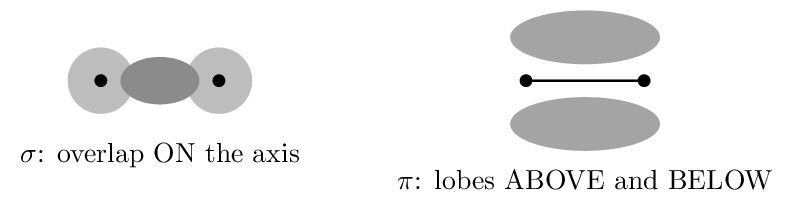

# Guided Notes

*Chapter 9 • Covalent Bonding: Orbitals*  
Zumdahl §9.1 (CED) $+$ §9.2–9.3 (enrichment) • PDF pp. 454–490 • 3 blocks

[← all lessons](../index.md)

---

> 📌 **Read this before you open the chapter — it is mostly off-syllabus**
>
> This is the **thinnest chapter in the book for AP purposes**. Only
> **§9.1** is examinable — hybridization and $\sigma$/$\pi$ bonding,
> which are CED 2.7.
> 
> **§9.2–9.5 develop molecular orbital theory** — MO diagrams, bond
> order from filled orbitals, homonuclear and heteronuclear diatomics. None of
> it is on the current CED. Rather than pretend otherwise, this chapter is
> built as two examinable blocks plus **one clearly marked enrichment
> block**. Work Blocks 1–2 properly; treat Block 3 as optional reading.
> 
> One more scope note: the CED assesses only **sp, sp$^2$, and sp$^3$**.
> Zumdahl's §9.1 also covers dsp$^3$ and d$^2$sp$^3$ for expanded octets —
> and he himself notes that this model “does not give an accurate picture”
> and that newer work does not use $d$ orbitals at all. You still assign
> *shapes* to PCl₅ and SF₆ with VSEPR; you are simply not asked
> for their hybridization.

## Hybridization and the Localized Electron Model Zumdahl §9.1

> 📌 **By the end you can…**
>
> - Explain why hybrid orbitals are proposed at all.
> - Assign sp, sp$^2$, or sp$^3$ from the electron-domain count.

**Read:** Zumdahl §9.1 • PDF pp. 455–466

> 📌 **Retrieval warm-up**
>
> 1. Electron domains around C in CH₄: **\_\_\_\_\_\_**
> 2. Geometry of BF₃: **\_\_\_\_\_\_**
> 3. Does a double bond count as one domain or two?
>    **\_\_\_\_\_\_**

#### INSTRUCTION A • The problem hybridization solves 25 min

### Why plain atomic orbitals are not enough `ZUM §9.1`

`SP 1`

Carbon's ground-state configuration is $[\text{He}]\,2s^2\,2p^2$ — one
filled $s$ orbital and two half-filled $p$ orbitals, pointing at
90$^\circ$ to each other. Taken literally, that predicts carbon should form
**\_\_\_\_\_\_** bonds at **\_\_\_\_\_\_**.

Methane is observed to have **\_\_\_\_\_\_** identical C–H bonds
at **\_\_\_\_\_\_**. The atomic-orbital picture is simply
wrong about the molecule.

> 📌 **Note**
>
> Zumdahl's resolution, and the key idea of the whole chapter: *start
> with the molecule, not the atoms*. A molecule's tendency to minimize its
> energy matters more than preserving the orbital arrangement the free atom
> happened to have. So we assume the atom hybridizes — its $2s$ and
> three $2p$ orbitals combine into four identical orbitals pointing at the
> corners of a tetrahedron.
> 
> Hybridization is a *model built to fit observed geometry*, not a
> physical event that happens to atoms. Nothing “hybridizes” in time.

#### The three hybridizations you are responsible for

| **Domains** | **Hybrid** | **Built from** | **Geometry** | **Leftover $p$** |
|---|---|---|---|---|
| 2 | **\_\_\_\_\_\_** | one $s$, one $p$ | **\_\_\_\_\_\_** | **\_\_\_\_\_\_** |
| 3 | **\_\_\_\_\_\_** | one $s$, two $p$ | **\_\_\_\_\_\_** | **\_\_\_\_\_\_** |
| 4 | **\_\_\_\_\_\_** | one $s$, three $p$ | **\_\_\_\_\_\_** | **\_\_\_\_\_\_** |

The count is the whole trick: **the number of hybrid orbitals always
equals the number of atomic orbitals combined**, and equals the number of
electron **\_\_\_\_\_\_**.

#### GUIDED PRACTICE • Zumdahl's three-step procedure 15 min

Always in this order:

1. Draw the **\_\_\_\_\_\_**.
2. Determine the electron-pair arrangement using
   **\_\_\_\_\_\_**.
3. Assign the **\_\_\_\_\_\_** that match.

Apply it:

1. C in CH₄: **\_\_\_\_\_\_**
2. B in BF₃: **\_\_\_\_\_\_**
3. C in CO₂: **\_\_\_\_\_\_**
4. N in NH₃: **\_\_\_\_\_\_**
5. O in H₂O: **\_\_\_\_\_\_**

> ⚠️ **AP trap**
>
> Count *domains*, not bonds. Water's oxygen has only two bonds but two
> lone pairs as well — four domains, so sp$^3$. Students who count bonds
> report sp for water and get both the hybridization and the bent geometry
> wrong.

#### INSTRUCTION B • The model's limits 20 min

### Where the simple picture strains `ZUM §9.1`

`SP 6`

For PCl₅, five electron pairs require a trigonal bipyramidal
arrangement, and Zumdahl introduces dsp$^3$ hybridization to supply
five orbitals. But he immediately adds a caution worth taking seriously:

> 📌 **Note**
>
> Zumdahl's own words are that this model “does not give an accurate picture
> of the actual bonding,” and that recent research shows a better model
> *does not use $d$ orbitals at all*. He keeps it only for convenience.
> 
> This is a good general lesson: the simple models in an introductory course
> are chosen for usefulness, not truth, and a well-taught course tells you
> which is which. It is also why the CED stops at sp$^3$ — you assign
> PCl₅ and SF₆ their *shapes* with VSEPR and leave their
> hybridization alone.

#### APPLICATION • Assign hybridization in real molecules 20 min

1. In methanol, CH₃OH, give the hybridization of both the carbon
   and the oxygen, with domain counts.
   \_\_\_\_\_\_\_\_\_\_\_\_\_\_\_\_\_\_\_\_
2. In formaldehyde, H₂CO, give the carbon's hybridization and
   predict the H–C–H angle.
   \_\_\_\_\_\_\_\_\_\_\_\_\_\_\_\_\_\_\_\_
3. SO₂ and SO₃ both have sulfur as the central atom, yet only
   one is bent. Give each hybridization and explain.
   \_\_\_\_\_\_\_\_\_\_\_\_\_\_\_\_\_\_\_\_

> 📌 **Exit ticket**
>
> Both CH₄ and H₂O have sp$^3$ hybridized central atoms, yet their
> bond angles differ. Explain. 
> 
> \_\_\_\_\_\_\_\_\_\_\_\_\_\_\_\_\_\_\_\_

## Sigma and Pi Bonds Zumdahl §9.1

> 📌 **By the end you can…**
>
> - Distinguish $\sigma$ from $\pi$ bonds by how orbitals overlap.
> - Count $\sigma$ and $\pi$ bonds, and explain restricted rotation.

**Read:** Zumdahl §9.1 • PDF pp. 455–466

> 📌 **Retrieval warm-up**
>
> 1. Hybridization of C in C₂H₆: **\_\_\_\_\_\_**
> 2. How many hybrid orbitals does sp$^2$ produce?
>    **\_\_\_\_\_\_**
> 3. Leftover unhybridized $p$ orbitals on an sp carbon:
>    **\_\_\_\_\_\_**

#### INSTRUCTION A • Two ways for orbitals to overlap 25 min

### Sigma and pi `ZUM §9.1`

`SP 1`

|  | **$\sigma$ (sigma) bond** | **$\pi$ (pi) bond** |
|---|---|---|
| Overlap | **\_\_\_\_\_\_**, along the internuclear axis | **\_\_\_\_\_\_**, above and below the axis |
| Built from | hybrid orbitals | leftover **\_\_\_\_\_\_** orbitals |
| Electron density | concentrated **\_\_\_\_\_\_** | in two lobes off the axis |
| Rotation | **\_\_\_\_\_\_** | **\_\_\_\_\_\_** |

#### Counting rule

- Single bond $=$ **\_\_\_\_\_\_**
- Double bond $=$ **\_\_\_\_\_\_**
- Triple bond $=$ **\_\_\_\_\_\_**

> 📌 **Note**
>
> The *first* bond between two atoms is always $\sigma$; every additional
> bond is $\pi$. That is because head-on overlap is more effective than
> side-by-side, so it happens first — and it is also why $\pi$ bonds are
> generally weaker and more reactive.

#### GUIDED PRACTICE • Count them 15 min

1. C₂H₆ (ethane): **\_\_\_\_\_\_**
2. C₂H₄ (ethene): **\_\_\_\_\_\_**
3. C₂H₂ (ethyne): **\_\_\_\_\_\_**
4. HCN: **\_\_\_\_\_\_**
5. N₂: **\_\_\_\_\_\_**

#### INSTRUCTION B • Why double bonds cannot rotate 20 min

### Restricted rotation `ZUM §9.1`

`SP 6`

A $\sigma$ bond is cylindrically symmetric about the internuclear axis, so
the two ends can spin freely — rotation costs essentially nothing.

A $\pi$ bond is different. Its two lobes must stay
**\_\_\_\_\_\_** to overlap at all. Rotating one end by
90$^\circ$ would set the $p$ orbitals perpendicular, destroying the overlap
and **\_\_\_\_\_\_**. That takes a large amount of
energy, so at ordinary temperatures a double bond is
**\_\_\_\_\_\_**.

> 📘 **Worked example: why cis and trans exist**
>
> In C₂H₄Cl₂ with one Cl on each carbon, the two chlorines can sit on the
> same side of the double bond (*cis*) or opposite sides
> (*trans*). Because the $\pi$ bond blocks rotation, these are
> **different compounds** — separable, with different melting points
> and dipole moments.
> 
> Do the same with ethane (C₂H₄Cl₂ with a single C–C bond) and the two
> arrangements interconvert freely billions of times a second. They are not
> distinguishable substances at all.

#### APPLICATION • Structure and bonding together 20 min

1. For H₂C=CH-C#N: give the hybridization of each carbon and the
   total $\sigma$ and $\pi$ counts.
   \_\_\_\_\_\_\_\_\_\_\_\_\_\_\_\_\_\_\_\_
2. Explain why ethyne (C₂H₂) is linear while ethene
   (C₂H₄) is planar but not linear.
   \_\_\_\_\_\_\_\_\_\_\_\_\_\_\_\_\_\_\_\_

> 📌 **Exit ticket**
>
> A molecule has 4 $\sigma$ and 2 $\pi$ bonds between its heavy atoms. What
> kind of multiple bonding must it contain? 
> 
> \_\_\_\_\_\_\_\_\_\_\_\_\_\_\_\_\_\_\_\_

## ENRICHMENT: The Molecular Orbital Model Zumdahl §9.2–9.3 — NOT on the CED

> 📌 **This block is optional**
>
> Nothing in this block is assessed on the AP exam. It is included because
> molecular orbital theory answers one question the Lewis model cannot —
> and knowing where a model *fails* is worth an hour of anyone's time.
> Skip it entirely without penalty.

> 📌 **By the end you can…**
>
> - Explain what a molecular orbital is and compute bond order.
> - Describe the oxygen paramagnetism problem and its resolution.

**Read:** Zumdahl §9.2–9.3 • PDF pp. 466–476

#### INSTRUCTION A • Orbitals that belong to the molecule 25 min

### Bonding and antibonding `ZUM §9.2`

`SP 1`

The localized electron model treats bonds as belonging to *pairs* of
atoms. Molecular orbital theory instead combines atomic orbitals into
orbitals that span the *whole molecule*.

Combining two atomic orbitals always produces two molecular orbitals:

- a bonding MO — lower in energy, with electron density
   **\_\_\_\_\_\_**;
- an antibonding MO ($\sigma^*$, $\pi^*$) — higher in energy,
   with a **\_\_\_\_\_\_** between the nuclei.

$\text{Bond order} =$ **\_\_\_\_\_\_**

A bond order of zero means **\_\_\_\_\_\_** — which is
exactly why He₂ does not exist.

#### GUIDED PRACTICE • Bond order practice 15 min

1. H₂: 2 bonding, 0 antibonding $\to$ bond order
   **\_\_\_\_\_\_**
2. He₂: 2 bonding, 2 antibonding $\to$ bond order
   **\_\_\_\_\_\_**
3. O₂: 10 bonding, 6 antibonding $\to$ bond order
   **\_\_\_\_\_\_**
4. N₂: 10 bonding, 4 antibonding $\to$ bond order
   **\_\_\_\_\_\_**

Zumdahl notes the payoff: across the period-2 diatomics, as MO bond order
rises, bond energy **\_\_\_\_\_\_** and bond length
**\_\_\_\_\_\_** — strong evidence the model is capturing
something real.

#### INSTRUCTION B • The oxygen problem 20 min

### Where Lewis structures fail `ZUM §9.3`

`SP 6`

> 📌 **Note**
>
> Draw the Lewis structure of O₂ and you get O=O with two lone pairs
> on each oxygen — **every electron paired**. That structure predicts
> oxygen should be diamagnetic, weakly repelled by a magnet.
> 
> Liquid oxygen is paramagnetic. Pour it between the poles of a magnet
> and it visibly sticks. It has **two unpaired electrons**.
> 
> The Lewis model cannot account for this. It is not a small discrepancy or a
> measurement issue — the model simply gets it wrong.

The MO model resolves it cleanly. Filling oxygen's molecular orbitals places
the last two electrons in *separate* degenerate $\pi^*$ orbitals, with
parallel spins by Hund's rule. Result: bond order 2 (agreeing with the
double bond) *and* two **\_\_\_\_\_\_** electrons,
matching the magnetic evidence exactly.

#### APPLICATION • Comparing the two models 20 min

State one thing the localized electron model does better than MO
        theory, and one thing MO does better.
        

\_\_\_\_\_\_\_\_\_\_\_\_\_\_\_\_\_\_\_\_

Both models agree that O₂ has a bond order of 2. Why is that
        agreement reassuring rather than trivial?
        

\_\_\_\_\_\_\_\_\_\_\_\_\_\_\_\_\_\_\_\_

> 📌 **Exit ticket**
>
> Why does He₂ not exist, in MO terms? 
> 
> \_\_\_\_\_\_\_\_\_\_\_\_\_\_\_\_\_\_\_\_

---

*AP Chemistry course materials • student edition • CC BY-NC-SA 4.0*
