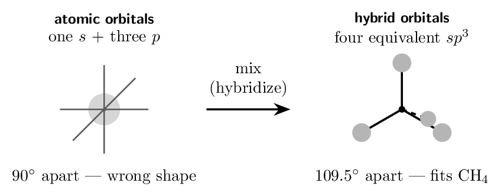
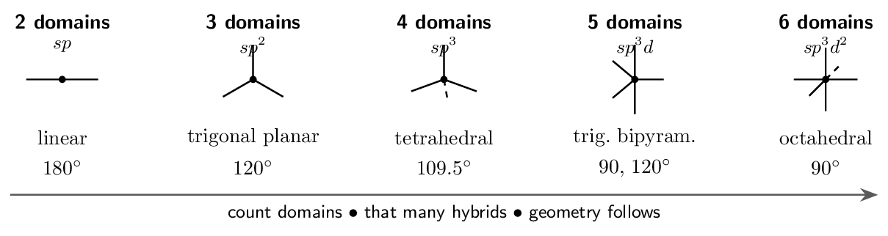
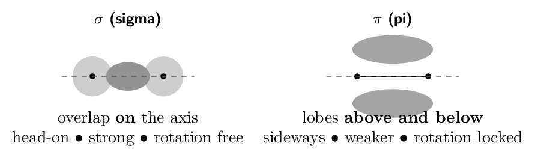
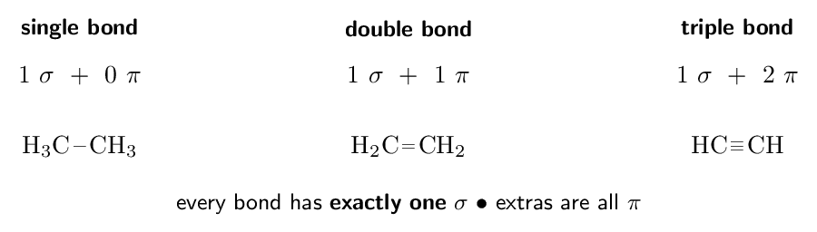
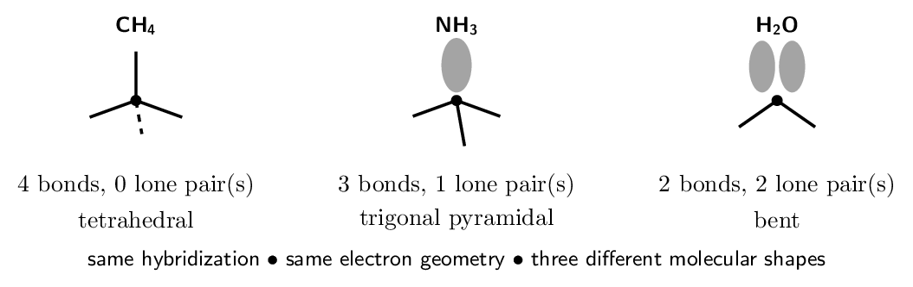
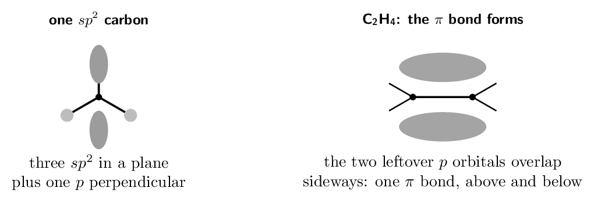
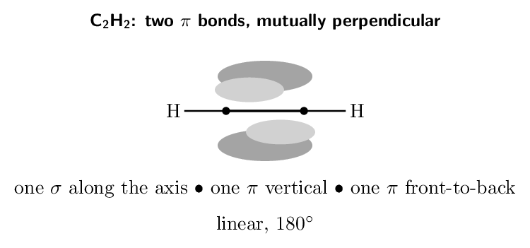
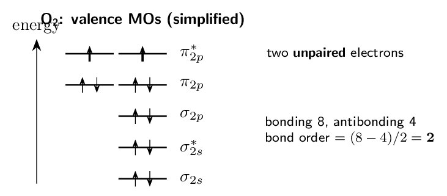

# Self-Study • Chapter 9, I do / You do

*Chapter 9 • Covalent Bonding: Orbitals*  
Zumdahl §9.1 (assessed) $+$ §9.2–9.3 (enrichment) • PDF pp. 455–480

[← all lessons](../index.md)

---

> 📌 **How to use these notes — read this first**
>
> Each skill is a **ladder**: a fully worked example in the
> solid-framed box, then **four** YOUR TURN questions in the dashed
> box — same skill, new numbers, no help. Work all four before checking
> the gray *check:* line; a tracker tick needs all four right first
> time.
> 
> **A scope warning that will save you hours.** Zumdahl's
> §9.2–9.5 — the whole Molecular Orbital chapter, MO diagrams,
> bond order from MO counts, homonuclear and heteronuclear diatomics —
> is **not on the AP CED**. It was dropped in the 2019 redesign.
> Ladders 1–8 cover §9.1, which *is* assessed and assessed heavily.
> Ladder 9 is MO theory, marked as enrichment: read it if you are curious
> or heading for college chemistry, skip it entirely without penalty.
> 
> **The whole of §9.1 in one sentence.** A carbon atom's real
> orbitals ($2s$ and three $2p$) do not point the right way to make four
> identical bonds — so we mix them into new ones that do, and the number
> we mix is set by the number of electron domains VSEPR already told you.

## Ladder 1 • Why hybridization is needed

`ZUM §9.1`

Methane is a fact: four identical C-H bonds, all
109.5 degree apart. Carbon's ground state is
$1s^{2}\,2s^{2}\,2p^{2}$ — one filled $s$, two half-filled $p$ and one
empty $p$. Those orbitals could not produce four identical bonds if we
wanted them to: the $p$ orbitals are mutually perpendicular
(90 degree) and the $s$ is spherical.

**Hybridization is a bookkeeping device, not an event.** No atom
“does” it. It is what the mathematics of the localized electron model
requires so that the orbitals we draw match the geometry we measure —
the model bending to fit the evidence, which is the right way round.

> 📘 **I do: counting what must be mixed**
>
> **How many orbitals must carbon mix to bond in methane, and which
> ones?**
> 
> **Start from the evidence, not the theory.** Methane has four bonds
> pointing to the corners of a tetrahedron. Four bonds need
> **four orbitals**, all equivalent.
> 
> **Take four from what carbon has.** The $n = 2$ shell offers one
> $2s$ and three $2p$. Mixing all four gives four new orbitals.
> 
> **Name them by what went in.** One $s$ plus three $p$ is written
> $\mathbf{sp^{3}}$ — the superscript 3 counts the $p$ orbitals, and the
> absent superscript on $s$ means one.
> 
> **The conservation rule that checks your work:** orbitals in equals
> orbitals out. Four atomic orbitals produce exactly four hybrids —
> never three, never five.
> 
> **And the payoff:** four $sp^{3}$ orbitals point at
> 109.5 degree, which is the measured H-C-H angle. The model
> now agrees with the laboratory.

> ✏️ **YOUR TURN 1 — four questions**
>
> 1. How many hybrid orbitals result from mixing one $s$ and two $p$
>    orbitals, and what is the set called?
>    *(working space)*
> 2. Why can four unmixed $2p$ orbitals not explain methane?
>    *(working space)*
> 3. If an atom uses $sp^{3}d$ hybridization, how many atomic orbitals
>    were mixed?
>    *(working space)*
> 4. Is hybridization something an atom physically does? Explain.
>    *(working space)*
> 
> > **check:** (a) three, $sp^{2}$     (b) carbon has only three $2p$, and
> they are 90 degree apart     (c) five     (d) no — it is a
> model, chosen to match measured geometry

## Ladder 2 • Domains to hybridization

`ZUM §9.1`

You already count electron domains for VSEPR. The same count gives the
hybridization — one hybrid orbital per domain.

> ⚠️ **AP trap**
>
> Count **domains**, not bonds. A double or triple bond is
> **one** domain, and a **lone pair is a domain too**. Carbon in
> CO₂ has two double bonds — two domains — so it is $sp$, not
> $sp^{3}$. Counting bonds instead of domains is the single commonest
> error in this chapter.

> 📘 **I do: three molecules, one procedure**
>
> **(a) CO₂.** Carbon has two double bonds and no lone pairs.
> Each double bond is one domain, so **2 domains** $\Rightarrow$
> **$sp$**, linear, 180 degree.
> 
> **(b) H₂O.** Oxygen has two bonds and two lone pairs.
> **4 domains** $\Rightarrow$ **$sp^{3}$**. The electron geometry
> is tetrahedral; the *molecular* shape is bent, because you cannot
> see lone pairs. Both facts are true at once, and the hybridization
> follows the domains, not the shape.
> 
> **(c) SO₃.** Sulfur has three domains (one double, two single
> in each resonance structure, no lone pair) $\Rightarrow$
> **$sp^{2}$**, trigonal planar, 120 degree.
> 
> **The procedure is always identical:** draw the Lewis structure,
> count domains on the atom in question, read the hybridization off the
> count. You never need to think about which specific orbitals are
> involved.

> ✏️ **YOUR TURN 2 — four questions**
>
> Give the hybridization of the *central* atom.
> 
> 1. NH₃ 
>    *(working space)*
> 2. BF₃ 
>    *(working space)*
> 3. PCl₅ 
>    *(working space)*
> 4. HCN — give the hybridization of the carbon, and say why
>    the triple bond does not make it $sp^{3}$.
>    *(working space)*
> 
> > **check:** (a) $sp^{3}$     (b) $sp^{2}$     (c) $sp^{3}d$    
> (d) $sp$ — the triple bond is one domain

## Ladder 3 • Sigma and pi bonds

`ZUM §9.1`

Two ways for orbitals to overlap, and the difference decides almost
everything about the bond.

> 📘 **I do: counting bonds in ethene and ethyne**
>
> **Ethene, C₂H₄.** Each carbon has three domains
> ($\Rightarrow sp^{2}$) and keeps one unhybridized $p$ orbital
> perpendicular to the plane. The two $p$ orbitals overlap sideways to form
> the $\pi$ bond.
> 
> Count: four C-H $\sigma$ bonds, one C-C $\sigma$, and one
> $\pi$. 
> 
> $$ \mathbf{5~\sigma \;+\; 1~\pi} $$
> 
> **Ethyne, C₂H₂.** Each carbon has two domains
> ($\Rightarrow sp$) and keeps *two* unhybridized $p$ orbitals, which
> form two mutually perpendicular $\pi$ bonds.
> 
> Count: two C-H $\sigma$, one C-C $\sigma$, two $\pi$.
> 
> $$ \mathbf{3~\sigma \;+\; 2~\pi} $$
> 
> **The bookkeeping rule.** Hybrid orbitals make $\sigma$ bonds;
> leftover unhybridized $p$ orbitals make $\pi$ bonds. Count the hybrids
> used and the $p$ orbitals left over, and the two numbers must account
> for every bond.

> ✏️ **YOUR TURN 3 — four questions**
>
> 1. How many $\sigma$ and $\pi$ bonds in CO₂?
>    *(working space)*
> 2. How many $\sigma$ and $\pi$ bonds in HCN?
>    *(working space)*
> 3. How many unhybridized $p$ orbitals remain on an $sp^{2}$ carbon,
>    and what do they do?
>    *(working space)*
> 4. Which is stronger, a $\sigma$ or a $\pi$ bond, and why?
>    *(working space)*
> 
> > **check:** (a) 2 $\sigma$, 2 $\pi$     (b) 2 $\sigma$, 2 $\pi$    
> (c) one — it forms the $\pi$ bond     (d) $\sigma$ — head-on
> overlap is greater

## Ladder 4 • $sp^{3}$ in detail

`ZUM §9.1`

Four domains, four hybrids, tetrahedral electron geometry — and the
molecular shape depends on how many of those domains are lone pairs.

> 📘 **I do: why the shapes differ but the hybrid does not**
>
> All three molecules above are $sp^{3}$. Why do their shapes differ?
> 
> **Because hybridization answers a different question than shape
> does.** Hybridization is set by the *number of domains* — four in
> every case here, so four hybrid orbitals, so $sp^{3}$, so a tetrahedral
> arrangement of *domains*.
> 
> **Molecular shape names only the atoms.** Methane's four domains
> are all bonds, so the shape is tetrahedral. Ammonia spends one domain on
> a lone pair, which is invisible, so the three remaining atoms describe a
> pyramid. Water spends two, leaving a bent arrangement.
> 
> **The consequence for bond angles.** A lone pair occupies its
> $sp^{3}$ orbital but is held by only one nucleus, so it spreads wider and
> compresses the rest: 109.5 degree in CH₄,
> 107 degree in NH₃, 104.5 degree in H₂O. The
> hybridization never changed — only how many domains you can see.
> 
> **So the safe phrasing on an exam:** “the central atom is $sp^{3}$
> hybridized, giving a tetrahedral electron geometry and a bent molecular
> shape”. Naming both keeps you right whichever the question asked for.

> ✏️ **YOUR TURN 4 — four questions**
>
> 1. Hybridization, electron geometry, and molecular shape for
>    PH₃.
>    *(working space)*
> 2. Same three for H₂S. 
>    *(working space)*
> 3. Same three for CCl₄. 
>    *(working space)*
> 4. Two molecules are both $sp^{3}$. Must they have the same
>    molecular shape? Explain.
>    *(working space)*
> 
> > **check:** (a) $sp^{3}$, tetrahedral, trigonal pyramidal     (b)
> $sp^{3}$, tetrahedral, bent     (c) $sp^{3}$, tetrahedral,
> tetrahedral     (d) no — it depends on how many domains are lone
> pairs

## Ladder 5 • $sp^{2}$ and the pi bond

`ZUM §9.1`

Three domains means three hybrids — and one $p$ orbital left over,
standing perpendicular to the plane of the three.

> 📘 **I do: formaldehyde, H₂CO**
>
> **Carbon's domains:** two C-H single bonds and one C=O
> double bond. A double bond is one domain, so **3 domains**
> $\Rightarrow$ **$sp^{2}$**, trigonal planar, roughly
> 120 degree.
> 
> **Which orbitals do what.** Carbon's three $sp^{2}$ hybrids form
> three $\sigma$ bonds: two to hydrogen, one to oxygen. Its remaining
> unhybridized $p$ orbital overlaps sideways with a $p$ orbital on oxygen,
> forming the $\pi$ bond that completes the double bond.
> 
> **Oxygen too.** Oxygen has one double bond and two lone pairs —
> **3 domains** $\Rightarrow$ also **$sp^{2}$**. Two of its
> hybrids hold the lone pairs, one makes the $\sigma$ bond, and its
> leftover $p$ makes the $\pi$.
> 
> **Total count:** 3 $\sigma$ and 1 $\pi$, and the molecule is
> planar — every atom in one plane, because that is what the three
> $sp^{2}$ directions demand.
> 
> **Note the habit worth forming:** assign hybridization to
> *every* atom that has more than one neighbour, not just the obvious
> central one. Exam questions ask about oxygen and nitrogen as often as
> carbon.

> ✏️ **YOUR TURN 5 — four questions**
>
> 1. Hybridization of the carbon in COCl₂ (one C=O, two
>    C-Cl).
>    *(working space)*
> 2. Hybridization of the nitrogen in HNO₂ where N has one
>    double bond, one single bond and one lone pair.
>    *(working space)*
> 3. How many $\sigma$ and $\pi$ bonds does H₂CO have in total?
>    *(working space)*
> 4. Why must every atom in H₂CO lie in one plane?
>    *(working space)*
> 
> > **check:** (a) $sp^{2}$     (b) $sp^{2}$     (c) 3 $\sigma$, 1
> $\pi$     (d) the three $sp^{2}$ orbitals are coplanar

## Ladder 6 • $sp$ and two pi bonds

`ZUM §9.1`

Two domains means two hybrids, pointing opposite ways — and
*two* unhybridized $p$ orbitals left over, perpendicular to each
other and to the bond axis.

> 📘 **I do: carbon dioxide, atom by atom**
>
> **Carbon.** Two double bonds $=$ **2 domains** $\Rightarrow$
> **$sp$**, linear at 180 degree. Its two $sp$ hybrids make the
> two $\sigma$ bonds; its two leftover $p$ orbitals make one $\pi$ bond to
> each oxygen.
> 
> **Each oxygen.** One double bond $+$ two lone pairs $=$
> **3 domains** $\Rightarrow$ **$sp^{2}$**. Two hybrids hold the
> lone pairs, one makes the $\sigma$, and the leftover $p$ makes the $\pi$.
> 
> **So the atoms in one molecule can differ.** Carbon is $sp$ while
> both oxygens are $sp^{2}$ — a point exam questions exploit, because
> students assign the central atom and stop.
> 
> **Totals:** 2 $\sigma$ and 2 $\pi$, molecule linear and therefore
> nonpolar despite two strongly polar bonds — the Chapter 8 result,
> recovered here from orbital reasoning.

> ✏️ **YOUR TURN 6 — four questions**
>
> 1. Hybridization of the carbon in HCN, and of the nitrogen.
>    *(working space)*
> 2. How many unhybridized $p$ orbitals does an $sp$ carbon keep?
>    *(working space)*
> 3. In C₂H₂, how many $\sigma$ and $\pi$ bonds are there in
>    total?
>    *(working space)*
> 4. Rank $sp$, $sp^{2}$, $sp^{3}$ by the bond angle they produce.
>    *(working space)*
> 
> > **check:** (a) both $sp$     (b) two     (c) 3 $\sigma$, 2 $\pi$
>     (d) $sp^{3}$ (109.5) $ 📘 **I do: why one has isomers and the other does not**
>
> **C₂H₄Cl₂ with a single C-C bond** —
> 1,2-dichloroethane. The C-C bond is a lone $\sigma$, cylindrically
> symmetric, so the two CH₂Cl ends spin freely at room temperature.
> Any arrangement converts into any other billions of times a second, so
> there is only **one** compound.
> 
> **C₂H₂Cl₂ with a double C=C bond** —
> 1,2-dichloroethene. Now the $\pi$ bond holds the two ends rigidly
> coplanar. Turning one end over would require breaking the sideways $p$
> overlap, which costs far more energy than is available at room
> temperature.
> 
> So the two chlorines are stuck either on the same side (*cis*) or
> on opposite sides (*trans*), and these are **two different
> compounds** with different physical properties — different melting
> points, different boiling points, different dipole moments (*cis*
> is polar, *trans* is not).
> 
> **The general statement:** $\pi$ bonds lock geometry. That single
> fact explains *cis*/*trans* isomerism, why fats are described
> as *cis*-unsaturated, and how vision works — the retinal molecule
> in your eye responds to light by flipping one *cis* double bond to
> *trans*.

> ✏️ **YOUR TURN 7 — four questions**
>
> 1. Can H₃C-CH₃ show *cis*/*trans* isomerism?
>    Explain.
>    *(working space)*
> 2. Which bond in a double bond must break to allow rotation?
>    *(working space)*
> 3. Of *cis*- and *trans*-1,2-dichloroethene, which is
>    polar?
>    *(working space)*
> 4. Why can a triple bond not show *cis*/*trans*
>    isomerism?
>    *(working space)*
> 
> > **check:** (a) no — free rotation about the $\sigma$     (b) the
> $\pi$     (c) *cis*     (d) it is linear, so there are no
> “sides”

## Ladder 8 • Full analysis of a molecule

`ZUM §9.1`

Everything from Ladders 1–7, applied in one pass. The order never
changes:

> 
Lewis structure $\to$ count domains on *each* interior atom $\to$
hybridization $\to$ geometry and angles $\to$ count $\sigma$ and $\pi$

> 📘 **I do: acetic acid, CH₃COOH**
>
> The skeleton is CH₃-C(=O)-O-H. Take the interior atoms one at a
> time.
> 
> **Methyl carbon.** Four single bonds $=$ 4 domains $\Rightarrow$
> **$sp^{3}$**, tetrahedral, 109.5 degree.
> 
> **Carbonyl carbon.** One C=O $+$ two single bonds $=$
> 3 domains $\Rightarrow$ **$sp^{2}$**, trigonal planar,
> 120 degree.
> 
> **Carbonyl oxygen** (the double-bonded one). One double bond $+$
> two lone pairs $=$ 3 domains $\Rightarrow$ **$sp^{2}$**.
> 
> **Hydroxyl oxygen.** Two single bonds $+$ two lone pairs $=$
> 4 domains $\Rightarrow$ **$sp^{3}$**, bent at the oxygen.
> 
> **Bond count.** Every single bond is one $\sigma$; the one double
> bond adds a $\pi$. Three C-H, one C-C, one C=O $\sigma$,
> one C-O $\sigma$, one O-H $=$
> 
> $$ \mathbf{7~\sigma \;+\; 1~\pi} $$
> 
> **What this molecule demonstrates.** *Four* interior atoms,
> *three* different hybridizations, and two oxygens that differ from
> each other. A question asking only for “the hybridization of the
> central atom” would be meaningless here — which is why the procedure
> works atom by atom.

> ✏️ **YOUR TURN 8 — four questions**
>
> Consider acetonitrile, CH₃CN (skeleton H₃C-C#N).
> 
> 1. Hybridization of the methyl carbon. 
>    *(working space)*
> 2. Hybridization of the nitrile carbon and of the nitrogen.
>    *(working space)*
> 3. Total $\sigma$ and $\pi$ bonds in the molecule.
>    *(working space)*
> 4. Give the approximate H-C-H angle and the C-C#N angle.
>    *(working space)*
> 
> > **check:** (a) $sp^{3}$     (b) both $sp$     (c) 5 $\sigma$, 2
> $\pi$     (d) 109.5 degree and 180 degree

## Ladder 9 • ENRICHMENT: molecular orbitals

`ZUM §9.2–9.3`

> ⚠️ **AP trap**
>
> **Not on the AP CED.** Molecular orbital theory was dropped in the
> 2019 redesign, and no AP question will ask for an MO diagram, an MO bond
> order, or the electron configuration of O₂ in MO terms. This ladder
> exists because MO explains one thing the localized model gets plainly
> wrong, and because it is standard in college chemistry. **Skip it
> with a clear conscience if you are short of time.**

Two atomic orbitals combine into two molecular orbitals: one
**bonding** (lower energy, density between the nuclei) and one
**antibonding** (higher, with a node between them).

$$ \text{bond order} =    \frac{(\text{bonding e}^-) - (\text{antibonding e}^-)}{2} $$

> 📘 **I do: the one thing Lewis structures get wrong**
>
> **Draw the Lewis structure of O₂.** You get O=O with two
> lone pairs on each oxygen — every electron paired.
> 
> **Now measure it.** Liquid oxygen is **paramagnetic**: poured
> between the poles of a magnet, it sticks. Paramagnetism requires
> *unpaired* electrons, and the Lewis structure has none. The
> localized model is simply wrong here.
> 
> **What MO theory says.** Filling the valence molecular orbitals for
> O₂'s 12 valence electrons puts the last two in *different*
> $\pi^{*}$ orbitals with parallel spins — Hund's rule again. Two
> unpaired electrons, exactly as the magnet shows.
> 
> **And the bond order still comes out right:**
> 
> $$ \frac{8 - 4}{2} = 2 $$
> 
> a double bond, agreeing with Lewis on the bond strength while
> disagreeing about the spins.
> 
> **The lesson worth keeping even though this is off-syllabus:** a
> model is a tool, not the truth. The localized model handles geometry
> beautifully and paramagnetism not at all; MO does the reverse. Chemists
> use whichever answers the question in front of them.

> ✏️ **YOUR TURN 9 — four questions, enrichment only**
>
> 1. N₂ has 10 valence electrons: 8 bonding, 2 antibonding. Give
>    the bond order.
>    *(working space)*
> 2. Is N₂ paramagnetic or diamagnetic? 
>    *(working space)*
> 3. What does a bond order of zero imply about a species?
>    *(working space)*
> 4. State one thing the localized model does better than MO theory.
>    *(working space)*
> 
> > **check:** (a) 3     (b) diamagnetic — all paired     (c) it does
> not exist as a stable molecule     (d) predicting molecular geometry

## Mastery tracker

Tick a row only if **all four** YOUR TURN questions were right on
the first attempt. Ladder 9 is enrichment — an untickable row there
costs you nothing.

| **First try?** | **Skill** | **Ladder** | **If not, re-read…** |
|---|---|---|---|
| $\square$ | why hybridization exists | 1 | orbitals in $=$ orbitals out |
| $\square$ | domains to hybridization | 2 | domains, not bonds |
| $\square$ | sigma and pi bonds | 3 | one $\sigma$ per bond, rest $\pi$ |
| $\square$ | $sp^{3}$ and lone pairs | 4 | hybrid vs molecular shape |
| $\square$ | $sp^{2}$ and the pi bond | 5 | the leftover $p$ |
| $\square$ | $sp$ and two pi bonds | 6 | two leftover $p$ |
| $\square$ | restricted rotation, isomers | 7 | $\pi$ locks geometry |
| $\square$ | full molecular analysis | 8 | every interior atom |
| *(opt.)* | molecular orbitals | 9 | *not assessed* |

> 📌 **Scoring yourself honestly**
>
> 8/8 on Ladders 1–8: you have Chapter 9's assessed content. It is a
> short chapter by AP standards precisely because most of Zumdahl's
> Chapter 9 is off-syllabus — do not mistake its brevity for
> unimportance, because hybridization appears on nearly every structure
> question.
> 
> 6–7: redo the missed ladders tomorrow, not today.
> 
> 5 or fewer: the misses are almost certainly in Ladder 2, and everything
> downstream inherits them. Go back and practise counting
> **domains** on twenty Lewis structures — double and triple bonds
> as one, lone pairs as one each — until the count is automatic. Every
> other ladder in this chapter is built on that single skill.

---

*AP Chemistry course materials • student edition • CC BY-NC-SA 4.0*
