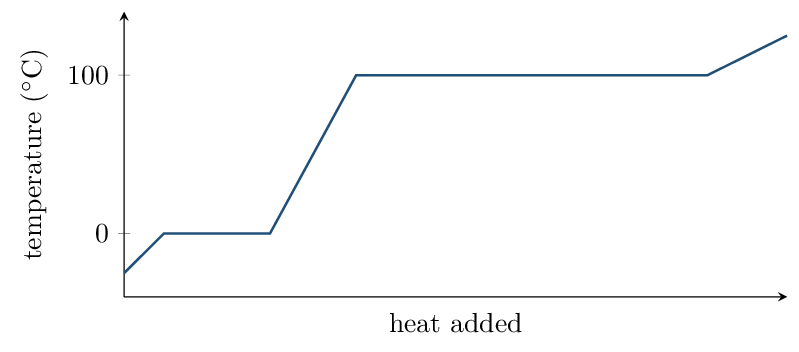

# Guided Notes

*Chapter 10 • Liquids and Solids*  
Zumdahl §10.1–10.8 • PDF pp. 491–530 • 5 blocks

[← all lessons](../index.md)

---

> 📌 **How this chapter fits the AP course**
>
> A chapter that feeds *three* different CED units:
> §10.1 $\to$ Unit 3.1 (intermolecular forces);
> §10.2–10.3, 10.6–10.7 $\to$ Unit 3.2–3.3 (solids, liquids, phases);
> §10.4 $\to$ Unit 2.4 (metals and alloys);
> §10.7 $\to$ Unit 2.3 (ionic solids);
> and §10.8 $\to$ **Unit 6.5**, the energy-of-phase-changes topic that
> Unit 6 borrows from this chapter.
> 
> **Two things inside are off-syllabus** and are marked as enrichment
> where they arise: *unit-cell counting and density calculations*
> (§10.3–10.4) and the *Clausius–Clapeyron equation* (§10.8). You are
> responsible for the qualitative structures and for reading a heating curve
> — not for computing a density from a unit-cell edge.
> 
> §10.9 (phase diagrams) is optional; a short treatment is included at the
> end of Block 5 because it makes vapour pressure easier to picture.

## Intermolecular Forces Zumdahl §10.1

> 📌 **By the end you can…**
>
> - Identify every intermolecular force acting in a substance.
> - Rank substances by IMF strength, accounting for polarizability.

**Read:** Zumdahl §10.1 • PDF pp. 493–498

> 📌 **Retrieval warm-up**
>
> 1. Is CH₄ polar? **\_\_\_\_\_\_**
> 2. Which is more electronegative, O or S?
>    **\_\_\_\_\_\_**
> 3. Geometry of H₂O: **\_\_\_\_\_\_**

#### INSTRUCTION A • The forces between molecules 25 min

### Three intermolecular forces `ZUM §10.1`

`SP 1`

These are attractions *between* molecules, not the bonds within them.
They are far weaker than covalent bonds — which is why melting a molecular
solid needs so much less energy than decomposing it.

| **Force** | **Present in** | **Origin** |
|---|---|---|
| London dispersion | **\_\_\_\_\_\_** | instantaneous, momentary dipoles from electron motion |
| Dipole–dipole | polar molecules | permanent $\delta^+$ attracted to a neighbour's
  **\_\_\_\_\_\_** |
| Hydrogen bonding | H bonded directly to
  **\_\_\_\_\_\_** | an especially strong dipole–dipole case |

> 📌 **Note**
>
> Dispersion forces exist in *everything*, including polar molecules.
> The question is never whether they are present but how large they are.
> Strength grows with the number of electrons, because a bigger, looser
> electron cloud is more polarizable.

#### Hydrogen bonding requires a direct attachment

CH₃OH hydrogen bonds through its **\_\_\_\_\_\_** group.
CH₃OCH₃ has the same formula C₂H₆O but
**\_\_\_\_\_\_** hydrogen bond — its hydrogens are all on
carbon. Boiling points: 65 °C versus -24 °C.

> 📘 **Worked example: when dispersion wins**
>
> Zumdahl's Table 10.3:
> 
> | Molecule | Forces | bp ( | deg;C) |
> |---|---|---|---|
> | BI₃ | dispersion only | 209.5 |
> | PCl₃ | dispersion $+$ dipole–dipole | 76.1 |
> | NH₃ | dispersion $+$ hydrogen bonding | $-33.0$ |

BI₃ is nonpolar yet boils highest. Its enormous electron count makes
dispersion overwhelming, while NH₃ is tiny with few electrons.

**Never rank by force *type* alone.** Compare molecular size
first when the molecules differ greatly; compare force type only among
molecules of similar size.

#### GUIDED PRACTICE • Identify and rank 15 min

1. CO₂: **\_\_\_\_\_\_**
2. HCl: **\_\_\_\_\_\_**
3. NH₃: **\_\_\_\_\_\_**
4. Rank bp: CH₄, Xe, H₂O
   **\_\_\_\_\_\_**

#### INSTRUCTION B • What IMFs control 20 min

### Properties that track IMF strength `ZUM §10.1`

`SP 6`

Stronger IMFs give **\_\_\_\_\_\_** boiling point,
**\_\_\_\_\_\_** viscosity, **\_\_\_\_\_\_** surface
tension — and **\_\_\_\_\_\_** vapour pressure.

> ⚠️ **AP trap**
>
> Vapour pressure runs *opposite* to the others, and it catches people
> out. Strong IMFs hold molecules in the liquid, so fewer escape — hence a
> *low* vapour pressure. A liquid that evaporates readily is called
> volatile, and volatility means *weak* IMFs.

#### APPLICATION • Structure to property 20 min

1. F₂, Cl₂, Br₂, I₂ are all nonpolar, yet boiling
   point rises steadily down the group. Explain.
   \_\_\_\_\_\_\_\_\_\_\_\_\_\_\_\_\_\_\_\_
2. H₂O boils at 100 °C while H₂S boils at
   -60 °C, even though H₂S has the greater molar
   mass. Explain.
   \_\_\_\_\_\_\_\_\_\_\_\_\_\_\_\_\_\_\_\_

> 📌 **Exit ticket**
>
> Two liquids have equal molar mass; one is polar and one is not. Which has
> the higher vapour pressure at room temperature, and why?
> 
> \_\_\_\_\_\_\_\_\_\_\_\_\_\_\_\_\_\_\_\_

## The Liquid State Zumdahl §10.2

> 📌 **By the end you can…**
>
> - Explain surface tension, viscosity, and capillary action in terms of
>    intermolecular forces.
> - Distinguish cohesive from adhesive forces.

**Read:** Zumdahl §10.2 • PDF pp. 498–501

> 📌 **Retrieval warm-up**
>
> 1. Strongest IMF in CH₃OH: **\_\_\_\_\_\_**
> 2. Higher vapour pressure: strong or weak IMFs?
>    **\_\_\_\_\_\_**
> 3. Which has stronger dispersion, Ne or Xe?
>    **\_\_\_\_\_\_**

#### INSTRUCTION A • Cohesion and adhesion 25 min

### Two kinds of attraction `ZUM §10.2`

`SP 1`

- Cohesive forces act between molecules of the
   **\_\_\_\_\_\_** substance.
- Adhesive forces act between the liquid and a
   **\_\_\_\_\_\_**, such as glass.

Which of the two wins determines much of a liquid's visible behaviour.

#### Surface tension

A molecule in the interior is pulled equally in all directions. A molecule at
the surface has no neighbours above, so it is pulled
**\_\_\_\_\_\_** — the liquid minimizes its surface area.

That is why water **\_\_\_\_\_\_** on a waxed car and why some
insects walk on ponds. Stronger IMFs give
**\_\_\_\_\_\_** surface tension.

#### GUIDED PRACTICE • Explain the observations 15 min

1. Why does a drop of water form a sphere in free fall?
   \_\_\_\_\_\_\_\_\_\_\_\_\_\_\_\_\_\_\_\_
2. Mercury has a much higher surface tension than water. What does that
   say about its cohesive forces?
   **\_\_\_\_\_\_**

#### INSTRUCTION B • Capillary action and viscosity 20 min

### Reading a meniscus `ZUM §10.2`

`SP 4`

Water creeps up a narrow glass tube because water's
**\_\_\_\_\_\_** forces to glass — the polar Si–OH groups
attract water's dipole — exceed its cohesive forces. The column rises
until its weight balances that attraction.

| **Liquid** | **Which force wins** | **Meniscus shape** |
|---|---|---|
| Water in glass | **\_\_\_\_\_\_** | **\_\_\_\_\_\_** (curves up at the edges) |
| Mercury in glass | **\_\_\_\_\_\_** | **\_\_\_\_\_\_** (bulges upward) |

> 📌 **Note**
>
> The meniscus is a direct readout of which force is stronger. Water wets
> glass and climbs it; mercury does not wet glass and pulls away from it.
> Reading a burette to the bottom of the meniscus is a consequence of this —
> with mercury you would read the top.

#### Viscosity

Viscosity is resistance to flow. It increases with
**\_\_\_\_\_\_** and also with
**\_\_\_\_\_\_** — long chain molecules tangle,
which is why motor oil and glycerol pour slowly while water does not.

#### APPLICATION • Property reasoning 20 min

1. Glycerol (C₃H₈O₃, three O–H groups) is far more viscous than
   ethanol (C₂H₅OH, one O–H). Give both reasons.
   \_\_\_\_\_\_\_\_\_\_\_\_\_\_\_\_\_\_\_\_
2. Predict the meniscus shape for water in a plastic (nonpolar) tube
   and justify.
   \_\_\_\_\_\_\_\_\_\_\_\_\_\_\_\_\_\_\_\_

> 📌 **Exit ticket**
>
> Explain why a paperclip can be floated on water even though steel is far
> denser than water. 
> 
> \_\_\_\_\_\_\_\_\_\_\_\_\_\_\_\_\_\_\_\_

## Metallic and Network Solids Zumdahl §10.3–10.5

> 📌 **By the end you can…**
>
> - Classify solids by particle type and predict properties.
> - Explain metallic bonding, alloys, and network covalent structures.

**Read:** Zumdahl §10.3–10.5 • PDF pp. 501–518

> 📌 **Retrieval warm-up**
>
> 1. Water in glass gives which meniscus?
>    **\_\_\_\_\_\_**
> 2. Viscosity increases with what?
>    **\_\_\_\_\_\_**
> 3. Does graphite conduct electricity? **\_\_\_\_\_\_**

#### INSTRUCTION A • Four kinds of solid 25 min

### Classification `ZUM §10.3`

`SP 1`

| **Type** | **Particles** | **Held by** | **Properties** |
|---|---|---|---|
| Metallic | cations $+$ e$^-$ sea | delocalized electrons | conducts **\_\_\_\_\_\_**, malleable, lustrous |
| Ionic | cations, anions | electrostatic attraction | high mp, brittle, conducts only when
  **\_\_\_\_\_\_** |
| Network covalent | atoms | **\_\_\_\_\_\_** | very high mp, very hard |
| Molecular | molecules | **\_\_\_\_\_\_** | low mp, soft, nonconducting |

#### GUIDED PRACTICE • Classify from data 15 min

1. mp 1538 °C, conducts as a solid, malleable:
   **\_\_\_\_\_\_**
2. mp 3550 °C, extremely hard, insulating:
   **\_\_\_\_\_\_**
3. mp -95 °C, soft, insulating:
   **\_\_\_\_\_\_**
4. mp 2852 °C, brittle, conducts when molten:
   **\_\_\_\_\_\_**

#### INSTRUCTION B • Metals, alloys, and network solids 20 min

### The electron sea and its consequences `ZUM §10.4`

`SP 6`

Metal cations sit in fixed positions while valence electrons are
delocalized across the entire sample. One model, three properties:

- conducts electricity — **\_\_\_\_\_\_**;
- malleable — layers slide without
   **\_\_\_\_\_\_** (contrast ionic solids,
   which shatter);
- lustrous — mobile electrons re-emit light.

#### Alloys

- Substitutional: similar-sized atoms
   **\_\_\_\_\_\_** host atoms — brass (Zn in Cu).
- Interstitial: small atoms fill
   **\_\_\_\_\_\_** between hosts — steel (C in Fe).
   These pin the layers, making the alloy
   **\_\_\_\_\_\_**.

#### Two forms of carbon

|  | **Diamond** | **Graphite** |
|---|---|---|
| Bonding | **\_\_\_\_\_\_**, 3-D network | **\_\_\_\_\_\_** sheets, with a leftover $p$ electron
  delocalized across each layer |
| Conducts? | **\_\_\_\_\_\_** | **\_\_\_\_\_\_**, within
  the layers |
| Hardness | hardest known | soft; layers slide over one another |

> 📌 **Note**
>
> Same element, wildly different properties — because *structure*,
> not composition, sets behaviour. Graphite's individual sheets are
> graphene, first isolated with adhesive tape in 2004 and awarded the
> 2010 Nobel Prize in physics. It is roughly 100 times stronger than steel.

> 📌 **ENRICHMENT — beyond the CED**
>
> §10.3–10.4 also develop **unit cells**: counting atoms per cell
> ($8 \times \tfrac18 + 6 \times \tfrac12 = 4$ for face-centred cubic) and
> computing a solid's density from its atomic radius. This is not on the
> current CED. You are responsible for the *qualitative* structures and
> their properties, not for unit-cell arithmetic.

#### APPLICATION • Structure explains property 20 min

1. Diamond and graphite are both pure carbon, yet one is the hardest
   known material and the other is used as a lubricant. Explain fully.
   \_\_\_\_\_\_\_\_\_\_\_\_\_\_\_\_\_\_\_\_
2. Explain why steel is harder than pure iron but still conducts
   electricity.
   \_\_\_\_\_\_\_\_\_\_\_\_\_\_\_\_\_\_\_\_

> 📌 **Exit ticket**
>
> SiO₂ (quartz) melts near 1600 °C while CO₂ sublimes at
> -78 °C. Both are group-14 oxides. Explain.
> 
> \_\_\_\_\_\_\_\_\_\_\_\_\_\_\_\_\_\_\_\_

## Molecular and Ionic Solids Zumdahl §10.6–10.7

> 📌 **By the end you can…**
>
> - Explain the properties of molecular solids from their IMFs.
> - Explain ionic solid properties, including brittleness and
>    conductivity.

**Read:** Zumdahl §10.6–10.7 • PDF pp. 518–523

> 📌 **Retrieval warm-up**
>
> 1. Type of solid: graphite? **\_\_\_\_\_\_**
> 2. Steel is which kind of alloy? **\_\_\_\_\_\_**
> 3. Do ionic solids conduct as solids? **\_\_\_\_\_\_**

#### INSTRUCTION A • Molecular solids 25 min

### Weak forces, low melting points `ZUM §10.6`

`SP 1`

In a molecular solid the lattice points are occupied by whole
**\_\_\_\_\_\_**, held to each other only by
**\_\_\_\_\_\_**.

> ⚠️ **AP trap**
>
> Melting a molecular solid breaks *intermolecular* forces, never
> covalent bonds. Melting ice does not break O–H bonds — it breaks hydrogen
> bonds between water molecules. Writing otherwise scores zero on an FRQ, and
> the numbers show why: hydrogen bonds in water are roughly
> 20 kJ/mol while the O–H bond is about
> 460 kJ/mol.

#### Why ice floats

Hydrogen bonding forces water molecules into an open hexagonal lattice with
more **\_\_\_\_\_\_** than the liquid. Solid water is
therefore **\_\_\_\_\_\_** dense than liquid water — almost
uniquely among substances, and the reason lakes freeze from the top down.

#### GUIDED PRACTICE • Predict melting points 15 min

Rank by increasing melting point and give the reason:
CH₄, H₂O, NaCl, SiO₂.

\_\_\_\_\_\_\_\_\_\_\_\_\_\_\_\_\_\_\_\_

#### INSTRUCTION B • Ionic solids 20 min

### Lattice, brittleness, conductivity `ZUM §10.7`

`SP 6`

An ionic solid is a repeating three-dimensional lattice — each cation
surrounded by anions and vice versa. There is no “NaCl molecule,” only
a repeating **\_\_\_\_\_\_**.

> 📘 **Worked example: why ionic solids shatter**
>
> Strike an ionic crystal and one layer shifts relative to the next. That
> shift brings **\_\_\_\_\_\_** into alignment — cation
> above cation — and the sudden repulsion splits the crystal along a clean
> plane.
> 
> Now do the same to a metal. Its layers slide too, but the delocalized
> electron sea simply flows with them and no like-charge alignment occurs —
> so the metal deforms instead of breaking. **Brittle versus malleable
> comes down entirely to what happens when layers shift.**

#### Conductivity requires mobile charges

Solid ionic compounds do *not* conduct: the ions are
**\_\_\_\_\_\_** in place. Melt or dissolve them and the ions
become **\_\_\_\_\_\_**, so the liquid or solution conducts.

#### APPLICATION • Contrasting solids 20 min

Copper conducts as a solid; NaCl conducts only when molten or
        dissolved. Explain both, naming the charge carrier in each.
        

\_\_\_\_\_\_\_\_\_\_\_\_\_\_\_\_\_\_\_\_

Why is MgO both harder and higher-melting than NaCl?
        

\_\_\_\_\_\_\_\_\_\_\_\_\_\_\_\_\_\_\_\_

> 📌 **Exit ticket**
>
> Identify the solid type and justify: a substance melts at
> 801 °C, shatters when struck, and conducts only when dissolved.
> 
> \_\_\_\_\_\_\_\_\_\_\_\_\_\_\_\_\_\_\_\_

## Vapour Pressure and Changes of State Zumdahl §10.8

> 📌 **By the end you can…**
>
> - Explain vapour pressure and its temperature dependence.
> - Read a heating curve and compute the energy of phase changes.

**Read:** Zumdahl §10.8 • PDF pp. 523–530

> 📌 **Retrieval warm-up**
>
> 1. Why does ice float? **\_\_\_\_\_\_**
> 2. Melting a molecular solid breaks:
>    **\_\_\_\_\_\_**
> 3. Charge carrier in molten NaCl: **\_\_\_\_\_\_**
> 4. Specific heat of liquid water:
>    **\_\_\_\_\_\_**

#### INSTRUCTION A • Vapour pressure 25 min

### An equilibrium, not an escape `ZUM §10.8`

`SP 4`

In a closed container, molecules leave the liquid and others return. When
the two rates are equal the system is at
**\_\_\_\_\_\_**, and the pressure of vapour above the
liquid is its vapour pressure.

Vapour pressure **\_\_\_\_\_\_** with temperature (more
molecules have enough kinetic energy to escape) and
**\_\_\_\_\_\_** with stronger IMFs.

#### Boiling

A liquid boils when its vapour pressure equals the
**\_\_\_\_\_\_**. The normal boiling point is
the temperature at which vapour pressure reaches
**\_\_\_\_\_\_**.

> 📌 **Note**
>
> This is why water boils near 95 °C in Denver and why a pressure
> cooker works. Lower the external pressure and the liquid boils sooner; raise
> it and boiling is postponed to a higher temperature — which is what cooks
> the food faster.

> 📌 **ENRICHMENT — beyond the CED**
>
> §10.8 derives the **Clausius–Clapeyron equation**,
> $\ln(P_{\text{vap}}) = -\frac{\Delta H_{\text{vap}}}{R}\left(\frac1T\right) + C$, so that a plot of $\ln P$ versus $1/T$ is a straight line of slope
> $-\Delta H_{\text{vap}}/R$. It is elegant and it is not on the current CED.
> The qualitative content — vapour pressure rises with temperature, and a
> steeper slope means a larger $\Delta H_{\text{vap}}$ — is what matters.

#### GUIDED PRACTICE • Vapour pressure reasoning 15 min

Higher vapour pressure at 25 °C: water or diethyl ether
        (bp 35 °C)? **\_\_\_\_\_\_**

Which therefore has the larger $\Delta H_{\text{vap}}$?
        **\_\_\_\_\_\_**

Does vapour pressure depend on the *amount* of liquid present?
        Explain. 

\_\_\_\_\_\_\_\_\_\_\_\_\_\_\_\_\_\_\_\_

#### INSTRUCTION B • Heating curves 20 min

### Where the energy goes `ZUM §10.8`

`SP 5`

On a sloped segment, added energy raises
**\_\_\_\_\_\_** — use $q = mc\Delta T$.
On a **\_\_\_\_\_\_**, temperature is constant while energy goes
into **\_\_\_\_\_\_** — use $q = n\Delta H$.

> 📘 **Worked example: ice to steam**
>
> Heat 18.0 g (one mole) of ice from -25.0 °C to steam
> at 125.0 °C. Data: $c_{\text{ice}} = 2.09$,
> $c_{\text{water}} = 4.184$, $c_{\text{steam}} = 2.0$
> J/g/°C; $\Delta H_{\text{fus}} = 6.02$,
> $\Delta H_{\text{vap}} = 40.7$ kJ/mol.
> 
> $$ \begin{align*}   \text{warm ice} &: (18.0)(2.09)(25.0) = 0.94\,\mathrm{kJ}\\   \text{melt} &: (1.00)(6.02) = 6.02\,\mathrm{kJ}\\   \text{warm water} &: (18.0)(4.184)(100.0) = 7.53\,\mathrm{kJ}\\   \text{vaporize} &: (1.00)(40.7) = 40.7\,\mathrm{kJ}\\   \text{warm steam} &: (18.0)(2.0)(25.0) = 0.90\,\mathrm{kJ}\2pt]   \text{total} &= 56.1\,\mathrm{kJ} \end{align*} $$
> 
> Note that vaporization alone is 40.7 kJ — about
> **73% of the total**. Separating molecules completely costs far more
> than merely loosening them.

> ⚠️ **AP trap**
>
> $\Delta H_{\text{vap}}$ is always much larger than $\Delta H_{\text{fus}}$
> (40.7 versus 6.02 for water — nearly seven times). Melting only loosens
> molecules enough to flow; vaporizing separates them entirely. Any answer
> that has fusion costing more than vaporization is wrong.

#### APPLICATION • Heating curve calculations 20 min

How much energy is needed to melt 45.0 g of ice already at
        0 °C? 

*(working space)*

How much energy to convert 45.0 g of water at
        100 °C into steam at 100 °C?
        **\_\_\_\_\_\_**

Explain why steam at 100 °C causes far worse burns than
        liquid water at 100 °C.
        

\_\_\_\_\_\_\_\_\_\_\_\_\_\_\_\_\_\_\_\_

> 📌 **Optional: phase diagrams (§10.9)**
>
> A phase diagram plots pressure against temperature, dividing the plane into
> solid, liquid, and gas regions. The lines are equilibria between two phases;
> the triple point is where all three coexist. It is not on the CED,
> but it makes the vapour-pressure and boiling-point ideas above easier to
> picture in one image — worth twenty minutes if you have them.

> 📌 **Exit ticket**
>
> On a heating curve, why does temperature stay constant during a phase
> change even though energy is still being added?
> 
> \_\_\_\_\_\_\_\_\_\_\_\_\_\_\_\_\_\_\_\_

---

*AP Chemistry course materials • student edition • CC BY-NC-SA 4.0*
