# Self-Study • Chapter 10, I do / You do

*Chapter 10 • Liquids and Solids*  
Zumdahl §10.1–10.8 • PDF pp. 493–530

[← all lessons](../index.md)

---

> 📌 **How to use these notes — read this first**
>
> Each skill is a **ladder**: a fully worked example in the
> solid-framed box, then **four** YOUR TURN questions in the dashed
> box — same skill, new substances, no help. Work all four before
> checking the gray *check:* line; a tracker tick needs all four
> right first time.
> 
> **This chapter is worth more than its size suggests.** Chapter 10
> feeds **six** different CED topics, and Unit 3 — your heaviest at
> 18–22% of the exam — draws on it directly. Nearly everything here is
> assessed. Only Ladder 12 (phase diagrams) sits outside the CED, and it
> is included because it explains the rest.
> 
> **The whole chapter in one sentence.** Everything a liquid or solid
> does — boils high or low, flows thick or thin, shatters or bends,
> conducts or insulates — follows from *what holds its particles
> together and how strongly*.
> 
> **The one habit that carries the whole chapter.** Before answering
> anything, identify the **particles** and the **force between
> them**. Ninety percent of Chapter 10 questions collapse the moment you do.

## Ladder 1 • Identifying intermolecular
forces

`ZUM §10.1`

An intermolecular force acts *between* particles. It is never the
bond *inside* a molecule — and confusing the two is the error
this chapter punishes hardest.

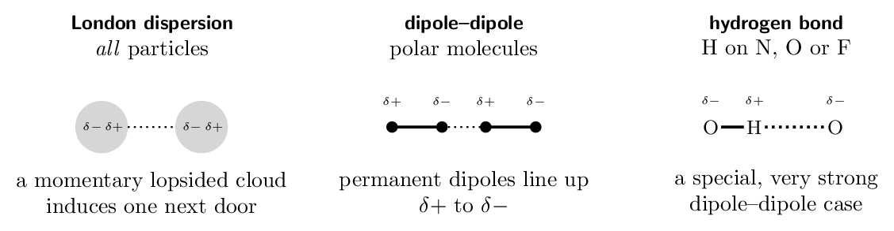

> ⚠️ **AP trap**
>
> **A hydrogen bond is not a bond.** It is an attraction
> *between* molecules, roughly 20 kJ/mol — about
> one twentieth of the 467 kJ/mol O-H covalent
> bond inside the molecule. When water boils, the hydrogen bonds break and
> the O-H bonds do not: steam is still H₂O. Any answer that has
> covalent bonds breaking during a phase change is wrong.

> 📘 **I do: name every force present**
>
> **Rule first: every particle has London dispersion forces.** They
> arise from momentary fluctuations in any electron cloud, so nothing is
> exempt. The question is always *what else* is present.
> 
> **(a) CH₄.** Tetrahedral, four identical C-H bonds, bond
> dipoles cancel $\Rightarrow$ nonpolar. **LDF only.**
> 
> **(b) CH₃Cl.** Tetrahedral but not symmetric — one C-Cl
> bond is much more polar than the C-H bonds, so the dipoles do not
> cancel $\Rightarrow$ polar. **LDF $+$ dipole–dipole.**
> 
> **(c) CH₃OH.** Polar, and it has an H attached directly to
> O. **LDF $+$ dipole–dipole $+$ hydrogen bonding.**
> 
> **(d) NaCl dissolved in water.** Na+ and Cl- ions
> next to polar water molecules gives **ion–dipole**, the strongest
> force in this family, and the reason ionic solids dissolve at all.
> 
> **The procedure, every time:** (1) LDF always. (2) Polar? add
> dipole–dipole. (3) H on N, O or F? add hydrogen bonding. (4) Ions
> present with a polar solvent? add ion–dipole.

> ✏️ **YOUR TURN 1 — four questions**
>
> Name *every* intermolecular force present.
> 
> 1. CO₂ 
>    *(working space)*
> 2. NH₃ 
>    *(working space)*
> 3. HCl 
>    *(working space)*
> 4. CH₃CH₂OH in water 
>    *(working space)*
> 
> > **check:** (a) LDF only     (b) LDF, dipole–dipole, H-bonding    
> (c) LDF, dipole–dipole     (d) LDF, dipole–dipole, H-bonding

## Ladder 2 • Dispersion forces and
polarizability

`ZUM §10.1`

Dispersion forces are the weakest *per contact* and yet they decide
most boiling points, because they grow with the size of the electron
cloud — and clouds get large fast.

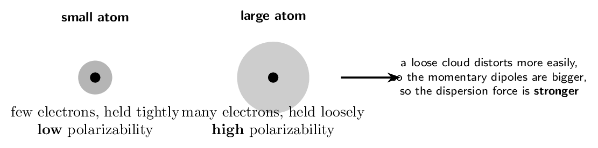

Shape matters too. Two molecules of identical formula can have different
boiling points if one presents more surface to its neighbours.

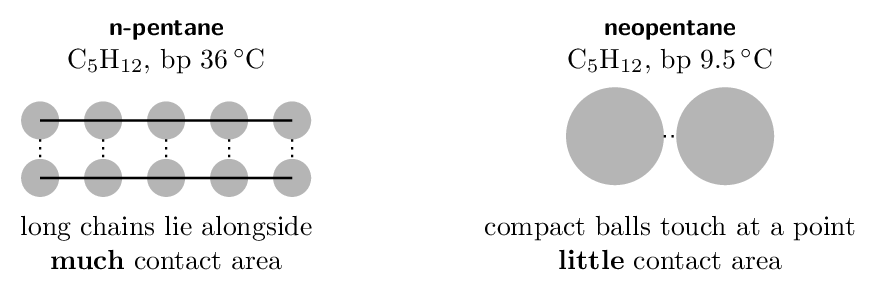

> 📘 **I do: the halogens, and why they change state**
>
> **At room temperature F₂ and Cl₂ are gases, Br₂ is a
> liquid, and I₂ is a solid.** All four are nonpolar diatomics with
> *only* dispersion forces. So dispersion alone produces the entire
> range from gas to solid.
> 
> **Why the trend runs that way.** Going down group 17 the atoms have
> more electrons in higher shells, further from the nucleus and more
> loosely held. The cloud distorts more readily — it is more
> **polarizable** — so the momentary dipoles are larger and the
> attractions stronger.
> 
> |  | **electrons** | **boiling point** |
> |---|---|---|
> | F₂ | 18 | -188 | thinsp; | deg;C |
> | Cl₂ | 34 | -34 | thinsp; | deg;C |
> | Br₂ | 70 | 59 | thinsp; | deg;C |
> | I₂ | 106 | 184 | thinsp; | deg;C |

**Say it in the language that earns the point:** “I₂ has more
electrons and a larger, more polarizable electron cloud, so its London
dispersion forces are stronger, so more energy is needed to separate the
molecules.” Naming the cause — polarizability — is what
distinguishes a scoring answer from “I₂ is bigger”.

> ✏️ **YOUR TURN 2 — four questions**
>
> 1. Which has the higher boiling point, Ar or Kr? Why?
>    *(working space)*
> 2. Both CH₄ and CCl₄ are nonpolar. Which boils higher?
>    *(working space)*
> 3. Why does *n*-pentane boil higher than neopentane if they
>    have the same formula?
>    *(working space)*
> 4. Can dispersion forces alone make a substance a solid at room
>    temperature? Give evidence.
>    *(working space)*
> 
> > **check:** (a) Kr     (b) CCl₄     (c) more contact area    
> (d) yes — I₂

## Ladder 3 • Hydrogen bonding

`ZUM §10.1`

Three elements only — **N, O and F**. They are small and highly
electronegative, so the H they carry is left unusually bare, and it can
approach a lone pair on the next molecule very closely.

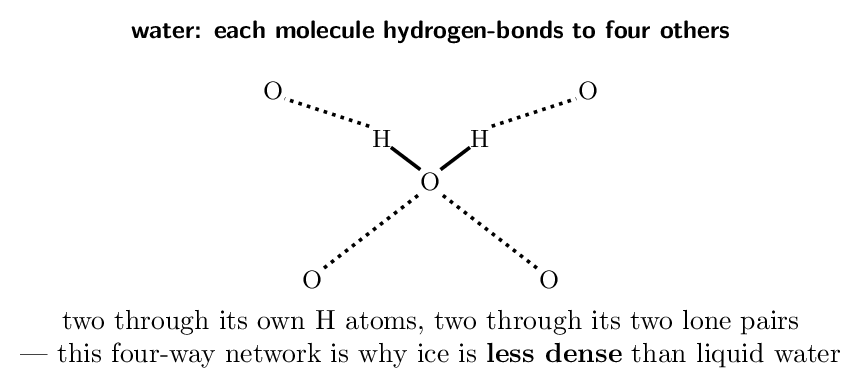

The clearest evidence that hydrogen bonding is real is a graph. Boiling
points normally rise down a group as clouds grow. In three groups the
first member breaks the rule badly.

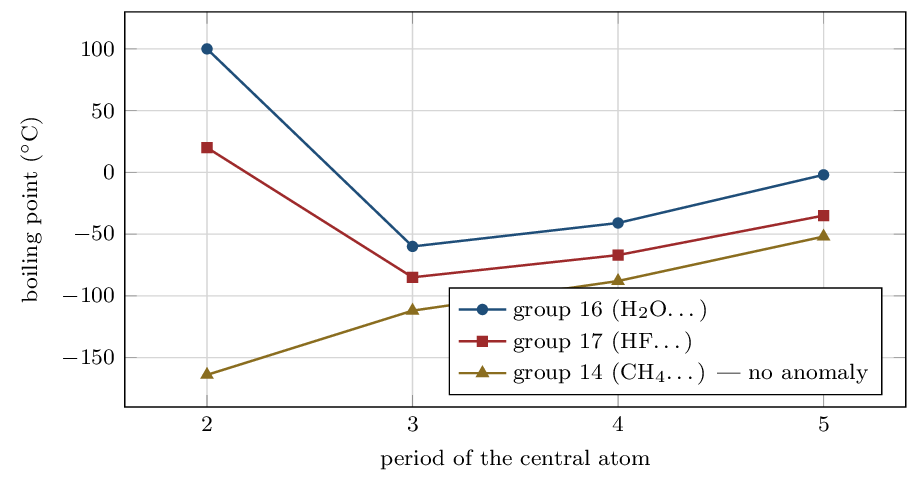

> ⚠️ **AP trap**
>
> **Read the group-14 line.** It rises smoothly with no kink, because
> carbon is not N, O or F and CH₄ cannot hydrogen-bond. It is the
> control that proves the other two lines are showing something real —
> and it is the line students forget to mention when a question asks for
> evidence.

> 📘 **I do: reading the anomaly**
>
> **Why does H₂O boil at 100 °C when H₂S,
> which is heavier, boils at -60 °C?**
> 
> **Start with what the trend predicts.** H₂S has more electrons
> than H₂O, so on dispersion grounds alone it should boil
> *higher*. Extrapolating the H₂S–H₂Se–H₂Te line
> backwards predicts about -80 °C for water.
> 
> **Water beats that prediction by roughly 180 °C.** That
> gap is the size of the effect being explained — quote it, because it
> shows the effect is not a minor correction.
> 
> **The cause.** Oxygen is small and highly electronegative, so the
> O-H bond is strongly polarized and the hydrogen is left with very
> little electron density — close to a bare proton. It can approach a
> lone pair on a neighbouring oxygen far more closely than any ordinary
> dipole–dipole contact allows, and the attraction is correspondingly
> strong. Sulfur is larger and much less electronegative, so H₂S gets
> only ordinary dipole–dipole forces.
> 
> **And the consequence you live inside:** without hydrogen bonding,
> water would boil near -80 °C and no ocean would exist.

> ✏️ **YOUR TURN 3 — four questions**
>
> 1. Can HCl hydrogen-bond? Explain. 
>    *(working space)*
> 2. CH₃OCH₃ and CH₃CH₂OH have the same formula
>    C₂H₆O. Which boils higher, and why?
>    *(working space)*
> 3. Why does the group-14 line show no anomaly?
>    *(working space)*
> 4. Why does ice float? 
>    *(working space)*
> 
> > **check:** (a) no — Cl is not N, O or F     (b) ethanol, it has
> -OH     (c) carbon is not N, O or F     (d) the H-bond network
> holds molecules further apart

## Ladder 4 • Ranking boiling points

`ZUM §10.1–10.2`

The chapter's most-asked question type. There is a fixed order of
priority, and following it beats intuition every time.

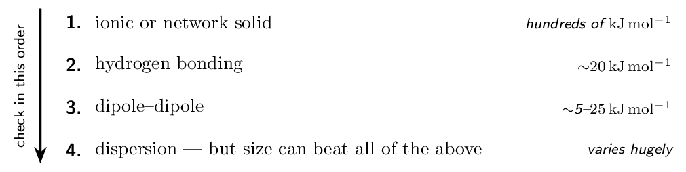

> ⚠️ **AP trap**
>
> Rule 4 is the one that catches people. Dispersion is weakest
> *per interaction*, but it scales without limit — so I₂
> (dispersion only) boils at 184 °C while H₂O (hydrogen
> bonded) boils at 100 °C. Compare like with like: rank by
> force type only when the molecules are of *similar size*, and by
> size when the force types match.

> 📘 **I do: rank four substances**
>
> **Rank by increasing boiling point: CH₄, CH₃OH,
> CH₃F, NaCl.**
> 
> **Classify each first — never compare before classifying.**
> 
> |  | **particles** | **strongest force** | **electrons** |
> |---|---|---|---|
> | CH₄ | molecules | dispersion only | 10 |
> | CH₃F | molecules | dipole–dipole | 18 |
> | CH₃OH | molecules | hydrogen bonding | 18 |
> | NaCl | ions | ionic (not an IMF at all) | — |

**Now apply the order.** NaCl is ionic, so it sits far above
every molecular substance — it is not a stronger intermolecular force,
it is a different category. Among the three molecules, CH₃OH
hydrogen-bonds and so beats CH₃F, which is polar and so beats
CH₄, which has dispersion only.

**The three molecules are close enough in size** (10 and 18
electrons) that the force type decides, so rule 4 does not overturn
anything here.

$$ \text{CH₄} \; ✏️ **YOUR TURN 4 — four questions**
>
> 1. Rank by increasing boiling point: Ne, HF, Xe.
>    *(working space)*
> 2. Rank by increasing boiling point: C₂H₆, CH₃OH,
>    CH₃Cl.
>    *(working space)*
> 3. Which boils higher, H₂O or I₂? What does the answer
>    show?
>    *(working space)*
> 4. Why does MgO melt so much higher than NaCl?
>    *(working space)*
> 
> > **check:** (a) Ne $ CH₃OH     (c) I₂ — size can beat force type     (d)
> $2+/2-$ charges instead of $1+/1-$

## Ladder 5 • Surface tension, viscosity,
capillary action

`ZUM §10.2`

Three liquid properties, one explanation: all three measure how strongly
the molecules hold each other.

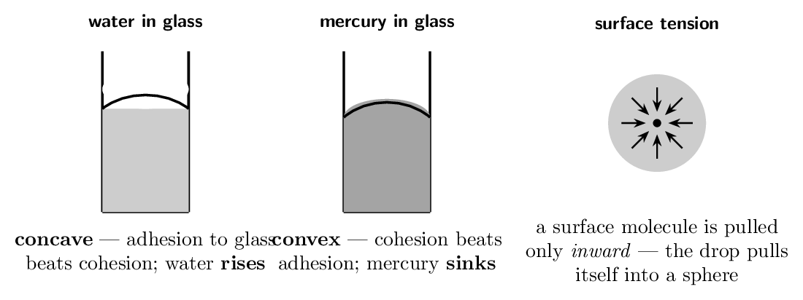

> 📘 **I do: three properties, one cause**
>
> **Surface tension** is the energy needed to increase a liquid's
> surface area. A molecule in the bulk is pulled equally in all
> directions; a molecule at the surface has neighbours only below and to
> the sides, so the net pull is inward. The liquid minimizes its surface,
> which for a free drop means a sphere. Water's surface tension is high
> because hydrogen bonding is strong — high enough to support a paperclip
> or a water strider.
> 
> **Viscosity** is resistance to flow. It rises with stronger
> intermolecular forces, and also with molecular length, because long
> molecules tangle. Glycerol, C₃H₅(OH)₃, carries *three* -OH
> groups per molecule and pours like syrup; propane, of similar size but
> with no -OH at all, is a gas.
> 
> **Capillary action** is the competition between two forces:
> **cohesion** (liquid to itself) and **adhesion** (liquid to
> the container). In a glass tube water adheres to the -OH groups on
> the glass surface more strongly than it coheres to itself, so it climbs
> the walls and its meniscus curves *up* at the edges — concave.
> Mercury is a metal held by strong metallic bonding, coheres far more
> strongly than it adheres to glass, and does the reverse: it is pushed
> down and its meniscus is convex.
> 
> **The unifying statement:** strong intermolecular forces give high
> surface tension and high viscosity; whether a liquid rises or sinks in a
> tube depends on cohesion *versus* adhesion, not on either alone.

> ✏️ **YOUR TURN 5 — four questions**
>
> 1. Which has the higher surface tension, water or hexane? Why?
>    *(working space)*
> 2. Why is glycerol far more viscous than ethanol?
>    *(working space)*
> 3. Why does water's meniscus curve up but mercury's curve down?
>    *(working space)*
> 4. What happens to a liquid's viscosity as it is heated? Explain.
>    *(working space)*
> 
> > **check:** (a) water — hydrogen bonding     (b) three -OH
> groups     (c) adhesion vs cohesion     (d) it falls

## Ladder 6 • Metallic solids and the
electron sea

`ZUM §10.3–10.4`

A metal is a lattice of cations sitting in a sea of electrons that
belong to no particular atom. Every metallic property follows from
those mobile electrons.

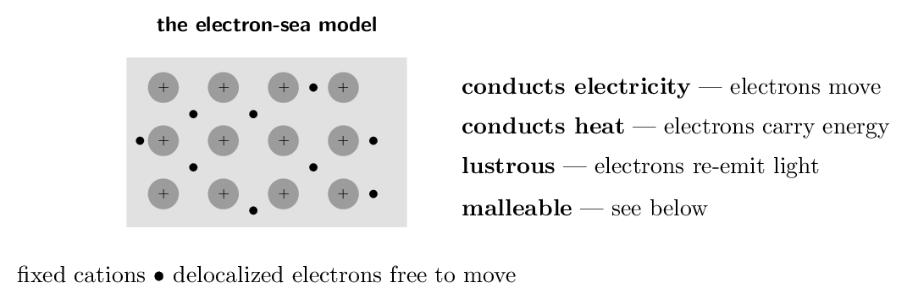

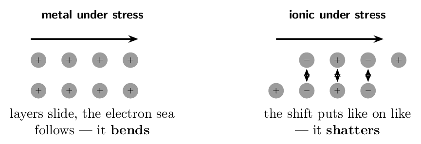

> 📘 **I do: why metals bend and salts shatter**
>
> **Hit a copper sheet and it dents. Hit a salt crystal and it
> splits.** Both are held by strong electrostatic forces, so why the
> opposite behaviour?
> 
> **In the metal, the bonding is non-directional.** The cations are
> all positive and the electron sea surrounds all of them equally. Slide
> one layer of cations past another and every cation is still in the same
> sea, still attracted in every direction. The bonding is undisturbed, so
> the metal simply takes the new shape — it is **malleable** and
> **ductile**.
> 
> **In the ionic solid, the bonding is exactly directional.** Each
> cation is surrounded by anions and vice versa. Slide one layer by a
> single ion's width and now cations face cations, anions face anions. The
> attraction becomes a *repulsion* along the whole plane, and the
> crystal flies apart — it is **brittle**.
> 
> **The conductivity test tells them apart too.** A metal conducts as
> a solid, because its electrons are already mobile. An ionic solid does
> *not* conduct as a solid — its ions are locked in the lattice —
> but conducts well once molten or dissolved, because then the ions can
> move. If a substance conducts when solid, it is a metal (or graphite);
> if only when molten, it is ionic.

> ✏️ **YOUR TURN 6 — four questions**
>
> 1. Why does a metal conduct electricity as a solid but NaCl
>    does not?
>    *(working space)*
> 2. Why is an ionic crystal brittle? 
>    *(working space)*
> 3. An unknown solid conducts when molten but not when solid. What
>    type is it?
>    *(working space)*
> 4. Why do metals conduct heat well? 
>    *(working space)*
> 
> > **check:** (a) delocalized electrons vs locked ions     (b) a shift
> puts like charges together     (c) ionic     (d) mobile electrons
> carry the energy

## Ladder 7 • Unit cells and counting atoms

`ZUM §10.4`

A crystal is one small pattern repeated. The **unit cell** is that
pattern, and the trick is that atoms on the boundary are shared with
neighbouring cells.

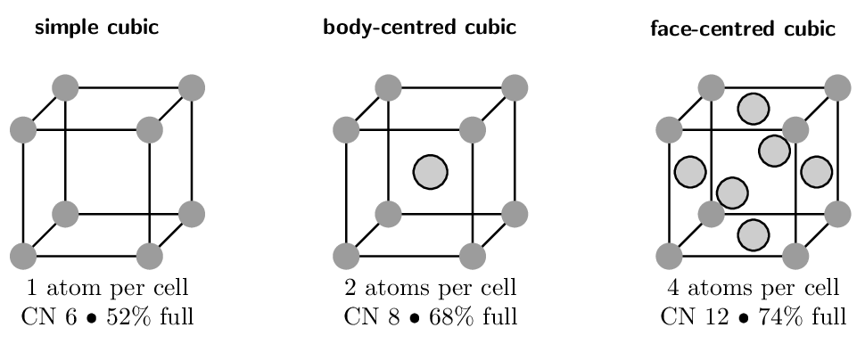

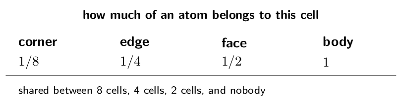

> 📘 **I do: count the atoms, then get the density**
>
> **Copper is face-centred cubic with a cell edge of
> 361.5 pm. Find its density.**
> 
> **Step 1 — count the atoms in one cell.** Eight corners, each
> worth $1/8$, and six faces, each worth $1/2$:
> 
> $$ 8 \times \tfrac{1}{8} \;+\; 6 \times \tfrac{1}{2}    \;=\; 1 + 3 \;=\; \mathbf{4 \text{ atoms}} $$
> 
> **Step 2 — mass of one cell.**
> 
> $$ m = \frac{4 \times 63.55\,\mathrm{g/mol}}             {6.022e23\,\mathrm{/mol}}      = 4.221e-22\,\mathrm{g} $$
> 
> **Step 3 — volume of one cell.** Convert the edge to centimetres
> first: 361.5 pm $= 3.615e-8\,\mathrm{cm}$.
> 
> $$ V = (3.615e-8\,\mathrm{cm})^{3}      = 4.724e-23\,\mathrm{cm^3} $$
> 
> **Step 4 — divide.**
> 
> $$ d = \frac{4.221e-22\,\mathrm{g}}{4.724e-23\,\mathrm{cm^3}}      = 8.94\,\mathrm{g/cm^3} $$
> 
> **Check it against reality:** copper's measured density is
> 8.96 g/cm³. Agreement to three figures from
> nothing but a cell edge and a counting rule — which is how we know the
> model is right.
> 
> **The step everyone drops:** converting picometres to centimetres
> *before* cubing. Cube first and the answer is wrong by $10^{30}$.

> ✏️ **YOUR TURN 7 — four questions**
>
> 1. How many atoms are in a body-centred cubic unit cell? Show the
>    count.
>    *(working space)*
> 2. How many are in a simple cubic cell? 
>    *(working space)*
> 3. Which packs most efficiently, and what fraction of space is
>    empty in it?
>    *(working space)*
> 4. A cell has atoms at all 8 corners and 1 in the centre of each of
>    2 opposite faces. How many atoms per cell?
>    *(working space)*
> 
> > **check:** (a) 2     (b) 1     (c) fcc/hcp, 26% empty     (d) 2

## Ladder 8 • Alloys

`ZUM §10.4`

An alloy is a metal mixed with something else while molten. There are
two ways the guest can sit in the host lattice, and they have different
consequences.

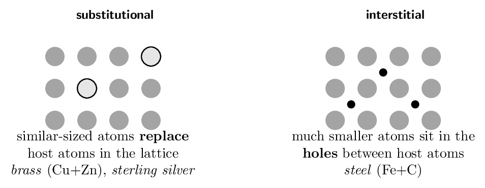

> 📘 **I do: why a trace of carbon transforms iron**
>
> **Pure iron is soft enough to bend by hand at the right thickness.
> Steel — iron with under 2% carbon — builds bridges. Two percent of
> anything should not do that.**
> 
> **Recall why pure metals are soft.** They deform because layers of
> cations *slide* over one another without disturbing the electron
> sea. Malleability is that sliding.
> 
> **Now block the sliding.** Carbon atoms are far smaller than iron
> atoms, so they fit into the holes between them — an
> **interstitial** alloy. They sit directly in the slip planes, and a
> layer trying to slide has to climb over them. The sliding stops, and the
> metal becomes hard and strong instead of soft and bendable.
> 
> **Substitutional alloys work differently.** In brass, zinc atoms
> are close enough in size to copper (134  against
> 128 pm) to take copper's place in the lattice outright.
> They still disrupt its regularity, and so still harden the metal, but far
> less dramatically — the alloy keeps much of the host's character, and
> brass stays workable enough to be chosen for its colour and corrosion
> resistance as much as for its strength.
> 
> **The size test decides which you have:** similar-sized guest
> $\Rightarrow$ substitutional; much smaller guest $\Rightarrow$
> interstitial.

> ✏️ **YOUR TURN 8 — four questions**
>
> 1. Classify brass (Cu with Zn) and say why.
>    *(working space)*
> 2. Classify steel and say why. 
>    *(working space)*
> 3. Why is steel harder than pure iron? 
>    *(working space)*
> 4. Would a guest atom twice the host's diameter form an
>    interstitial alloy? Explain.
>    *(working space)*
> 
> > **check:** (a) substitutional — similar radii     (b) interstitial
> — C is much smaller     (c) interstitials block layer sliding    
> (d) no — far too large for the holes

## Ladder 9 • Network covalent and molecular
solids

`ZUM §10.5–10.6`

The largest gap in properties anywhere in chemistry sits between these
two, and both are made only of nonmetals.

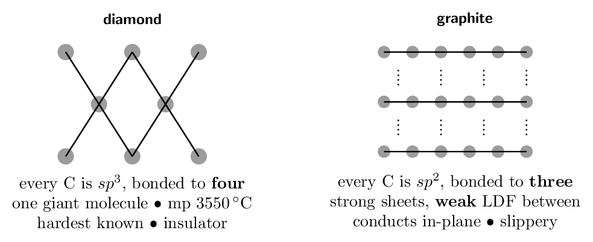

> ⚠️ **AP trap**
>
> **Graphite is the exception that a question will test.** It is a
> network covalent solid that *conducts*, because each carbon uses
> only three of its four valence electrons for $\sigma$ bonds and the
> fourth is delocalized across the sheet. It is also soft, because the
> sheets are held to each other only by dispersion forces and slide freely
> — which is why a pencil writes. Same element as diamond, opposite
> properties, and the reason is the bonding pattern, not the element.

> 📘 **I do: classify a solid from its properties**
>
> A table for the four solid types, and the way a question will hand them
> to you — as properties, not as names.
> 
> | **type** | **particles** | **force** | **melting pt** | **conducts?** |
> |---|---|---|---|---|
> | ionic | ions | ionic attraction | high | molten/aq only |
> | metallic | cations $+$ e$^-$ | metallic bond | varies wildly | always |
> | network | atoms | covalent bonds | very high | no (graphite yes) |
> | molecular | molecules | IMF | low | no |

**Worked case: a solid melts at -57 °C, does not
conduct in any state, and is soft.**

Very low melting point rules out ionic, network and most metals at once.
No conduction in any state rules out metallic (which conducts solid) and
ionic (which conducts molten). Softness confirms it. This is a
**molecular solid**: the particles are whole molecules, and melting
only has to overcome *intermolecular forces* — no bond breaks at
all.

**The diagnostic question is always the same:** what has to break
for this to melt? A molecular solid breaks weak forces *between*
molecules; a network solid breaks covalent bonds *themselves*. That
single difference spans 3600 °C.

> ✏️ **YOUR TURN 9 — four questions**
>
> 1. SiO₂ melts at 1610 °C; CO₂ melts at
>    -57 °C under pressure, and at 1  does not
>    melt at all but sublimes at -78 °C. Both are
>    group-14 dioxides. Explain.
>    *(working space)*
> 2. Why is graphite soft when diamond is the hardest substance
>    known?
>    *(working space)*
> 3. Why does graphite conduct but diamond not? 
>    *(working space)*
> 4. A solid is hard, melts above 2000 °C, and does not
>    conduct even when molten. Classify it.
>    *(working space)*
> 
> > **check:** (a) SiO₂ is network, CO₂ molecular     (b) sheets
> slide on weak LDF     (c) a delocalized fourth electron     (d)
> network covalent

## Ladder 10 • Ionic solids

`ZUM §10.7`

An ionic crystal is built so that each ion is surrounded by as many
oppositely charged neighbours as will geometrically fit — which is
what makes lattice energies so large.

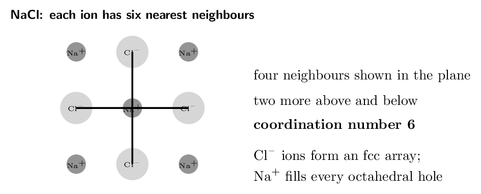

> 📘 **I do: formula from a unit cell**
>
> **In the NaCl unit cell, chloride ions sit at the 8 corners
> and the 6 face centres, and sodium ions sit at the 12 edge midpoints and
> the 1 body centre. Show the formula is NaCl.**
> 
> **Count the chloride.** It occupies exactly the fcc positions:
> 
> $$ 8 \times \tfrac{1}{8} \;+\; 6 \times \tfrac{1}{2} \;=\; 1 + 3    \;=\; 4 \;\text{Cl⁻} $$
> 
> **Count the sodium.** Edge atoms are shared between four cells;
> the body centre belongs to this cell alone:
> 
> $$ 12 \times \tfrac{1}{4} \;+\; 1 \;=\; 3 + 1 \;=\; 4 \;\text{Na⁺} $$
> 
> **Take the ratio.** Four to four is **1:1**, giving the
> empirical formula NaCl — exactly what charge balance demanded, now
> confirmed by the geometry independently.
> 
> **Why this matters beyond the arithmetic.** There is no
> “NaCl molecule”. No sodium ion belongs to any one chloride; each
> is bonded equally to six. The formula is a *ratio*, which is why we
> call it an empirical formula and why ionic compounds have no molecular
> mass in the way CO₂ does.

> ✏️ **YOUR TURN 10 — four questions**
>
> 1. What is the coordination number of Na+ in NaCl?
>    *(working space)*
> 2. A cell has X at 8 corners and Y at the body centre.
>    Give the formula.
>    *(working space)*
> 3. Why does MgO have a much larger lattice energy than
>    NaCl?
>    *(working space)*
> 4. Why is it wrong to speak of an “NaCl molecule”?
>    *(working space)*
> 
> > **check:** (a) 6     (b) XY     (c) $2+/2-$ charges     (d)
> each ion binds six others equally

## Ladder 11 • Vapour pressure and heating
curves

`ZUM §10.8`

Vapour pressure is the pressure of vapour standing above its own liquid
in a closed container once evaporation and condensation have come into
balance.

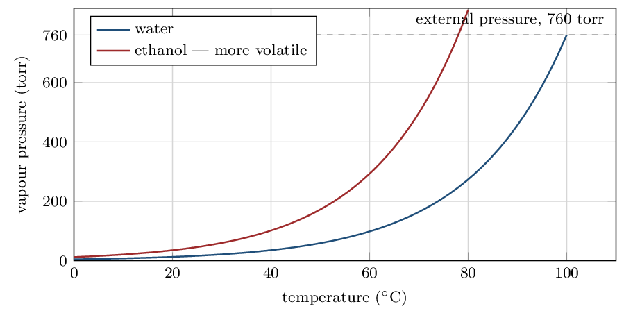

> 📌 **The definition of boiling, stated exactly**
>
> A liquid boils at the temperature where its **vapour pressure
> equals the external pressure**. Nothing about 100 °C is
> special to water — it is the temperature at which water's vapour
> pressure happens to reach 760 . Lower the external pressure and
> the boiling point falls with it, which is why water boils near
> 95 °C in Denver and why food takes longer to cook there.

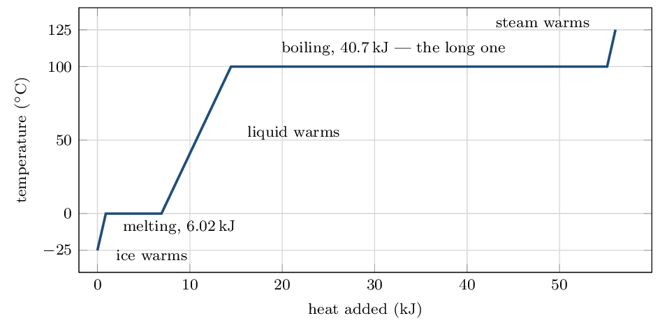

> ⚠️ **AP trap**
>
> **Temperature does not rise on the flat parts.** All the energy
> going in is breaking intermolecular forces, not speeding molecules up.
> Ice water stays at 0 °C until the last ice is gone — and
> that is why ice cools a drink so well.

> 📘 **I do: heat 18.0 g of ice at $-25$ °C to
steam at 125 °C**
>
> Five segments, and you must not merge them. Use $c_{\text{ice}} = 2.03\,\mathrm{J/g/{}^\circ C}$, $c_{\text{water}} = 4.18\,\mathrm{}$, $c_{\text{steam}} = 2.01\,\mathrm{}$,
> $\Delta H_{\text{fus}} = 6.02\,\mathrm{kJ/mol}$,
> $\Delta H_{\text{vap}} = 40.7\,\mathrm{kJ/mol}$.
> Note 18.0 g is exactly 1.00 mol.
> 
> **1. Warm the ice, $-25$ to 0 °C** (use $q = mc\Delta T$):
> 
> $$ q = 18.0 \times 2.03 \times 25 = 914\,\mathrm{J}      = 0.91\,\mathrm{kJ} $$
> 
> **2. Melt it** (use $n\Delta H$, and $\Delta T = 0$):
> $q = 1.00 \times 6.02 = 6.02\,\mathrm{kJ}$
> 
> **3. Warm the water, 0 to 100 °C:**
> 
> $$ q = 18.0 \times 4.18 \times 100 = 7524\,\mathrm{J}      = 7.52\,\mathrm{kJ} $$
> 
> **4. Boil it:** $q = 1.00 \times 40.7 = 40.7\,\mathrm{kJ}$
> 
> **5. Warm the steam, 100 to 125 °C:**
> 
> $$ q = 18.0 \times 2.01 \times 25 = 905\,\mathrm{J}      = 0.90\,\mathrm{kJ} $$
> 
> **Total:**
> 
> $$ 0.91 + 6.02 + 7.52 + 40.7 + 0.90 = \mathbf{56.1\,\mathrm{kJ}} $$
> 
> **Look at where the energy went.** Boiling alone took
> 40.7 kJ — **73%** of the total, and nearly seven
> times the cost of melting. Melting only loosens the hydrogen-bond
> network enough to let molecules slide; boiling has to break it
> completely and separate the molecules entirely. That ratio is why steam
> burns are so much worse than hot-water burns.

> ✏️ **YOUR TURN 11 — four questions**
>
> 1. Why does temperature stay constant while ice melts?
>    *(working space)*
> 2. Which requires more energy per mole for water, melting or
>    boiling? By roughly what factor?
>    *(working space)*
> 3. Why does water boil below 100 °C on a mountain?
>    *(working space)*
> 4. Two liquids are at the same temperature; one has the higher
>    vapour pressure. Which has the stronger intermolecular forces?
>    *(working space)*
> 
> > **check:** (a) energy breaks IMF, not raises KE     (b) boiling, about
> $7\times$     (c) lower external pressure     (d) the one with the
> *lower* vapour pressure

## Ladder 12 • Phase diagrams

`ZUM §10.9`

> 📌 **Not a CED topic — but read it anyway**
>
> Phase diagrams are not listed in the 2024 CED, so no question will ask
> you to draw or label one. They are here because they put Ladders 5 and
> 11 into a single picture, and because CED topics **3.3** (solids,
> liquids and gases) and **6.5** (energy of phase changes) both make
> more sense once you have seen one. Twenty minutes well spent, but skip
> it without cost if you are short of time.

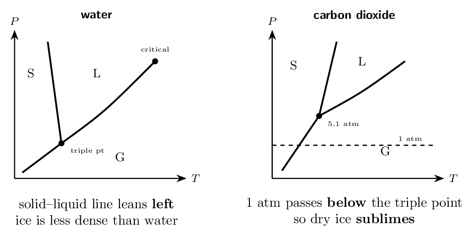

> 📘 **I do: why dry ice has no puddle**
>
> **Solid CO₂ at room pressure turns straight into gas. Ice
> melts first. The reason is one number.**
> 
> **Find the triple point.** CO₂'s triple point is at
> 5.1  — the lowest pressure at which liquid CO₂ can exist
> at all. Water's is at 0.006 .
> 
> **Compare it with normal atmospheric pressure, 1 .** For
> CO₂, 1  lies *below* the triple point, so warming
> solid CO₂ at room pressure carries it directly across the
> solid–gas line: it **sublimes**, and there is no pressure at which
> you could keep liquid CO₂ in an open room. For water, 1 
> lies well *above* its triple point, so warming ice crosses the
> solid–liquid line first and it melts.
> 
> **Now the other difference — water's backwards slope.** Almost
> every substance's solid–liquid line leans right: squeeze it and it
> freezes. Water's leans **left**, because ice is *less* dense
> than liquid water, so pressure favours the liquid. Squeeze ice hard
> enough and it melts.
> 
> **And that traces straight back to Ladder 3:** the tetrahedral
> hydrogen-bond network holds molecules further apart in ice than the
> liquid's jostling does. One property of one bond, visible as the slope
> of a line on a graph.

> ✏️ **YOUR TURN 12 — four questions, not assessed**
>
> 1. What does the triple point represent? 
>    *(working space)*
> 2. Why does dry ice sublime at room pressure?
>    *(working space)*
> 3. What is unusual about water's solid–liquid line, and why?
>    *(working space)*
> 4. Above the critical point, what phase is present?
>    *(working space)*
> 
> > **check:** (a) all three phases coexist     (b) 1 atm is below its
> triple point     (c) negative slope — ice is less dense     (d) a
> supercritical fluid — neither

## Mastery tracker

Tick a row only if **all four** YOUR TURN questions were right on
the first attempt. Ladder 12 is outside the CED — an untickable row
there costs you nothing.

| **First try?** | **Skill** | **Ladder** | **If not, re-read…** |
|---|---|---|---|
| $\square$ | identifying IMFs | 1 | LDF always, then add |
| $\square$ | dispersion and polarizability | 2 | cloud size and shape |
| $\square$ | hydrogen bonding | 3 | N, O, F only |
| $\square$ | ranking boiling points | 4 | classify before comparing |
| $\square$ | surface tension, viscosity | 5 | cohesion vs adhesion |
| $\square$ | metals and the electron sea | 6 | non-directional bonding |
| $\square$ | unit cells, counting atoms | 7 | corner $1/8$, face $1/2$ |
| $\square$ | alloys | 8 | size decides the type |
| $\square$ | network and molecular solids | 9 | what breaks on melting |
| $\square$ | ionic solids | 10 | formula is a ratio |
| $\square$ | vapour pressure, heating curves | 11 | flat means IMF |
| *(opt.)* | phase diagrams | 12 | *not on the CED* |

> 📌 **Scoring yourself honestly**
>
> 11/11 on Ladders 1–11: you have Chapter 10, and with it a large share
> of Unit 3 — the heaviest unit on the exam at 18–22%.
> 
> 8–10: note *which* ladders missed. If they are 1–4, the gap is
> intermolecular forces and everything about liquids depends on it. If
> they are 7–10, the gap is solid structure, which is more self-contained
> and easier to repair.
> 
> 7 or fewer: go back to Ladder 1 and do nothing else first. The habit it
> teaches — name the particles, then name the force between them — is
> what every remaining ladder in this chapter is an application of. A
> student who can do that reliably can reconstruct most of Chapter 10 from
> scratch; a student who cannot will keep guessing.

---

*AP Chemistry course materials • student edition • CC BY-NC-SA 4.0*
