# Self-Study • Chapter 11, I do / You do

*Chapter 11 • Properties of Solutions*  
Zumdahl §11.1–11.3 • PDF pp. 545–563

[← all lessons](../index.md)

---

> 📌 **How to use these notes — read this first**
>
> Each skill is a **ladder**: a fully worked example in the
> solid-framed box, then **four** YOUR TURN questions in the dashed
> box — same skill, new numbers, no help. Work all four before checking
> the gray *check:* line; a tracker tick needs all four right first
> time.
> 
> **This document covers §11.1–11.3 and stops there.**
> Zumdahl's §11.4–11.7 — vapour pressure lowering, boiling point
> elevation, freezing point depression, osmotic pressure, the whole of
> colligative properties — and §11.8 on colloids are **not on the
> AP CED** and are not treated here at all. That is not an oversight; it
> is most of a chapter you do not have to learn.
> 
> **What is left is not small.** §11.1–11.3 feeds CED topic
> **3.7** (Solutions and Mixtures) and **3.10** (Solubility),
> both inside Unit 3 — the heaviest unit on the exam at 18–22%.
> Concentration calculations in particular turn up everywhere: in
> titrations, in equilibrium, in kinetics, in electrochemistry.
> 
> **The chapter in one sentence.** A solution is a mixture at the
> particle level, and every question about one is either *how much
> is in there* (§11.1) or *why did it dissolve at all*
> (§11.2–11.3).

## Ladder 1 • Molarity

`ZUM §11.1`

Molarity is moles of solute per litre of **solution** — not per
litre of solvent. The distinction is the whole of Ladder 1.

$$ M = \frac{\text{moles of solute}}{\text{litres of \textbf{solution}}} $$

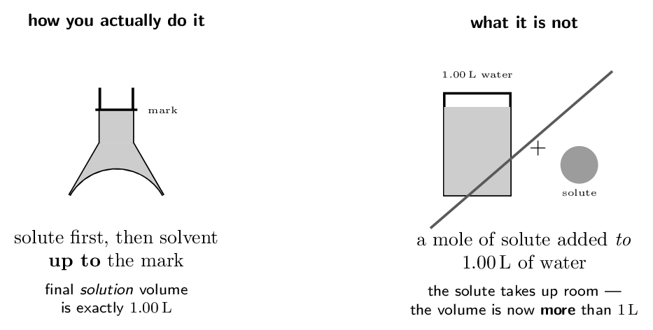

> 📘 **I do: molarity from a mass**
>
> **What is the molarity of a solution made by dissolving
> 25.0 g of NaCl in enough water to make
> 500. mL of solution?**
> 
> **Step 1 — grams to moles.** You can never put grams into a
> molarity; the definition demands moles.
> 
> $$ M(\text{NaCl}) = 22.99 + 35.45 = 58.44\,\mathrm{g/mol} $$
> 
> $$ n = \frac{25.0\,\mathrm{g}}{58.44\,\mathrm{g/mol}}      = 0.428\,\mathrm{mol} $$
> 
> **Step 2 — millilitres to litres.** 500. mL
> $= 0.500\,\mathrm{L}$.
> 
> **Step 3 — divide.**
> 
> $$ M = \frac{0.428\,\mathrm{mol}}{0.500\,\mathrm{L}}      = \mathbf{0.856\,\mathrm{M}} $$
> 
> **Two habits worth building now.** Convert to moles and litres
> *before* you divide, every time — most lost marks here are unit
> slips, not concept failures. And read the wording: “dissolved in enough
> water to make 500. mL” is a solution volume;
> “dissolved in 500. mL of water” is a solvent volume,
> and the two are not the same quantity.

> ✏️ **YOUR TURN 1 — four questions**
>
> 1. Find the molarity of 0.500 mol of KCl in
>    2.00 L of solution.
>    *(working space)*
> 2. Find the molarity of 40.0 g of NaOH
>    ($M = 40.00\,\mathrm{g/mol}$) in 250. mL
>    of solution.
>    *(working space)*
> 3. How many moles of solute are in 50.0 mL of
>    2.00 M HCl?
>    *(working space)*
> 4. Why is molarity defined per litre of solution rather than per
>    litre of solvent?
>    *(working space)*
> 
> > **check:** (a) 0.250 M     (b) 4.00 M    
> (c) 0.100 mol     (d) the solute itself occupies volume

## Ladder 2 • Dilution

`ZUM §11.1`

Adding solvent changes the volume and the concentration but
**not** the number of moles of solute. That single conserved
quantity is the whole calculation.

$$ \underbrace{M_{1}V_{1}}_{\text{moles before}}    \;=\;    \underbrace{M_{2}V_{2}}_{\text{moles after}} $$

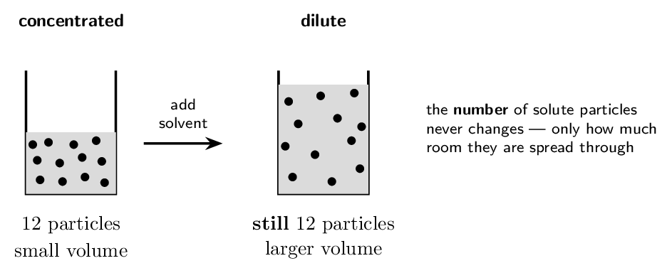

> 📘 **I do: two directions of the same equation**
>
> **(a) What is the concentration when 50.0 mL of
> 6.00 M HCl is diluted to 250. mL?**
> 
> Rearrange for what you want, then substitute:
> 
> $$ M_{2} = \frac{M_{1}V_{1}}{V_{2}}          = \frac{6.00 \times 50.0}{250.}          = \mathbf{1.20\,\mathrm{M}} $$
> 
> **Note the units did not need converting.** $V_{1}$ and $V_{2}$
> appear as a ratio, so as long as both are in the same unit the
> millilitres cancel. This is the one place in solution work where you may
> safely leave millilitres alone.
> 
> **(b) What volume of 6.00 M HCl is needed to make
> 2.00 L of 0.150 M HCl?**
> 
> $$ V_{1} = \frac{M_{2}V_{2}}{M_{1}}          = \frac{0.150 \times 2.00}{6.00}          = 0.0500\,\mathrm{L} = \mathbf{50.0\,\mathrm{mL}} $$
> 
> **And the safety rule that goes with it.** You would measure that
> 50.0 mL of acid and add it *to* water already in
> the flask — never water to concentrated acid. Dissolving concentrated
> acid is strongly exothermic, and adding water to it can boil the surface
> and spit acid out of the container.

> ✏️ **YOUR TURN 2 — four questions**
>
> 1. 25.0 mL of 12.0 M HCl is diluted
>    to 500. mL. Find the new molarity.
>    *(working space)*
> 2. What volume of 2.00 M stock makes
>    100. mL of 0.400 M solution?
>    *(working space)*
> 3. 100. mL of 0.50 M NaCl has
>    100. mL of water added. Find the new molarity.
>    *(working space)*
> 4. Does diluting a solution change the number of moles of solute?
>    Explain.
>    *(working space)*
> 
> > **check:** (a) 0.600 M     (b) 20.0 mL
>     (c) 0.25 M     (d) no — only the volume changes

## Ladder 3 • Mass percent, ppm and ppb

`ZUM §11.1`

When the solute is very dilute, molarity produces awkward numbers.
These units exist to make small amounts readable.

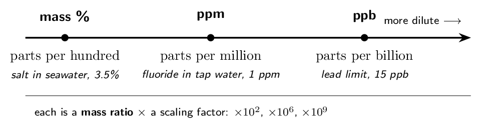

$$ \text{mass \%} =    \frac{\text{mass of solute}}{\text{mass of \textbf{solution}}}    \times 100 $$

> ⚠️ **AP trap**
>
> The denominator is the mass of the **solution**, meaning
> solute $+$ solvent — not the mass of the solvent alone. Dissolving
> 15 g in 135 g of water gives a
> 150 g solution, so the answer is $15/150$, not $15/135$. The
> same total-versus-part trap as molarity, one ladder later.

> 📘 **I do: mass percent and ppm**
>
> **(a) 15.0 g of NaCl is dissolved in
> 135.0 g of water. Find the mass percent.**
> 
> Total solution mass $= 15.0 + 135.0 = 150.0\,\mathrm{g}$.
> 
> $$ \text{mass \%} = \frac{15.0}{150.0} \times 100                   = \mathbf{10.0\%} $$
> 
> **(b) A water sample contains 2.5 mg of fluoride
> per 1.0 kg of water. Express this in ppm.**
> 
> Parts per million is the same ratio scaled by $10^{6}$. Put both masses
> in the same unit first: 2.5 mg $= 2.5e-3\,\mathrm{g}$ and 1.0 kg $= 1.0e3\,\mathrm{g}$.
> 
> $$ \frac{2.5e-3}{1.0e3} \times 10^{6}    = \mathbf{2.5 \text{ ppm}} $$
> 
> **The shortcut worth memorising.** For dilute *aqueous*
> solutions the density is essentially 1.00 g/mL,
> so 1 kg of solution is 1 L and
> 
> $$ 1 \text{ ppm} \;\approx\; 1\,\mathrm{mg/L} $$
> 
> That is why water-quality reports quote mg/L and ppm interchangeably.
> It is an approximation that holds only because the solution is mostly
> water — do not use it for concentrated solutions or non-aqueous
> solvents.

> ✏️ **YOUR TURN 3 — four questions**
>
> 1. Find the mass percent of 5.0 g of sugar in
>    95.0 g of water.
>    *(working space)*
> 2. A solution is 2.0% by mass. How much solute is in
>    250 g of it?
>    *(working space)*
> 3. Convert 0.0025 g of solute per 1000 g of
>    solution to ppm.
>    *(working space)*
> 4. Why is the denominator the mass of solution rather than of
>    solvent?
>    *(working space)*
> 
> > **check:** (a) 5.0%     (b) 5.0 g     (c) 2.5 ppm    
> (d) it is a fraction of the whole mixture

## Ladder 4 • Mole fraction and molality

`ZUM §11.1`

Four concentration units, and what separates them is entirely
**what sits in the denominator**. Get that right and all four are
one idea.

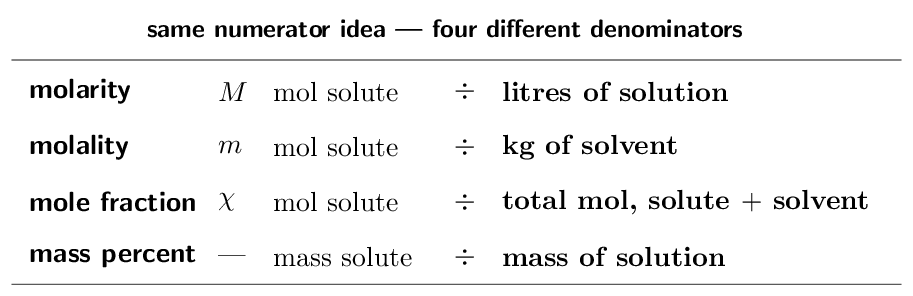

> 📌 **Where molality actually gets used — read this once**
>
> Molality exists mainly to support **colligative properties**, and
> those are §11.4–11.7, which this course skips. So learn the definition
> and learn how it differs from molarity — that distinction is fair game
> — but do not expect to apply it. Two reasons it is defined against
> solvent *mass* rather than solution *volume*: mass does not
> change with temperature, whereas volume does, so molality is
> temperature-independent where molarity is not.

> 📘 **I do: mole fraction, then molality**
>
> **(a) A solution contains 46.0 g of ethanol
> (C₂H₅OH, $M = 46.07\,\mathrm{g/mol}$) and 54.0 g
> of water ($M = 18.02\,\mathrm{g/mol}$). Find the mole fraction of
> ethanol.**
> 
> **Everything must be in moles** — a mole fraction cannot be built
> from grams.
> 
> $$ n_{\text{ethanol}} = \frac{46.0}{46.07} = 0.998\,\mathrm{mol}    \qquad    n_{\text{water}} = \frac{54.0}{18.02} = 3.00\,\mathrm{mol} $$
> 
> $$ \chi_{\text{ethanol}}    = \frac{0.998}{0.998 + 3.00}    = \frac{0.998}{4.00}    = \mathbf{0.250} $$
> 
> **Check it the free way.** Mole fractions of everything present
> must sum to exactly 1, so $\chi_{\text{water}} = 1 - 0.250 = 0.750$.
> If your fractions do not sum to 1, you have made an arithmetic error and
> the check has just caught it.
> 
> **Note what happened to the masses.** Nearly equal masses
> (46.0  and 54.0 g) gave wildly unequal mole counts
> (0.998  and 3.00 mol), because a water molecule is so much
> lighter. Mass ratios and mole ratios are not interchangeable.
> 
> **(b) Find the molality of 18.0 g of glucose
> (C₆H₁₂O₆, $M = 180.16\,\mathrm{g/mol}$) dissolved in
> 250. g of water.**
> 
> $$ n = \frac{18.0}{180.16} = 0.0999\,\mathrm{mol}    \qquad    m = \frac{0.0999}{0.250\,\mathrm{kg}}      = \mathbf{0.400\,\mathrm{molal}} $$
> 
> The denominator is 0.250 kg of *water*, not of
> solution — for molality the solute mass never enters the bottom.

> ✏️ **YOUR TURN 4 — four questions**
>
> 1. A mixture holds 2.00 mol of A and
>    6.00 mol of B. Find $\chi_{\text{A}}$.
>    *(working space)*
> 2. If $\chi_{\text{A}} = 0.35$ in a two-component mixture, what is
>    $\chi_{\text{B}}$?
>    *(working space)*
> 3. Find the molality of 0.500 mol of solute in
>    2.00 kg of solvent.
>    *(working space)*
> 4. State the one difference between molarity and molality, and say
>    why molality does not change with temperature.
>    *(working space)*
> 
> > **check:** (a) 0.250     (b) 0.65     (c) 0.250 molal    
> (d) litres of solution vs kg of solvent; mass is
> temperature-independent

## Ladder 5 • The energetics of dissolving

`ZUM §11.2`

Dissolving is not one event but three, and only the third releases
energy. Whether a solution forms — and whether the beaker gets warm or
cold — is the sum.

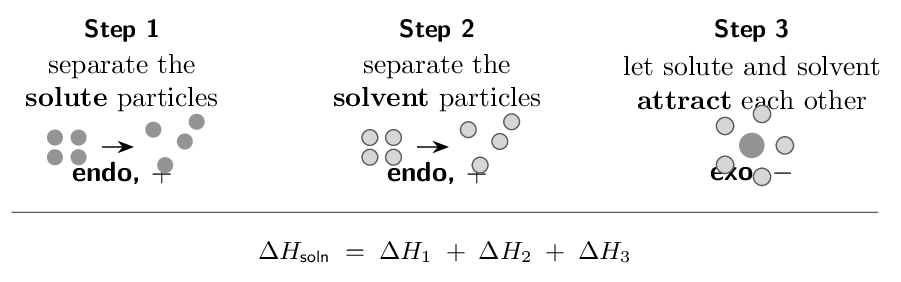

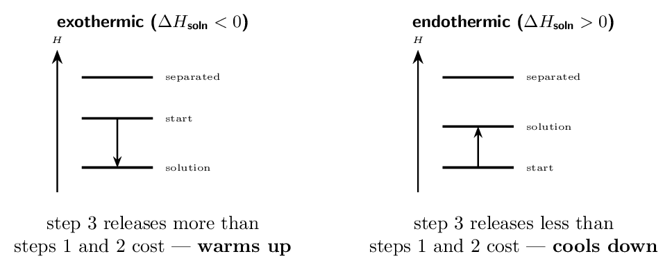

> 📘 **I do: why NaCl dissolves at all**
>
> **Breaking the NaCl lattice costs
> +786 kJ/mol. Hydrating the resulting ions releases
> -783 kJ/mol. Find $\Delta H_{\text{soln}}$ and
> comment.**
> 
> $$ \Delta H_{\text{soln}} = (+786) + (-783)    = \mathbf{+3\,\mathrm{kJ/mol}} $$
> 
> **So dissolving salt is slightly endothermic** — a beaker of
> water cools very slightly as salt dissolves. And yet NaCl is
> famously soluble. Why does an uphill process happen at all?
> 
> **Because enthalpy is not the only driver.** A dissolved solute is
> enormously more disordered than a crystal: the ions go from fixed
> lattice sites to wandering freely through the liquid. That increase in
> **entropy** is what drives dissolving here, and it is large enough
> to overwhelm a 3 kJ/mol enthalpy penalty.
> 
> **Look at the two numbers again.** 786  and 783  —
> each enormous, and their difference tiny. Solubility is decided by the
> small residue left when two large opposing quantities nearly cancel,
> which is why it is so hard to predict from first principles and why
> chemists rely on measured solubility data instead.
> 
> **Two contrasting cases worth knowing.**
> NH₄NO₃ has $\Delta H_{\text{soln}} = +25.7\,\mathrm{kJ/mol}$ — strongly endothermic, and the
> active ingredient of an instant *cold* pack.
> CaCl₂ has $\Delta H_{\text{soln}} = -82.8\,\mathrm{kJ/mol}$ — strongly exothermic, and used in
> instant *hot* packs and to melt road ice.

> ✏️ **YOUR TURN 5 — four questions**
>
> 1. Which of the three steps is exothermic, and why?
>    *(working space)*
> 2. Lattice breaking costs +700 kJ/mol and
>    hydration releases -750 kJ/mol. Find
>    $\Delta H_{\text{soln}}$ and say whether the beaker warms or
>    cools.
>    *(working space)*
> 3. A cold pack contains NH₄NO₃. What is the sign of its
>    $\Delta H_{\text{soln}}$?
>    *(working space)*
> 4. NaCl dissolving is endothermic, yet it dissolves readily.
>    Explain.
>    *(working space)*
> 
> > **check:** (a) step 3 — attractions form     (b)
> -50 kJ/mol, warms     (c) positive     (d)
> entropy drives it

## Ladder 6 • Like dissolves like

`ZUM §11.2–11.3`

Step 3 of Ladder 5 only pays for steps 1 and 2 when the new
solute–solvent attractions resemble the ones that were broken. That is
the whole content of the slogan.

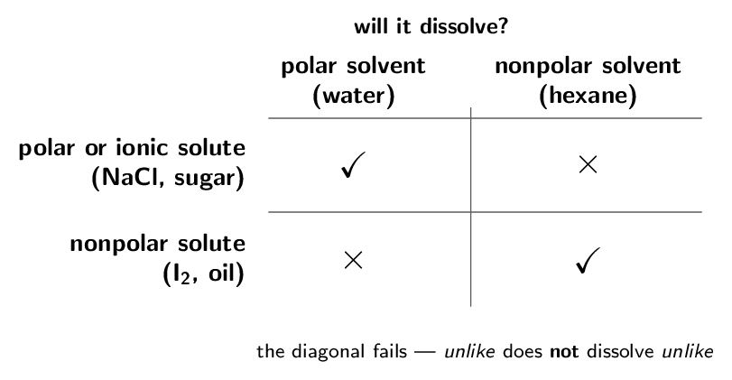

> 📘 **I do: why oil and water refuse**
>
> **Water is strongly hydrogen bonded. Oil is a nonpolar
> hydrocarbon with dispersion forces only. Work through the three steps.**
> 
> **Step 1 — separate the oil.** Cheap. Only weak dispersion forces
> have to be overcome, so this costs little.
> 
> **Step 2 — separate the water.** *Expensive.* Every water
> molecule is hydrogen bonded to its neighbours, and opening a cavity big
> enough for an oil molecule means breaking a great many of those bonds.
> 
> **Step 3 — oil attracts water.** Cheap and useless. An oil
> molecule cannot hydrogen-bond, so all it offers water in return is weak
> dispersion — nowhere near enough to repay what step 2 cost.
> 
> **The books do not balance,** so the mixture separates and the
> water re-forms its hydrogen-bond network with itself.
> 
> **Now reverse the pairing and watch it work.** Ethanol,
> CH₃CH₂OH, has an -OH group and hydrogen-bonds to water just
> as water does to itself. Step 2 is still expensive, but step 3 now
> repays it in the same currency — so ethanol and water are
> **miscible** in all proportions.
> 
> **Say it precisely on an exam.** Not “like dissolves like”, which
> earns nothing, but: “the solute–solvent attractions are comparable in
> strength to the solvent–solvent attractions that must be broken.”
> Naming the forces is what scores.

> ✏️ **YOUR TURN 6 — four questions**
>
> 1. Will I₂ dissolve better in water or in CCl₄? Why?
>    *(working space)*
> 2. Will NaCl dissolve in hexane? Why not?
>    *(working space)*
> 3. Why is ethanol miscible with water in all proportions?
>    *(working space)*
> 4. Which step of the cycle is the expensive one when a nonpolar
>    solute meets water?
>    *(working space)*
> 
> > **check:** (a) CCl₄ — both nonpolar     (b) no — hexane
> cannot solvate ions     (c) it hydrogen-bonds     (d) step 2

## Ladder 7 • Structure: chains, heads and
tails

`ZUM §11.3`

Most real molecules are neither purely polar nor purely nonpolar. They
have a **hydrophilic** part that water likes and a
**hydrophobic** part it does not, and solubility follows whichever
wins.

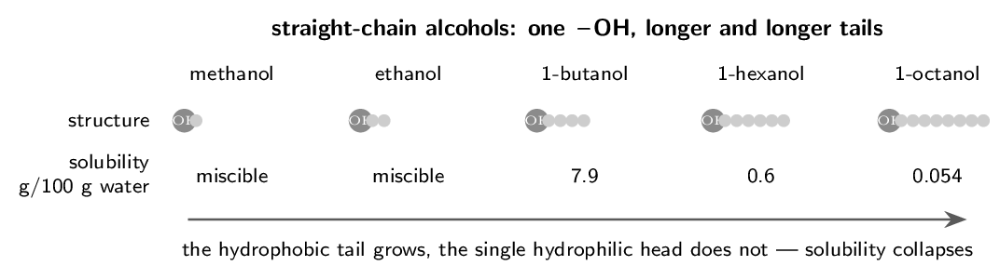

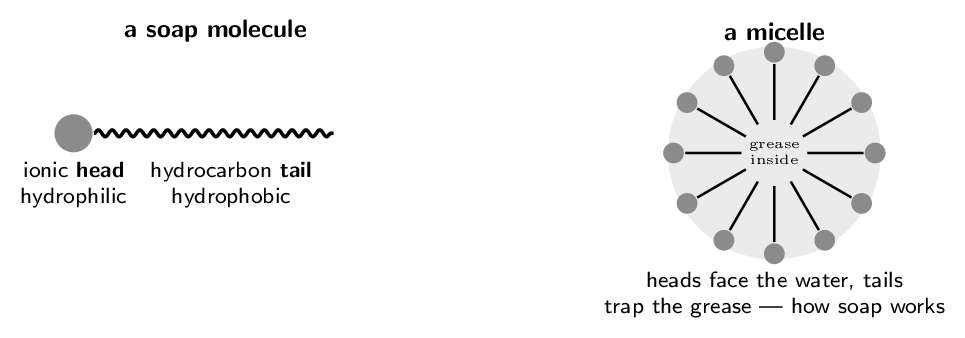

> 📘 **I do: reading a solubility collapse**
>
> **Methanol is miscible with water in all proportions.
> 1-octanol dissolves to only 0.054 g per 100 g of
> water — a difference of orders of magnitude. Both have exactly one
> -OH group.**
> 
> **What stayed the same.** Each molecule has a single -OH, so
> each can form roughly the same number of hydrogen bonds to water. The
> hydrophilic contribution is essentially constant across the series.
> 
> **What changed.** The hydrocarbon tail grew from one carbon to
> eight. That tail cannot hydrogen-bond, so it forces water to break its
> own hydrogen bonds and open a cavity, paying step 2's cost with nothing
> in return. The longer the tail, the bigger the unpaid bill.
> 
> **So the ratio decides.** In methanol the -OH dominates the
> molecule and it behaves like water. By octanol the tail dominates and
> the molecule behaves like a hydrocarbon. The crossover sits around four
> carbons, which is why 1-butanol is only partly soluble
> (7.9 g/100 g) — it is the molecule where the two
> halves are most nearly matched.
> 
> **Where this shows up outside chemistry class.** Vitamin C is
> studded with -OH groups and is water soluble, so the body cannot
> store it and you need it regularly. Vitamin A is mostly hydrocarbon and
> is fat soluble, so it accumulates in body fat — which is why an
> overdose of vitamin A is possible and an overdose of vitamin C is
> largely just expensive.

> ✏️ **YOUR TURN 7 — four questions**
>
> 1. Which is more soluble in water, 1-propanol or 1-heptanol? Why?
>    *(working space)*
> 2. Which part of a soap molecule dissolves grease?
>    *(working space)*
> 3. Why is vitamin A stored in body fat but vitamin C is not?
>    *(working space)*
> 4. Would you expect ethanoic acid (CH₃COOH) to be water
>    soluble? Explain.
>    *(working space)*
> 
> > **check:** (a) 1-propanol — shorter tail     (b) the hydrocarbon
> tail     (c) A is hydrophobic, C is hydrophilic     (d) yes —
> short chain, polar -COOH

## Ladder 8 • Saturated, unsaturated,
supersaturated

`ZUM §11.3`

Solubility is a *limit*, and a solution is classified by where it
sits relative to that limit.

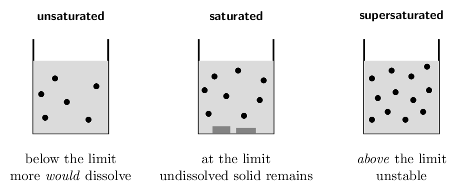

> ⚠️ **AP trap**
>
> A **supersaturated** solution holds more solute than it should be
> able to. It is made by saturating a solution hot and then cooling it
> slowly and undisturbed, so the excess has no site on which to
> crystallise. Drop in a single seed crystal — or scratch the glass —
> and the whole excess crystallises at once, releasing its heat of
> crystallisation. That is exactly how a reusable sodium acetate hand
> warmer works, and why clicking its metal disc turns it solid and hot in
> seconds.

> 📘 **I do: how much crystallises out on cooling**
>
> **100 g of water at 60 °C is saturated with
> KNO₃, which dissolves to 110 g/100 g at that
> temperature. The solution is cooled to 20 °C, where the
> solubility is 31.6 g/100 g. How much solid appears?**
> 
> **What is dissolved at the start.** Saturated at
> 60 °C, so 110 g of KNO₃ is in solution.
> 
> **What can stay dissolved at the end.** At 20 °C the
> same 100 g of water can hold only 31.6 g.
> 
> **The difference has nowhere to go.**
> 
> $$ 110 - 31.6 = \mathbf{78.4\,\mathrm{g}}\text{ of \text{KNO₃}    crystallises out} $$
> 
> **This is how recrystallisation purifies a compound.** Dissolve
> the impure solid in hot solvent, cool it, and the bulk of your compound
> comes out as crystals while the impurities — present in far smaller
> amounts, and so still below *their* solubility limits — stay
> behind in solution. Filter, and what is on the paper is purer than what
> you started with.
> 
> **One caution about the wording.** The question said cooled, not
> cooled *slowly and undisturbed*. Cooled carefully, this solution
> could instead have become supersaturated and dropped nothing at all
> until it was seeded.

> ✏️ **YOUR TURN 8 — four questions**
>
> Use KNO₃ solubilities of 31.6 g/100 g at
> 20 °C and 169 g/100 g at
> 80 °C.
> 
> 1. 50 g of KNO₃ is stirred into 100 g of
>    water at 20 °C. Is the solution saturated?
>    *(working space)*
> 2. How much KNO₃ crystallises if a solution saturated at
>    80 °C is cooled to 20 °C?
>    *(working space)*
> 3. How would you tell a supersaturated solution from a saturated
>    one?
>    *(working space)*
> 4. Why does recrystallisation purify a compound?
>    *(working space)*
> 
> > **check:** (a) yes, with 18.4 g undissolved     (b)
> 137.4 g     (c) add a seed crystal     (d) impurities stay
> below their own limits

## Ladder 9 • Temperature and solubility

`ZUM §11.3`

Two rules, and they point in opposite directions — which is why you
must know which kind of solute you have before you answer.

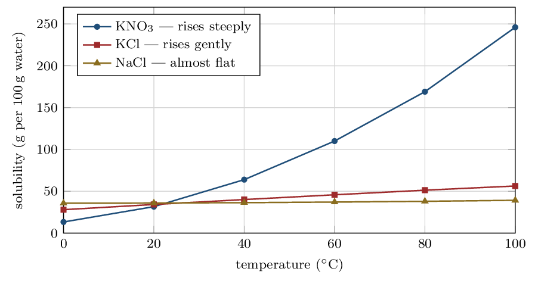

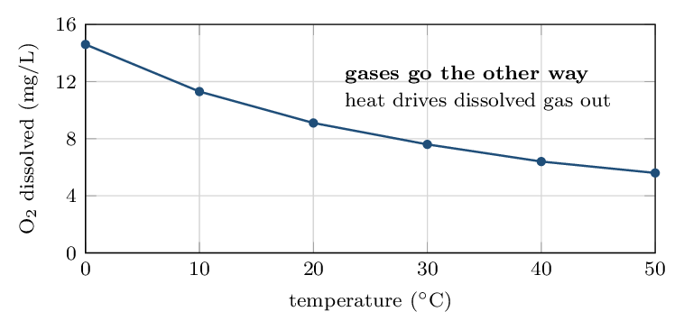

> 📘 **I do: reading a solubility curve**
>
> **Most solids get more soluble as temperature rises** — but by
> wildly differing amounts, and a curve is the only reliable source. Read
> the graph above:
> 
> **KNO₃** climbs from 13.3  to
> 246 g/100 g — nearly twentyfold. It is the classic
> recrystallisation solute precisely because so much drops out on cooling.
> 
> **NaCl** climbs from 35.7  to only
> 39.2 g/100 g over the same 100 °C. You
> cannot usefully purify salt by recrystallisation from water — cooling
> a saturated solution recovers almost nothing — which is why sea salt
> is obtained by *evaporating* the water instead.
> 
> **Gases always go the other way.** Every gas becomes
> *less* soluble as temperature rises, with no exceptions. Warming
> gives dissolved gas molecules enough kinetic energy to escape the
> liquid, and there is no lattice to break in the first place.
> 
> **Two consequences you can observe.** Bubbles form on the inside of
> a pan of water long before it boils — that is dissolved air coming out
> of solution as the water warms. And a power station returning warm
> cooling water to a river lowers its dissolved oxygen; a river at
> 30 °C holds only 7.6 mg/L against
> 14.6  at 0 °C, which is why *thermal* pollution
> kills fish without a single toxic chemical being released.

> ✏️ **YOUR TURN 9 — four questions**
>
> Read values from the curves above.
> 
> 1. Roughly how much KNO₃ dissolves in 100 g of
>    water at 40 °C?
>    *(working space)*
> 2. Which solid's solubility changes least with temperature?
>    *(working space)*
> 3. What happens to the solubility of a gas as temperature rises?
>    *(working space)*
> 4. Why does warm river water threaten fish even when it is
>    chemically clean?
>    *(working space)*
> 
> > **check:** (a) about 64 g     (b) NaCl     (c) it
> falls     (d) less dissolved oxygen

## Ladder 10 • Pressure and Henry's law

`ZUM §11.3`

Pressure changes the solubility of **gases** and, for practical
purposes, nothing else. Solids and liquids are already close-packed and
barely compressible, so squeezing them changes very little.

$$ C = kP \qquad\text{or, comparing two conditions,}\qquad    \frac{C_{1}}{P_{1}} = \frac{C_{2}}{P_{2}} $$

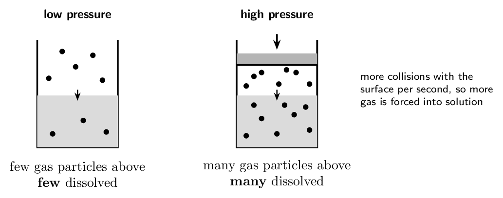

> 📘 **I do: the soda can**
>
> **The solubility of a gas is 1.3e-3 M under
> 1.0 atm of that gas. What is it under
> 4.0 atm?**
> 
> Solubility is directly proportional to partial pressure, so
> 
> $$ C_{2} = C_{1} \times \frac{P_{2}}{P_{1}}         = 1.3e-3 \times \frac{4.0}{1.0}         = \mathbf{5.2e-3\,\mathrm{M}} $$
> 
> Four times the pressure, four times the dissolved gas. No other
> variable enters.
> 
> **Now the everyday version.** A sealed can of fizzy drink is
> bottled under CO₂ at several atmospheres, so a lot of CO₂ is
> dissolved. Open it, and the pressure above the liquid drops to the
> CO₂ partial pressure of ordinary air — about
> 0.0004 atm. The solubility collapses by a factor of
> thousands, the drink is now hugely supersaturated, and the excess
> CO₂ escapes as bubbles. Leave it open and it goes flat, because
> the process runs to completion.
> 
> **Use partial pressure, not total.** Henry's law depends on the
> partial pressure of *that gas* alone. Air is 21 %
> oxygen, so water open to the atmosphere at 1.0 atm total
> experiences an oxygen partial pressure of only
> 0.21 atm — which is why dissolved oxygen in a lake is
> so much lower than what pure O₂ at 1 atm would give.
> 
> **And why divers care.** At depth the total pressure is far above
> 1 atm, so far more nitrogen dissolves in the blood.
> Surface too quickly and it comes out of solution as bubbles inside the
> body — decompression sickness, Henry's law applied to a diver.

> ✏️ **YOUR TURN 10 — four questions**
>
> 1. A gas dissolves to 0.020 M at 1.0 atm.
>    Find its solubility at 3.0 atm.
>    *(working space)*
> 2. A gas dissolves to 0.050 M at
>    2.5 atm. Find its solubility at
>    1.0 atm.
>    *(working space)*
> 3. Why does an open drink go flat? 
>    *(working space)*
> 4. Does raising the pressure increase the solubility of a solid?
>    Explain.
>    *(working space)*
> 
> > **check:** (a) 0.060 M     (b) 0.020 M    
> (c) the CO₂ partial pressure above it collapses     (d) no —
> solids are barely compressible

## Mastery tracker

Tick a row only if **all four** YOUR TURN questions were right on
the first attempt. Every row here is assessed — there is no optional
ladder in this chapter, because the optional material was cut instead.

| **First try?** | **Skill** | **Ladder** | **If not, re-read…** |
|---|---|---|---|
| $\square$ | molarity | 1 | per litre of *solution* |
| $\square$ | dilution | 2 | moles are conserved |
| $\square$ | mass percent, ppm, ppb | 3 | mass of *solution* |
| $\square$ | mole fraction and molality | 4 | check the denominator |
| $\square$ | energetics of dissolving | 5 | three steps, one exothermic |
| $\square$ | like dissolves like | 6 | can step 3 pay for step 2? |
| $\square$ | chains, heads and tails | 7 | the ratio decides |
| $\square$ | saturated to supersaturated | 8 | solubility is a limit |
| $\square$ | temperature and solubility | 9 | gases go the other way |
| $\square$ | pressure and Henry's law | 10 | partial pressure, gases only |

> 📌 **Scoring yourself honestly**
>
> 10/10: you have Chapter 11's assessed content. It is a short chapter
> only because most of Zumdahl's Chapter 11 was cut from the CED — what
> remains is dense and heavily used elsewhere.
> 
> 7–9: check *which* ladders missed. Ladders 1–4 are arithmetic and
> repair quickly with practice. Ladders 5–7 are conceptual, and a miss
> there usually means the three-step cycle has not clicked; that one takes
> a re-read rather than more problems.
> 
> 6 or fewer: start with Ladders 1–3 and do nothing else until they are
> automatic. Concentration calculations are not really Chapter 11 content
> — they are the arithmetic of Units 4, 5, 6, 7 and 8 as well. Every
> titration, every equilibrium table, every rate law and every cell
> potential problem you meet for the rest of the year begins by putting a
> concentration into a formula. Time spent here is repaid many times over.

---

*AP Chemistry course materials • student edition • CC BY-NC-SA 4.0*
