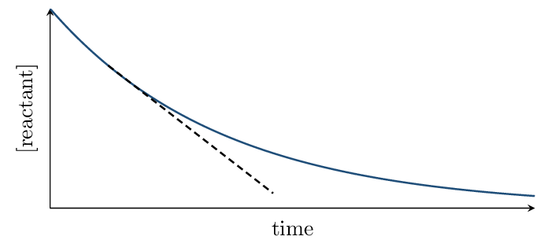
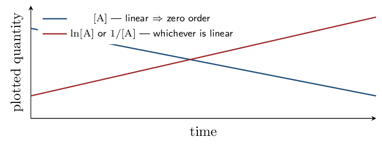
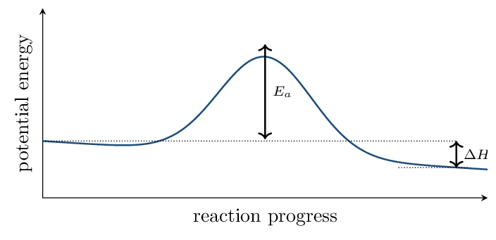

# Guided Notes

*Chapter 12 • Chemical Kinetics*  
Zumdahl §12.1–12.7 • PDF pp. 593–632 • 5 blocks

[← all lessons](../index.md)

---

> 📌 **How this chapter fits the AP course**
>
> **Nothing here is off-syllabus.** Chapter 12 maps onto CED Unit 5
> (Kinetics) section by section, in the textbook's own order — the cleanest
> one-to-one match in the book alongside Chapter 6. You can assign “read
> Chapter 12” and mean it.
> 
> §12.1 $\to$ 5.1 • §12.2–12.3 $\to$ 5.2 •\
> §12.4 $\to$ 5.3 • §12.5 $\to$ 5.4, 5.7–5.9 •\
> §12.6 $\to$ 5.5, 5.6, 5.10 • §12.7 $\to$ 5.11.
> 
> One idea governs the whole chapter and is worth holding onto from the start:
> **everything about a rate must be determined by experiment.** You
> cannot read a rate law off a balanced equation. Thermodynamics tells you
> whether a reaction *can* happen; kinetics tells you how fast, and the
> two are independent.

## Reaction Rates Zumdahl §12.1

> 📌 **By the end you can…**
>
> - Express reaction rate in terms of any reactant or product.
> - Distinguish average from instantaneous rate.

**Read:** Zumdahl §12.1 • PDF pp. 594–598

> 📌 **Retrieval warm-up**
>
> 1. Balance: N₂O₅ → NO₂ + O₂:
>    **\_\_\_\_\_\_**
> 2. Molarity units: **\_\_\_\_\_\_**
> 3. Does a negative $\Delta H$ mean a reaction is fast?
>    **\_\_\_\_\_\_**

#### INSTRUCTION A • Defining rate 25 min

### Concentration change per unit time `ZUM §12.1`

`SP 5`

$\text{rate} =$ **\_\_\_\_\_\_** $=$ **\_\_\_\_\_\_**

The minus sign on the reactant term exists so the rate comes out
**\_\_\_\_\_\_** — reactant concentration is falling, and a
negative rate would be meaningless.

#### Stoichiometry relates the rates

For 2 N₂O₅ → 4 NO₂ + O₂, NO₂ appears four times as fast as
O₂. To get one number for the whole reaction, divide each rate by its
**\_\_\_\_\_\_**:

$$ \text{rate} = -\frac{1}{2}\frac{\Delta[\text{N₂O₅}]}{\Delta t}   = \frac{1}{4}\frac{\Delta[\text{NO₂}]}{\Delta t}   = \frac{\Delta[\text{O₂}]}{\Delta t} $$

> 📌 **Note**
>
> This is why a question must say *which* species it means. “The rate of
> the reaction” and “the rate of disappearance of N₂O₅” differ by a
> factor of two here. Read the wording carefully before computing.

#### GUIDED PRACTICE • Relating rates 15 min

For 2 NO + O₂ → 2 NO₂, if O₂ disappears at
0.020 M/s:

1. Rate of NO disappearance:
   **\_\_\_\_\_\_**
2. Rate of NO₂ formation:
   **\_\_\_\_\_\_**
3. Rate of the reaction: **\_\_\_\_\_\_**

#### INSTRUCTION B • Average versus instantaneous 20 min

### Reading a concentration–time curve `ZUM §12.1`

`SP 4`

- The average rate over an interval is the slope of the
   **\_\_\_\_\_\_** joining two points.
- The instantaneous rate at one moment is the slope of the
   **\_\_\_\_\_\_** at that point.
- The initial rate is the instantaneous rate at
   **\_\_\_\_\_\_** — the value used in rate-law
   experiments, because no products have accumulated to complicate
   things.

> ⚠️ **AP trap**
>
> The curve is steepest at the start and flattens out. That means the rate is
> *not constant* — it decreases as reactants are consumed. Reporting an
> average rate over a long interval as though it were the rate throughout is a
> standard error.

#### APPLICATION • Rate reasoning 20 min

1. Explain why the initial rate is preferred for determining a rate
   law.
   \_\_\_\_\_\_\_\_\_\_\_\_\_\_\_\_\_\_\_\_
2. A reaction's rate decreases steadily over time even at constant
   temperature. Explain why.
   \_\_\_\_\_\_\_\_\_\_\_\_\_\_\_\_\_\_\_\_

> 📌 **Exit ticket**
>
> For N₂ + 3 H₂ → 2 NH₃, if H₂ is consumed at
> 0.30 M/s, at what rate is NH₃ formed?
> 
> \_\_\_\_\_\_\_\_\_\_\_\_\_\_\_\_\_\_\_\_

## Rate Laws and the Method of Initial Rates Zumdahl §12.2–12.3

> 📌 **By the end you can…**
>
> - Write a rate law and interpret reaction orders.
> - Determine orders experimentally from initial-rate data.

**Read:** Zumdahl §12.2–12.3 • PDF pp. 598–604

> 📌 **Retrieval warm-up**
>
> 1. Rate of the reaction 2 A → B in terms of A:
>    **\_\_\_\_\_\_**
> 2. Instantaneous rate is the slope of what?
>    **\_\_\_\_\_\_**
> 3. Why use initial rates? **\_\_\_\_\_\_**

#### INSTRUCTION A • The rate law 25 min

### Form and meaning `ZUM §12.2`

`SP 5`

$$ \text{rate} = k[\text{A}]^n[\text{B}]^m $$

$k$ is the rate constant; $n$ and $m$ are the
reaction orders. The overall order is
**\_\_\_\_\_\_**.

> ⚠️ **AP trap**
>
> **The exponents are not the coefficients.** They must be determined
> experimentally and frequently disagree with the balanced equation. Zumdahl's
> 2 N₂O₅ → 4 NO₂ + O₂ has a coefficient of 2 but is
> *first* order in N₂O₅. Any answer that reads orders off the
> equation is guessing.

#### What each order means physically

| **Order in A** | **Double [A] and the rate…** | **Meaning** |
|---|---|---|
| 0 | **\_\_\_\_\_\_** | rate independent of [A] |
| 1 | **\_\_\_\_\_\_** | rate proportional to [A] |
| 2 | **\_\_\_\_\_\_** | rate proportional to [A]$^2$ |

> 📘 **Worked example: Zumdahl's dinitrogen pentoxide**
>
> For 2 N₂O₅ → 4 NO₂ + O₂ at 45 °C, tangent slopes give:
> 
> | $[\text{N₂O₅}]$ | rate (mol/L/s) |
> |---|---|
> | 0.90 M | $5.4\times10^{-4}$ |
> | 0.45 M | $2.7\times10^{-4}$ |

Halving the concentration halves the rate, so the reaction is
**first order** in N₂O₅:

$$ \text{rate} = k[\text{N₂O₅}] $$

even though the coefficient is 2.

#### GUIDED PRACTICE • Interpreting orders 15 min

For rate $= k[\text{A}]^2[\text{B}]$:

1. Overall order: **\_\_\_\_\_\_**
2. Effect of doubling [A]: **\_\_\_\_\_\_**
3. Effect of doubling [B]: **\_\_\_\_\_\_**
4. Effect of doubling both: **\_\_\_\_\_\_**

#### INSTRUCTION B • The method of initial rates 20 min

### Changing one thing at a time `ZUM §12.3`

`SP 5`

The procedure: run several trials, changing *one* concentration
between two of them while holding the others
**\_\_\_\_\_\_**. The ratio of rates then reveals that
reactant's order.

> 📘 **Worked example: determining a full rate law**
>
> For 2 NO + O₂ → 2 NO₂:
> 
> | Trial | $[\text{NO}]$ | $[\text{O₂}]$ | initial rate (M/s) |
> |---|---|---|---|
> | 1 | 0.010 | 0.010 | $2.5\times10^{-5}$ |
> | 2 | 0.020 | 0.010 | $1.0\times10^{-4}$ |
> | 3 | 0.010 | 0.020 | $5.0\times10^{-5}$ |

**Order in NO** (trials 1 and 2, $[\text{O₂}]$ fixed): [NO] doubled and
the rate went up by a factor of $1.0\times10^{-4}/2.5\times10^{-5} = 4$.
Since $2^n = 4$, $n = 2$.

**Order in O₂** (trials 1 and 3, [NO] fixed): $[\text{O₂}]$ doubled
and the rate doubled. $2^m = 2$, so $m = 1$.

$$ \text{rate} = k[\text{NO}]^2[\text{O₂}] $$

**Rate constant** (any trial):

$$ k = \frac{2.5\times10^{-5}}{(0.010)^2(0.010)}     = 25\,\mathrm{/M^2/s} $$

> 📌 **Note**
>
> The units of $k$ depend on the overall order — they are whatever makes the
> right side come out as M/s. Third order here gives
> /M²/s. If you are unsure of an order, checking
> that the units of $k$ work is a reliable diagnostic.

#### APPLICATION • Determine a rate law 20 min

For A + B → C:

| Trial | $[\text{A}]$ | $[\text{B}]$ | rate (M/s) |
|---|---|---|---|
| 1 | 0.10 | 0.10 | $4.0\times10^{-3}$ |
| 2 | 0.20 | 0.10 | $8.0\times10^{-3}$ |
| 3 | 0.20 | 0.20 | $8.0\times10^{-3}$ |

1. Order in A: **\_\_\_\_\_\_**   
   Order in B: **\_\_\_\_\_\_**
2. Write the rate law and the overall order.
   **\_\_\_\_\_\_**
3. Calculate $k$ with units. 
   *(working space)*
4. What does it mean physically that B is zero order?
   \_\_\_\_\_\_\_\_\_\_\_\_\_\_\_\_\_\_\_\_

> 📌 **Exit ticket**
>
> Why can a rate law never be written from a balanced equation alone?
> 
> \_\_\_\_\_\_\_\_\_\_\_\_\_\_\_\_\_\_\_\_

## Integrated Rate Laws and Half-Life Zumdahl §12.4

> 📌 **By the end you can…**
>
> - Use integrated rate laws for zero, first, and second order.
> - Identify order from which plot is linear; compute half-life.

**Read:** Zumdahl §12.4 • PDF pp. 604–615

> 📌 **Retrieval warm-up**
>
> 1. Rate law for a first-order reaction in A:
>    **\_\_\_\_\_\_**
> 2. If doubling [A] quadruples the rate, the order is:
>    **\_\_\_\_\_\_**
> 3. Units of $k$ for a first-order reaction:
>    **\_\_\_\_\_\_**

#### INSTRUCTION A • Three integrated forms 25 min

### Concentration as a function of time `ZUM §12.4`

`SP 5`

The rate law tells you the rate *now*; the integrated rate law tells
you the concentration *later*.

| **Order** | **Integrated form** | **Linear plot** | **Half-life** |
|---|---|---|---|
| 0 | $[\text{A}]_t = -kt + [\text{A}]_0$ | **\_\_\_\_\_\_** | $t_{1/2} = [\text{A}]_0/2k$ |
| 1 | $\ln[\text{A}]_t = -kt + \ln[\text{A}]_0$ | **\_\_\_\_\_\_** | **\_\_\_\_\_\_** |
| 2 | $\dfrac{1}{[\text{A}]_t} = kt + \dfrac{1}{[\text{A}]_0}$ | **\_\_\_\_\_\_** | $t_{1/2} = 1/(k[\text{A}]_0)$ |

> 📌 **Note**
>
> Each is a straight line $y = mx + b$ with slope $\pm k$. That is the
> practical test: given concentration–time data, plot all three and see
> *which one is linear*. That plot identifies the order, and its slope
> gives $k$. The AP equations sheet supplies the first- and second-order
> forms.

#### Why first-order half-life is special

Only for first order is $t_{1/2}$ **\_\_\_\_\_\_**. A first-order reaction takes the same time to go from
1.00 M to 0.50 M as from 0.50 M to 0.25 M — which is why radioactive decay
and drug elimination are described by half-lives at all.

> 📘 **Worked example: Zumdahl's N₂O₅ data**
>
> Starting at $[\text{N₂O₅}]_0 = 0.1000\,\mathrm{M}$, the concentration is
> 0.0500 M at 100 s and 0.0250 M at
> 200 s. Equal successive halvings confirm
> **first order** with $t_{1/2} = 100\,\mathrm{s}$:
> 
> $$ k = \frac{0.693}{100.} = 6.93e-3\,\mathrm{/s} $$

> 📘 **Worked example: the tempting wrong answer**
>
> What is $[\text{N₂O₅}]$ at 150 s?
> 
> It is tempting to average 0.0500 and 0.0250 to get 0.0375. **That is
> wrong.** It is $\ln[\text{A}]$, not $[\text{A}]$, that is linear in time.
> 
> $$ \begin{align*}   \ln[\text{A}]_{150} &= -(6.93\times10^{-3})(150.) + \ln(0.1000)\\   &= -1.040 - 2.303 = -3.343\\   [\text{A}]_{150} &= e^{-3.343} = 0.0353\,\mathrm{M} \end{align*} $$
> 
> Not halfway between — and the gap between 0.0375 and 0.0353 is exactly the
> error that linear thinking introduces.

#### GUIDED PRACTICE • Half-life and order 15 min

1. First-order with $k = 0.0231\,\mathrm{/s}$. Find $t_{1/2}$:
   **\_\_\_\_\_\_**
2. After three half-lives, what fraction remains?
   **\_\_\_\_\_\_**
3. A plot of $1/[\text{A}]$ versus $t$ is linear. The order is:
   **\_\_\_\_\_\_**
4. A plot of $[\text{A}]$ versus $t$ is linear. The order is:
   **\_\_\_\_\_\_**

#### INSTRUCTION B • Identifying order from data 20 min

### The graphical method `ZUM §12.4`

`SP 4`

Procedure: tabulate $[\text{A}]$, $\ln[\text{A}]$, and $1/[\text{A}]$ against
time. Exactly one column will plot as a straight line, and that identifies
the **\_\_\_\_\_\_**. The magnitude of the slope is
**\_\_\_\_\_\_**.

#### APPLICATION • Full analysis 20 min

A reaction is first order in A with $k = 0.0450\,\mathrm{/s}$ and
$[\text{A}]_0 = 0.800\,\mathrm{M}$.

1. Find $t_{1/2}$. **\_\_\_\_\_\_**
2. Find $[\text{A}]$ after 30.0 s. 
   *(working space)*
3. How long until $[\text{A}] = 0.100\,\mathrm{M}$? 
   *(working space)*

> 📌 **Exit ticket**
>
> A first-order reaction has $t_{1/2} = 20\,\mathrm{min}$. If you start with
> 8.0 g, how much remains after 60 min?
> 
> \_\_\_\_\_\_\_\_\_\_\_\_\_\_\_\_\_\_\_\_

## Reaction Mechanisms Zumdahl §12.5

> 📌 **By the end you can…**
>
> - Write rate laws for elementary steps from their molecularity.
> - Use the rate-determining step to test a proposed mechanism.

**Read:** Zumdahl §12.5 • PDF pp. 615–620

> 📌 **Retrieval warm-up**
>
> 1. $t_{1/2}$ for first order with $k = 0.0693\,\mathrm{/s}$:
>    **\_\_\_\_\_\_**
> 2. Which plot is linear for second order?
>    **\_\_\_\_\_\_**
> 3. Fraction left after 2 half-lives: **\_\_\_\_\_\_**
> 4. Rate law exponents come from: **\_\_\_\_\_\_**

#### INSTRUCTION A • Elementary steps 25 min

### What actually happens, collision by collision `ZUM §12.5`

`SP 1`

A mechanism is the series of elementary steps by which a
reaction really occurs. For an elementary step — and *only* for an
elementary step — the rate law can be written directly from the
molecularity:

| **Molecularity** | **Step** | **Rate law** |
|---|---|---|
| Unimolecular | A → products | **\_\_\_\_\_\_** |
| Bimolecular | A + B → products | **\_\_\_\_\_\_** |
| Bimolecular | 2A → products | **\_\_\_\_\_\_** |

> ⚠️ **AP trap**
>
> This is the one place coefficients *do* become exponents — because an
> elementary step describes an actual collision. Never do this for an overall
> balanced equation. Knowing which is which is the whole skill.

#### Two requirements for a valid mechanism

The steps must sum to the **\_\_\_\_\_\_**.

The predicted rate law must match the
        **\_\_\_\_\_\_** rate law.

An intermediate is produced in one step and consumed in a later one,
so it **\_\_\_\_\_\_** in the sum and never appears in the
overall equation.

#### GUIDED PRACTICE • Write step rate laws 15 min

O₃ → O₂ + O: **\_\_\_\_\_\_**

NO₂ + NO₂ → NO₃ + NO:
        **\_\_\_\_\_\_**

O + O₃ → 2 O₂:
        **\_\_\_\_\_\_**

#### INSTRUCTION B • The rate-determining step 20 min

### The slow step controls everything `ZUM §12.5`

`SP 6`

> 📌 **Note**
>
> Zumdahl's analogy: pouring water rapidly through a funnel into a container.
> The container fills at a rate set by the *funnel opening*, not by how
> fast you pour. In the same way, an overall reaction can be no faster than
> its **\_\_\_\_\_\_** — the
> rate-determining step.

> 📘 **Worked example: Zumdahl's NO₂ $+$ CO**
>
> Overall: NO₂(g) + CO(g) → NO(g) + CO₂(g).
> Experimentally, rate $= k[\text{NO₂}]^2$ — note that CO does not appear
> at all.
> 
> Proposed mechanism:
> 
> $$ \begin{align*}   \text{NO₂ + NO₂ & → NO₃ + NO} &&\text{slow (rate-determining)}\\   \text{NO₃ + CO & → NO₂ + CO₂} &&\text{fast} \end{align*} $$
> 
> **Check 1 — do the steps sum correctly?** NO₃ cancels, and one
> NO₂ appears on both sides and cancels, leaving
> NO₂ + CO → NO + CO₂. ✓
> 
> **Check 2 — does the predicted rate law match?** The slow step is
> bimolecular in NO₂, so rate $= k[\text{NO₂}]^2$. ✓
> 
> The mechanism also explains the puzzle: CO is absent from the rate law
> because it appears only *after* the rate-determining step. Speeding up
> a step that comes after the bottleneck changes nothing.

#### APPLICATION • Evaluate a mechanism 20 min

Overall: 2 NO + O₂ → 2 NO₂, with experimental
rate $= k[\text{NO}]^2[\text{O₂}]$. Proposed:

$$ \begin{align*}   \text{NO + NO & → N₂O₂} &&\text{fast equilibrium}\\   \text{N₂O₂ + O₂ & → 2 NO₂} &&\text{slow} \end{align*} $$

Identify the intermediate.
        **\_\_\_\_\_\_**

Verify the steps sum to the overall equation.
        

\_\_\_\_\_\_\_\_\_\_\_\_\_\_\_\_\_\_\_\_

The slow step gives rate $= k[\text{N₂O₂}][\text{O₂}]$, but
        N₂O₂ is an intermediate and cannot appear in a rate law.
        Using the fast equilibrium $[\text{N₂O₂}] \propto [\text{NO}]^2$,
        show that the mechanism predicts the observed rate law.
        

\_\_\_\_\_\_\_\_\_\_\_\_\_\_\_\_\_\_\_\_

> 📌 **Exit ticket**
>
> Why can a proposed mechanism never be *proved* correct?
> 
> \_\_\_\_\_\_\_\_\_\_\_\_\_\_\_\_\_\_\_\_

## Collision Model, Activation Energy, and Catalysis Zumdahl §12.6–12.7

> 📌 **By the end you can…**
>
> - Explain rate in terms of collisions, energy, and orientation.
> - Interpret energy profiles and use the Arrhenius relationship.
> - Explain how catalysts work.

**Read:** Zumdahl §12.6–12.7 • PDF pp. 620–632

> 📌 **Retrieval warm-up**
>
> 1. Rate law for the elementary step 2 A → B:
>    **\_\_\_\_\_\_**
> 2. A species made then consumed is called an:
>    **\_\_\_\_\_\_**
> 3. The slowest step is called the:
>    **\_\_\_\_\_\_**

#### INSTRUCTION A • Why most collisions do nothing 25 min

### The collision model `ZUM §12.6`

`SP 1`

Molecules collide constantly, yet reactions proceed far more slowly than
collision frequency alone would predict. Two requirements filter them:

Sufficient **\_\_\_\_\_\_** — at least the
        activation energy $E_a$.

Correct **\_\_\_\_\_\_** — the reacting atoms must
        meet.

The peak is the activated complex (transition state). Note that
$E_a$ and $\Delta H$ are **\_\_\_\_\_\_** — a very
exothermic reaction can still be extremely slow if $E_a$ is large, which is
why diamond does not spontaneously become graphite.

> ⚠️ **AP trap**
>
> $E_a$ controls the *rate*; $\Delta H$ controls the *energy
> released*. Confusing them produces the classic wrong claim that exothermic
> reactions must be fast. They are unrelated quantities.

#### Temperature and the Arrhenius relationship

$k = Ae^{-E_a/RT}   \qquad\Longleftrightarrow\qquad   \ln k =$ **\_\_\_\_\_\_**

A plot of $\ln k$ versus $1/T$ is a straight line of slope
**\_\_\_\_\_\_**. Raising the temperature increases $k$ because
a larger *fraction* of molecules exceeds $E_a$ — connect this to the
Maxwell–Boltzmann curves from Unit 3.

> 📘 **Worked example: finding $E_a$**
>
> For 2 N₂O₅ → 4 NO₂ + O₂: $k = 2.0\times10^{-5}\ \mathrm{/s}$ at
> 20 °C and $k = 2.9\times10^{-3}\ \mathrm{/s}$ at
> 60 °C.
> 
> $$ \begin{align*}   \ln\frac{k_2}{k_1} &= -\frac{E_a}{R}\left(\frac{1}{T_2}-\frac{1}{T_1}\right)\\   \ln\frac{2.9\times10^{-3}}{2.0\times10^{-5}} &= \ln(145) = 4.98\\   \frac{1}{333}-\frac{1}{293} &= -4.10\times10^{-4}\\   E_a &= \frac{(8.314)(4.98)}{4.10\times10^{-4}} = 1.0e5\,\mathrm{J/mol}        = 100\,\mathrm{kJ/mol} \end{align*} $$
> 
> A 40-degree rise multiplied the rate constant by roughly 145.

#### GUIDED PRACTICE • Energy profile reading 15 min

$E_a$ is measured from which point to which?
        **\_\_\_\_\_\_**

$\Delta H$ is measured from which to which?
        **\_\_\_\_\_\_**

If the peak lies above the reactants and the products lie below,
        the reaction is: **\_\_\_\_\_\_**

#### INSTRUCTION B • Catalysis 20 min

### A different path `ZUM §12.7`

`SP 6`

A catalyst increases the rate by providing an alternative pathway
with a **\_\_\_\_\_\_**. It is
**\_\_\_\_\_\_** — it is regenerated by the end.

|  | **Catalyst** | **Intermediate** |
|---|---|---|
| Appears first as a | **\_\_\_\_\_\_** | **\_\_\_\_\_\_** |
| Net effect | regenerated, unchanged | consumed later |

> 📌 **Note**
>
> The distinction is a favourite exam item and comes down to *order of
> appearance*. A catalyst is used in an early step and regenerated in a later
> one; an intermediate is created in an early step and used up in a later one.
> Both cancel from the overall equation — so look at which side each appears
> on first.

#### What a catalyst does and does not change

- Changes: the **\_\_\_\_\_\_**, $E_a$, and the rate.
- Does *not* change: $\Delta H$, the position of
   **\_\_\_\_\_\_**, or the identity of the products.

Types: homogeneous (same phase as reactants) and
heterogeneous (different phase — typically a solid surface, as in a
catalytic converter). Enzymes are biological catalysts.

#### APPLICATION • Catalysis reasoning 20 min

On an energy profile, sketch how a catalyst changes the curve and
        state what stays the same. 

*(working space)*

A catalyst speeds up a reaction. Does it produce more product at
        equilibrium? Explain. 

\_\_\_\_\_\_\_\_\_\_\_\_\_\_\_\_\_\_\_\_

In this mechanism, classify Cl and ClO:
        Cl + O₃ → ClO + O₂; ClO + O → Cl + O₂.
        

\_\_\_\_\_\_\_\_\_\_\_\_\_\_\_\_\_\_\_\_

> 📌 **Exit ticket**
>
> Why does a modest temperature rise often produce a large increase in rate?
> 
> \_\_\_\_\_\_\_\_\_\_\_\_\_\_\_\_\_\_\_\_

---

*AP Chemistry course materials • student edition • CC BY-NC-SA 4.0*
