# Self-Study • Chapter 12, I do / You do

*Chapter 12 • Chemical Kinetics*  
Zumdahl §12.1–12.7 • PDF pp. 594–632

[← all lessons](../index.md)

---

> 📌 **How to use these notes — read this first**
>
> Each skill is a **ladder**: a fully worked example in the
> solid-framed box, then **four** YOUR TURN questions in the dashed
> box — same skill, new numbers, no help. Work all four before checking
> the gray *check:* line; a tracker tick needs all four right first
> time.
> 
> **Nothing in this chapter is skipped.** Every section, §12.1
> through §12.7, is assessed — they map onto CED topics 5.1 to 5.11,
> which is the whole of Unit 5. This is the first chapter in the series
> you have to learn end to end.
> 
> **The one idea the whole chapter turns on.** Thermodynamics tells
> you *whether* a reaction can happen. Kinetics tells you
> *how fast*, and the two are independent. Diamond turning into
> graphite is thermodynamically downhill and yet takes longer than the age
> of the Earth — because the rate, not the favourability, is what you
> observe.
> 
> **The habit that prevents most lost marks.** Orders come from
> **experiment**, never from the balanced equation. Write that on the
> inside of your eyelids. The single commonest error in Unit 5 is reading
> a rate law off the coefficients of an overall equation.

## Ladder 1 • Reaction rate and
stoichiometry

`ZUM §12.1`

Rate is a change in concentration per unit time. Because the species in
a reaction are consumed and produced at different speeds, we divide by
the coefficient so that *one* number describes the reaction.

For $a\text{A} + b\text{B} \longrightarrow c\text{C} + d\text{D}$:

$$ \text{rate}    = -\frac{1}{a}\frac{\Delta[\text{A}]}{\Delta t}    = -\frac{1}{b}\frac{\Delta[\text{B}]}{\Delta t}    = +\frac{1}{c}\frac{\Delta[\text{C}]}{\Delta t}    = +\frac{1}{d}\frac{\Delta[\text{D}]}{\Delta t} $$

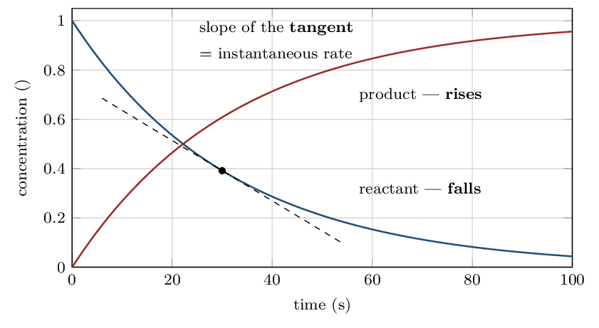

> ⚠️ **AP trap**
>
> **Rate is always reported as a positive number.** A reactant's
> concentration falls, so $\Delta[\text{A}]/\Delta t$ is negative — the
> minus sign in the definition is there to cancel that, not to make the
> rate negative. An answer of $-2.0e-3\,\mathrm{M/s}$ for a rate
> is wrong on sight.

> 📘 **I do: one rate, four different species**
>
> **For 2N₂O₅ → 4NO₂ + O₂, N₂O₅ disappears at
> 4.0e-3 M/s. Find the reaction rate and the rate of
> appearance of each product.**
> 
> **Step 1 — get the reaction rate.** Divide the disappearance of
> N₂O₅ by its coefficient, 2:
> 
> $$ \text{rate} = \frac{1}{2}\left(4.0e-3\,\mathrm{M/s}\right)    = 2.0e-3\,\mathrm{M/s} $$
> 
> **Step 2 — multiply back out for each species.** Each species
> changes at (rate $\times$ its own coefficient):
> 
> $$ \frac{\Delta[\text{NO₂}]}{\Delta t}    = 4 \times 2.0e-3\,\mathrm{} = 8.0e-3\,\mathrm{M/s} $$
> 
> $$ \frac{\Delta[\text{O₂}]}{\Delta t}    = 1 \times 2.0e-3\,\mathrm{} = 2.0e-3\,\mathrm{M/s} $$
> 
> **Sanity-check against the chemistry.** Four NO₂ appear for
> every two N₂O₅ consumed, so NO₂ should appear twice as fast as
> N₂O₅ disappears — 8.0e-3  against 4.0e-3 . It does.
> That ratio check catches almost every slip in this ladder.
> 
> **Average versus instantaneous.** Concentration-versus-time curves
> are curved, so the rate is not constant. A rate taken between two times
> is an **average** rate (the slope of a straight line joining two
> points); a rate at one instant is the slope of the **tangent**
> there. Unless a question says otherwise, “the rate” means the
> instantaneous rate, and the **initial rate** — the tangent at
> $t = 0$ — is the one Ladder 3 depends on.

> ✏️ **YOUR TURN 1 — four questions**
>
> For 2NO + O₂ → 2NO₂, O₂ disappears at
> 0.020 M/s.
> 
> 1. What is the reaction rate? 
>    *(working space)*
> 2. How fast does NO disappear? 
>    *(working space)*
> 3. How fast does NO₂ appear? 
>    *(working space)*
> 4. Why is there a minus sign in front of $\Delta[\text{A}]/\Delta t$
>    for a reactant?
>    *(working space)*
> 
> > **check:** (a) 0.020 M/s     (b)
> 0.040 M/s     (c)
> 0.040 M/s     (d) to make the rate come out
> positive

## Ladder 2 • Rate laws and reaction order

`ZUM §12.2–12.3`

A rate law says how the rate depends on concentration:

$$ \text{rate} = k[\text{A}]^{m}[\text{B}]^{n} $$

$m$ and $n$ are the **orders**; $m + n$ is the **overall
order**; $k$ is the **rate constant**.

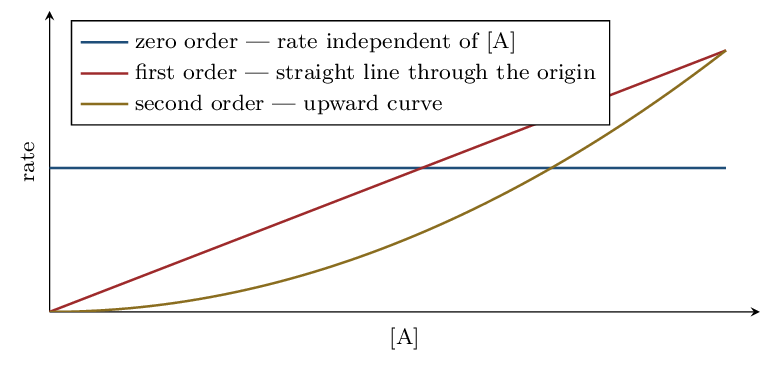

> ⚠️ **AP trap**
>
> **Orders are found by experiment. They are not the coefficients.**
> For 2N₂O₅ → 4NO₂ + O₂ the measured rate law is
> rate $= k[\text{N₂O₅}]$ — *first* order, not second, despite the
> coefficient of 2. The only time coefficients give orders is for a single
> **elementary step** (Ladder 7), and an overall balanced equation is
> almost never one.

> 📘 **I do: reading a rate law**
>
> **A reaction has rate $= k[\text{A}]^{2}[\text{B}]$. Answer four
> questions about it.**
> 
> **What is the order in each reactant?** Second order in A,
> first order in B. Read the exponents; a missing exponent means 1.
> 
> **What is the overall order?** $2 + 1 = \mathbf{3}$. Add the
> exponents.
> 
> **What happens if $[\text{A}]$ is doubled?** Rate changes by
> $2^{2} = \mathbf{4}$ — it quadruples. Raise the factor to the power of
> the order.
> 
> **What happens if $[\text{B}]$ is tripled?** Rate changes by
> $3^{1} = \mathbf{3}$ — it triples.
> 
> **And both at once?** Multiply the effects: $4 \times 3 = 12$.
> Doubling A and tripling B makes the reaction twelve times
> faster.
> 
> **A zero-order reactant is worth understanding, not memorising.**
> If rate $= k[\text{A}]^{0}[\text{B}] = k[\text{B}]$, then changing
> $[\text{A}]$ does nothing at all. That is not a trick — it usually means
> A is not involved in the slow step, or that a surface or enzyme is
> already saturated with it, so adding more has nowhere to go.

> ✏️ **YOUR TURN 2 — four questions**
>
> A reaction has rate $= k[\text{X}][\text{Y}]^{2}$.
> 
> 1. What is the overall order? 
>    *(working space)*
> 2. By what factor does the rate change if $[\text{Y}]$ is doubled?
>    *(working space)*
> 3. By what factor does the rate change if $[\text{X}]$ is halved?
>    *(working space)*
> 4. A different reaction is 2A + B → C with measured rate
>    $= k[\text{A}][\text{B}]$. Is the order in A equal to 2?
>    Explain.
>    *(working space)*
> 
> > **check:** (a) 3     (b) $4\times$     (c) halves     (d) no —
> orders come from experiment

## Ladder 3 • The method of initial rates

`ZUM §12.2–12.3`

The standard experimental route to a rate law. Change *one*
concentration at a time and watch what the rate does.

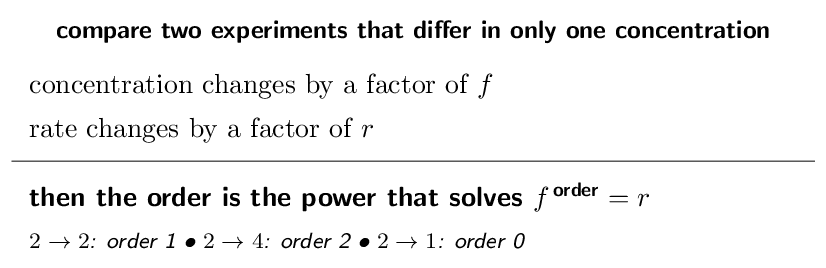

> 📘 **I do: extract a rate law from a data table**
>
> **For A + B → products:**
> 
> | **Exp** | $[\text{A}]_{0}$ (M) | $[\text{B}]_{0}$
>   (M) | **initial rate**
>   (M/s) |
> |---|---|---|---|
> | 1 | 0.10 | 0.10 | 2.0e-3 |
> | 2 | 0.20 | 0.10 | 8.0e-3 |
> | 3 | 0.10 | 0.20 | 4.0e-3 |

**Order in A — use experiments 1 and 2**, because
$[\text{B}]$ is the same in both. $[\text{A}]$ doubles
($0.10 \to 0.20$) and the rate goes from 2.0e-3 to 8.0e-3,
a factor of 4.

$$ 2^{m} = 4 \;\Longrightarrow\; m = \mathbf{2} $$

**Order in B — use experiments 1 and 3**, where $[\text{A}]$
is held fixed. $[\text{B}]$ doubles and the rate doubles
(2.0e-3 to 4.0e-3).

$$ 2^{n} = 2 \;\Longrightarrow\; n = \mathbf{1} $$

**So the rate law is** $\text{rate} = k[\text{A}]^{2}[\text{B}]$,
overall order 3.

**Now find $k$** by substituting any one experiment — use
experiment 1:

$$ k = \frac{\text{rate}}{[\text{A}]^{2}[\text{B}]}      = \frac{2.0e-3}{(0.10)^{2}(0.10)}      = \frac{2.0e-3}{1.0e-3}      = 2.0\;\mathrm{M^{-2}\,s^{-1}} $$

**Then check $k$ against a different row** — this is free and it
catches errors. Experiment 2:
$2.0 \times (0.20)^{2} \times 0.10 = 2.0 \times 0.040 \times 0.10 = 8.0e-3$. Matches. If $k$ does not come out the same from every
row, an order is wrong.

> ✏️ **YOUR TURN 3 — four questions**
>
> For X + Y → products:
> 
> | **Exp** | $[\text{X}]_{0}$ (M) | $[\text{Y}]_{0}$
>   (M) | **initial rate** (M/s) |
> |---|---|---|---|
> | 1 | 0.10 | 0.10 | 1.5e-3 |
> | 2 | 0.20 | 0.10 | 3.0e-3 |
> | 3 | 0.10 | 0.20 | 1.5e-3 |

1. Find the order in X. 
   *(working space)*
2. Find the order in Y. 
   *(working space)*
3. Write the rate law and give the overall order.
   *(working space)*
4. Calculate $k$, with units. 
   *(working space)*

> **check:** (a) 1     (b) 0     (c) rate $= k[\text{X}]$, first order
    (d) 1.5e-2 /s

## Ladder 4 • The units of $k$

`ZUM §12.2`

The units of $k$ are not fixed — they are whatever makes the rate law
come out in M/s. That makes them a free check on
your order.

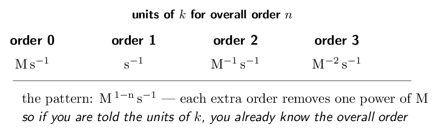

> 📘 **I do: derive the units instead of memorising them**
>
> **Never memorise this table. Derive it in five seconds.**
> 
> Rate always has units M/s, i.e.\
> $\mathrm{M\,s^{-1}}$. For a second-order reaction,
> rate $= k[\text{A}]^{2}$, so
> 
> $$ k = \frac{\text{rate}}{[\text{A}]^{2}}      = \frac{\mathrm{M\,s^{-1}}}{\mathrm{M^{2}}}      = \mathrm{M^{-1}\,s^{-1}} $$
> 
> **The same move for any order.** Divide $\mathrm{M\,s^{-1}}$ by
> $\mathrm{M}^{n}$, giving $\mathrm{M^{\,1-n}\,s^{-1}}$. For $n=0$ that is
> $\mathrm{M\,s^{-1}}$; for $n=1$, $\mathrm{s^{-1}}$; for $n=3$,
> $\mathrm{M^{-2}\,s^{-1}}$.
> 
> **Now use it backwards, which is where the marks are.** If a
> question hands you $k = 0.045\;\mathrm{M^{-1}\,s^{-1}}$, you already
> know the reaction is **second order overall** before reading
> anything else. Examiners use this to test whether you understand the
> relationship or merely memorised a table.
> 
> **And use it as a check.** If you determine orders from a data
> table and then compute a $k$ whose units disagree with your overall
> order, one of the two is wrong — go back before continuing.

> ✏️ **YOUR TURN 4 — four questions**
>
> 1. Give the units of $k$ for a first-order reaction.
>    *(working space)*
> 2. $k = 0.020\;\mathrm{M^{-1}\,s^{-1}}$. What is the overall
>    order?
>    *(working space)*
> 3. $k = 3.5\;\mathrm{M\,s^{-1}}$. What is the overall order?
>    *(working space)*
> 4. Derive the units of $k$ for a reaction that is first order in
>    A and second order in B.
>    *(working space)*
> 
> > **check:** (a) $\mathrm{s^{-1}}$     (b) 2     (c) 0     (d)
> $\mathrm{M^{-2}\,s^{-1}}$

## Ladder 5 • Integrated rate laws

`ZUM §12.4`

A rate law relates rate to concentration. An *integrated* rate law
relates concentration to **time** — which is what you actually
need to answer “how much is left after ten minutes?”

| **Order** | **Integrated law** | **Linear plot** | **Slope** |
|---|---|---|---|
| 0 | $[\text{A}] = -kt + [\text{A}]_{0}$ | $[\text{A}]$ vs $t$ | $-k$ |
| 1 | $\ln[\text{A}] = -kt + \ln[\text{A}]_{0}$ | $\ln[\text{A}]$ vs $t$ | $-k$ |
| 2 | $\dfrac{1}{[\text{A}]} = kt + \dfrac{1}{[\text{A}]_{0}}$ | $1/[\text{A}]$ vs $t$ | $+k$ |

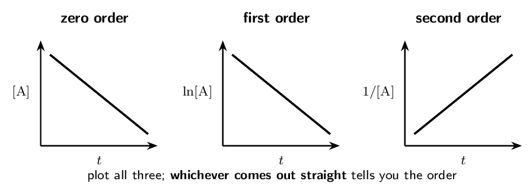

> 📌 **Why this is really a graphing skill**
>
> On the exam you are far more likely to be *given* data and asked
> which order it is than to be told the order outright. The method is
> always the same: make the three plots (or inspect three columns of
> numbers) and find the one that is linear. A straight
> $\ln[\text{A}]$-versus-$t$ plot **is** the evidence for first order,
> and saying so is what earns the mark — not asserting the order and
> moving on.

> 📘 **I do: a first-order calculation**
>
> **A first-order reaction has $k = 0.0250\,\mathrm{/s}$ and
> $[\text{A}]_{0} = 0.800\,\mathrm{M}$. Find $[\text{A}]$ after
> 60.0 s.**
> 
> **Use the first-order integrated law** in its exponential form,
> which is easier than the logarithmic one when you want a concentration:
> 
> $$ [\text{A}] = [\text{A}]_{0}\,e^{-kt} $$
> 
> $$ [\text{A}] = 0.800 \times e^{-(0.0250)(60.0)}             = 0.800 \times e^{-1.500}             = 0.800 \times 0.2231             = \mathbf{0.179\,\mathrm{M}} $$
> 
> **Check it with half-lives, which is quicker than it looks.**
> 
> $$ t_{1/2} = \frac{0.693}{k} = \frac{0.693}{0.0250}            = 27.7\,\mathrm{s} $$
> 
> 60.0 s is about **2.2** half-lives — so a little more
> than two, and roughly a quarter of the material should be left, with a
> bit more decay on top. $0.800/4 = 0.200$, and our answer of
> 0.179 M sits just below it. Consistent.
> 
> **That cross-check is worth doing every time.** It costs one line
> and catches sign errors in the exponent, which are the commonest failure
> here. A positive exponent would have given 3.58 M — more
> than you started with, and obviously impossible.

> ✏️ **YOUR TURN 5 — four questions**
>
> 1. Which plot is linear for a second-order reaction?
>    *(working space)*
> 2. A plot of $\ln[\text{A}]$ against $t$ is a straight line with
>    slope $-0.0400\,\mathrm{/s}$. Give the order and $k$.
>    *(working space)*
> 3. For a first-order reaction with $k = 0.100\,\mathrm{/s}$
>    and $[\text{A}]_{0} = 1.00\,\mathrm{M}$, find $[\text{A}]$ after
>    10.0 s.
>    *(working space)*
> 4. You are given concentration-versus-time data and no order.
>    Describe how you would find the order.
>    *(working space)*
> 
> > **check:** (a) $1/[\text{A}]$ vs $t$     (b) first order,
> $k = 0.0400\,\mathrm{/s}$     (c) 0.368 M     (d)
> plot all three, find the straight one

## Ladder 6 • Half-life

`ZUM §12.4`

The half-life $t_{1/2}$ is the time for half the reactant to be
consumed. Its behaviour differs sharply between orders, and that
difference is itself a way to identify the order.

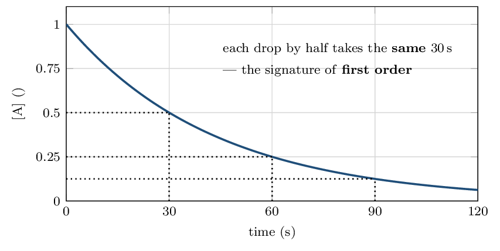

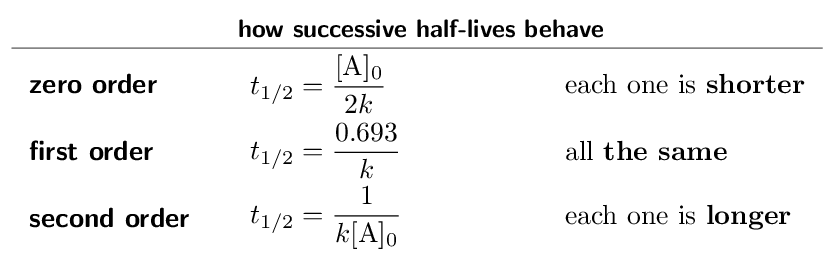

> ⚠️ **AP trap**
>
> **Only the first-order half-life is independent of
> concentration.** That is why $t_{1/2} = 0.693/k$ contains no
> $[\text{A}]_{0}$ — and why radioactive decay, which is always first
> order, has a fixed half-life you can quote for an isotope. Quoting a
> single half-life for a second-order reaction is meaningless, because it
> doubles every time round.

> 📘 **I do: half-lives without a calculator**
>
> **A first-order reaction has $t_{1/2} = 25\,\mathrm{s}$. What
> fraction of the reactant remains after 100 s?**
> 
> **Count half-lives rather than using the exponential.**
> 
> $$ \frac{100\,\mathrm{s}}{25\,\mathrm{s}} = 4    \text{ half-lives} $$
> 
> Each one leaves half of what was there, so after four:
> 
> $$ \left(\tfrac{1}{2}\right)^{4} = \tfrac{1}{16}    = \mathbf{0.0625} = 6.25\% $$
> 
> **This is exactly why MCQ sections can be no-calculator.** Whole
> numbers of half-lives are meant to be done in your head: 1 half-life
> leaves $1/2$, then $1/4$, $1/8$, $1/16$. If a question gives you a time
> that is a neat multiple of $t_{1/2}$, it is telling you to count rather
> than compute.
> 
> **Going the other way.** If a first-order reaction is 87.5%
> complete, then $12.5\% = 1/8$ remains, which is three half-lives.
> Recognising $1/2$, $1/4$, $1/8$, $1/16$ as one, two, three and four
> half-lives turns a calculation into a glance.
> 
> **And the link back to $k$:** $t_{1/2} = 0.693/k$, so a large $k$
> means a short half-life. The two are just different ways of stating the
> same speed.

> ✏️ **YOUR TURN 6 — four questions**
>
> 1. A first-order reaction has $k = 0.0350\,\mathrm{/s}$. Find
>    $t_{1/2}$.
>    *(working space)*
> 2. What fraction remains after 3 half-lives?
>    *(working space)*
> 3. A first-order reaction is 75% complete. How many half-lives
>    have passed?
>    *(working space)*
> 4. Successive half-lives of a reaction get longer each time. What
>    order is it?
>    *(working space)*
> 
> > **check:** (a) 19.8 s     (b) $1/8$     (c) 2    
> (d) second order

## Ladder 7 • Elementary steps and
molecularity

`ZUM §12.5`

An **elementary step** is a single collision event — what
actually happens, not a summary. For an elementary step, and only for an
elementary step, the coefficients *are* the orders.

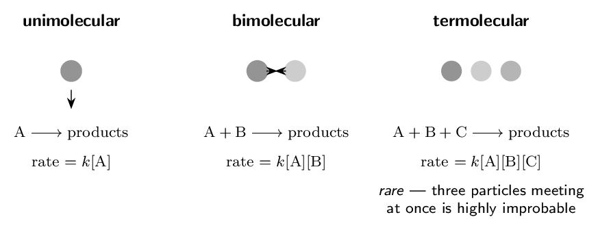

> 📘 **I do: the one place coefficients give orders**
>
> **Why can you read a rate law off an elementary step but not off
> an overall equation?**
> 
> **Because an elementary step describes an actual collision.** If
> the step is NO₂ + NO₂ → NO₃ + NO, then the event is literally
> two NO₂ molecules meeting. Double $[\text{NO₂}]$ and each molecule
> has twice as many partners available while there are twice as many
> molecules looking — so the collision frequency, and the rate, goes up
> by $2 \times 2 = 4$. That is second order, and it follows from the
> coefficient 2 because the coefficient is counting colliding particles.
> 
> **An overall equation summarises, and summaries lose
> information.** 2N₂O₅ → 4NO₂ + O₂ does not mean two N₂O₅
> molecules collide. It means that when the whole multi-step process is
> tallied up, two are consumed. The measured rate law is
> $k[\text{N₂O₅}]$ — first order — because the slow step involves only
> one molecule.
> 
> **Why termolecular steps are essentially never proposed.** Getting
> two particles to meet with enough energy and the right orientation is
> already demanding. Requiring a third to arrive at the same instant makes
> the probability vanishingly small. If you write a mechanism with a
> termolecular step, expect to be asked to justify it — and you usually
> cannot.
> 
> **The test to apply:** has the question told you the step is
> elementary (or is it labelled “slow”/“fast” inside a mechanism)? If
> yes, use the coefficients. If it is an overall equation, you need
> experimental data.

> ✏️ **YOUR TURN 7 — four questions**
>
> 1. Give the rate law for the elementary step
>    2NO₂ → N₂O₄.
>    *(working space)*
> 2. Give the molecularity of the elementary step
>    O₃ → O₂ + O.
>    *(working space)*
> 3. Give the rate law for the elementary step
>    NO + O₃ → NO₂ + O₂.
>    *(working space)*
> 4. Why are termolecular steps rare? 
>    *(working space)*
> 
> > **check:** (a) rate $= k[\text{NO₂}]^{2}$     (b) unimolecular    
> (c) rate $= k[\text{NO}][\text{O₃}]$     (d) three-body collisions are
> improbable

## Ladder 8 • Mechanisms and the
rate-determining step

`ZUM §12.5`

A mechanism is the list of elementary steps. The **slowest** step
sets the pace for the whole reaction, exactly as the narrowest point on
a road sets the traffic speed.

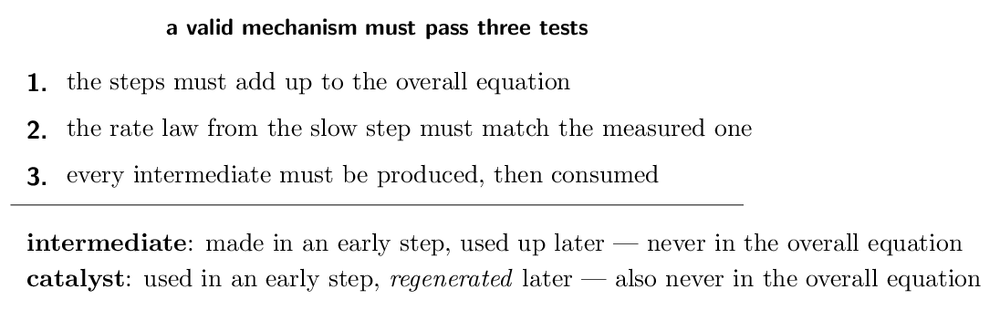

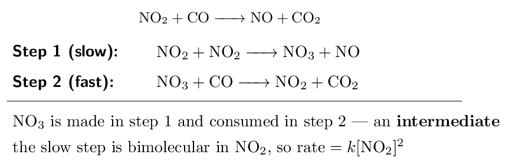

> 📘 **I do: check a mechanism, then get its rate law**
>
> **Test the two-step mechanism above against all three
> requirements.**
> 
> **Test 1 — do the steps add to the overall equation?** Add them:
> 2NO₂ + NO₃ + CO → NO₃ + NO + NO₂ + CO₂
> Cancel NO₃ from both sides and one NO₂ from both sides:
> 
> $$ \text{NO₂ + CO → NO + CO₂} \quad\checkmark $$
> 
> **Test 2 — what rate law does it predict?** The slow step is
> NO₂ + NO₂ → NO₃ + NO, which is elementary, so its coefficients
> give its orders:
> 
> $$ \text{rate} = k[\text{NO₂}]^{2} $$
> 
> This is the experimentally measured rate law for this reaction, so the
> mechanism survives.
> 
> **Test 3 — is the intermediate handled properly?** NO₃ is
> produced in step 1 and consumed in step 2, and it does not appear in the
> overall equation.    ✓
> 
> **Now notice what the rate law does *not* contain: CO.**
> Carbon monoxide is a reactant in the overall equation, yet the rate does
> not depend on it at all — because CO appears only in the
> *fast* step, after the bottleneck. Adding more CO cannot speed
> up a process that is already waiting on step 1.
> 
> **And notice the order in NO₂ is 2** while its coefficient in
> the overall equation is 1. Both observations are the same lesson from
> Ladder 2, now with a mechanism to explain *why*.

> ✏️ **YOUR TURN 8 — four questions**
>
> Consider this mechanism for 2NO₂ + F₂ → 2NO₂F:
> 
> | Step 1 (slow): | NO₂ + F₂ → NO₂F + F |
> |---|---|
> | Step 2 (fast): | NO₂ + F → NO₂F |

1. Show the steps add to the overall equation.
   *(working space)*
2. Identify the intermediate. 
   *(working space)*
3. Write the predicted rate law. 
   *(working space)*
4. Would doubling $[\text{NO₂}]$ double the rate? Explain.
   *(working space)*

> **check:** (a) they sum correctly     (b) F atoms     (c) rate
$= k[\text{NO₂}][\text{F₂}]$     (d) yes — first order in NO₂

## Ladder 9 • A fast first step:
pre-equilibrium

`ZUM §12.5`

When the *first* step is fast and reversible, the rate-determining
step contains an intermediate — and a rate law may not contain an
intermediate, because you cannot measure its concentration. This ladder
is how you get rid of it.

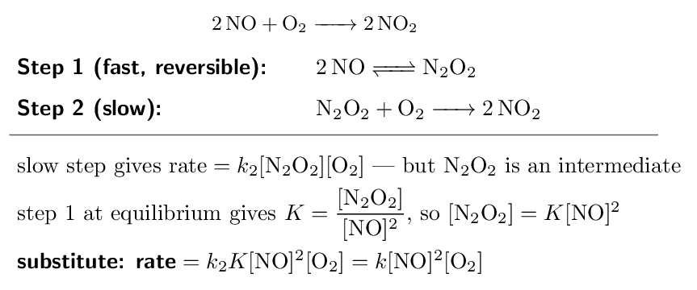

> 📘 **I do: eliminating an intermediate**
>
> **The rule that forces this whole procedure: a rate law may
> contain only species whose concentrations you can control or measure —
> reactants, products, catalysts. Never an intermediate.**
> 
> **Start where the bottleneck is.** The slow step is
> N₂O₂ + O₂ → 2NO₂, elementary, so
> 
> $$ \text{rate} = k_{2}[\text{N₂O₂}][\text{O₂}] $$
> 
> This is correct but useless: N₂O₂ exists only fleetingly and you
> cannot put a number on its concentration.
> 
> **Use the fast step to express it in measurable terms.** Step 1 is
> fast and reversible, so it reaches equilibrium long before step 2 gets
> anywhere. For 2NO ⇌ N₂O₂,
> 
> $$ K = \frac{[\text{N₂O₂}]}{[\text{NO}]^{2}}    \quad\Longrightarrow\quad    [\text{N₂O₂}] = K[\text{NO}]^{2} $$
> 
> **Substitute and fold the constants together.**
> 
> $$ \text{rate} = k_{2}K[\text{NO}]^{2}[\text{O₂}]                = k[\text{NO}]^{2}[\text{O₂}] $$
> 
> where $k = k_{2}K$ is what an experiment actually measures. You cannot
> separate $k_{2}$ from $K$ by measuring the rate — only their product.
> 
> **Check against reality.** The experimentally observed rate law for
> 2NO + O₂ → 2NO₂ is third order overall, second in NO and
> first in O₂. The mechanism reproduces it exactly.
> 
> **And note the payoff.** A simple one-step collision of
> 2NO + O₂ would be *termolecular* — three particles at
> once, which Ladder 7 said is implausible. The pre-equilibrium mechanism
> gets the same third-order rate law out of two ordinary bimolecular
> steps. That is why chemists proposed it.

> ✏️ **YOUR TURN 9 — four questions**
>
> 1. Why may a rate law not contain an intermediate?
>    *(working space)*
> 2. In the mechanism above, which species is the intermediate?
>    *(working space)*
> 3. A mechanism has fast A ⇌ B then slow
>    B + C → D. Write the rate law in terms of A and
>    C.
>    *(working space)*
> 4. Why is a termolecular one-step route for
>    2NO + O₂ → 2NO₂ considered implausible?
>    *(working space)*
> 
> > **check:** (a) its concentration cannot be measured or controlled    
> (b) N₂O₂     (c) rate $= k[\text{A}][\text{C}]$     (d) it needs a
> three-body collision

## Ladder 10 • The collision model

`ZUM §12.6`

For a reaction to occur, particles must collide — with
**enough energy** and in the **right orientation**. Almost
every collision fails one test or the other, which is why reactions are
so much slower than collision frequencies alone would suggest.

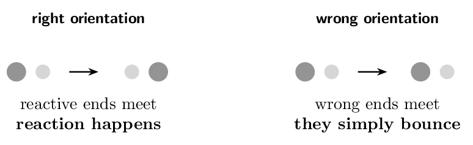

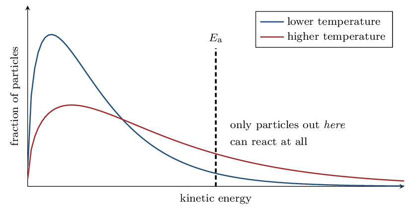

> 📌 **Why a small temperature rise does so much**
>
> Heating does *not* shift the whole distribution up — it flattens
> and stretches it to the right. The peak barely moves, but the
> **tail beyond $E_{\mathrm{a}}$** grows enormously, and it is only
> the tail that reacts. For a typical activation energy near
> 50 kJ/mol, warming from 25 °C to
> 35 °C roughly *doubles* the rate — a
> 10 °C change producing a 100% change in speed. Say
> “the fraction of collisions with energy $\ge E_{\mathrm{a}}$
> increases”, not “the particles have more energy”: the second earns
> nothing.

> 📘 **I do: the Arrhenius equation**
>
> $$ k = A\,e^{-E_{\mathrm{a}}/RT}    \qquad\text{or, taking logs,}\qquad    \ln k = -\frac{E_{\mathrm{a}}}{R}\cdot\frac{1}{T} + \ln A $$
> 
> **Read the second form as $y = mx + c$.** Plotting $\ln k$ against
> $1/T$ gives a straight line of slope $-E_{\mathrm{a}}/R$ — which is
> how activation energies are actually measured.
> 
> 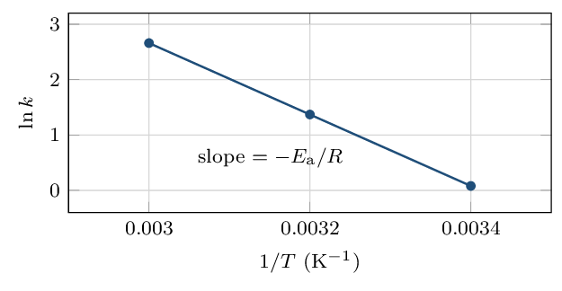

**Worked: the rate constant doubles when the temperature rises
from 300 K to 310 K. Find $E_{\mathrm{a}}$.**

Use the two-point form:

$$ \ln\!\left(\frac{k_{2}}{k_{1}}\right)    = -\frac{E_{\mathrm{a}}}{R}      \left(\frac{1}{T_{2}} - \frac{1}{T_{1}}\right) $$

$$ \ln 2 = -\frac{E_{\mathrm{a}}}{8.314}    \left(\frac{1}{310} - \frac{1}{300}\right)    = -\frac{E_{\mathrm{a}}}{8.314}\left(-1.075e-4\right) $$

$$ 0.693 = E_{\mathrm{a}} \times 1.293e-5    \quad\Longrightarrow\quad    E_{\mathrm{a}} = 53600\,\mathrm{J/mol}    = \mathbf{53.6\,\mathrm{kJ/mol}} $$

**Two habits.** Temperature must be in **kelvin** — the
equation is meaningless in celsius. And $R = 8.314\,\mathrm{}$ gives
$E_{\mathrm{a}}$ in joules, so divide by 1000 at the end; forgetting to
is the single most common slip here.

> ✏️ **YOUR TURN 10 — four questions**
>
> 1. State the two requirements for a collision to lead to reaction.
>    *(working space)*
> 2. Why does raising the temperature increase the rate so sharply?
>    *(working space)*
> 3. What does the slope of a plot of $\ln k$ against $1/T$ equal?
>    *(working space)*
> 4. Does raising the temperature change $E_{\mathrm{a}}$? Explain.
>    *(working space)*
> 
> > **check:** (a) enough energy, correct orientation     (b) the
> fraction exceeding $E_{\mathrm{a}}$ rises steeply     (c)
> $-E_{\mathrm{a}}/R$     (d) no — it changes how many particles clear
> it

## Ladder 11 • Reaction energy profiles

`ZUM §12.6`

An energy profile is the reaction drawn as a landscape: reactants on one
side, products on the other, and a hill in between whose height is the
activation energy.

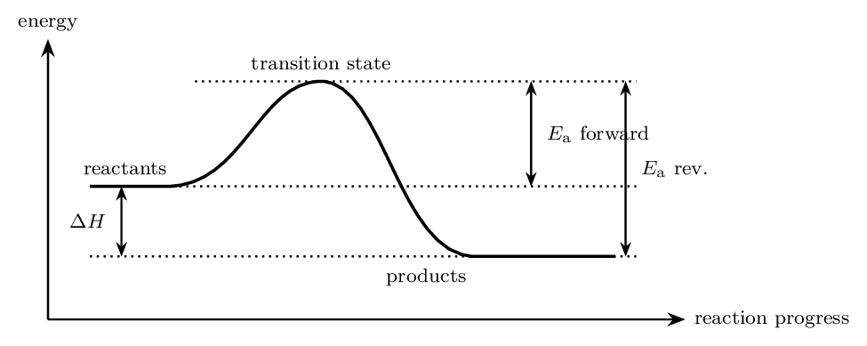

$$ E_{\mathrm{a}}(\text{forward}) - E_{\mathrm{a}}(\text{reverse})    = \Delta H $$

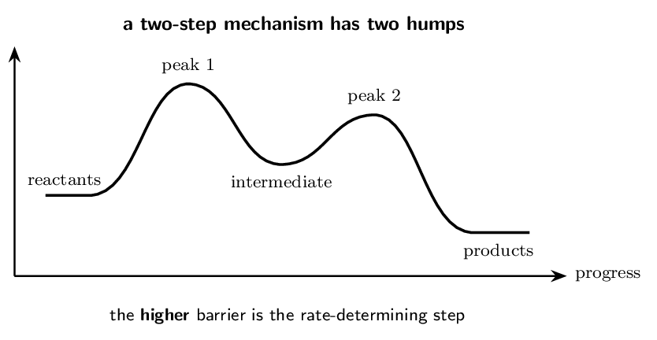

> 📘 **I do: reading numbers off a profile**
>
> **A one-step reaction has $E_{\mathrm{a}}(\text{forward}) = 80\,\mathrm{kJ/mol}$ and $\Delta H = -30\,\mathrm{kJ/mol}$. Find $E_{\mathrm{a}}$ for the reverse
> reaction.**
> 
> **Put the reactants at zero and work up.** The peak is
> 80 kJ/mol above the reactants. The products are
> 30 kJ/mol *below* them, because $\Delta H$ is
> negative.
> 
> **The reverse barrier is measured from the products to the same
> peak:**
> 
> $$ E_{\mathrm{a}}(\text{rev}) = 80 - (-30)    = \mathbf{110\,\mathrm{kJ/mol}} $$
> 
> **Sanity check.** An exothermic reaction always has a
> *larger* reverse barrier than forward one — the products sit in a
> deeper valley, so climbing back out costs more. If your reverse
> $E_{\mathrm{a}}$ came out smaller for an exothermic reaction, you
> subtracted the wrong way.
> 
> **Now the two-step profile above.** Take reactants at 0, peak 1 at
> 75, the intermediate at 20, peak 2 at 50, products at $-25$
> (kJ/mol).
> 
> - $E_{\mathrm{a}}$ of step 1 $= 75 - 0 = 75\,\mathrm{}$
> - $E_{\mathrm{a}}$ of step 2 $= 50 - 20 = 30\,\mathrm{}$
> - overall $\Delta H = -25 - 0 = -25\,\mathrm{kJ/mol}$
> 
> **Step 1 is rate-determining** because its barrier is the larger.
> Each step's activation energy is measured from *its own* starting
> valley, not from the reactants — for step 2 that means from the
> intermediate at 20, not from 0.

> ✏️ **YOUR TURN 11 — four questions**
>
> Use reactants $=0$, peak 1 $=60\,\mathrm{}$, intermediate $=15\,\mathrm{}$,
> peak 2 $=45\,\mathrm{}$, products $=-20\,\mathrm{kJ/mol}$.
> 
> 1. Find $E_{\mathrm{a}}$ for step 1. 
>    *(working space)*
> 2. Find $E_{\mathrm{a}}$ for step 2. 
>    *(working space)*
> 3. Which step is rate-determining? 
>    *(working space)*
> 4. Give the overall $\Delta H$, and say whether the reaction is
>    exothermic or endothermic.
>    *(working space)*
> 
> > **check:** (a) 60 kJ/mol     (b)
> 30 kJ/mol     (c) step 1     (d)
> -20 kJ/mol, exothermic

## Ladder 12 • Catalysis

`ZUM §12.7`

A catalyst speeds a reaction by offering a **different pathway**
with a lower activation energy. It changes the route, not the
destination.

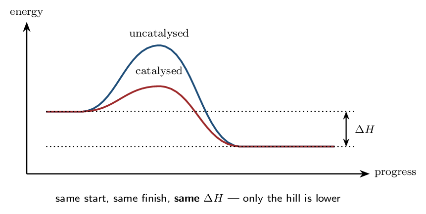

> ⚠️ **AP trap**
>
> **A catalyst does not change $\Delta H$, and it does not shift the
> equilibrium position.** It lowers the barrier for the forward
> *and* the reverse reaction by exactly the same amount, so both
> speed up equally and equilibrium is simply reached sooner. An answer
> saying a catalyst “increases the yield” or “makes the reaction more
> exothermic” scores zero.

> 📘 **I do: catalyst or intermediate?**
>
> **Both appear inside a mechanism and neither appears in the
> overall equation. Telling them apart is a standard exam question, and
> the test is the order in which they show up.**
> 
> **An intermediate is produced first, then consumed.** It appears as
> a *product* of an earlier step and a *reactant* of a later
> one. It did not exist before the reaction started.
> 
> **A catalyst is consumed first, then regenerated.** It appears as a
> *reactant* of an earlier step and a *product* of a later one.
> It was there at the start and is still there at the end — which is why
> a tiny amount can process an unlimited quantity of reactant.
> 
> **Worked case.** In the mechanism
> 
> $$ \text{Cl + O₃ → ClO + O₂}    \qquad    \text{ClO + O → Cl + O₂} $$
> 
> Cl is used in step 1 and **regenerated** in step 2 — a
> **catalyst**. ClO is made in step 1 and **consumed** in
> step 2 — an **intermediate**. Adding the steps gives
> O₃ + O → 2O₂, with neither appearing. This is the real
> chemistry of chlorine-catalysed ozone destruction, and the reason a
> single chlorine atom can destroy many thousands of ozone molecules
> before it is finally removed.
> 
> **Two kinds of catalyst, distinguished by phase.**
> **Homogeneous** catalysts are in the same phase as the reactants
> — as Cl above, a gas among gases. **Heterogeneous**
> catalysts are in a different phase, usually a solid surface on which gas
> or liquid reactants adsorb, react and then leave; the platinum in a car's
> catalytic converter is the standard example. **Enzymes** are
> biological catalysts, and their extraordinary specificity comes from an
> active site shaped to hold one substrate in exactly the right
> orientation — solving the orientation half of Ladder 10's problem
> rather than the energy half.

> ✏️ **YOUR TURN 12 — four questions**
>
> 1. How does a catalyst increase the rate? 
>    *(working space)*
> 2. Does a catalyst change $\Delta H$? Explain.
>    *(working space)*
> 3. Distinguish an intermediate from a catalyst.
>    *(working space)*
> 4. Does a catalyst shift the position of equilibrium? Explain.
>    *(working space)*
> 
> > **check:** (a) it lowers $E_{\mathrm{a}}$ via a new pathway     (b)
> no     (c) intermediate is made then used; catalyst is used then
> remade     (d) no — both directions speed up equally

## Mastery tracker

Tick a row only if **all four** YOUR TURN questions were right on
the first attempt. Every row is assessed — Chapter 12 has no
off-syllabus sections.

| **First try?** | **Skill** | **Ladder** | **If not, re-read…** |
|---|---|---|---|
| $\square$ | rate and stoichiometry | 1 | divide by the coefficient |
| $\square$ | rate laws and order | 2 | orders are experimental |
| $\square$ | method of initial rates | 3 | change one thing at a time |
| $\square$ | units of $k$ | 4 | $\mathrm{M^{\,1-n}\,s^{-1}}$ |
| $\square$ | integrated rate laws | 5 | which plot is straight? |
| $\square$ | half-life | 6 | only first order is constant |
| $\square$ | elementary steps | 7 | coefficients work only here |
| $\square$ | mechanisms and the RDS | 8 | the slow step sets the rate |
| $\square$ | pre-equilibrium | 9 | eliminate the intermediate |
| $\square$ | the collision model | 10 | energy *and* orientation |
| $\square$ | energy profiles | 11 | measure from its own valley |
| $\square$ | catalysis | 12 | new pathway, same $\Delta H$ |

> 📌 **Scoring yourself honestly**
>
> 12/12: you have Unit 5. This chapter is unusually self-contained —
> almost nothing in it depends on the rest of the course — so a clean
> sweep here is genuinely banked.
> 
> 9–11: look at *where* the misses fall. Ladders 1–6 are the
> computational half and repair with practice. Ladders 7–9 are the
> mechanism half, and a miss there is nearly always the same root cause:
> still reading orders off coefficients. Re-read Ladder 7 before
> attempting more problems.
> 
> 8 or fewer: go back to Ladder 2 and hold one sentence in mind —
> *orders come from experiment, not from the balanced equation*. Most
> wrong answers in this unit are that error wearing a different hat.
> Ladder 3 (initial rates) and Ladder 8 (mechanisms) are the two that
> appear most often on the exam; if time is short, make those two
> automatic first.

---

*AP Chemistry course materials • student edition • CC BY-NC-SA 4.0*
