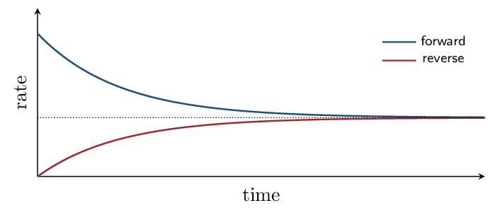

# Guided Notes

*Chapter 13 • Chemical Equilibrium*  
Zumdahl §13.1–13.7 • PDF pp. 650–695 • 5 blocks

[← all lessons](../index.md)

---

> 📌 **How this chapter fits the AP course**
>
> Chapter 13 covers **CED 7.1–7.10** in the textbook's own order — about
> 80% of Unit 7, with nothing off-syllabus.
> 
> The two topics it does *not* contain are **7.11 solubility
> equilibria ($K_{sp}$)** and **7.12 the common-ion effect**, which live in
> Zumdahl §16.1 and §15.1. Plan to pick those up separately.
> 
> **One connection worth making explicitly:** the ICE tables in Block 4
> are the BCA tables from Chapter 3 with new labels. Before/Change/After
> becomes Initial/Change/Equilibrium, and the change row is still driven by
> coefficient ratios. The only new idea is that the reaction stops partway
> instead of running to completion.

## The Equilibrium Condition Zumdahl §13.1

> 📌 **By the end you can…**
>
> - Describe chemical equilibrium as a dynamic condition.
> - Explain why concentrations become constant but not equal.

**Read:** Zumdahl §13.1 • PDF pp. 651–654

> 📌 **Retrieval warm-up**
>
> 1. Rate law for the elementary step A + B → C:
>    $k[\text{A}][\text{B}]$
> 2. Does a catalyst change $\Delta H$? no
> 3. Balance: N₂ + H₂ → NH₃:
>    N₂ + 3 H₂ → 2 NH₃

#### INSTRUCTION A • What equilibrium actually is 25 min

### Dynamic, not static `ZUM §13.1`

`SP 1`

Start with pure reactants. The forward reaction begins fast and slows as
reactants are consumed. Products accumulate, so the reverse reaction speeds
up. Eventually the two rates become
equal, and from that moment the concentrations stop
changing.

$\text{at equilibrium:}\qquad   \text{rate}_{\text{forward}} =$ $\text{rate}_{\text{reverse}}$

> ⚠️ **AP trap**
>
> Equilibrium is dynamic, not static. Both reactions continue at full
> speed — they simply cancel out. Nothing has stopped; the traffic in both
> directions is merely balanced.
> 
> And “constant” does not mean “equal.” Concentrations of reactants and
> products settle at values that are typically very different from one
> another. Saying “at equilibrium the concentrations are equal” is the
> single most common error in this unit.

#### GUIDED PRACTICE • True or false, with reasons 15 min

1. At equilibrium, the forward reaction stops.
   False — both continue at equal rates
2. At equilibrium, concentrations are constant.
   True
3. At equilibrium, $[\text{reactants}] = [\text{products}]$.
   False — constant, not equal
4. Equilibrium can be reached from either direction.
   True

#### INSTRUCTION B • Approaching from either side 20 min

### The same destination `ZUM §13.1`

`SP 4`

A crucial property: for a given temperature, starting with pure reactants or
with pure products leads to the same equilibrium
condition. Only the *route* differs.

> 📌 **Note**
>
> This is why equilibrium is described by a constant rather than a
> procedure. The system does not remember how it got there — which is the
> same path-independence you met with state functions in Chapter 6.

#### APPLICATION • Reasoning about the approach 20 min

1. Sketch how $[\text{N₂}]$, $[\text{H₂}]$, and $[\text{NH₃}]$ change over
   time starting from pure N₂ and H₂, and mark where
   equilibrium is reached.
   *(working space)*
2. A sealed flask of N₂O₄ is left until no further colour change
   occurs, yet a chemist insists both reactions are still running.
   How could that be demonstrated? 

> 📌 **Exit ticket**
>
> Explain the difference between saying concentrations are “constant” and
> saying they are “equal” at equilibrium.

## The Equilibrium Constant Zumdahl §13.2–13.3

> 📌 **By the end you can…**
>
> - Write $K$ expressions from balanced equations.
> - Convert between $K_c$ and $K_p$.

**Read:** Zumdahl §13.2–13.3 • PDF pp. 654–660

> 📌 **Retrieval warm-up**
>
> 1. At equilibrium the two rates are:
>    equal
> 2. Is equilibrium static or dynamic? dynamic
> 3. $R$ in L·atm/mol/K:
>    0.08206

#### INSTRUCTION A • The law of mass action 25 min

### Writing $K$ `ZUM §13.2`

`SP 5`

For the general reaction $j\text{A} + k\text{B} \rightleftharpoons l\text{C} + m\text{D}$:
$K =$ $\dfrac{[\text{C}]^l[\text{D}]^m}{[\text{A}]^j[\text{B}]^k}$

Products over reactants, each raised to its
coefficient.

> 📌 **Note**
>
> Here the coefficients *do* become exponents — unlike rate laws in
> Chapter 12, where they never do. The difference is that $K$ describes a
> thermodynamic end state determined by the overall equation, while a rate law
> describes a mechanism. Two different questions, two different rules.

#### Manipulating $K$

| **If you…** | **then the new constant is…** |
|---|---|
| reverse the reaction | $1/K$ |
| multiply coefficients by $n$ | $K^n$ |
| add two reactions | $K_1 \times K_2$ |

#### GUIDED PRACTICE • Write the expressions 15 min

1. N₂(g) + 3 H₂(g) ⇌ 2 NH₃(g):
   $[\text{NH₃}]^2/([\text{N₂}][\text{H₂}]^3)$
2. 2 SO₂(g) + O₂(g) ⇌ 2 SO₃(g):
   $[\text{SO₃}]^2/([\text{SO₂}]^2[\text{O₂}])$
3. If $K = 4.0$ for a reaction, $K$ for the reverse is:
   0.25

#### INSTRUCTION B • $K_p$ and $K_c$ 20 min

### Equilibrium in terms of pressure `ZUM §13.3`

`SP 5`

For gases it is often easier to measure pressure than concentration, so
$K_p$ uses partial pressures in place of molar concentrations.

Since $C = P/RT$ for an ideal gas, substituting gives
$K_p =$ $K_c(RT)^{\Delta n}$ $\qquad \Delta n =$ (mol gas products) $-$ (mol gas reactants)

> 📘 **Worked example 1: when the two are equal**
>
> For H₂(g) + F₂(g) ⇌ 2 HF(g): two moles of gas on each side, so
> $\Delta n = 0$ and $(RT)^0 = 1$. Therefore
> 
> $$ K_p = K_c $$
> 
> Zumdahl works the substitution explicitly — every $RT$ term cancels.
> Whenever the gas-mole totals match, the two constants are identical.

> 📘 **Worked example 2: when they differ**
>
> For N₂O₄(g) ⇌ 2 NO₂(g) at 25 °C, $K_c = 4.6\times10^{-3}$. Here $\Delta n = 2 - 1 = 1$:
> 
> $$ K_p = K_c(RT)^1 = (4.6\times10^{-3})(0.08206)(298) = 0.11 $$
> 
> The two differ by a factor of $RT \approx 24.5$ — large enough that
> quoting the wrong one is a serious error.

> ⚠️ **AP trap**
>
> $\Delta n$ counts *gases only*. Solids and liquids are excluded, for
> the same reason they are excluded from the $K$ expression itself
> (Block 3). And equilibrium constants are conventionally written without
> units — do not attach any.

#### APPLICATION • Conversions 20 min

1. For N₂(g) + 3 H₂(g) ⇌ 2 NH₃(g), find $\Delta n$ and write the
   relationship between $K_p$ and $K_c$.
   
2. For 2 SO₂(g) + O₂(g) ⇌ 2 SO₃(g) at 700 K,
   $K_c = 4.3\times10^{6}$. Calculate $K_p$.
   *(working space)*

> 📌 **Exit ticket**
>
> For which type of reaction does $K_p = K_c$? Give an example.

## Heterogeneous Equilibria, Magnitude of $K$, and $Q$ Zumdahl §13.4–13.5

> 📌 **By the end you can…**
>
> - Write $K$ for heterogeneous equilibria.
> - Interpret the magnitude of $K$, and use $Q$ to predict direction.

**Read:** Zumdahl §13.4–13.5 • PDF pp. 660–671

> 📌 **Retrieval warm-up**
>
> 1. $K$ expression for 2 A ⇌ B:
>    $[\text{B}]/[\text{A}]^2$
> 2. $\Delta n$ for 2 NO₂ ⇌ N₂O₄: $-1$
> 3. If $K = 100$, $K$ for the reverse is:
>    0.010
> 4. Do equilibrium constants carry units? no

#### INSTRUCTION A • Leaving things out 25 min

### Heterogeneous equilibria `ZUM §13.4`

`SP 6`

When a reaction involves more than one phase, pure solids and
pure liquids are omitted from the $K$ expression.

The reason is not arbitrary: the “concentration” of a pure condensed phase
is fixed by its density, which does not change as the
reaction proceeds. Adding more solid does not make it more concentrated — it
just makes the pile bigger.

> 📘 **Worked example: limestone decomposition**
>
> CaCO₃(s) ⇌ CaO(s) + CO₂(g)
> Both calcium-containing species are pure solids, so
> 
> $$ K_p = P_{\text{CO₂}} $$
> 
> The equilibrium pressure of CO₂ above the solid depends only on
> temperature. Doubling the amount of CaCO₃ in the flask changes
> *nothing* — provided some of each solid remains present.

#### GUIDED PRACTICE • Write heterogeneous expressions 15 min

1. 2 H₂O(l) ⇌ 2 H₂(g) + O₂(g):
   $K = [\text{H₂}]^2[\text{O₂}]$
2. C(s) + CO₂(g) ⇌ 2 CO(g):
   $K = [\text{CO}]^2/[\text{CO₂}]$
3. NH₄Cl(s) ⇌ NH₃(g) + HCl(g):
   $K = [\text{NH₃}][\text{HCl}]$

#### INSTRUCTION B • What $K$ tells you — and what it does not 20 min

### The extent of reaction `ZUM §13.5`

`SP 6`

| **Magnitude** | **At equilibrium** | **Position** |
|---|---|---|
| $K \gg 1$ | mostly products | lies far to the right |
| $K \approx 1$ | appreciable amounts of both | near the middle |
| $K \ll 1$ | mostly reactants | lies far to the left |

> ⚠️ **AP trap**
>
> Zumdahl is explicit about this and it is a favourite exam trap:
> **the size of $K$ says nothing about how fast equilibrium is reached.**
> Extent is thermodynamics; speed is kinetics, governed by $E_a$. A reaction
> with $K = 10^{20}$ can take centuries — diamond turning to graphite is
> exactly that case.

#### The reaction quotient

$Q$ has the identical algebraic form as $K$, but uses whatever
concentrations you have *right now*, equilibrium or not. Comparing
them predicts which way the system must move:

| **Comparison** | **Meaning** | **Shift** |
|---|---|---|
| $Q  K$ | too many products | toward reactants (left) |

#### APPLICATION • Using $Q$ 20 min

For H₂(g) + I₂(g) ⇌ 2 HI(g), $K = 50.0$ at a given temperature.

1. A flask contains all three at 1.0 M. Compute $Q$ and
   predict the direction of change.
   *(working space)*
2. Another flask has $[\text{HI}] = 2.0\,\mathrm{M}$,
   $[\text{H₂}] = [\text{I₂}] = 0.010\,\mathrm{M}$. Compute $Q$ and
   predict.
   *(working space)*
3. Explain why $Q$ is useful even though it is not a new equation.
   

> 📌 **Exit ticket**
>
> A reaction has $K = 3\times10^{15}$ yet no product forms in a laboratory
> over several hours. Explain how both facts can be true.

## Solving Equilibrium Problems Zumdahl §13.6

> 📌 **By the end you can…**
>
> - Build and complete an ICE table.
> - Solve for equilibrium concentrations, including by approximation.

**Read:** Zumdahl §13.6 • PDF pp. 671–676

> 📌 **Retrieval warm-up**
>
> 1. If $Q     right
> 2. $K$ expression for CaCO₃(s) ⇌ CaO(s) + CO₂(g):
>    $K_p = P_{\text{CO₂}}$
> 3. Does a large $K$ mean a fast reaction? no

#### INSTRUCTION A • The ICE table 25 min

### BCA tables, one chapter later `ZUM §13.6`

`SP 5`

The tool is the Chapter 3 BCA table with new labels:
Initial, Change, Equilibrium. As before, the change row
is set by the coefficient ratios; the only new feature
is that the reaction stops partway, so the change is an unknown $x$ rather
than a known quantity.

|  | N₂O₄ | $\rightleftharpoons$ | 2 NO₂ |
|---|---|---|---|
| **Initial** | 1.00 |  | 0 |
| **Change** | $-x$ |  | $+2x$ |
| **Equilibrium** | $1.00-x$ |  | $2x$ |

> 📘 **Worked example 1: with the approximation**
>
> N₂O₄(g) ⇌ 2 NO₂(g), $K_c = 4.6\times10^{-3}$, starting at
> $[\text{N₂O₄}] = 1.00\,\mathrm{M}$.
> 
> $$ K = \frac{(2x)^2}{1.00-x} = 4.6\times10^{-3} $$
> 
> Because $K$ is small, very little reacts — so assume
> $1.00 - x \approx 1.00$:
> 
> $$ 4x^2 = 4.6\times10^{-3} \Rightarrow x^2 = 1.15\times10^{-3}   \Rightarrow x = 0.0339 $$
> 
> **Validity check (the 5% rule):** $0.0339/1.00 = 3.4\%$, comfortably
> under 5%, so the approximation stands.
> 
> $$ [\text{NO₂}] = 2x = 0.068\,\mathrm{M}, \qquad   [\text{N₂O₄}] = 0.966\,\mathrm{M} $$

> ⚠️ **AP trap**
>
> The approximation is only legal when $x$ is small compared with the initial
> concentration — roughly when $K$ is small. **Always run the 5%
> check.** If $x$ exceeds 5% of the initial value, discard the approximation
> and solve the quadratic properly.

#### GUIDED PRACTICE • Set up the table 15 min

For 2 SO₂ + O₂ ⇌ 2 SO₃ starting with 2.0 M SO₂,
1.0 M O₂, no SO₃, write the equilibrium row.

#### INSTRUCTION B • When you must use the quadratic 20 min

### Zumdahl's hydrogen fluoride problem `ZUM §13.6`

`SP 5`

> 📘 **Worked example 2: large $K$, no shortcut**
>
> H₂(g) + F₂(g) ⇌ 2 HF(g), $K = 1.15\times10^{2}$, starting with
> $[\text{H₂}] = 1.000\,\mathrm{M}$ and $[\text{F₂}] = 2.000\,\mathrm{M}$.
> 
> ICE gives $[\text{H₂}] = 1.000-x$, $[\text{F₂}] = 2.000-x$, $[\text{HF}] = 2x$:
> 
> $$ \frac{(2x)^2}{(1.000-x)(2.000-x)} = 115 $$
> 
> $K$ is large, so $x$ will *not* be small — the approximation is
> unavailable. Expanding gives
> 
> $$ 111x^2 - 345x + 230 = 0   \qquad\Rightarrow\qquad   x = 0.968 \ \text{ or } \ 2.140 $$
> 
> **Reject $x = 2.140$**: subtracting it from 1.000 M would give a
> negative concentration of H₂, which is physically impossible. So
> 
> $$ [\text{H₂}] = 0.032\,\mathrm{M},\quad   [\text{F₂}] = 1.032\,\mathrm{M},\quad   [\text{HF}] = 1.936\,\mathrm{M} $$
> 
> **Reality check:** substituting back gives
> $(1.936)^2/[(0.032)(1.032)] = 1.13\times10^{2}$, agreeing with the given
> $1.15\times10^{2}$ to within rounding. ✓

> 📌 **Note**
>
> Two habits from that example are worth keeping. First, a quadratic always
> gives two roots and one is normally *physically* impossible — reject
> it by checking for negative concentrations, not by preference. Second,
> always substitute your answer back into the $K$ expression. It takes ten
> seconds and catches nearly every arithmetic slip.

#### APPLICATION • Full problem 20 min

H₂(g) + I₂(g) ⇌ 2 HI(g) has $K = 50.0$. A flask initially contains
1.00 M H₂ and 1.00 M I₂.

Build the ICE table.
        

Solve for $x$. (This one is a perfect square — take the square
        root of both sides.) 

*(working space)*

        

State all three equilibrium concentrations and check them against
        $K$. 

*(working space)*

        

> 📌 **Exit ticket**
>
> When is it safe to assume $x$ is negligible, and how do you confirm it?

## Le Ch\^atelier's Principle Zumdahl §13.7

> 📌 **By the end you can…**
>
> - Predict the direction of shift for concentration, volume, and
>    temperature changes.
> - Explain which changes alter $K$ and which do not.

**Read:** Zumdahl §13.7 • PDF pp. 676–683

> 📌 **Retrieval warm-up**
>
> 1. The 5% rule checks what? validity of the
>    approximation
> 2. Reject a quadratic root when it gives:
>    a negative concentration
> 3. If $Q > K$, the shift is: left

#### INSTRUCTION A • The principle 25 min

### Systems relieve stress `ZUM §13.7`

`SP 6`

> 📌 **Note**
>
> **Le Ch\^atelier's principle:** if a change is imposed on a system at
> equilibrium, the equilibrium position shifts in the direction that
> partially offsets that change.
> 
> Zumdahl's formulation for concentration is particularly clean: add a
> component and the system shifts in the direction that
> *lowers* the concentration of that component. Remove one and the
> opposite happens.

| **Change** | **Shift** | **Does $K$ change?** |
|---|---|---|
| Add a reactant | toward products | no |
| Remove a product | toward products | no |
| Decrease volume | toward the side with fewer gas moles | no |
| Increase temperature | toward the endothermic direction | **yes** |
| Add a catalyst | no shift | no |
| Add an inert gas at constant $V$ | no shift | no |

> ⚠️ **AP trap**
>
> **Only temperature changes the value of $K$.** Everything else shifts
> the *position* of equilibrium while leaving the constant alone — the
> system simply moves to restore the same $K$.
> 
> Two more traps in that table. A catalyst speeds both directions equally, so
> equilibrium arrives sooner but sits in the same place. And an inert gas
> added at constant volume changes the total pressure without changing any
> *partial* pressure, so nothing shifts.

#### GUIDED PRACTICE • Predict the shifts 15 min

For N₂(g) + 3 H₂(g) ⇌ 2 NH₃(g), $\Delta H = -92\,\mathrm{kJ}$:

Add N₂: right

Remove NH₃: right

Decrease the volume: right (4 mol $\to$ 2 mol)

Increase the temperature:
        left (exothermic forward)

Add a catalyst: no shift

#### INSTRUCTION B • Temperature and heterogeneous cases 20 min

### Two special situations `ZUM §13.7`

`SP 4`

#### Treat heat as a term in the equation

For an exothermic reaction, write heat as a product:

$$ \text{N₂ + 3 H₂ ⇌ 2 NH₃} + \text{heat} $$

Now Le Ch\^atelier applies directly — adding heat (raising the
temperature) pushes the system left, exactly as adding
any other product would.

> 📘 **Worked example: Zumdahl's arsenic roasting**
>
> As₄O₆(s) + 6 C(s) ⇌ As₄(g) + 6 CO(g)
> **(a) Add CO:** shift *left*, away from the added substance.
> 
> **(b) Add or remove C or As₄O₆:** *no shift at all*.
> Both are pure solids, so they do not appear in $K$ — adding more changes
> no concentration. (Removing *all* of one would stop the reaction, but
> that is a different situation.)
> 
> **(c) Remove As₄ gas:** shift *right*, to replace it.

#### APPLICATION • Applied Le Ch\^atelier 20 min

For 2 SO₂(g) + O₂(g) ⇌ 2 SO₃(g), $\Delta H 

The Haber process is run at high temperature even though that
        *lowers* the equilibrium yield of ammonia. Explain the
        trade-off. 

Explain why adding argon to a rigid vessel containing an
        equilibrium mixture causes no shift.
        

> 📌 **Exit ticket**
>
> Which single type of change alters the numerical value of $K$, and why do
> the others not?

---

*AP Chemistry course materials • student edition • CC BY-NC-SA 4.0*
