# Self-Study • Chapter 13, I do / You do

*Chapter 13 • Chemical Equilibrium*  
Zumdahl §13.1–13.7 • PDF pp. 651–683

[← all lessons](../index.md)

---

> 📌 **How to use these notes — read this first**
>
> Each skill is a **ladder**: a fully worked example in the
> solid-framed box, then **four** YOUR TURN questions in the dashed
> box — same skill, new numbers, no help. Work all four before checking
> the gray *check:* line; a tracker tick needs all four right first
> time.
> 
> **Nothing in this chapter is skipped.** §13.1–13.7 maps onto CED
> topics 7.1 to 7.10, the whole of Unit 7.
> 
> **And this chapter pays twice.** Unit 8 — acids and bases, at
> 11–15% the second-heaviest unit on the exam — is almost entirely
> equilibrium applied to one particular reaction. Every ICE table you
> build here you will build again for a weak acid. A shaky Chapter 13
> does not cost you one unit; it costs you two.
> 
> **The single idea underneath everything.** At equilibrium the
> forward and reverse reactions have not stopped — they are running at
> *equal rates*, so nothing appears to change. “Dynamic” is the
> word that earns marks, and “the reaction has stopped” is the sentence
> that loses them.

## Ladder 1 • The equilibrium condition

`ZUM §13.1`

Equilibrium is reached when the forward and reverse rates become equal.
From that moment concentrations stop changing — but the reactions
themselves keep going.

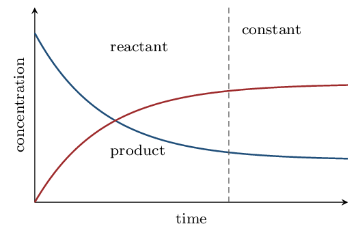

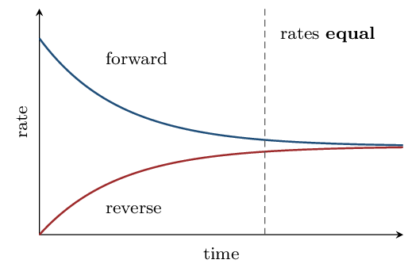

> ⚠️ **AP trap**
>
> **Equal rates, not equal concentrations.** At equilibrium there is
> no requirement whatever that $[\text{reactant}] = [\text{product}]$ —
> usually they are wildly different. What is equal is the *rate* at
> which each side is being consumed and re-formed. Writing “the
> concentrations become equal” is the classic wrong answer here.

> 📘 **I do: what is and is not true at equilibrium**
>
> **Sort these statements about a system at equilibrium.**
> 
> **“The forward and reverse reactions have stopped.”**
> **False**, and it is the error the whole chapter is built to
> prevent. Both reactions continue at full speed. Equilibrium is
> **dynamic**: label a few reactant molecules and you would find them
> turning into product and back again indefinitely.
> 
> **“The concentrations are constant.”** **True** — this is
> what you observe. Each species is being formed exactly as fast as it is
> consumed, so the net change is zero.
> 
> **“The concentrations are equal.”** **False.** Nothing
> requires that, and for most reactions they differ by orders of
> magnitude.
> 
> **“The amounts of reactant and product no longer change.”**
> **True**, and it is just the second statement restated.
> 
> **How you would know experimentally.** Equilibrium can be
> approached from *either* direction — start with pure reactants
> or with pure products and, at the same temperature, you arrive at the
> same equilibrium mixture. That two-way approach is the strongest
> evidence that the system is genuinely at equilibrium rather than simply
> having run out of something.

> ✏️ **YOUR TURN 1 — four questions**
>
> 1. True or false: at equilibrium the forward reaction stops.
>    Explain.
>    *(working space)*
> 2. True or false: at equilibrium $[\text{reactant}] =         [\text{product}]$. Explain. 
>    *(working space)*
> 3. What quantity is equal at equilibrium? 
>    *(working space)*
> 4. What would you observe that tells you equilibrium has been
>    reached?
>    *(working space)*
> 
> > **check:** (a) false — both continue     (b) false — no such
> requirement     (c) the forward and reverse rates     (d)
> concentrations stop changing

## Ladder 2 • Writing the equilibrium
expression

`ZUM §13.2`

For $a\text{A} + b\text{B} \rightleftharpoons c\text{C} + d\text{D}$:

$$ K_{c} = \frac{[\text{C}]^{c}\,[\text{D}]^{d}}                 {[\text{A}]^{a}\,[\text{B}]^{b}} $$

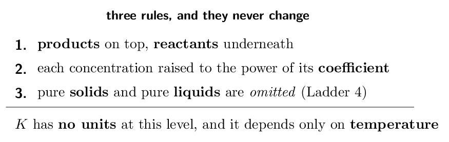

> 📘 **I do: three expressions**
>
> **(a) N₂(g) + 3H₂(g) ⇌ 2NH₃(g)**
> 
> $$ K_{c} = \frac{[\text{NH₃}]^{2}}{[\text{N₂}][\text{H₂}]^{3}} $$
> 
> The 3 on H₂ is an exponent, not a multiplier — $[\text{H₂}]^{3}$,
> never $3[\text{H₂}]$. That single confusion accounts for a startling share
> of lost marks.
> 
> **(b) 2SO₂(g) + O₂(g) ⇌ 2SO₃(g)**
> 
> $$ K_{c} = \frac{[\text{SO₃}]^{2}}{[\text{SO₂}]^{2}[\text{O₂}]} $$
> 
> **(c) H₂(g) + I₂(g) ⇌ 2HI(g)**
> 
> $$ K_{c} = \frac{[\text{HI}]^{2}}{[\text{H₂}][\text{I₂}]} $$
> 
> **What $K$ does and does not depend on.** It depends on the
> temperature and on nothing else. Changing concentrations, changing the
> pressure, or adding a catalyst does *not* change $K$ — those
> shift the position of equilibrium, which is a different thing entirely
> and is Ladders 11 and 12. Only a change in temperature changes the
> number itself.
> 
> **Why $K$ carries no units here.** Strictly it is built from
> activities, which are ratios and therefore dimensionless. At this level
> just report $K$ as a bare number — an answer with units attached is
> not what the CED expects.

> ✏️ **YOUR TURN 2 — four questions**
>
> Write the $K_{c}$ expression.
> 
> 1. PCl₅(g) ⇌ PCl₃(g) + Cl₂(g) 
>    *(working space)*
> 2. 2NO(g) + O₂(g) ⇌ 2NO₂(g) 
>    *(working space)*
> 3. 4NH₃(g) + 5O₂(g) ⇌ 4NO(g) + 6H₂O(g)
>    *(working space)*
> 4. Name the only variable that changes the value of $K$.
>    *(working space)*
> 
> > **check:** (a) $[\text{PCl₃}][\text{Cl₂}]/[\text{PCl₅}]$     (b)
> $[\text{NO₂}]^{2}/([\text{NO}]^{2}[\text{O₂}])$     (c)
> $[\text{NO}]^{4}[\text{H₂O}]^{6}/([\text{NH₃}]^{4}[\text{O₂}]^{5})$     (d)
> temperature

## Ladder 3 • $K_{p}$ and $K_{c}$

`ZUM §13.3`

For gases you may build $K$ out of partial pressures instead of
concentrations. The two are related through the change in the number of
moles of *gas*.

$$ K_{p} = K_{c}\,(RT)^{\Delta n}    \qquad    \Delta n = \big(\text{mol gas products}\big)             - \big(\text{mol gas reactants}\big) $$

with $R = 0.08206\;\mathrm{L\,atm\,mol^{-1}\,K^{-1}}$ and $T$ in
**kelvin**.

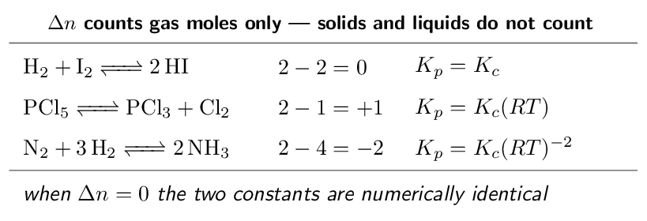

> 📌 **AP scope: know the difference, skip the conversion**
>
> The CED's topic 7.3 exclusion: *“Conversion between $K_{c}$ and
> $K_{p}$ will not be assessed on the AP Exam. Students should be aware
> of the conceptual differences and pay attention to whether $K_{c}$ or
> $K_{p}$ is used in an exam question.”* So what this ladder is really
> for: knowing the two constants exist, that they describe the same
> equilibrium in different currencies, and that they are numerically
> equal only when $\Delta n = 0$. The $(RT)^{\Delta n}$ conversion below
> is Zumdahl's, kept for completeness — an exam question will hand you
> whichever constant it wants you to use.

> 📘 **I do: converting between the two**
>
> **A gas-phase reaction has $K_{c} = 0.500$ at 400 K
> and $\Delta n = +1$. Find $K_{p}$.**
> 
> $$ K_{p} = K_{c}(RT)^{\Delta n}          = 0.500 \times (0.08206 \times 400)^{1} $$
> 
> $$ = 0.500 \times 32.82 = \mathbf{16.4} $$
> 
> **Check the direction of the change.** $\Delta n$ is positive, so
> $(RT)^{\Delta n}$ is a factor larger than 1 and $K_{p} > K_{c}$. If
> $\Delta n$ had been negative, $K_{p}$ would have come out smaller. A
> quick look at the sign tells you whether your answer should have grown
> or shrunk before you compute anything.
> 
> **The two things that go wrong here.** $T$ must be in
> **kelvin** — the equation is meaningless in celsius. And
> $\Delta n$ counts **gas moles only**: in
> CaCO₃(s) ⇌ CaO(s) + CO₂(g), $\Delta n = 1 - 0 = +1$, because
> neither solid contributes.
> 
> **When you can skip the conversion entirely.** If $\Delta n = 0$
> then $(RT)^{0} = 1$ and $K_{p} = K_{c}$ exactly. Count the gas moles on
> each side first — if they match, there is nothing to calculate.

> ✏️ **YOUR TURN 3 — four questions**
>
> 1. Find $\Delta n$ for 2SO₂(g) + O₂(g) ⇌ 2SO₃(g).
>    *(working space)*
> 2. For that reaction, is $K_{p}$ larger or smaller than $K_{c}$?
>    *(working space)*
> 3. Find $\Delta n$ for CaCO₃(s) ⇌ CaO(s) + CO₂(g).
>    *(working space)*
> 4. A reaction has $K_{c} = 2.0$ and $\Delta n = 0$. Give $K_{p}$.
>    *(working space)*
> 
> > **check:** (a) $-1$     (b) smaller     (c) $+1$     (d) 2.0

## Ladder 4 • Heterogeneous equilibria

`ZUM §13.4`

Pure solids and pure liquids are left out of the equilibrium
expression. Not set to zero — *left out*.

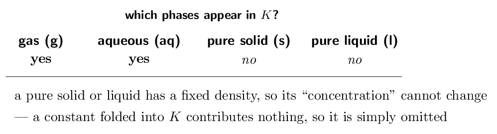

> 📘 **I do: why a solid drops out**
>
> **For CaCO₃(s) ⇌ CaO(s) + CO₂(g), the expression is
> just**
> 
> $$ K_{c} = [\text{CO₂}]    \qquad\text{and}\qquad    K_{p} = P_{\text{CO₂}} $$
> 
> **Why the solids vanish.** The “concentration” of a pure solid
> is its density divided by its molar mass — a fixed property of the
> substance. Adding more CaCO₃ gives you a bigger lump, not a more
> concentrated one. Since the quantity never changes, it is a constant;
> constants get absorbed into $K$, and what is left is the expression
> above.
> 
> **The consequence students find surprising.** Adding more solid
> CaCO₃ to this system does **nothing** — it does not shift
> the equilibrium and does not change the CO₂ pressure. Nor does
> removing some, as long as *some* remains. What matters is that the
> solid is present at all; how much is irrelevant.
> 
> **But do not confuse pure liquids with solutions.** Water as a pure
> liquid solvent is omitted. Water as a *gas* is included. And a
> dissolved species is always included, however dilute — “(aq)” means
> it counts.
> 
> **A second example to fix the pattern:**
> Fe₃O₄(s) + 4H₂(g) ⇌ 3Fe(s) + 4H₂O(g) gives
> 
> $$ K_{c} = \frac{[\text{H₂O}]^{4}}{[\text{H₂}]^{4}} $$
> 
> Both solids are gone; only the two gases survive.

> ✏️ **YOUR TURN 4 — four questions**
>
> Write the $K_{c}$ expression.
> 
> 1. 2NaHCO₃(s) ⇌ Na₂CO₃(s) + CO₂(g) + H₂O(g)
>    *(working space)*
> 2. C(s) + CO₂(g) ⇌ 2CO(g) 
>    *(working space)*
> 3. AgCl(s) ⇌ Ag+(aq) + Cl-(aq) 
>    *(working space)*
> 4. Does adding more solid to a heterogeneous equilibrium shift it?
>    Explain.
>    *(working space)*
> 
> > **check:** (a) $[\text{CO₂}][\text{H₂O}]$     (b)
> $[\text{CO}]^{2}/[\text{CO₂}]$     (c) $[\text{Ag+}][\text{Cl-}]$     (d)
> no — its concentration is fixed

## Ladder 5 • What the size of $K$ tells you

`ZUM §13.5`

$K$ is a statement about *where* the equilibrium sits — how far
the reaction goes before it balances.

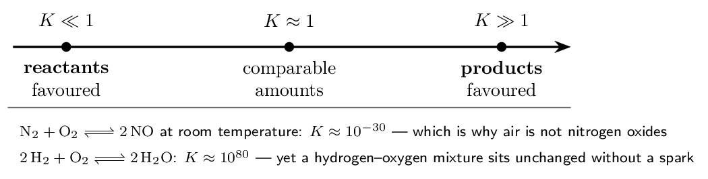

> ⚠️ **AP trap**
>
> **$K$ says nothing about speed.** A reaction with $K = 10^{80}$ can
> be immeasurably slow, and hydrogen and oxygen sitting together in a
> flask are the standard demonstration: enormously product-favoured, and
> nothing happens for years without a spark. $K$ is thermodynamics —
> *how far*. Chapter 12 was kinetics — *how fast*. Confusing
> them is the commonest conceptual error across Units 5 and 7 together.

> 📘 **I do: reading three values of $K$**
>
> **H₂ + I₂ ⇌ 2HI has $K_{c} = 54.3$ at
> 698 K.** Greater than 1, so products are favoured — but
> only modestly. A value of 54 means a substantial amount of H₂ and
> I₂ is still present at equilibrium. This is a genuinely
> *reversible* reaction in the everyday sense.
> 
> **N₂ + O₂ ⇌ 2NO has $K \approx 10^{-30}$ at room
> temperature.** Overwhelmingly reactant-favoured. The air you are
> breathing is roughly 78% N₂ and 21% O₂, and the equilibrium
> amount of NO is negligible. Raise the temperature to that of a car
> engine, however, and $K$ climbs — which is exactly why internal
> combustion produces NOx pollution.
> 
> **2H₂ + O₂ ⇌ 2H₂O has $K \approx 10^{80}$.** So
> product-favoured that for practical purposes the reaction goes to
> completion — yet it needs a spark, because its activation energy is
> large. Thermodynamically inevitable, kinetically stalled.
> 
> **The rule of thumb worth carrying.** $K > 10^{3}$: treat as
> essentially complete. $K  Between those, both sides are present in meaningful amounts and you
> will need an ICE table (Ladder 9) to say anything quantitative.

> ✏️ **YOUR TURN 5 — four questions**
>
> 1. A reaction has $K = 2e-8$. Which side is favoured?
>    *(working space)*
> 2. A reaction has $K = 4e6$. Which side is favoured?
>    *(working space)*
> 3. Does a large $K$ mean the reaction is fast? Explain.
>    *(working space)*
> 4. Reaction A has $K = 10$ and reaction B has $K = 1000$. Which
>    proceeds further toward products?
>    *(working space)*
> 
> > **check:** (a) reactants     (b) products     (c) no — $K$ is not
> about rate     (d) B

## Ladder 6 • The reaction quotient $Q$

`ZUM §13.5`

$Q$ is calculated exactly like $K$ — same expression — but from
*whatever concentrations you happen to have*, equilibrium or not.
Comparing $Q$ with $K$ tells you which way the reaction must go.

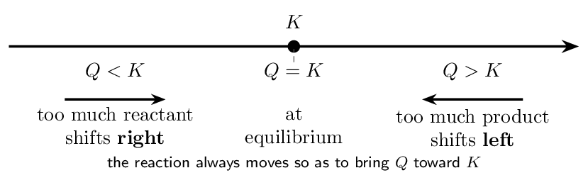

> 📘 **I do: predicting the direction**
>
> **For H₂ + I₂ ⇌ 2HI, $K_{c} = 54.3$. A flask contains
> $[\text{H₂}] = [\text{I₂}] = [\text{HI}] = 0.100\,\mathrm{M}$. Which way
> does the reaction go?**
> 
> **Build $Q$ with exactly the expression you would use for $K$:**
> 
> $$ Q = \frac{[\text{HI}]^{2}}{[\text{H₂}][\text{I₂}]}      = \frac{(0.100)^{2}}{(0.100)(0.100)}      = \frac{0.0100}{0.0100} = 1.00 $$
> 
> **Compare.** $Q = 1.00$ and $K = 54.3$, so $Q  
> **Interpret.** There is too little product relative to
> equilibrium, so the reaction runs **forward** — HI is
> produced and H₂ and I₂ are consumed — until $Q$ climbs to
> 54.3.
> 
> **The mental model that makes this automatic.** $Q$ has the
> products on top. If $Q$ is too *small*, the top is too small, so
> the reaction makes more product — it goes right. If $Q$ is too
> *large*, the top is too big, so it consumes product — it goes
> left. You never need to memorise a rule; you just read the fraction.
> 
> **And note what $Q$ is for.** It answers “which way?” before you
> do any hard work. If a question hands you a set of concentrations and
> asks for the direction of change, computing $Q$ is the whole answer —
> no ICE table required.

> ✏️ **YOUR TURN 6 — four questions**
>
> For A ⇌ B with $K = 4.0$:
> 
> 1. $[\text{A}] = 1.0\,\mathrm{M}$, $[\text{B}] = 1.0\,\mathrm{M}$.
>    Find $Q$ and the direction.
>    *(working space)*
> 2. $[\text{A}] = 0.10\,\mathrm{M}$, $[\text{B}] = 0.80\,\mathrm{M}$.
>    Find $Q$ and the direction.
>    *(working space)*
> 3. $[\text{A}] = 0.50\,\mathrm{M}$, $[\text{B}] = 2.0\,\mathrm{M}$.
>    Find $Q$ and the direction.
>    *(working space)*
> 4. In one sentence, what does $Q$ tell you that $K$ cannot?
>    *(working space)*
> 
> > **check:** (a) $Q = 1.0$, right     (b) $Q = 8.0$, left     (c)
> $Q = 4.0$, at equilibrium     (d) which way a particular mixture must
> move

## Ladder 7 • Manipulating $K$

`ZUM §13.2`

Rewrite an equation and $K$ changes in a predictable way. Three
operations cover everything the exam asks.

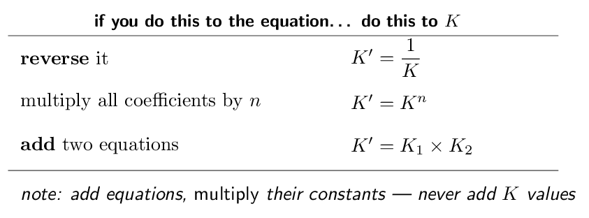

> 📘 **I do: one $K$, four questions**
>
> **For A ⇌ B, $K = 4.0$. Find $K$ for each rewriting.**
> 
> **(a) B ⇌ A.** Reversed, so take the reciprocal:
> 
> $$ K' = \frac{1}{4.0} = \mathbf{0.25} $$
> 
> **(b) 2A ⇌ 2B.** Coefficients doubled, so square:
> 
> $$ K' = (4.0)^{2} = \mathbf{16} $$
> 
> **(c) 2B ⇌ 2A.** Both operations — reverse
> *and* double:
> 
> $$ K' = \left(\frac{1}{4.0}\right)^{2} = \mathbf{0.0625} $$
> 
> Order does not matter; you may square then invert, or invert then
> square, and get the same number.
> 
> **(d) Why reversing inverts.** Look at the expression.
> For A ⇌ B, $K = [\text{B}]/[\text{A}]$. For B ⇌ A, the
> products and reactants swap, so $K' = [\text{A}]/[\text{B}]$ — the same
> fraction upside down. And doubling the coefficients squares every
> concentration in the expression, so the whole fraction is squared. Both
> rules fall straight out of the definition; there is nothing extra to
> remember.
> 
> **Adding equations.** If A ⇌ B has $K_{1}$ and
> B ⇌ C has $K_{2}$, then A ⇌ C has
> $K = K_{1}K_{2}$, because
> 
> $$ \frac{[\text{B}]}{[\text{A}]} \times \frac{[\text{C}]}{[\text{B}]}    = \frac{[\text{C}]}{[\text{A}]} $$
> 
> — the intermediate cancels, exactly as it does in a Hess's law
> calculation. Same bookkeeping, multiplication instead of addition.

> ✏️ **YOUR TURN 7 — four questions**
>
> For X ⇌ Y, $K = 9.0$.
> 
> 1. Find $K$ for Y ⇌ X. 
>    *(working space)*
> 2. Find $K$ for 3X ⇌ 3Y. 
>    *(working space)*
> 3. X ⇌ Y has $K = 9.0$ and Y ⇌ Z has $K = 2.0$.
>    Find $K$ for X ⇌ Z.
>    *(working space)*
> 4. Why do you multiply rather than add the constants when adding
>    two equations?
>    *(working space)*
> 
> > **check:** (a) 0.11     (b) 729     (c) 18     (d) the
> expressions multiply and the intermediate cancels

## Ladder 8 • Finding $K$ from equilibrium
concentrations

`ZUM §13.2`

The easiest calculation in the chapter, and worth being fast at: you
are handed equilibrium values and simply substitute.

> 📘 **I do: substitute and check**
>
> **For H₂(g) + I₂(g) ⇌ 2HI(g) a flask at equilibrium
> contains $[\text{H₂}] = 0.0075\,\mathrm{M}$, $[\text{I₂}] = 0.0075\,\mathrm{M}$ and $[\text{HI}] = 0.055\,\mathrm{M}$. Find
> $K_{c}$.**
> 
> **Write the expression first, always.**
> 
> $$ K_{c} = \frac{[\text{HI}]^{2}}{[\text{H₂}][\text{I₂}]} $$
> 
> **Substitute.**
> 
> $$ K_{c} = \frac{(0.055)^{2}}{(0.0075)(0.0075)}          = \frac{3.025e-3}{5.625e-5}          = \mathbf{54} $$
> 
> **Is the answer sensible?** $K > 1$, so products are favoured —
> consistent with the fact that $[\text{HI}]$ is far larger than either
> reactant. If you had got a number less than 1 from these figures, you
> would have inverted the fraction.
> 
> **The one condition that must hold.** Every value you substitute
> must be an **equilibrium** concentration. If a question gives you
> *initial* concentrations, you cannot substitute them — you must
> first work out the equilibrium values, which is what the ICE table of
> Ladder 9 exists to do. Reading “initial” as “equilibrium” is the
> most expensive misreading in this chapter.
> 
> **A cross-check worth knowing:** the accepted value for this
> reaction at 698 K is $K_{c} = 54.3$, so our 54 is right.

> ✏️ **YOUR TURN 8 — four questions**
>
> 1. For A ⇌ B, equilibrium gives $[\text{A}] =         0.20\,\mathrm{M}$ and $[\text{B}] = 0.60\,\mathrm{M}$. Find
>    $K$.
>    *(working space)*
> 2. For 2A ⇌ B, equilibrium gives $[\text{A}] =         0.10\,\mathrm{M}$ and $[\text{B}] = 0.50\,\mathrm{M}$. Find
>    $K$.
>    *(working space)*
> 3. For N₂ + 3H₂ ⇌ 2NH₃, equilibrium gives $[\text{N₂}] =         0.10\,\mathrm{M}$, $[\text{H₂}] = 0.20\,\mathrm{M}$,
>    $[\text{NH₃}] = 0.40\,\mathrm{M}$. Find $K_{c}$.
>    *(working space)*
> 4. Why may you not substitute *initial* concentrations into
>    $K$?
>    *(working space)*
> 
> > **check:** (a) 3.0     (b) 50     (c) 200     (d) $K$ is defined
> only at equilibrium

## Ladder 9 • ICE tables

`ZUM §13.6`

When you are given *initial* concentrations and $K$, and asked for
the equilibrium ones, you need an ICE table — Initial, Change,
Equilibrium.

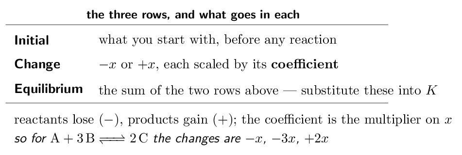

> 📘 **I do: a full ICE calculation**
>
> **For H₂ + I₂ ⇌ 2HI, $K_{c} = 54.3$. A flask starts with
> 1.00 M each of H₂ and I₂ and no HI. Find all
> three equilibrium concentrations.**
> 
> **Build the table.** H₂ and I₂ each lose $x$; HI
> gains $2x$, because its coefficient is 2.
> 
> |  | $[\text{H₂}]$ | $[\text{I₂}]$ | $[\text{HI}]$ |
> |---|---|---|---|
> | **I** | 1.00 | 1.00 | 0 |
> | **C** | $-x$ | $-x$ | $+2x$ |
> | **E** | $1.00-x$ | $1.00-x$ | $2x$ |

**Substitute the E row into $K$.**

$$ 54.3 = \frac{(2x)^{2}}{(1.00-x)(1.00-x)}         = \frac{4x^{2}}{(1.00-x)^{2}} $$

**Take the square root of both sides** — legitimate here because
both sides are perfect squares, and far quicker than the quadratic
formula:

$$ \sqrt{54.3} = \frac{2x}{1.00-x}    \qquad\Longrightarrow\qquad    7.369 = \frac{2x}{1.00-x} $$

**Solve.**

$$ 7.369(1.00-x) = 2x    \;\Longrightarrow\;    7.369 = 9.369x    \;\Longrightarrow\;    x = 0.787 $$

**Read off the answers.**

$$ [\text{H₂}] = [\text{I₂}] = 1.00 - 0.787 = 0.213\,\mathrm{M}    \qquad    [\text{HI}] = 2(0.787) = 1.57\,\mathrm{M} $$

**Always check by substituting back:**

$$ \frac{(1.57)^{2}}{(0.213)^{2}} = 54.3 \quad\checkmark $$

That check costs one line and catches every algebra slip. And note that
$x$ came out large — 79% of the starting material reacted — which
is what a $K$ of 54 should do. Do not be alarmed by a large $x$ when $K$
is large.

> ✏️ **YOUR TURN 9 — four questions**
>
> 1. For A + B ⇌ 2C, give the Change row in terms of $x$.
>    *(working space)*
> 2. For N₂ + 3H₂ ⇌ 2NH₃, give the Change row.
>    *(working space)*
> 3. A ⇌ B has $K = 3.0$ and starts at $[\text{A}] =         1.00\,\mathrm{M}$, $[\text{B}] = 0$. Find $x$ and both
>    equilibrium concentrations.
>    *(working space)*
> 4. Why must you substitute the **E** row, not the
>    **I** row, into $K$?
>    *(working space)*
> 
> > **check:** (a) $-x$, $-x$, $+2x$     (b) $-x$, $-3x$, $+2x$    
> (c) $x = 0.75$; 0.25  and 0.75 M     (d) $K$ is
> defined at equilibrium

## Ladder 10 • The small-$x$ approximation

`ZUM §13.6`

When $K$ is very small, barely any reaction occurs, and the algebra
simplifies enormously — provided you check that you were entitled to
simplify it.

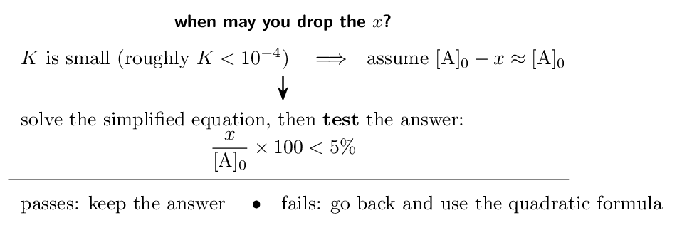

> 📘 **I do: approximate, then justify**
>
> **For A ⇌ B + C, $K = 1.0e-5$ and $[\text{A}]_{0} = 0.100\,\mathrm{M}$. Find the equilibrium concentrations.**
> 
> **The ICE row is** $0.100-x$, $x$, $x$, so
> 
> $$ K = \frac{x^{2}}{0.100-x} = 1.0e-5 $$
> 
> which is a quadratic — solvable, but tedious.
> 
> **Make the approximation.** $K$ is tiny, so almost no A
> reacts and $x$ must be very small compared with 0.100. Drop it from the
> denominator:
> 
> $$ \frac{x^{2}}{0.100} \approx 1.0e-5    \;\Longrightarrow\;    x^{2} = 1.0e-6    \;\Longrightarrow\;    x = 1.0e-3 $$
> 
> **Now justify it — this step is not optional.**
> 
> $$ \frac{1.0e-3}{0.100} \times 100 = 1.0\% $$
> 
> That is comfortably under 5%, so the approximation was valid and the
> answer stands.
> 
> $$ [\text{A}] = 0.099\,\mathrm{M}    \qquad    [\text{B}] = [\text{C}] = 1.0e-3\,\mathrm{M} $$
> 
> **How good was it, really?** Solving the full quadratic gives
> $x = 9.95e-4$ against our 1.0e-3 — an error of about
> 0.5%, far smaller than the precision of the data. The shortcut cost
> nothing.
> 
> **And when it fails.** If the 5% test comes out at, say, 12%,
> the approximation is not merely imprecise, it is wrong, and you must
> return to the quadratic. Examiners award the mark for *performing
> the check*, so show it even when it obviously passes.

> ✏️ **YOUR TURN 10 — four questions**
>
> 1. For A ⇌ B + C with $K = 4.0e-6$ and
>    $[\text{A}]_{0} = 1.00\,\mathrm{M}$, find $x$ using the
>    approximation.
>    *(working space)*
> 2. Test that approximation with the 5% rule.
>    *(working space)*
> 3. If the test gives 9%, what must you do?
>    *(working space)*
> 4. Why is the approximation safe when $K$ is very small?
>    *(working space)*
> 
> > **check:** (a) $x = 2.0e-3$     (b) 0.20% — valid     (c)
> solve the quadratic     (d) barely any reactant is consumed

## Ladder 11 • Le Ch\^atelier:
concentration and pressure

`ZUM §13.7`

Disturb a system at equilibrium and it shifts so as to *partly
counteract* the disturbance. Note “partly” — it never fully undoes
what you did.

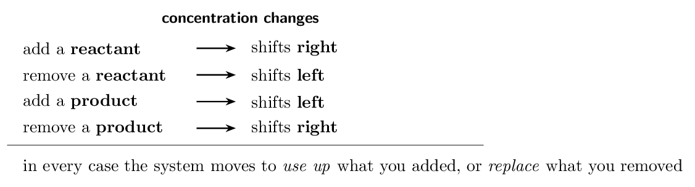

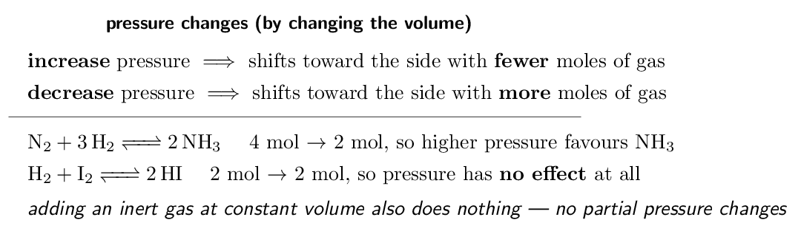

> 📘 **I do: four disturbances, one reaction**
>
> **For N₂(g) + 3H₂(g) ⇌ 2NH₃(g), predict the effect of
> each change.**
> 
> **(a) Add N₂.** $Q$ falls below $K$ (the denominator grew), so
> the system shifts **right**, consuming some of the added N₂
> and making more NH₃.
> 
> **(b) Remove NH₃ as it forms.** $Q$ falls below $K$ again, so
> the system shifts **right** to replace it. This is why industrial
> plants condense ammonia out continuously — it drives the reaction
> forward indefinitely.
> 
> **(c) Compress the vessel to half its volume.** All partial
> pressures double, so the system shifts toward **fewer moles of
> gas**. The left side has $1 + 3 = 4$; the right has 2. It shifts
> **right**.
> 
> **(d) Add argon at constant volume.** **No shift.** The total
> pressure rises, but the partial pressures of N₂, H₂ and
> NH₃ are unchanged — none of them is in a smaller volume than
> before, and argon appears nowhere in $Q$. This is the disturbance
> students most often get wrong.
> 
> **The rigorous way to answer any of these.** Do not reason from a
> slogan; compute what happened to $Q$. If the change made $Q  K$, left; if $Q$ is untouched, nothing
> happens. Le Ch\^atelier's principle is a shortcut for that comparison,
> and when the shortcut feels ambiguous, $Q$ never is.
> 
> **And note what did *not* happen in any of (a)–(d):** $K$
> never changed. Only temperature does that — Ladder 12.

> ✏️ **YOUR TURN 11 — four questions**
>
> For 2SO₂(g) + O₂(g) ⇌ 2SO₃(g):
> 
> 1. Which way does it shift if O₂ is added?
>    *(working space)*
> 2. Which way does it shift if SO₃ is removed?
>    *(working space)*
> 3. Which way does it shift if the volume is decreased?
>    *(working space)*
> 4. Which way does it shift if helium is added at constant volume?
>    Explain.
>    *(working space)*
> 
> > **check:** (a) right     (b) right     (c) right — 3 mol to
> 2 mol     (d) no shift

## Ladder 12 • Le Ch\^atelier:
temperature and catalysts

`ZUM §13.7`

Temperature is different in kind from every other disturbance: it is the
only one that changes the value of $K$ itself.

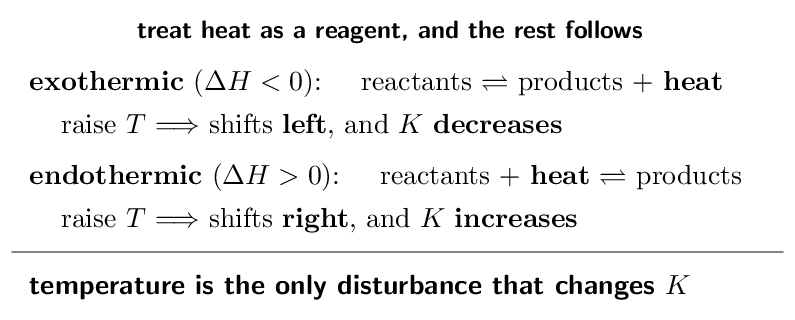

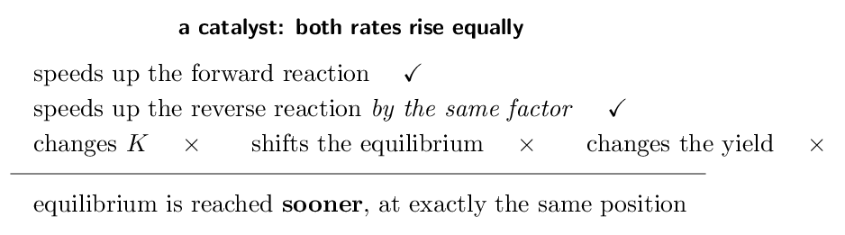

> 📘 **I do: the Haber process, where it all collides**
>
> **N₂(g) + 3H₂(g) ⇌ 2NH₃(g), $\Delta H = -92\,\mathrm{kJ/mol}$. What conditions maximise the yield of
> ammonia, and what does industry actually use?**
> 
> **Pressure.** Four moles of gas become two, so **high
> pressure** shifts the equilibrium toward ammonia. Industry uses roughly
> 200 atm — limited by what the vessels can withstand rather
> than by chemistry.
> 
> **Temperature.** The reaction is exothermic, so heat is a product
> and **low temperature** shifts toward ammonia and raises $K$. But
> here chemistry and reality collide: at low temperature the reaction is
> far too slow to be useful. Thermodynamics wants it cold; kinetics needs
> it hot.
> 
> **The compromise.** Industry runs at about
> 450 °C — hot enough to be fast, cool enough that the
> yield is not ruinous — and adds an **iron catalyst**, which
> raises the rate without touching the equilibrium position at all.
> Ammonia is then condensed out continuously, which by Ladder 11 keeps
> pulling the reaction to the right.
> 
> **This is the exam question in disguise.** “Why not just use a low
> temperature, since the reaction is exothermic?” The answer is that
> $K$ and rate pull in opposite directions, and a working plant must
> satisfy both. Notice how many chapters are in play at once: equilibrium
> position (13.7), the size of $K$ (13.5), reaction rate and catalysis
> (Chapter 12), and $\Delta H$ (Chapter 6).
> 
> **One caution.** The catalyst is there for rate alone. Writing that
> it “increases the yield” is wrong and is specifically penalised.

> ✏️ **YOUR TURN 12 — four questions**
>
> 1. An endothermic reaction is heated. Which way does it shift, and
>    what happens to $K$?
>    *(working space)*
> 2. An exothermic reaction is cooled. Which way does it shift?
>    *(working space)*
> 3. Does a catalyst change $K$? Explain. 
>    *(working space)*
> 4. Name the only disturbance that changes the value of $K$.
>    *(working space)*
> 
> > **check:** (a) right; $K$ increases     (b) right     (c) no —
> both rates rise equally     (d) temperature

## Mastery tracker

Tick a row only if **all four** YOUR TURN questions were right on
the first attempt. Every row is assessed except the $K_{p}$/$K_{c}$
*conversion* inside Ladder 3 (see its scope note) — knowing the
two constants differ is required; converting between them is not.

| **First try?** | **Skill** | **Ladder** | **If not, re-read…** |
|---|---|---|---|
| $\square$ | the equilibrium condition | 1 | dynamic, not stopped |
| $\square$ | writing $K$ expressions | 2 | products over reactants |
| $\square$ | $K_{p}$ and $K_{c}$ | 3 | $\Delta n$ counts gas only |
| $\square$ | heterogeneous equilibria | 4 | solids and liquids drop out |
| $\square$ | the magnitude of $K$ | 5 | extent, never rate |
| $\square$ | the reaction quotient $Q$ | 6 | compare $Q$ with $K$ |
| $\square$ | manipulating $K$ | 7 | reverse, power, multiply |
| $\square$ | $K$ from concentrations | 8 | must be equilibrium values |
| $\square$ | ICE tables | 9 | scale $x$ by the coefficient |
| $\square$ | the small-$x$ approximation | 10 | always run the 5% test |
| $\square$ | shifts: concentration, pressure | 11 | count moles of gas |
| $\square$ | shifts: temperature, catalyst | 12 | only $T$ changes $K$ |

> 📌 **Scoring yourself honestly**
>
> 12/12: you have Unit 7 — and, more importantly, you have the
> machinery Unit 8 is built from. Weak acids, buffers and titration curves
> are all this chapter applied to one reaction.
> 
> 9–11: check where the misses sit. Ladders 1–8 are definitions and
> substitution, and they repair quickly. Ladders 9–10 are the ICE
> machinery, and a miss there must be fixed *now* rather than later
> — Unit 8 assumes it cold, and you will be building these tables under
> time pressure with weak-acid numbers that are far less friendly.
> 
> 8 or fewer: the likeliest single cause is confusing $Q$ with $K$, or
> substituting initial concentrations where equilibrium ones belong.
> Re-read Ladders 6 and 8 together, then redo Ladder 9. Everything after
> that depends on those three being automatic.

---

*AP Chemistry course materials • student edition • CC BY-NC-SA 4.0*
