# Self-Study • Chapter 14, I do / You do

*Chapter 14 • Acids and Bases*  
Zumdahl §14.1–14.11 • PDF pp. 697–740

[← all lessons](../index.md)

---

> 📌 **How to use these notes — read this first**
>
> Each skill is a **ladder**: a fully worked example in the
> solid-framed box, then **four** YOUR TURN questions in the dashed
> box — same skill, new numbers, no help. Work all four before checking
> the gray *check:* line; a tracker tick needs all four right first
> time. After Ladder 16 there is a **mixed set** of twelve further
> questions that do not tell you which ladder they came from.
> 
> **This is the longest document in the series, on purpose.** Unit 8
> is **11–15%** of the exam, second only to Unit 3, and this
> chapter is most of it. Sixteen ladders, 76 questions.
> 
> **What you must bring with you.** Chapter 13. A weak acid problem
> *is* an equilibrium problem — same ICE table, same small-$x$
> approximation, same 5% check. If Ladders 9–10 of Chapter 13 are not
> automatic, stop and go back; nothing here will stick otherwise.
> 
> **The one habit that decides this chapter.** Before any
> calculation, ask: **is it strong or weak?** Strong means it comes
> apart completely and the arithmetic is one line. Weak means an
> equilibrium and an ICE table. Answering that question first prevents
> most of the errors this chapter can produce.
> 
> **Not covered here.** Buffers and titration curves (CED 8.4–8.5)
> are Chapter 15. Do not go looking for them.

## Ladder 1 • Three definitions

`ZUM §14.1, 14.11`

Three models, each broader than the last. Each is useful; none is wrong.

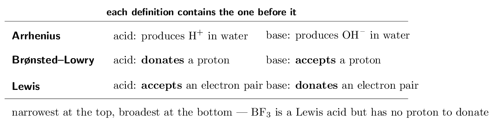

> 📘 **I do: classifying under each model**
>
> **Which model do you need for each of these?**
> 
> **HCl(aq) → H+(aq) + Cl-(aq).** Arrhenius is enough:
> HCl produces H+ in water. It is also Brønsted–Lowry (it
> donates a proton) and Lewis. All three agree.
> 
> **NH₃(aq) + H₂O(l) ⇌ NH₄+(aq) + OH-(aq).** NH₃
> contains no OH- at all, so Arrhenius cannot call it a base. But it
> *accepts* a proton from water, so Brønsted–Lowry can. This is
> exactly why the broader definition was needed.
> 
> **BF₃ + NH₃ → F₃B-NH₃.** No proton moves anywhere, so
> Brønsted–Lowry has nothing to say. NH₃ donates its lone pair and
> BF₃, which is electron-deficient at boron, accepts it. Only the
> Lewis model covers this.
> 
> **The relationship to keep straight.** Every Brønsted acid is a
> Lewis acid, but not every Lewis acid is a Brønsted acid. The models
> nest; the later ones do not replace the earlier ones.
> 
> **For the exam.** Brønsted–Lowry is the *only* model
> assessed — the CED's topic 4.8 exclusion says outright that
> *“Lewis acid–base concepts will not be assessed on the AP
> Exam”*, and Arrhenius appears only as history. The Lewis model stays
> in this ladder because Zumdahl teaches it and it is the only way to
> understand species like BF₃ and hydrated metal cations — but if
> you are triaging, Brønsted–Lowry is the definition to own.

> ✏️ **YOUR TURN 1 — four questions**
>
> 1. Define a Brønsted–Lowry acid. 
>    *(working space)*
> 2. Define a Lewis base. 
>    *(working space)*
> 3. Why can Arrhenius not classify NH₃ as a base?
>    *(working space)*
> 4. Is every Lewis acid a Brønsted acid? Give an example to
>    support your answer.
>    *(working space)*
> 
> > **check:** (a) proton donor     (b) electron-pair donor     (c) it
> contains no OH-     (d) no — BF₃

## Ladder 2 • Conjugate acid–base pairs

`ZUM §14.1`

Every Brønsted reaction moves one proton, and that creates
**two** pairs. A conjugate pair differs by exactly one H+.

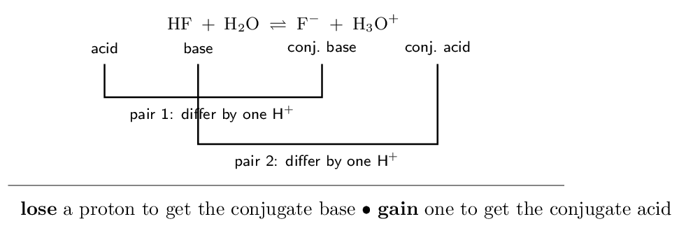

> ⚠️ **AP trap**
>
> **A conjugate pair differs by *one* proton — and by one
> unit of charge.** H₂SO₄ and SO₄²⁻ are **not** a
> conjugate pair: they differ by two protons. The conjugate base of
> H₂SO₄ is HSO₄-. Check the charge as well as the hydrogen
> count and you will not get this wrong.

> 📘 **I do: finding conjugates**
>
> **Rule: to get a conjugate *base*, remove one H+
> (charge goes down by one). To get a conjugate *acid*, add one
> H+ (charge goes up by one).**
> 
> **Conjugate base of HNO₃:** remove H+ from HNO₃
> (charge 0) to get NO₃- (charge $-1$). ✓
> 
> **Conjugate acid of NH₃:** add H+ to NH₃ (charge 0)
> to get NH₄+ (charge $+1$). ✓
> 
> **Conjugate base of H₂PO₄⁻:** remove H+ from charge
> $-1$ to get HPO₄²⁻, charge $-2$. ✓
> 
> **Now the interesting one — HCO₃-.** Its conjugate base is
> CO₃²⁻ and its conjugate acid is H₂CO₃. A species that can do
> both is **amphoteric**, and water is the most important example:
> H₂O has conjugate base OH- and conjugate acid H₃O+.
> 
> **The pattern worth internalising.** Strong acid, weak conjugate
> base. HCl is a strong acid, so Cl- is such a weak base that it
> does nothing in water. Weak acid, appreciable conjugate base: acetic
> acid is weak, so acetate is a genuine base — which is exactly why
> sodium acetate solutions are basic (Ladder 14).

> ✏️ **YOUR TURN 2 — four questions**
>
> 1. Give the conjugate base of HCN. 
>    *(working space)*
> 2. Give the conjugate acid of HPO₄²⁻. 
>    *(working space)*
> 3. In HCl + H₂O → Cl- + H₃O+, name both conjugate pairs.
>    *(working space)*
> 4. Why are H₂SO₄ and SO₄²⁻ not a conjugate pair?
>    *(working space)*
> 
> > **check:** (a) CN-     (b) H₂PO₄⁻     (c) HCl/
> Cl- and H₂O/H₃O+     (d) they differ by two protons

## Ladder 3 • Strong versus weak

`ZUM §14.2`

“Strong” has one meaning only: it ionises **completely**. It has
nothing to do with concentration.

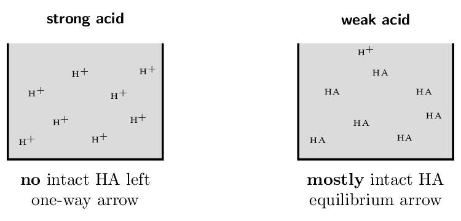

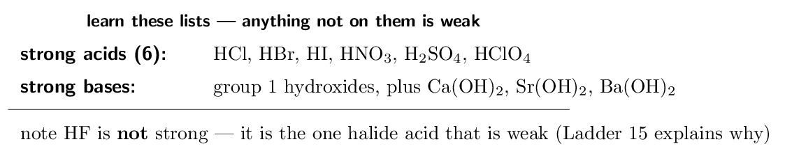

> ⚠️ **AP trap**
>
> **Strong is not the same as concentrated.** A
> 0.001 M HCl solution is *dilute* but the acid is
> *strong*; a 10 M acetic acid solution is
> *concentrated* but the acid is *weak*. Strong/weak describes
> the substance and how completely it ionises; dilute/concentrated
> describes how much of it you put in the water. The two words answer
> different questions.

> 📘 **I do: what “complete” actually buys you**
>
> **Compare 0.10 M HCl with 0.10 M
> CH₃COOH.**
> 
> **HCl is strong.** It ionises completely, so
> HCl → H+ + Cl-
> is written with a *one-way* arrow, and $[\text{H+}] = 0.10\,\mathrm{M}$ exactly. There is no equilibrium and no ICE table:
> whatever you put in, you get out as ions.
> 
> **Acetic acid is weak.** It reaches an equilibrium,
> CH₃COOH ⇌ H+ + CH₃COO-
> written with a *double* arrow, and only about 1% of it comes
> apart. $[\text{H+}]$ is around 1.3e-3 M — about
> seventy-five times smaller than for the HCl, at the same nominal
> concentration.
> 
> **So the arrow you draw is a claim.** A single arrow asserts
> complete ionisation; a double arrow asserts an equilibrium. Drawing the
> wrong one is a chemistry error, not a notation slip, and examiners treat
> it as such.
> 
> **And the practical consequence.** For a strong acid you can go
> straight to pH in one step (Ladder 6). For a weak acid you must build an
> ICE table and use $K_{a}$ (Ladder 9). Deciding strong-or-weak is
> therefore always your first move, before any arithmetic at all.

> ✏️ **YOUR TURN 3 — four questions**
>
> 1. Is HF a strong or a weak acid? 
>    *(working space)*
> 2. Which is more acidic: 0.10 M HCl or
>    0.10 M HF? Why?
>    *(working space)*
> 3. Explain the difference between “strong” and
>    “concentrated”.
>    *(working space)*
> 4. Which arrow, single or double, do you draw for
>    HNO₃ in water? Why?
>    *(working space)*
> 
> > **check:** (a) weak     (b) HCl — it ionises completely    
> (c) extent of ionisation vs amount dissolved     (d) single —
> HNO₃ is strong

## Ladder 4 • Water, $K_{w}$, and
autoionisation

`ZUM §14.2–14.3`

Water ionises slightly on its own, and that single equilibrium underlies
the entire pH scale.

$$ \text{2H₂O(l) ⇌ H₃O+(aq) + OH-(aq)}    \qquad    K_{w} = [\text{H+}][\text{OH-}] = 1.0e-14    \text{ at 25\,\mathrm{{}^\circ C}} $$

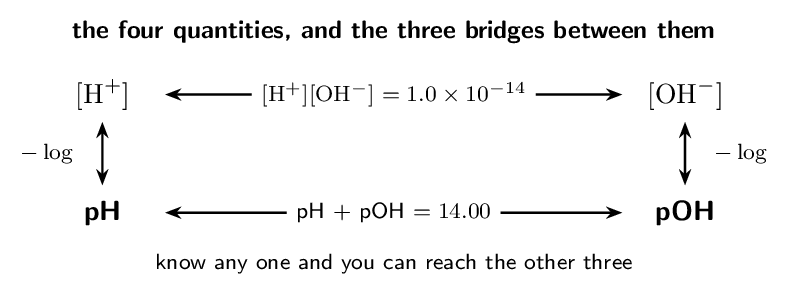

> ⚠️ **AP trap**
>
> **“pH 7 is neutral” is only true at 25 °C.** $K_{w}$
> grows with temperature, so at 50 °C neutral water has
> pH $\approx 6.6$ — and it is still *neutral*, because
> $[\text{H+}]$ still equals $[\text{OH-}]$. Neutral means the two are equal,
> not that pH is 7. Any question that gives you a temperature other than
> 25 °C is testing exactly this.

> 📘 **I do: moving around the wheel**
>
> **A solution has $[\text{H+}] = 2.0e-4\,\mathrm{M}$ at
> 25 °C. Find $[\text{OH-}]$, pH and pOH.**
> 
> **$[\text{OH-}]$ from $K_{w}$:**
> 
> $$ [\text{OH-}] = \frac{1.0e-14}{2.0e-4}    = 5.0e-11\,\mathrm{M} $$
> 
> **pH by definition:**
> 
> $$ \text{pH} = -\log(2.0e-4) = \mathbf{3.70} $$
> 
> **pOH two ways, and they must agree:**
> 
> $$ \text{pOH} = 14.00 - 3.70 = \mathbf{10.30}    \qquad\text{or}\qquad    -\log(5.0e-11) = 10.30 \quad\checkmark $$
> 
> **Is the answer sensible?** pH 3.70 is below 7, so the solution is
> acidic — consistent with $[\text{H+}]$ being far larger than
> $[\text{OH-}]$. That one-line check catches an inverted $K_{w}$ division,
> which is the usual slip here.
> 
> **Note about significant figures in logs.** Only the digits
> *after* the decimal point in a pH are significant; the part before
> it just records the power of ten. $[\text{H+}] = 2.0e-4$ has two
> significant figures, so the pH is written with **two decimal
> places**: 3.70. Writing “3.7” understates your precision and “3.6990”
> overstates it.

> ✏️ **YOUR TURN 4 — four questions**
>
> All at 25 °C.
> 
> 1. $[\text{H+}] = 1.0e-5\,\mathrm{M}$. Find $[\text{OH-}]$.
>    *(working space)*
> 2. $[\text{OH-}] = 1.0e-3\,\mathrm{M}$. Find $[\text{H+}]$ and pH.
>    *(working space)*
> 3. Pure water at 25 °C: give $[\text{H+}]$ and pH.
>    *(working space)*
> 4. At 50 °C neutral water has pH 6.6. Is it acidic?
>    Explain.
>    *(working space)*
> 
> > **check:** (a) 1.0e-9 M     (b) 1.0e-11 M,
> pH 11.00     (c) 1.0e-7 M, pH 7.00     (d) no — it is
> neutral

## Ladder 5 • The pH scale

`ZUM §14.3`

pH is a logarithm, so every whole unit is a **factor of ten** in
$[\text{H+}]$.

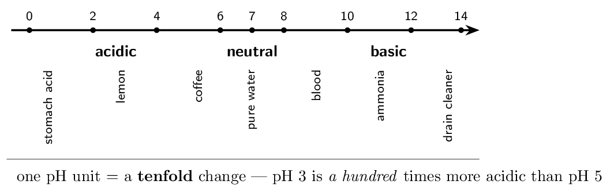

> 📘 **I do: what a difference of pH units means**
>
> **How much more acidic is a pH 2 solution than a pH 5 one?**
> 
> The difference is $5 - 2 = 3$ pH units, and each unit is a factor of
> ten:
> 
> $$ 10^{3} = \mathbf{1000 \text{ times}} $$
> 
> **Verify it directly.** pH 2 means $[\text{H+}] = 1e-2\,\mathrm{M}$; pH 5 means $[\text{H+}] = 1e-5\,\mathrm{M}$. The
> ratio is $10^{-2}/10^{-5} = 10^{3}$. Same answer, and this is the
> version to fall back on whenever the shortcut feels slippery.
> 
> **The direction that catches people.** *Lower* pH means
> *more* acidic, because of the minus sign in $\text{pH} = -\log[\text{H+}]$. Higher $[\text{H+}]$ gives lower pH. If your answer has a
> pH 5 solution more acidic than a pH 2 one, you dropped the sign.
> 
> **Going backwards, from pH to concentration.**
> 
> $$ [\text{H+}] = 10^{-\text{pH}} $$
> 
> So pH 3.70 gives $[\text{H+}] = 10^{-3.70} = 2.0e-4\,\mathrm{M}$ —
> which is exactly where Ladder 4's worked example started. The two
> operations are inverses, and being fluent in both directions is
> assumed from here on.
> 
> **Why the scale runs about 0 to 14.** It is not a hard boundary
> — concentrated strong acids genuinely have negative pH. The range
> simply reflects that $K_{w} = 10^{-14}$, so ordinary aqueous solutions
> land inside it.

> ✏️ **YOUR TURN 5 — four questions**
>
> 1. How many times more acidic is pH 3 than pH 6?
>    *(working space)*
> 2. A solution has pH 4.00. Find $[\text{H+}]$.
>    *(working space)*
> 3. A solution has pOH 3.00. Find its pH and say whether it is
>    acidic or basic.
>    *(working space)*
> 4. Which is more acidic, pH 2.5 or pH 4.5? By what factor?
>    *(working space)*
> 
> > **check:** (a) 1000     (b) 1.0e-4 M     (c) pH 11.00,
> basic     (d) pH 2.5, by 100

## Ladder 6 • pH of a strong acid

`ZUM §14.4`

The one-line calculation. Complete ionisation means $[\text{H+}]$ equals
the acid concentration, and you take a logarithm.

> 📘 **I do: two strong acids**
>
> **(a) Find the pH of 0.010 M HCl.**
> 
> HCl is strong, so ionisation is complete and one HCl gives one
> H+:
> 
> $$ [\text{H+}] = 0.010\,\mathrm{M}    \qquad    \text{pH} = -\log(0.010) = \mathbf{2.00} $$
> 
> **(b) Find the pH of 0.0025 M HNO₃.**
> 
> $$ [\text{H+}] = 0.0025\,\mathrm{M}    \qquad    \text{pH} = -\log(2.5e-3) = \mathbf{2.60} $$
> 
> **Check the sig figs.** 2.5e-3 has two significant figures,
> so the pH carries two decimal places: 2.60, not 2.6 and not 2.602.
> 
> **The trap in this ladder is H₂SO₄.** It is the one strong
> acid on the list that is diprotic, and only its *first* proton is
> strong — the second comes off a weak acid, HSO₄-
> ($K_{a2} = 1.2e-2$). So 0.010 M H₂SO₄ gives at
> least 0.010 M H+ from the first ionisation, and a bit
> more from the second. Unless a question tells you otherwise, treat only
> the first proton as complete and say so.
> 
> **And a boundary worth knowing.** For extremely dilute strong acid
> — below about 1e-7 M — water's own autoionisation
> contributes as much H+ as the acid does, and $\text{pH} = -\log(c)$ breaks down. A 1e-10 M HCl solution is not
> pH 10; it is very slightly below 7. Adding acid can never make water
> basic.

> ✏️ **YOUR TURN 6 — four questions**
>
> 1. Find the pH of 0.100 M HCl.
>    *(working space)*
> 2. Find the pH of 0.0010 M HBr.
>    *(working space)*
> 3. Find $[\text{H+}]$ in a strong acid solution of pH 1.50.
>    *(working space)*
> 4. Why can you not simply write $\text{pH} = -\log(c)$ for
>    1e-10 M HCl?
>    *(working space)*
> 
> > **check:** (a) 1.000     (b) 3.00     (c) 0.032 M    
> (d) water's own H+ dominates

## Ladder 7 • pH of a strong base

`ZUM §14.6`

Same idea, one extra step — and one place where the formula unit
matters.

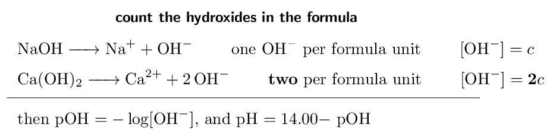

> 📘 **I do: the factor of two**
>
> **(a) Find the pH of 0.010 M NaOH.**
> 
> $$ [\text{OH-}] = 0.010\,\mathrm{M}    \;\Rightarrow\;    \text{pOH} = 2.00    \;\Rightarrow\;    \text{pH} = 14.00 - 2.00 = \mathbf{12.00} $$
> 
> **(b) Find the pH of 0.0050 M Ca(OH)₂.**
> 
> Each formula unit releases *two* hydroxides:
> 
> $$ [\text{OH-}] = 2 \times 0.0050 = 0.010\,\mathrm{M} $$
> 
> $$ \text{pOH} = 2.00    \;\Rightarrow\;    \text{pH} = \mathbf{12.00} $$
> 
> **Notice that (a) and (b) give the same pH** from different
> concentrations — 0.0050 M Ca(OH)₂ and
> 0.010 M NaOH are equally basic, because what matters is
> $[\text{OH-}]$, not the concentration written on the bottle. Forgetting
> the 2 would have given pOH 2.30 and pH 11.70, an error of 0.30 pH
> units.
> 
> **Where the factor does *not* apply.** It applies to strong
> bases because they dissociate completely. It does *not* apply to
> weak polyprotic acids, whose successive ionisations are separate
> equilibria of wildly different strengths (Ladder 13). Complete
> dissociation is what lets you simply multiply.
> 
> **One caution about Ca(OH)₂ in practice:** it is only
> sparingly soluble, so you cannot actually make a concentrated solution
> of it. The calculation is fine for the concentrations exam questions
> use.

> ✏️ **YOUR TURN 7 — four questions**
>
> 1. Find the pH of 0.100 M KOH.
>    *(working space)*
> 2. Find the pH of 0.0010 M Ba(OH)₂.
>    *(working space)*
> 3. Find $[\text{OH-}]$ in a solution of pH 13.00.
>    *(working space)*
> 4. Why does Ca(OH)₂ need a factor of 2 but NaOH does
>    not?
>    *(working space)*
> 
> > **check:** (a) 13.000     (b) 11.30     (c) 0.10 M    
> (d) two OH- per formula unit

## Ladder 8 • $K_{a}$ and what “weak”
measures

`ZUM §14.5`

$K_{a}$ is just an equilibrium constant, applied to one particular
reaction: an acid giving up its proton to water.

$$ \text{HA ⇌ H+ + A-}    \qquad    K_{a} = \frac{[\text{H+}][\text{A-}]}{[\text{HA}]} $$

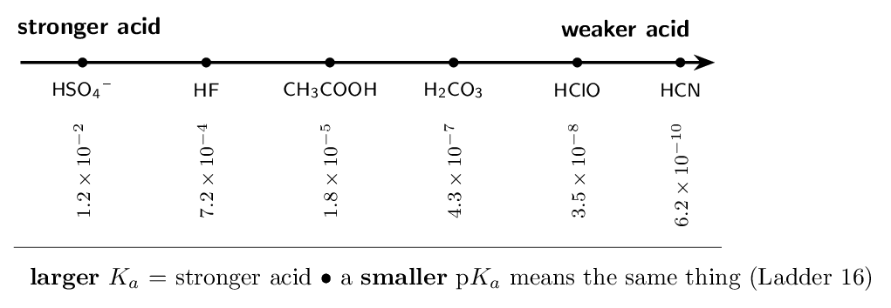

> 📘 **I do: reading $K_{a}$ values**
>
> **$K_{a}$ answers “how far does this acid ionise?” — exactly
> the question $K$ answered in Chapter 13, for one specific reaction.**
> 
> **Acetic acid, $K_{a} = 1.8e-5$.** Far below 1, so the
> equilibrium lies well to the left and the acid is mostly intact in
> solution. Weak.
> 
> **HF, $K_{a} = 7.2e-4$.** Also below 1, so also weak —
> but about forty times larger than acetic acid's, so HF is the
> stronger of the two. Compare $K_{a}$ values directly; the bigger number
> is the stronger acid, every time.
> 
> **HCN, $K_{a} = 6.2e-10$.** Extremely weak. A
> 0.1 M solution is barely acidic at all.
> 
> **And strong acids?** Their $K_{a}$ values are enormous — for
> HCl, roughly $10^{6}$ — which is why we do not tabulate them.
> When $K_{a}$ is that large the equilibrium is so far right that treating
> ionisation as complete is not an approximation worth apologising for.
> 
> **The link to the conjugate base, which Ladder 12 makes exact.**
> The stronger the acid, the weaker its conjugate base. HCN is
> feeble, so CN- is a genuinely strong base — strong enough that
> sodium cyanide solutions are distinctly alkaline. HCl is powerful,
> so Cl- is so weak a base that it does nothing at all in water.

> ✏️ **YOUR TURN 8 — four questions**
>
> Use the $K_{a}$ values in the figure above.
> 
> 1. Which is the stronger acid, HF or HClO?
>    *(working space)*
> 2. Write the $K_{a}$ expression for HCN.
>    *(working space)*
> 3. Which has the stronger conjugate base, HF or HCN?
>    *(working space)*
> 4. Why are $K_{a}$ values not tabulated for HCl?
>    *(working space)*
> 
> > **check:** (a) HF     (b) $[\text{H+}][\text{CN-}]/[\text{HCN}]$    
> (c) HCN     (d) it is strong — $K_{a}$ is enormous

## Ladder 9 • pH of a weak acid

`ZUM §14.5`

The central calculation of Unit 8. It is Chapter 13's ICE table with
$K_{a}$ in place of $K$.

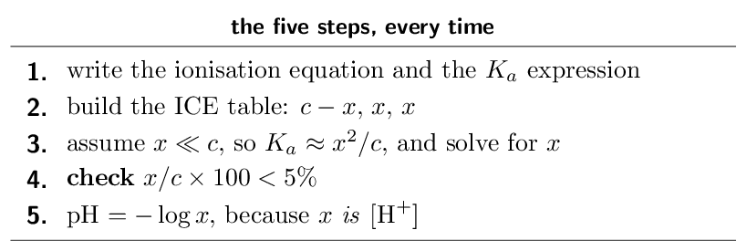

> 📘 **I do: acetic acid from scratch**
>
> **Find the pH of 0.500 M acetic acid,
> $K_{a} = 1.8e-5$.**
> 
> **Step 1 — equation and expression.**
> 
> $$ \text{CH₃COOH ⇌ H+ + CH₃COO-}    \qquad    K_{a} = \frac{[\text{H+}][\text{CH₃COO-}]}{[\text{CH₃COOH}]} $$
> 
> **Step 2 — ICE table.**
> 
> |  | $[\text{CH₃COOH}]$ | $[\text{H+}]$ | $[\text{CH₃COO-}]$ |
> |---|---|---|---|
> | **I** | 0.500 | 0 | 0 |
> | **C** | $-x$ | $+x$ | $+x$ |
> | **E** | $0.500-x$ | $x$ | $x$ |

**Step 3 — substitute and approximate.**

$$ 1.8e-5 = \frac{x^{2}}{0.500-x}    \;\approx\; \frac{x^{2}}{0.500} $$

$$ x^{2} = 9.0e-6    \;\Longrightarrow\;    x = 3.0e-3\,\mathrm{M} $$

**Step 4 — justify the approximation.**

$$ \frac{3.0e-3}{0.500} \times 100 = 0.60\%    \quad ✏️ **YOUR TURN 9 — four questions**
>
> 1. Find the pH of 1.00 M acetic acid
>    ($K_{a} = 1.8e-5$).
>    *(working space)*
> 2. In the ICE table for a weak acid, what does $x$ represent
>    physically?
>    *(working space)*
> 3. Why must you check the 5% rule?
>    *(working space)*
> 4. A weak acid and a strong acid are both at
>    0.10 M. Which has the lower pH, and why?
>    *(working space)*
> 
> > **check:** (a) 2.37     (b) $[\text{H+}]$ at equilibrium     (c) to
> confirm dropping $x$ was legitimate     (d) the strong acid

## Ladder 10 • Percent ionisation

`ZUM §14.5`

$$ \text{percent ionisation}    = \frac{[\text{H+}]_{\text{equilibrium}}}{[\text{HA}]_{0}} \times 100 $$

This is the same fraction as the 5% check — but here it is the
answer, not a validity test.

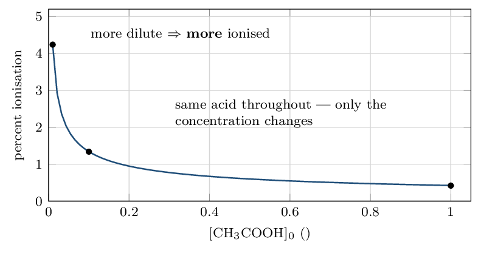

> ⚠️ **AP trap**
>
> **Diluting a weak acid raises its percent ionisation but
> *lowers* its $[\text{H+}]$.** Both are true at once and they sound
> contradictory. A larger *fraction* of a smaller *amount* still
> gives less acid in total — so the solution gets less acidic (pH rises)
> even as the percentage climbs. And $K_{a}$ itself never moves; only
> temperature changes that.

> 📘 **I do: the same acid at three concentrations**
>
> **Acetic acid, $K_{a} = 1.8e-5$, at three
> concentrations.**
> 
> **1.00 M:** $x = \sqrt{1.8e-5 \times 1.00} = 4.24e-3$, so
> 
> $$ \frac{4.24e-3}{1.00} \times 100 = \mathbf{0.42\%} $$
> 
> **0.100 M:** $x = 1.34e-3$, so
> 
> $$ \frac{1.34e-3}{0.100} \times 100 = \mathbf{1.3\%} $$
> 
> **0.0100 M:** $x = 4.24e-4$, so
> 
> $$ \frac{4.24e-4}{0.0100} \times 100 = \mathbf{4.2\%} $$
> 
> **Read the pattern.** A tenfold dilution multiplies the percent
> ionisation by about $\sqrt{10} \approx 3.2$ — from 0.42 to 1.3 to 4.2.
> That square-root behaviour follows straight from $x = \sqrt{K_{a}c}$:
> percent ionisation is $x/c = \sqrt{K_{a}/c}$, so it rises as $c$ falls.
> 
> **But check what happened to the acidity.** $[\text{H+}]$ went
> *down* at every step, from 4.24e-3 to 4.24e-4, so the
> pH rose from about 2.4 to about 3.4. The solution became *less*
> acidic while becoming *more* ionised. Both statements are correct,
> and a question that asks for one while implying the other is testing
> whether you can hold them apart.
> 
> **Why dilution pushes ionisation up.** Le Ch\^atelier, from
> Chapter 13: adding water dilutes everything, and the equilibrium shifts
> toward the side with *more* dissolved particles — the ionised
> side, since one HA becomes two ions.

> ✏️ **YOUR TURN 10 — four questions**
>
> 1. A 0.20 M weak acid has $[\text{H+}] =         2.0e-3\,\mathrm{M}$. Find its percent ionisation.
>    *(working space)*
> 2. Does diluting a weak acid raise or lower its percent
>    ionisation?
>    *(working space)*
> 3. Does diluting a weak acid raise or lower its pH?
>    *(working space)*
> 4. Does diluting a weak acid change its $K_{a}$? Explain.
>    *(working space)*
> 
> > **check:** (a) 1.0%     (b) raises it     (c) raises it (less
> acidic)     (d) no — only temperature does

## Ladder 11 • Weak bases and $K_{b}$

`ZUM §14.6`

Identical machinery, one substitution: the base takes a proton
*from water*, so what you solve for is $[\text{OH-}]$, and you must
finish by converting to pH.

$$ \text{B + H₂O ⇌ BH+ + OH-}    \qquad    K_{b} = \frac{[\text{BH+}][\text{OH-}]}{[\text{B}]} $$

> 📘 **I do: ammonia, and the extra step**
>
> **Find the pH of 0.500 M NH₃,
> $K_{b} = 1.8e-5$.**
> 
> **ICE gives the same algebra as Ladder 9:**
> 
> $$ 1.8e-5 \approx \frac{x^{2}}{0.500}    \;\Longrightarrow\;    x = 3.0e-3\,\mathrm{M} $$
> 
> Check: $0.60\%  
> **Now the step that separates bases from acids.** Here $x$ is
> $[\text{OH-}]$, not $[\text{H+}]$, so it gives you **pOH** first:
> 
> $$ \text{pOH} = -\log(3.0e-3) = 2.52 $$
> 
> $$ \text{pH} = 14.00 - 2.52 = \mathbf{11.48} $$
> 
> **Compare with Ladder 9 deliberately.** Acetic acid at
> 0.500 M with $K_{a} = 1.8e-5$ gave pH 2.52. Ammonia at
> 0.500 M with the same numerical $K_{b}$ gives pH 11.48. The
> two are mirror images about 7 — $2.52 + 11.48 = 14.00$ — because the
> constants are numerically equal. That symmetry is worth noticing, and it
> is a fast way to spot a forgotten conversion.
> 
> **Which is exactly the error to watch for.** Stopping at
> $\text{pH} = -\log x = 2.52$ would report a strongly *acidic*
> ammonia solution. Ammonia is a base; its pH must exceed 7. Always ask
> whether the sign of your answer matches the chemistry before you write
> it down.

> ✏️ **YOUR TURN 11 — four questions**
>
> 1. Write the $K_{b}$ expression for methylamine, CH₃NH₂.
>    *(working space)*
> 2. For 0.100 M of a base with $K_{b} = 1.0e-5$,
>    find $[\text{OH-}]$.
>    *(working space)*
> 3. Convert that $[\text{OH-}]$ to a pH. 
>    *(working space)*
> 4. Why does a weak-base ICE table give pOH rather than pH
>    directly?
>    *(working space)*
> 
> > **check:** (a) $[\text{CH₃NH₃+}][\text{OH-}]/[\text{CH₃NH₂}]$     (b)
> 1.0e-3 M     (c) 11.00     (d) $x$ is $[\text{OH-}]$

## Ladder 12 • $K_{a} \times K_{b} = K_{w}$

`ZUM §14.6`

For a **conjugate pair** — and only for a conjugate pair — the
two constants multiply to $K_{w}$.

$$ K_{a} \times K_{b} = K_{w} = 1.0e-14    \qquad\text{equivalently}\qquad    \text{p}K_{a} + \text{p}K_{b} = 14.00 $$

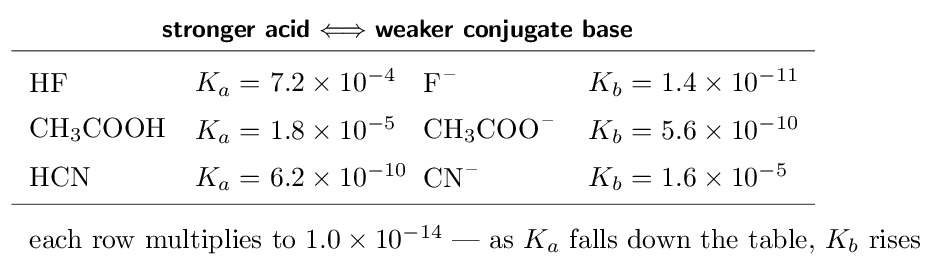

> 📘 **I do: converting between the two**
>
> **Acetic acid has $K_{a} = 1.8e-5$. Find $K_{b}$ for
> acetate, CH₃COO-.**
> 
> $$ K_{b} = \frac{K_{w}}{K_{a}}          = \frac{1.0e-14}{1.8e-5}          = \mathbf{5.6e-10} $$
> 
> **Sense-check the size.** $5.6e-10$ is small, so acetate is a
> weak base — but not a negligible one, and that is precisely why sodium
> acetate solutions come out basic (Ladder 14).
> 
> **Now the other direction. Ammonia has $K_{b} = 1.8e-5$;
> find $K_{a}$ for the ammonium ion, NH₄+.**
> 
> $$ K_{a} = \frac{1.0e-14}{1.8e-5} = 5.6e-10 $$
> 
> So NH₄+ is a weak acid — which is why ammonium chloride
> solutions are acidic.
> 
> **The relationship must be used on a conjugate pair.** $K_{a}$ for
> acetic acid and $K_{b}$ for ammonia do *not* multiply to $K_{w}$;
> they are unrelated species. Pair the acid with *its own* conjugate
> base, differing by exactly one proton.
> 
> **Why the rule holds at all.** Add the two equilibria:
> 
> $$ \text{HA ⇌ H+ + A-}    \qquad    \text{A- + H₂O ⇌ HA + OH-} $$
> 
> Everything cancels except H₂O ⇌ H+ + OH-, whose constant is
> $K_{w}$ — and from Chapter 13, adding equations multiplies their
> constants. It is Ladder 7 of Chapter 13, reused.

> ✏️ **YOUR TURN 12 — four questions**
>
> 1. HF has $K_{a} = 7.2e-4$. Find $K_{b}$ for F-.
>    *(working space)*
> 2. A base has $K_{b} = 1.0e-6$. Find $K_{a}$ for its
>    conjugate acid.
>    *(working space)*
> 3. An acid has p$K_{a} = 4.00$. Find p$K_{b}$ for its conjugate
>    base.
>    *(working space)*
> 4. Why do $K_{a}$ for acetic acid and $K_{b}$ for ammonia
>    *not* multiply to $K_{w}$?
>    *(working space)*
> 
> > **check:** (a) 1.4e-11     (b) 1.0e-8     (c) 10.00
>     (d) they are not a conjugate pair

## Ladder 13 • Polyprotic acids

`ZUM §14.7`

Acids with more than one ionisable proton give them up in stages, and
each stage is far weaker than the one before.

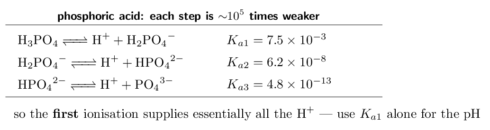

> 📘 **I do: why only the first step matters**
>
> **Why does $K_{a2}$ drop so far below $K_{a1}$?**
> 
> **Because of charge.** Pulling H+ away from neutral
> H₃PO₄ is one thing. Pulling a *positive* H+ away from an
> already *negative* H₂PO₄- means fighting an electrostatic
> attraction — and it gets harder again for the $2-$ ion. Each
> successive proton leaves behind a more negative species, so each is
> harder to remove.
> 
> **The consequence for calculations.** $K_{a1}$ exceeds $K_{a2}$ by
> about $10^{5}$, so the second ionisation contributes a hundred-thousandth
> as much H+ as the first. For pH purposes you can ignore everything
> after the first step and treat the acid as an ordinary weak monoprotic
> acid.
> 
> **Worked: the pH of 0.100 M H₂CO₃,
> $K_{a1} = 4.3e-7$.**
> 
> $$ x^{2}/0.100 \approx 4.3e-7    \;\Longrightarrow\;    x^{2} = 4.3e-8    \;\Longrightarrow\;    x = 2.07e-4 $$
> 
> $$ \text{pH} = -\log(2.07e-4) = \mathbf{3.68} $$
> 
> Check: $2.07e-4/0.100 = 0.21\%  $K_{a2} = 5.6e-11$ is nearly four orders of magnitude smaller, so
> ignoring it was safe.
> 
> **The one exception on the strong-acid list.** H₂SO₄'s first
> ionisation is *strong* and its second is weak but not negligible
> ($K_{a2} = 1.2e-2$). It is the polyprotic acid where the second
> step genuinely matters, and it is the one an exam question will use if
> it wants to test this.

> ✏️ **YOUR TURN 13 — four questions**
>
> 1. Why is $K_{a2}$ always smaller than $K_{a1}$?
>    *(working space)*
> 2. Which $K$ do you use to find the pH of 0.10 M
>    H₃PO₄?
>    *(working space)*
> 3. Write the equation for the second ionisation of H₂CO₃.
>    *(working space)*
> 4. Why is H₂SO₄ the exception among polyprotic acids?
>    *(working space)*
> 
> > **check:** (a) removing H+ from a negative ion is harder     (b)
> $K_{a1}$     (c) HCO₃⁻ ⇌ H+ + CO₃²⁻     (d) its first
> ionisation is strong

## Ladder 14 • Acid–base properties of
salts

`ZUM §14.8`

Dissolve a salt and its ions may react with water. Whether the solution
comes out acidic, basic or neutral depends on which parent acid and base
the salt came from.

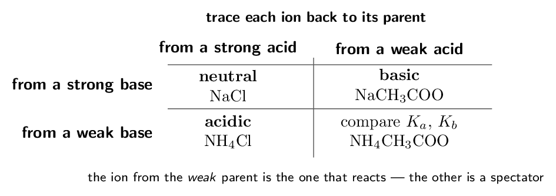

> 📘 **I do: three salts, one method**
>
> **The method: split the salt into its ions, ask where each came
> from, and let the ion from the weak parent decide.**
> 
> **NaCl.** Na+ is from NaOH, a strong base;
> Cl- is from HCl, a strong acid. Both conjugates are so weak
> they do nothing at all. **Neutral**, pH 7.
> 
> **NH₄Cl.** Cl- is again a spectator. NH₄+ is the
> conjugate acid of the *weak* base ammonia, so it is a weak acid and
> donates a proton to water. **Acidic**.
> 
> **NaCH₃COO.** Na+ is a spectator. Acetate is the
> conjugate base of the *weak* acid acetic acid, so it takes a
> proton from water and releases OH-. **Basic**.
> 
> **Worked calculation.** Find the pH of a 0.10 M
> solution of sodium acetate. From Ladder 12 we have
> $K_{b}(\text{CH₃COO-}) = 5.6e-10$, so:
> 
> $$ x^{2}/0.10 \approx 5.6e-10    \;\Longrightarrow\;    x = 7.5e-6 = [\text{OH-}] $$
> 
> $$ \text{pOH} = 5.13    \;\Longrightarrow\;    \text{pH} = 14.00 - 5.13 = \mathbf{8.87} $$
> 
> Basic, as predicted — and only mildly so, which is what a $K_{b}$ of
> $10^{-10}$ should give.
> 
> **The fourth box.** When *both* ions come from weak parents,
> as in ammonium acetate, you must compare $K_{a}$ of the cation with
> $K_{b}$ of the anion; the larger one wins. For ammonium acetate both are
> $5.6e-10$, so the solution is very nearly neutral — a
> coincidence of that particular pair, not a general rule.
> 
> **One more class worth recognising:** small, highly charged metal
> cations such as Al³⁺ and Fe³⁺ make solutions acidic, because
> they polarise the water molecules bound to them enough to release
> H+. AlCl₃ solutions are noticeably acidic despite containing
> no obvious acid.

> ✏️ **YOUR TURN 14 — four questions**
>
> 1. Is a KNO₃ solution acidic, basic or neutral? Explain.
>    *(working space)*
> 2. Is a NaCN solution acidic, basic or neutral? Explain.
>    *(working space)*
> 3. Is a NH₄NO₃ solution acidic, basic or neutral? Explain.
>    *(working space)*
> 4. Which ion in NaF reacts with water, and what does it
>    produce?
>    *(working space)*
> 
> > **check:** (a) neutral     (b) basic     (c) acidic     (d)
> F-, producing OH-

## Ladder 15 • Structure and acid strength

`ZUM §14.9–14.10`

Why is HI strong and HF weak? Why is HClO₄ the strongest
common acid? Two families, two different explanations.

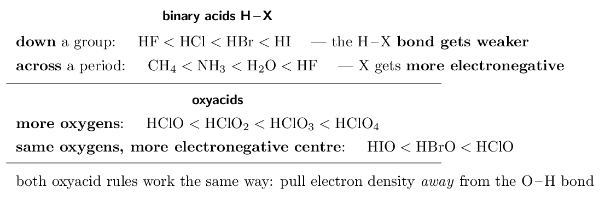

> 📘 **I do: two rules, two reasons**
>
> **Binary acids down a group: HF $ $ 
> You might expect fluorine, the most electronegative element, to give the
> strongest acid. It does not, and the reason is **bond strength**.
> Iodine is large, so the H-I bond is long and weak and the proton
> leaves easily. The H-F bond is short and very strong, and holding
> onto the proton is exactly what makes HF weak. Going down a group,
> bond strength beats electronegativity.
> 
> **Binary acids across a period: CH₄ $ H₂O $ longer dominates and **electronegativity** takes over. A more
> electronegative X pulls the bonding electrons toward itself, leaving the
> hydrogen more positive and easier to remove — and stabilising the
> anion left behind.
> 
> **Oxyacids, more oxygens: HClO $ $ electron density away from the O-H bond, weakening it. It also
> spreads the negative charge of the anion over more atoms, which
> stabilises the conjugate base. Both effects push in the same direction.
> 
> **Oxyacids, same oxygens: HIO $ Same argument with the central atom instead: chlorine is the most
> electronegative of the three and withdraws the most.
> 
> **Say it in terms of the conjugate base.** “The more the negative
> charge is delocalised, the more stable the conjugate base, so the
> stronger the acid.” That single sentence answers most structure
> questions in this ladder, and it earns marks where “it has more
> oxygens” does not.

> ✏️ **YOUR TURN 15 — four questions**
>
> 1. Which is the stronger acid, HBr or HCl? Why?
>    *(working space)*
> 2. Which is the stronger acid, HClO₃ or HClO? Why?
>    *(working space)*
> 3. Which is the stronger acid, H₂O or NH₃? Why?
>    *(working space)*
> 4. Why is HF weak when F is the most electronegative
>    element?
>    *(working space)*
> 
> > **check:** (a) HBr — weaker bond     (b) HClO₃ — more
> oxygens     (c) H₂O — O is more electronegative     (d) the
> H-F bond is very strong

## Ladder 16 • pH and p$K_{a}$

`ZUM §14.8`

p$K_{a} = -\log K_{a}$, exactly as pH is $-\log[\text{H+}]$. Comparing the
two tells you which form of the acid dominates.

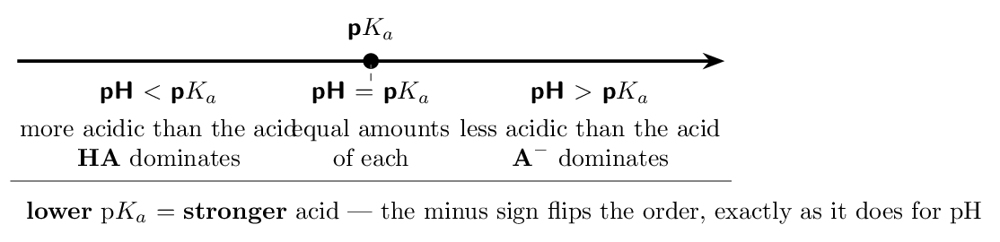

> 📘 **I do: p$K_{a}$ and which form you have**
>
> **Acetic acid has $K_{a} = 1.8e-5$. Find p$K_{a}$.**
> 
> $$ \text{p}K_{a} = -\log(1.8e-5) = \mathbf{4.74} $$
> 
> **Now compare acids by p$K_{a}$.** HF has
> $K_{a} = 7.2e-4$, so p$K_{a} = 3.14$; HCN has
> $K_{a} = 6.2e-10$, so p$K_{a} = 9.21$. The order of strength is
> $\text{HF} > \text{CH₃COOH} > \text{HCN}$, and the p$K_{a}$ values 3.14,
> 4.74, 9.21 rise in exactly the reverse order. **Lower p$K_{a}$,
> stronger acid.**
> 
> **Now use pH against p$K_{a}$.** Put acetic acid
> (p$K_{a} = 4.74$) into a solution buffered at pH 2.00. Since pH $$ p$K_{a}$, so the **deprotonated** form
> CH₃COO- dominates. And at pH 4.74 exactly, the two are present in
> equal amounts.
> 
> **Why this matters beyond the exam.** It is how a drug's behaviour
> is predicted: aspirin has p$K_{a} \approx 3.5$, so in stomach acid
> (pH $\approx 2$) it is neutral and crosses membranes easily, while in
> blood (pH 7.4) it is ionised and stays put. Same molecule, two
> environments, opposite behaviour — read off a comparison of pH with
> p$K_{a}$.
> 
> **The rule in one line:** *low pH protonates, high pH
> deprotonates*, and p$K_{a}$ is the pH at which the balance tips.

> ✏️ **YOUR TURN 16 — four questions**
>
> 1. An acid has $K_{a} = 1.0e-3$. Find p$K_{a}$.
>    *(working space)*
> 2. Acid A has p$K_{a} = 3.0$ and acid B has p$K_{a} = 6.0$. Which
>    is stronger?
>    *(working space)*
> 3. An acid with p$K_{a} = 5.0$ sits in a solution at pH 8.0. Which
>    form dominates?
>    *(working space)*
> 4. At what pH are $[\text{HA}]$ and $[\text{A-}]$ equal?
>    *(working space)*
> 
> > **check:** (a) 3.00     (b) A     (c) A-     (d) pH $=$
> p$K_{a}$

## Mixed set • twelve questions, no labels

> 📌 **Why this section exists**
>
> Every question so far arrived with its ladder attached, so you always
> knew which method to use. On the exam you will not. These twelve are
> deliberately unlabelled and out of order — the first decision, every
> time, is *which kind of problem is this?*

> ✏️ **MIXED SET — first six**
>
> 1. Find the pH of 0.020 M HNO₃.
>    *(working space)*
> 2. Find the pH of 0.020 M NaOH.
>    *(working space)*
> 3. Give the conjugate base of H₂PO₄⁻ and the conjugate acid
>    of HCO₃⁻.
>    *(working space)*
> 4. Is a solution of K₂CO₃ acidic, basic or neutral? Explain
>    in one sentence.
>    *(working space)*
> 5. A weak acid has $K_{a} = 4.0e-6$. Find $K_{b}$ for its
>    conjugate base.
>    *(working space)*
> 6. Which is the stronger acid, HBrO or HBrO₃? Give the
>    reason.
>    *(working space)*
> 
> > **check:** (a) 1.70     (b) 12.30     (c) HPO₄²⁻ and H₂CO₃
>     4. basic     5. 2.5e-9     6. HBrO₃

> ✏️ **MIXED SET — last six**
>
> 1. Find the pH of 0.250 M of a weak acid with
>    $K_{a} = 4.0e-5$.
>    *(working space)*
> 2. Find the percent ionisation for question 7.
>    *(working space)*
> 3. Find the pH of 0.0050 M Ba(OH)₂.
>    *(working space)*
> 4. A solution has pOH 4.20. Find its pH and $[\text{H+}]$.
>    *(working space)*
> 5. An acid has p$K_{a} = 7.2$ and sits at pH 5.0. Which form
>    dominates?
>    *(working space)*
> 6. Explain in one sentence why 0.10 M HCl and
>    0.10 M CH₃COOH have different pH values.
>    *(working space)*
> 
> > **check:** (a) 2.50     (b) 1.3%     (c) 12.00     (d) pH 9.80,
> 1.6e-10 M     1(a) HA     1(b) one is strong, one
> weak

## Mastery tracker

Tick a row only if **all four** YOUR TURN questions were right on
the first attempt. Every row is assessed except the Lewis model inside
Ladder 1 (see its “For the exam” note) — Brønsted–Lowry is the
exam's model.

| **First try?** | **Skill** | **Ladder** | **If not, re-read…** |
|---|---|---|---|
| $\square$ | the three definitions | 1 | the models nest |
| $\square$ | conjugate pairs | 2 | one proton, one charge |
| $\square$ | strong versus weak | 3 | not the same as concentrated |
| $\square$ | $K_{w}$ and autoionisation | 4 | pH 7 only at 25 C |
| $\square$ | the pH scale | 5 | one unit is tenfold |
| $\square$ | pH of a strong acid | 6 | one line, no ICE |
| $\square$ | pH of a strong base | 7 | count the hydroxides |
| $\square$ | $K_{a}$ and weakness | 8 | bigger $K_{a}$, stronger acid |
| $\square$ | pH of a weak acid | 9 | ICE, then take the log |
| $\square$ | percent ionisation | 10 | dilution raises it |
| $\square$ | weak bases and $K_{b}$ | 11 | $x$ is $[\text{OH-}]$ |
| $\square$ | $K_{a}K_{b} = K_{w}$ | 12 | conjugate pairs only |
| $\square$ | polyprotic acids | 13 | $K_{a1}$ dominates |
| $\square$ | salts | 14 | the weak parent decides |
| $\square$ | structure and strength | 15 | stabilise the conjugate base |
| $\square$ | pH and p$K_{a}$ | 16 | low pH protonates |
| $\square$ | **mixed set** (10 of 12) | — | whichever it exposed |

> 📌 **Scoring yourself honestly**
>
> 16/16 and the mixed set: you have the bulk of an 11–15% unit, and
> Chapter 15 — buffers and titrations — will feel like a
> continuation rather than a new subject.
> 
> 12–15: look at *which* ladders missed. Ladders 1–8 are
> definitions and one-line arithmetic; they repair fast. Ladders 9–14 are
> the calculation core, and a miss there is the one to fix now.
> 
> Under 12, or a weak mixed set with strong ladders: that specific
> pattern means you can execute each method but cannot yet *choose*
> between them — which is what the exam actually tests. The repair is
> not more of the same practice; it is to go back through the ladders
> asking only “what tells me this is a weak-acid problem rather than a
> strong-acid one?” Build the decision, not the arithmetic.
> 
> **One thing to carry into Chapter 15.** Every buffer calculation
> starts from a weak acid and its conjugate base — Ladders 9, 12 and 16
> combined. If those three are solid, buffers are mostly bookkeeping.

---

*AP Chemistry course materials • student edition • CC BY-NC-SA 4.0*
