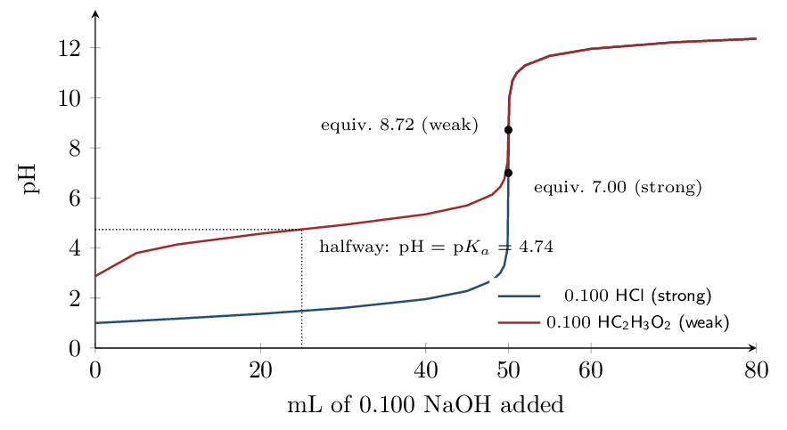

# Guided Notes

*Chapter 15 • Acid–Base Equilibria*  
Zumdahl §15.1–15.5 • PDF pp. 755–803 • 5 blocks

[← all lessons](../index.md)

---

> 📌 **How this chapter fits the AP course**
>
> This is the **back half of Unit 8** and the chapter that finishes it:
> §15.1 $\to$ CED 7.12, §15.2 $\to$ 8.4 and 8.8–8.9, §15.3 $\to$ 8.10,
> §15.4 $\to$ 8.5, §15.5 $\to$ 8.5 (indicator choice).
> 
> **It also closes a gap left open in Chapter 13.** Unit 7's last two
> topics were missing from the equilibrium chapter: §15.1 supplies
> **7.12, the common-ion effect**. Only **7.11 (Ksp)** is still
> outstanding, and it lives in §16.1.
> 
> **Marked enrichment:** §15.6 (polyprotic titrations). You are
> responsible for recognizing the *shape* of a polyprotic curve and what
> each plateau means; the multi-equivalence-point calculations are not on the
> framework.
> 
> Nothing here is a new kind of problem. A buffer is a weak-acid equilibrium
> with the conjugate base already present, and a titration is a
> *stoichiometry* problem followed by whichever equilibrium is left over.
> The skill being built is deciding *which* of those two you are in.

## The Common Ion Effect and What a Buffer Is Zumdahl §15.1–15.2

> 📌 **By the end you can…**
>
> - Predict the effect of a common ion using Le Ch\^atelier's principle.
> - Recognize a buffer and calculate its pH from $K_a$ and the
>    concentration ratio.

**Read:** Zumdahl §15.1–15.2 • PDF pp. 756–765

> 📌 **Retrieval warm-up**
>
> 1. pH of 0.10 M HC₂H₃O₂ ($K_a = 1.8\times10^{-5}$):
>    2.87
> 2. $K_b$ for C₂H₃O₂⁻: $5.6\times10^{-10}$
> 3. If $Q  4. Adding a product to a system at equilibrium shifts it:
>    left

#### INSTRUCTION A • The common ion effect 25 min

### Le Ch\^atelier, wearing a different hat `ZUM §15.1`

`SP 6`

A common ion is an ion that is already a participant in the
equilibrium you care about. Adding it shifts the position of that
equilibrium backward — there is no new principle
here at all. This is Le Ch\^atelier's principle applied to an acid
ionization.

HF(aq) ⇌ H+(aq) + F⁻(aq)

Dissolve NaF in this solution and you have added F-, a product.
The equilibrium shifts left, so the acid ionizes
*less* and the solution is less acidic than the
acid alone.

> 📘 **Worked example 1: Zumdahl's fluoride comparison**
>
> Compare 1.0 M HF alone with a solution that is
> 1.0 M in HF *and* 1.0 M in NaF.
> $K_a(\text{HF}) = 7.2\times10^{-4}$.
> 
> **HF alone.** The usual weak-acid ICE:
> $x = \sqrt{(7.2\times10^{-4})(1.0)} = 2.7\times10^{-2}$, so
> $\mathrm{pH} = \mathbf{1.57}$ and the acid is $\mathbf{2.7\%}$ ionized.
> 
> **With NaF present.** Now $[\text{F-}]_0 = 1.0$, not zero:
> 
> $$ K_a = \frac{x(1.0+x)}{1.0-x} \approx \frac{x(1.0)}{1.0}    \quad\Longrightarrow\quad x = K_a\frac{[\text{HF}]}{[\text{F-}]}    = 7.2\times10^{-4} $$
> 
> so $\mathrm{pH} = \mathbf{3.14}$ and the acid is only $\mathbf{0.072\%}$
> ionized.
> 
> The common ion suppressed the ionization by a factor of about
> **37**, and moved the pH by more than **1.5 units**.

> ⚠️ **AP trap**
>
> Notice what the algebra collapsed to:
> 
> $$ [\text{H+}] = K_a\,\frac{[\text{HA}]}{[\text{A⁻}]} $$
> 
> No square root, no quadratic. When *both* members of a conjugate pair
> are present in comparable amounts, the ICE table's $x$ is negligible against
> both of them, and the whole problem reduces to a ratio. This single
> expression is the engine of the entire chapter.

#### GUIDED PRACTICE • Predicting the shift 15 min

1. NaCN is added to a solution of HCN. The pH
   rises (less ionization)
2. NH₄Cl is added to a solution of NH₃. The pH
   falls (less OH-)
3. NaCl is added to a solution of HC₂H₃O₂. The pH
   no change — neither ion participates
4. Which ion in item 3 would have mattered?
   C₂H₃O₂⁻, not Cl-

#### INSTRUCTION B • What makes a solution a buffer 20 min

### Definition and recognition `ZUM §15.2`

`SP 6`

A buffered solution resists a change in pH when acid or base is
added. It contains **significant amounts of both members of a
conjugate acid–base pair**: a weak acid together with its conjugate base, or
a weak base together with its conjugate acid.

Three ways a buffer shows up on the exam:

1. **Stated outright** — HC₂H₃O₂ plus NaC₂H₃O₂, or
   NH₃ plus NH₄Cl.
2. **Made by partial neutralization** — a weak acid plus
   *less than enough* strong base to consume it. The base
   converts part of the acid to its conjugate base, and what remains is
   a mixture of both.
3. **Hiding at the halfway point of a titration**, which is item 2
   with the amounts chosen so the two are equal.

> ⚠️ **AP trap**
>
> A strong acid and its “conjugate base” is *not* a buffer.
> HCl and NaCl do nothing: Cl- has no affinity for protons, so
> there is nothing to absorb added acid. A buffer requires a *weak*
> conjugate pair — the reversibility is the whole point.

#### APPLICATION • Ratio calculations 20 min

1. Find $[\text{H+}]$ and pH for a solution 0.10 M in HF
   and 0.30 M in NaF.
   *(working space)*
2. Identify each as a buffer or not, with a reason:
   

> 📌 **Exit ticket**
>
> A student says “NaF makes the solution basic, so adding it to HF
> raises the pH.” The conclusion is right but the reasoning is incomplete.
> Give the better explanation.

## The Henderson–Hasselbalch Equation Zumdahl §15.2

> 📌 **By the end you can…**
>
> - Derive and apply $\mathrm{pH} = \mathrm{p}K_a +         \log([\text{base}]/[\text{acid}])$.
> - Explain why the ratio, not the absolute concentration, sets the pH.

**Read:** Zumdahl §15.2 • PDF pp. 763–767

> 📌 **Retrieval warm-up**
>
> 1. $[\text{H+}] = K_a \times$ $[\text{HA}]/[\text{A⁻}]$
> 2. p$K_a$ of HC₂H₃O₂: 4.74
> 3. $\log(1) =$ 0

#### INSTRUCTION A • Deriving the equation 25 min

### From $K_a$ to a log equation `ZUM §15.2`

`SP 5`

Start from the rearranged $K_a$ expression and take $-\log$ of both sides:

$$ [\text{H+}] = K_a\frac{[\text{HA}]}{[\text{A⁻}]}    \;\Longrightarrow\;    -\log[\text{H+}] = -\log K_a - \log\frac{[\text{HA}]}{[\text{A⁻}]} $$

Inverting the fraction flips the sign of its log, which gives the
Henderson–Hasselbalch equation:

$$ \boxed{\;\mathrm{pH} = \mathrm{p}K_a    + \log\frac{[\text{A⁻}]}{[\text{HA}]}    = \mathrm{p}K_a + \log\frac{[\text{base}]}{[\text{acid}]}\;} $$

Read the equation as three separate statements:

- If $[\text{base}] = [\text{acid}]$, the log term is
   0, so the pH equals
   p$K_a$.
- More base than acid $\Rightarrow$ log term positive $\Rightarrow$ pH
   above p$K_a$.
- More acid than base $\Rightarrow$ pH
   below p$K_a$.

> ⚠️ **AP trap**
>
> **Base over acid, and the base is the anion.** Writing the ratio upside
> down flips the sign of the correction, so a pH that should sit above p$K_a$
> lands the same distance below it. Before you divide, name the two species
> out loud: C₂H₃O₂⁻ is the base, HC₂H₃O₂ is the acid.

#### GUIDED PRACTICE • Straight substitution 15 min

1. 0.25 M HC₂H₃O₂ and 0.15 M
   NaC₂H₃O₂:
   *(working space)*
2. 0.20 M NH₃ and 0.30 M NH₄Cl, given
   $K_a(\text{NH₄+}) = 5.6\times10^{-10}$:
   *(working space)*
3. 0.100 M HOCl and 0.100 M NaOCl
   ($K_a = 3.5\times10^{-8}$): pH $= 7.46$

> 📌 **On the ammonium p$K_a$**
>
> Two routes give answers differing by $0.01$: $-\log(5.6\times10^{-10}) = 9.25$, while $14.00 - \mathrm{p}K_b = 14.00 - 4.74 = 9.26$. Both are
> correct; the gap is rounding in the tabulated constants, nothing more. AP
> scoring accepts either. Do not chase the last digit — pick one route and
> be consistent within a problem.

#### INSTRUCTION B • Why the ratio is what matters 20 min

### Dilution does not change a buffer's pH `ZUM §15.2`

`SP 5`

Because only the *ratio* appears in the equation, two solutions with
the same ratio have the same pH no matter how concentrated they are:

| **Solution** | $[\text{A⁻}]/[\text{HA}]$ | **pH** |
|---|---|---|
| 5.0 | thinsp;M HC₂H₃O₂ $+$ 3.0 | thinsp;M NaC₂H₃O₂ | $3.0/5.0 = 0.60$ | 4.52 |
| 0.050 | thinsp;M HC₂H₃O₂ $+$ 0.030 | thinsp;M NaC₂H₃O₂ | $0.030/0.050 = 0.60$ | 4.52 |

Two consequences worth writing down:

- **Diluting a buffer does not change its pH** (to a good
   approximation) — both concentrations fall by the same factor, so
   the ratio is unchanged. Compare this with a
   weak acid alone, where dilution *does* raise the pH.
- **You may use moles instead of molarity.** Both species share
   the same volume, so the volume cancels out of the ratio. This saves
   a step on nearly every titration problem.

> 📘 **Worked example 2: moles are enough**
>
> What is the pH of a solution made by dissolving 0.100 mol of
> HC₂H₃O₂ and 0.100 mol of NaC₂H₃O₂ in enough water to make
> 500 mL?
> 
> There is no need to compute either molarity. The mole ratio is
> $0.100/0.100 = 1$, so
> $\mathrm{pH} = \mathrm{p}K_a = \mathbf{4.74}$.
> 
> The answer would be identical in 2.0 L.

#### APPLICATION • Working backwards 20 min

1. A buffer made from HOCl and NaOCl has pH 7.00. Find
   $[\text{OCl-}]/[\text{HOCl}]$.
   *(working space)*
2. A NH₃/NH₄Cl buffer is 0.30 M in NH₃ and
   0.15 M in NH₄Cl. Find the pH and say whether it lies
   above or below p$K_a$, with a reason.
   *(working space)*

> 📌 **Exit ticket**
>
> Two beakers hold acetate buffers. Beaker A is 1.0 M in each
> component; beaker B is 0.010 M in each. Which has the higher pH,
> and which is the better buffer?

## Buffer Action and Buffering Capacity Zumdahl §15.2–15.3

> 📌 **By the end you can…**
>
> - Calculate the pH of a buffer after a strong acid or base is added.
> - Compare buffering capacity and choose components for a target pH.

**Read:** Zumdahl §15.2–15.3 • PDF pp. 761–770

> 📌 **Retrieval warm-up**
>
> 1. Henderson–Hasselbalch: pH $=$
>    p$K_a + \log([\text{base}]/[\text{acid}])$
> 2. pH of a buffer with equal amounts of both components:
>    p$K_a$
> 3. Diluting a buffer changes its pH how?
>    hardly at all

#### INSTRUCTION A • Stoichiometry first, then equilibrium 25 min

### The two-step method `ZUM §15.2`

`SP 5`

This is the most important procedure in the chapter, and the one students
most often try to skip.

**Stoichiometry step.** Strong acid or strong base reacts
        completely. Added OH- converts HA to A-;
        added H+ converts A- to HA. Work in
        moles (or mmol) and take the reaction to
        completion. No $K$ appears in this step.

**Equilibrium step.** Take the new amounts and put them into
        Henderson–Hasselbalch.

> ⚠️ **AP trap**
>
> Do **not** put the added OH- into an ICE table. Strong base does
> not sit at equilibrium with a weak acid — it consumes it. Mixing the two
> steps is the single most common way to lose every point on a buffer
> question.

> 📘 **Worked example 3: a buffer absorbing a strong base**
>
> 1.00 L of solution is 0.50 M in HC₂H₃O₂ and
> 0.50 M in NaC₂H₃O₂. Add 0.010 mol of NaOH.
> 
> **Start:** ratio $=1$, so pH $= 4.74$.
> 
> **Step 1 — stoichiometry.** OH⁻ + HC₂H₃O₂ → C₂H₃O₂⁻ + H₂O
> 
> |  | HC₂H₃O₂ | OH- | C₂H₃O₂⁻ |
> |---|---|---|---|
> | before | 0.50 | 0.010 | 0.50 |
> | after | 0.49 | 0 | 0.51 |

**Step 2 — equilibrium.**
$\mathrm{pH} = 4.74 + \log(0.51/0.49) = 4.74 + 0.02 = \mathbf{4.76}$

**For contrast:** the same 0.010 mol of NaOH in
1.00 L of *pure water* gives $[\text{OH-}] = 0.010$,
pOH $= 2.00$, and $\mathrm{pH} = \mathbf{12.00}$.

The buffer moved **0.02** pH units. Water moved **5.00**.

#### GUIDED PRACTICE • The same buffer, acid added 15 min

Add 0.010 mol of HCl to the same original buffer instead.

Which component is consumed? C₂H₃O₂⁻

New amounts: HC₂H₃O₂ $=$ 0.51,
        C₂H₃O₂⁻ $=$ 0.49

New pH: 4.72

Same HCl in 1.00 L pure water:
        2.00

#### INSTRUCTION B • Capacity, and choosing a buffer 20 min

### Why equal amounts buffer best `ZUM §15.3`

`SP 6`

Buffering capacity is how much added acid or base a buffer can absorb
before its pH moves appreciably. Two things control it:

- **How much** of each component is present. More is better —
   this is why dilution, which leaves the pH alone, still *hurts*
   the buffer.
- **How lopsided** the ratio is. Zumdahl's Table 15.1 makes the
   case with two solutions at very different ratios, each receiving
   0.01 mol of H+:

|  | $[\text{A⁻}]/[\text{HA}]$ before | after | change | pH shift |
|---|---|---|---|---|
| A  1.00 | thinsp;M / 1.00 | thinsp;M | 1.00 | 0.98 | 2.0% | $4.74 \to 4.73$ |
| B  1.00 | thinsp;M / 0.01 | thinsp;M | 100 | 49.5 | 50.5% | $6.74 \to 6.43$ |

Same amount of acid added; solution B's ratio changed
25 times as much. The lesson:

> 
Optimal buffering occurs when $[\text{HA}] = [\text{A⁻}]$, that is, when
$\mathrm{pH} = \mathrm{p}K_a$.   

A buffer is useful over roughly
$\mathrm{p}K_a \pm 1$.

So to **design** a buffer for a target pH, choose a weak acid whose
p$K_a$ is as close as possible to that pH, then set the ratio with
Henderson–Hasselbalch.

> 📘 **Worked example 4: designing a pH 4.00 buffer**
>
> Which acid, and in what ratio?
> 
> | **Acid** | p$K_a$ | $\|\mathrm{pH} - \mathrm{p}K_a\|$ |
> |---|---|---|
> | HF | 3.14 | 0.86 |
> | HNO₂ | 3.40 | **0.60** |
> | HC₂H₃O₂ | 4.74 | 0.74 |
> | HOCl | 7.46 | 3.46     (unusable) |

HNO₂ is the closest, so use HNO₂/NaNO₂:

$$ 4.00 = 3.40 + \log\frac{[\text{NO₂⁻}]}{[\text{HNO₂}]}    \;\Longrightarrow\;    \frac{[\text{NO₂⁻}]}{[\text{HNO₂}]} = 10^{0.60} = \mathbf{4.0} $$

Four times as much nitrite as nitrous acid. HOCl is useless here: its
p$K_a$ is 3.5 units away, so reaching pH 4.00 would need a ratio near
$10^{-3.5}$ — almost no conjugate base present, and no capacity against
added acid.

#### APPLICATION • Capacity reasoning 20 min

1.0 L of a buffer is 0.40 M in
        HC₂H₃O₂ and 0.40 M in NaC₂H₃O₂. Add
        0.050 mol NaOH. Find the new pH. 

*(working space)*

        

Explain why a buffer eventually fails if you keep adding base.
        

Rank for buffering capacity at pH 4.74, highest first:
        (i) 1.0 M/1.0 M acetate,
        (ii) 0.10 M/0.10 M acetate,
        (iii) 1.0 M/0.010 M acetate.
        

> 📌 **Exit ticket**
>
> Blood is buffered near pH 7.4 by the H₂CO₃/HCO₃- pair
> (p$K_a \approx 6.4$). Is this the ideal buffer for that pH? Why might the
> body use it anyway?

## Titrations and pH Curves Zumdahl §15.4

> 📌 **By the end you can…**
>
> - Calculate pH at any point of a strong–strong or weak–strong
>    titration.
> - Interpret the regions and landmarks of a titration curve.

**Read:** Zumdahl §15.4 • PDF pp. 770–785

> 📌 **Retrieval warm-up**
>
> 1. Buffer method, step 1: stoichiometry to
>    completion
> 2. Buffer method, step 2: Henderson–Hasselbalch
> 3. mmol $=$ mL $\times$ molarity
> 4. pH of a 0.10 M NaC₂H₃O₂ solution:
>    8.87

#### INSTRUCTION A • Strong acid with strong base 25 min

### Bookkeeping in millimoles `ZUM §15.4`

`SP 5`

Since $\text{mL}\times\text{molarity} = \text{mmol}$, working in mL and mmol
avoids every unit conversion. The total volume is always
initial volume $+$ volume added.

> 📘 **Worked example 5: Zumdahl's nitric acid titration**
>
> 50.0 mL of 0.200 M HNO₃
> ($= 10.0\,\mathrm{mmol}$ H+) titrated with 0.100 M
> NaOH. The reaction is H+ + OH⁻ → H₂O.
> 
> | **mL NaOH** | **mmol OH-** | **excess** | **pH** |
> |---|---|---|---|
> | 0 | 0 | 10.0 mmol H+ | 0.70 |
> | 10.0 | 1.00 | 9.00 mmol H+ | 0.82 |
> | 20.0 | 2.00 | 8.00 mmol H+ | 0.94 |
> | 50.0 | 5.00 | 5.00 mmol H+ | 1.30 |
> | 100.0 | 10.0 | none — **equivalence** | **7.00** |
> | 150.0 | 15.0 | 5.00 mmol OH- | 12.40 |

Sample: at 20.0 mL,
$[\text{H+}] = 8.00/(50.0+20.0) = 0.114\,\mathrm{M}$, pH $= 0.94$.

At equivalence the only species left are Na+, NO₃- and water.
Neither ion reacts, so the pH is exactly **7.00**.

#### INSTRUCTION B • Weak acid with strong base 20 min

### Four regions, four different methods `ZUM §15.4`

`SP 5`

This is the curve AP asks about most, and the reason is that
*each region needs a different calculation*:

| **Region** | **Major species** | **Method** |
|---|---|---|
| Before any base | HA only | weak-acid ICE, $x=\sqrt{K_aC_0}$ |
| Before equivalence | HA $+$ A- | **buffer:**
  Henderson–Hasselbalch |
| At equivalence | A- only | weak-*base* ICE, $K_b = K_w/K_a$ |
| After equivalence | A- $+$ excess OH- | excess strong base alone |

> 📘 **Worked example 6: acetic acid titrated with NaOH**
>
> 50.0 mL of 0.10 M HC₂H₃O₂
> ($= 5.0\,\mathrm{mmol}$) with 0.10 M NaOH. Equivalence
> comes at 50.0 mL.
> 
> | **mL** | **Region** | **Work** | **pH** |
> |---|---|---|---|
> | 0 | weak acid | $x=\sqrt{(1.8\times10^{-5})(0.10)}=1.34\times10^{-3}$ | 2.87 |
> | 10.0 | buffer | $4.74+\log(1.0/4.0)$ | 4.14 |
> | 25.0 | **halfway** | $4.74+\log(2.5/2.5)$ | **4.74** |
> | 40.0 | buffer | $4.74+\log(4.0/1.0)$ | 5.34 |
> | 50.0 | **equivalence** | $[\text{A⁻}]=0.050$, $K_b=5.6\times10^{-10}$ | **8.72** |
> | 60.0 | excess base | $[\text{OH-}]=1.0/110.0$ | 11.96 |

**The equivalence-point calculation in full.** All 5.0 mmol
of acid has become acetate, in $50.0+50.0 = 100.0\,\mathrm{mL}$:
$[\text{C₂H₃O₂⁻}] = 0.050\,\mathrm{M}$. Then
$x = \sqrt{(5.6\times10^{-10})(0.050)} = 5.3\times10^{-6} = [\text{OH-}]$,
pOH $= 5.28$, pH $= \mathbf{8.72}$.

> ⚠️ **AP trap**
>
> **The equivalence point of a weak acid titration is not pH 7.** All the
> acid has been converted to its conjugate base, and that base hydrolyses. For
> a weak acid titrated with a strong base the equivalence pH is
> above 7; for a weak base titrated with a strong acid it
> is below 7. Only strong-with-strong lands on 7.00.

> 📌 **Two useful landmarks**
>
> **Halfway point.** Exactly half the acid has been converted, so
> $[\text{HA}]=[\text{A⁻}]$ and $\mathrm{pH} = \mathrm{p}K_a$. This is how $K_a$
> is measured from a curve, and it is worth a point almost every time it
> appears.
> 
> **Equivalence point.** Moles of added base $=$ moles of acid
> originally present. This is a *stoichiometric* definition — it says
> nothing about the pH being 7.

Both curves start and end in different places but converge after
equivalence, because once the acid is gone the pH is set only by
excess NaOH, which is the same in both flasks.

#### APPLICATION • Reading and calculating 20 min

100.0 mL of 0.050 M NH₃
        ($K_b = 1.8\times10^{-5}$) is titrated with 0.10 M
        HCl. Find the volume at equivalence and the pH there.
        

*(working space)*

        

For that same titration, what is the pH after
        25.0 mL of HCl, and why can you write it down
        with almost no work? 

A curve for a monoprotic acid shows its equivalence point at pH
        9.1. Is the acid strong or weak? Justify.
        

> 📌 **Exit ticket**
>
> Why does the buffer region of the weak-acid curve appear flat, while the
> strong-acid curve has no flat region at all?

## Indicators and Titration as Analysis Zumdahl §15.5–15.6

> 📌 **By the end you can…**
>
> - Select an indicator whose range matches a titration's equivalence
>    point.
> - Determine $K_a$ and concentration from titration data.

**Read:** Zumdahl §15.5–15.6 • PDF pp. 785–792

> 📌 **Retrieval warm-up**
>
> 1. Equivalence pH, weak acid $+$ strong base:
>    above 7
> 2. Equivalence pH, weak base $+$ strong acid:
>    below 7
> 3. At the halfway point, pH $=$ p$K_a$

#### INSTRUCTION A • How an indicator works 25 min

### An indicator is just another weak acid `ZUM §15.5`

`SP 6`

An acid–base indicator is a weak acid, written HIn, whose two
forms have different colors:
HIn(aq) ⇌ H+(aq) + In⁻(aq)
 (one color)   (the other color)

Because it is a weak acid, it obeys the same equation everything else in
this chapter obeys:

$$ \mathrm{pH} = \mathrm{p}K_a + \log\frac{[\text{In⁻}]}{[\text{HIn}]} $$

The eye needs about **one part in ten** of the new form before it
registers a change in color. So, titrating an *acid* (going from
HIn toward In-), the change first shows when
$[\text{In⁻}]/[\text{HIn}] = 1/10$:

$$ \mathrm{pH} = \mathrm{p}K_a + \log\tfrac{1}{10}    = \mathrm{p}K_a - 1 $$

and titrating a *base*, at the reciprocal ratio, at
$\mathrm{p}K_a + 1$. Hence the general rule:

>  An indicator changes color over
roughly $\mathrm{p}K_a \pm 1$ — a span of about **2 pH units**.

> 📘 **Worked example 7: bromthymol blue**
>
> Bromthymol blue has $K_a = 1.0\times10^{-7}$, yellow as HIn and blue as
> In-. An acidic solution containing it is titrated with NaOH. At
> what pH does the color first visibly change?
> 
> $\mathrm{p}K_a = 7.00$, and the change is visible at
> $[\text{In⁻}]/[\text{HIn}] = 1/10$:
> 
> $$ \mathrm{pH} = 7.00 + \log(0.10) = 7.00 - 1.00 = \mathbf{6.00} $$
> 
> A greenish tint — a little blue mixed into the yellow. Its useful range
> runs from about **6 to 8**.

### End point is not equivalence point `ZUM §15.5`

- The equivalence point is defined by
   reaction stoichiometry.
- The end point is defined by
   the indicator changing color.

They are different things. A good indicator makes them nearly coincide; a
badly chosen one does not.

#### GUIDED PRACTICE • Choosing an indicator 15 min

| **Indicator** | **approx. p$K_a$** | **useful range** |
|---|---|---|
| Methyl orange | 3.7 | 3.1–4.4 |
| Methyl red | 5.3 | 4.4–6.2 |
| Bromthymol blue | 7.0 | 6.0–7.6 |
| Phenolphthalein | 9.1 | 8.2–10.0 |

HCl with NaOH, equivalence pH 7.00. Suitable indicators:
        any of them — the jump is nearly vertical

HC₂H₃O₂ with NaOH, equivalence pH 8.72:
        phenolphthalein

Why is methyl red wrong for item 2?
        

NH₃ with HCl, equivalence pH 5.36:
        methyl red

#### INSTRUCTION B • Titration as a measuring tool 20 min

### Getting $K_a$ and concentration from a curve `ZUM §15.4`

`SP 4`

A titration curve carries two independent pieces of information:

- The **equivalence volume** gives the amount — and therefore
   the concentration — of the unknown.
- The **pH at half that volume** gives
   p$K_a$, and hence $K_a$.

> 📘 **Worked example 8: identifying an unknown acid**
>
> 25.00 mL of a monoprotic acid requires
> 18.50 mL of 0.1050 M NaOH to reach
> equivalence. The pH at 9.25 mL is 4.20.
> 
> **Concentration.** $n = (18.50)(0.1050) = 1.943\,\mathrm{mmol}$, so
> $C = 1.943/25.00 = 0.0777\,\mathrm{M}$.
> 
> **$K_a$.** 9.25 mL is exactly half of
> 18.50 mL, so this is the halfway point:
> $\mathrm{p}K_a = 4.20$ and
> $K_a = 10^{-4.20} = \mathbf{6.3\times10^{-5}}$.
> 
> **Sanity check.** A $K_a$ near $10^{-5}$ is a typical weak organic
> acid, and it predicts an equivalence point above 7 — consistent with
> titrating a weak acid with a strong base.

### Polyprotic curves `ZUM §15.6`

> 📌 **Enrichment — shape only**
>
> A polyprotic acid is titrated one proton at a time, giving *one
> equivalence point per ionizable proton*. Each addition of OH- strips
> off the next proton in turn:
> H₃PO₄ → H₂PO₄⁻ → HPO₄²⁻ → PO₄³⁻
> Each step consumes the *same* number of moles of base, so the
> equivalence points are evenly spaced along the volume axis — which is how
> you count the protons from a curve. Between them sit buffer plateaus.
> 
> You should be able to read a polyprotic curve and say how many acidic
> protons the acid has. Calculating pH at the second and third equivalence
> points is beyond the current CED.

#### APPLICATION • Putting it together 20 min

A 25.0 mL sample of 0.100 M
        HC₂H₃O₂ is titrated with 0.100 M NaOH. After
        10.0 mL the pH is measured. Predict it.
        

*(working space)*

        

An indicator has $K_a = 1\times10^{-5}$. Over what pH range does it
        change color, and which titration in this block would it suit?
        

A student titrating acetic acid with NaOH uses methyl orange
        and reports a concentration that is far too low. Explain the
        source of the error. 

> 📌 **Exit ticket**
>
> State the one question you should ask before starting any titration
> calculation, and why it settles the method.

---

*AP Chemistry course materials • student edition • CC BY-NC-SA 4.0*
