# Self-Study • Chapter 15, I do / You do

*Chapter 15 • Acid–Base Equilibria*  
Zumdahl §15.1–15.6 • PDF pp. 756–792

[← all lessons](../index.md)

---

> 📌 **How to use these notes — read this first**
>
> Each skill is a **ladder**: a fully worked example in the
> solid-framed box, then **four** YOUR TURN questions in the dashed
> box — same skill, new numbers, no help. Work all four before checking
> the gray *check:* line; a tracker tick needs all four right first
> time. A ten-question **mixed set** follows Ladder 14.
> 
> **This is the second half of Unit 8**, which at 11–15% is the
> exam's second-heaviest unit. Chapter 14 gave you weak acids in
> isolation; this chapter puts them in mixtures — which is where nearly
> all the exam's Unit 8 marks actually live.
> 
> **What you must bring.** Chapter 14, Ladders 9, 12 and 16. Every
> calculation here is a weak-acid equilibrium with an extra stoichiometry
> step in front of it. If $K_{a}K_{b} = K_{w}$ and $\text{p}K_{a}$ are not
> automatic, fix that first.
> 
> **The one structural idea.** Almost every problem in this chapter
> is **two steps**: first a *stoichiometry* step in moles —
> the strong reagent is consumed completely — and then an
> *equilibrium* step on whatever is left. Students who try to do both
> at once get lost; students who do them in order rarely do.
> 
> **A scope note that matters.** The CED excludes two specific
> things here (Ladders 6 and 14 flag them precisely). Both exclusions are
> narrower than they first appear, and over-reading either one would make
> you skip required material — so read those notes rather than
> guessing.

## Ladder 1 • The common-ion effect

`ZUM §15.1`

Add acetate to acetic acid and the acid ionises *less*. That is
Le Ch\^atelier applied to a weak acid — and it is the mechanism
behind every buffer in this chapter.

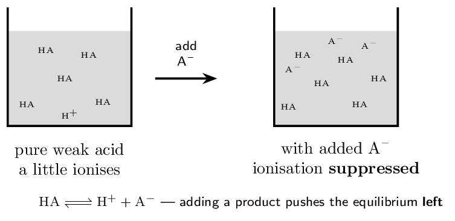

> 📘 **I do: the same acid, two solutions**
>
> **Compare 0.10 M acetic acid alone with
> 0.10 M acetic acid that also contains 0.10 M
> sodium acetate. $K_{a} = 1.8e-5$.**
> 
> **Alone** (Chapter 14, Ladder 9): $x = \sqrt{K_{a}c} = 1.34e-3$, so pH $= 2.87$.
> 
> **With acetate present**, the ICE table starts differently —
> acetate is no longer zero:
> 
> |  | $[\text{HA}]$ | $[\text{H+}]$ | $[\text{A-}]$ |
> |---|---|---|---|
> | **I** | 0.10 | 0 | **0.10** |
> | **C** | $-x$ | $+x$ | $+x$ |
> | **E** | $0.10-x$ | $x$ | $0.10+x$ |

$$ K_{a} = \frac{x(0.10+x)}{0.10-x}    \;\approx\; \frac{x(0.10)}{0.10} = x $$

So $x = K_{a} = 1.8e-5$ and pH $= 4.74$.

**Nearly two pH units less acidic**, from adding a salt that
contains no H+ at all. The added acetate pushed the ionisation
equilibrium left, exactly as Chapter 13's Le Ch\^atelier predicts.

**Notice what the algebra collapsed to.** With comparable amounts
of HA and A-, the two concentrations nearly cancel and
$[\text{H+}] \approx K_{a}$. That is the Henderson–Hasselbalch equation
in embryo (Ladder 3) — and it is why buffers are so easy to compute
once you see the pattern.

> ✏️ **YOUR TURN 1 — four questions**
>
> 1. Does adding NaF to HF solution raise or lower the pH?
>    Explain.
>    *(working space)*
> 2. Does it raise or lower the percent ionisation of HF?
>    *(working space)*
> 3. Does it change $K_{a}$? 
>    *(working space)*
> 4. Which ion in NaF is the “common” ion, and why is the
>    other irrelevant?
>    *(working space)*
> 
> > **check:** (a) raises it — equilibrium shifts left     (b) lowers
> it     (c) no     (d) F-; Na+ is a spectator

## Ladder 2 • What a buffer is, and why it
works

`ZUM §15.2`

A buffer contains **appreciable amounts of both members of a
conjugate pair**. That is the whole definition, and everything else
follows from it.

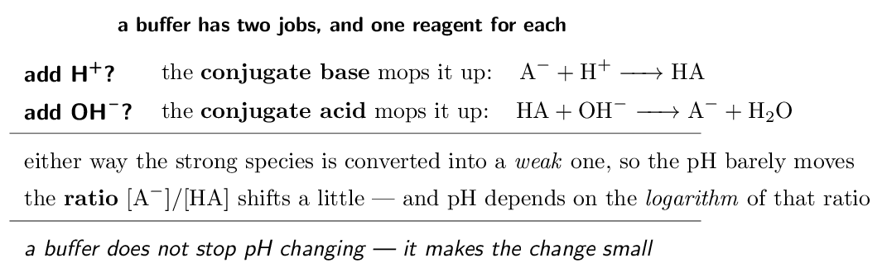

> 📘 **I do: why the pH barely moves**
>
> **This is CED topic 8.8, and it is an *argumentation* topic
> — the marks are for the explanation, not a number.**
> 
> **The mechanism, stated properly.** A buffer solution contains a
> large concentration of both members of a conjugate acid–base pair. The
> conjugate base reacts with added acid; the conjugate acid reacts with
> added base. Both reactions convert a *strong* species into a
> *weak* one, and a weak species contributes far less to the pH.
> 
> **Why the logarithm matters.** pH tracks the *ratio*
> $[\text{A-}]/[\text{HA}]$, and only through a logarithm. Take a buffer that
> is 0.50 M in each. Convert a tenth of the acid to base and
> the ratio goes from $1.00$ to $0.60/0.40 = 1.5$ — and
> $\log 1.5 = 0.18$, so the pH moves by less than two-tenths of a unit.
> The same amount of acid added to pure water would move the pH by
> several units.
> 
> **What a buffer is not.** It is not a substance that “absorbs”
> H+ indefinitely, and it does not hold pH *constant*. It
> resists change until one component is used up — which is Ladder 5.
> 
> **The exam sentence.** “The solution contains appreciable amounts
> of both HA and A-. Added H+ reacts with A- to form
> HA, and added OH- reacts with HA to form A-, so the
> ratio changes only slightly and the pH is stabilised.” Both directions,
> or you have answered half the question.
> 
> **And what makes a mixture a buffer.** Not any acid and base —
> a **conjugate pair**. HCl and NaOH together are not a
> buffer; they neutralise each other completely. CH₃COOH with
> NaCH₃COO is, and so is NH₃ with NH₄Cl.

> ✏️ **YOUR TURN 2 — four questions**
>
> 1. Which of these is a buffer? HCl/NaCl,
>    HF/NaF, HCl/NaOH.
>    *(working space)*
> 2. Which component reacts with added OH-?
>    *(working space)*
> 3. Write the equation for a buffer absorbing added H+.
>    *(working space)*
> 4. Does a buffer keep the pH exactly constant? Explain.
>    *(working space)*
> 
> > **check:** (a) HF/NaF     (b) the weak acid HA    
> (c) A- + H+ → HA     (d) no — it makes the change small

## Ladder 3 • Henderson–Hasselbalch

`ZUM §15.2`

$$ \text{pH} = \text{p}K_{a}    + \log\!\left(\frac{[\text{A-}]}{[\text{HA}]}\right) $$

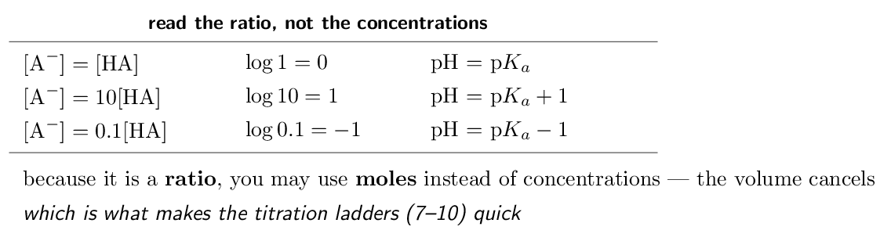

> 📌 **AP scope: use it, do not derive it**
>
> CED topic 8.9's exclusion: *“Derivation of the
> Henderson–Hasselbalch equation will not be assessed on the AP
> Exam.”* So you will never be asked where it comes from — only to
> apply it. (For the curious: take $K_{a} = [\text{H+}][\text{A-}]/[\text{HA}]$, solve for $[\text{H+}]$, and take
> $-\log$ of both sides. That is the whole derivation, and it is not
> examinable.)

> 📘 **I do: three buffers of the same acid**
>
> **Acetic acid has $K_{a} = 1.8e-5$, so
> p$K_{a} = 4.74$.**
> 
> **(a) Equal concentrations: 0.10 M CH₃COOH and
> 0.10 M CH₃COO-.**
> 
> $$ \text{pH} = 4.74 + \log\!\left(\frac{0.10}{0.10}\right)    = 4.74 + 0 = \mathbf{4.74} $$
> 
> When the two are equal, pH *is* p$K_{a}$ — the single most
> useful fact in this chapter, and the basis of Ladder 12.
> 
> **(b) Twice as much base: 0.10 M HA,
> 0.20 M A-.**
> 
> $$ \text{pH} = 4.74 + \log 2 = 4.74 + 0.30 = \mathbf{5.04} $$
> 
> **(c) Using moles instead.** Suppose a solution contains
> 0.030 mol HA and 0.020 mol A- in some volume:
> 
> $$ \text{pH} = 4.74 + \log\!\left(\frac{0.020}{0.030}\right)    = 4.74 - 0.18 = \mathbf{4.56} $$
> 
> No volume was needed, because both species sit in the *same*
> solution and the volume divides out of the ratio. This is why the
> titration ladders can work entirely in moles.
> 
> **Two errors to avoid.** The base goes on **top** — putting
> HA there flips the sign of the correction and moves the pH the
> wrong way. And the equation uses p$K_{a}$, not $K_{a}$: substituting
> $1.8e-5$ where $4.74$ belongs produces nonsense you should catch
> by inspection.
> 
> **When it stops being valid.** H–H assumes both species are
> present in appreciable, comparable amounts. If the ratio is more
> extreme than about 10:1 either way you no longer really have a buffer,
> and the assumption that neither concentration changes much begins to
> fail.

> ✏️ **YOUR TURN 3 — four questions**
>
> Acetic acid, p$K_{a} = 4.74$.
> 
> 1. 0.20 M HA and 0.20 M A-. Find
>    the pH.
>    *(working space)*
> 2. 0.10 M HA and 0.010 M A-. Find
>    the pH.
>    *(working space)*
> 3. 0.040 mol A- and 0.020 mol HA in one
>    solution. Find the pH.
>    *(working space)*
> 4. Why may you use moles instead of concentrations?
>    *(working space)*
> 
> > **check:** (a) 4.74     (b) 3.74     (c) 5.04     (d) the volume
> cancels in the ratio

## Ladder 4 • Designing a buffer

`ZUM §15.2`

Given a target pH, choose the acid first and the ratio second.

> 📘 **I do: build a buffer at pH 5.00**
>
> **Step 1 — choose an acid whose p$K_{a}$ is close to the target
> pH.** The correction term $\log(\text{ratio})$ should be small, which
> means p$K_{a}$ within about one unit of the target. For pH 5.00, acetic
> acid (p$K_{a} = 4.74$) is an excellent choice; HCN
> (p$K_{a} = 9.21$) would be a terrible one, because it would need a
> ratio of about $10^{-4}$ and there would be almost no CN- present
> to do any buffering.
> 
> **Step 2 — solve for the ratio.**
> 
> $$ 5.00 = 4.74 + \log\!\left(\frac{[\text{A-}]}{[\text{HA}]}\right) $$
> 
> $$ \log(\text{ratio}) = 0.26    \quad\Longrightarrow\quad    \text{ratio} = 10^{0.26} = \mathbf{1.8} $$
> 
> So you need about **1.8 moles of acetate for every 1 mole of
> acetic acid**.
> 
> **Step 3 — choose absolute amounts.** The ratio fixes the pH;
> the *concentrations* fix the capacity (Ladder 5). Using
> 0.10 M HA with 0.18 M A- gives pH 5.00,
> and so does 1.0 M with 1.8 M — but the second
> buffer will withstand ten times as much added acid or base.
> 
> **Two ways to make it in the lab.** Mix the weak acid with its
> salt directly, or — more common in practice — take the weak acid and
> add *part* of the strong base needed to neutralise it. Half-neutralise
> an acid and you get a buffer at exactly p$K_{a}$, which is Ladder 12.
> 
> **The choice-of-acid question is the assessed one.** If a question
> gives you four acids and a target pH, the answer is the one whose
> p$K_{a}$ is nearest — and the justification is that a ratio near 1
> gives comparable amounts of both species and therefore the greatest
> capacity in both directions.

> ✏️ **YOUR TURN 4 — four questions**
>
> p$K_{a}$: acetic $4.74$, HF $3.14$, HClO $7.46$, HCN
> $9.21$.
> 
> 1. Which acid would you choose for a pH 7.00 buffer? Why?
>    *(working space)*
> 2. Which for a pH 3.00 buffer? 
>    *(working space)*
> 3. For an acid with p$K_{a} = 4.74$, what ratio gives pH 4.44?
>    *(working space)*
> 4. Two buffers have the same ratio but one is ten times more
>    concentrated. Do they have the same pH?
>    *(working space)*
> 
> > **check:** (a) HClO     (b) HF     (c) 0.50     (d)
> yes

## Ladder 5 • Buffer capacity

`ZUM §15.3`

Capacity is how much acid or base a buffer can absorb before it stops
working. It is set by the *absolute* concentrations, not the
ratio.

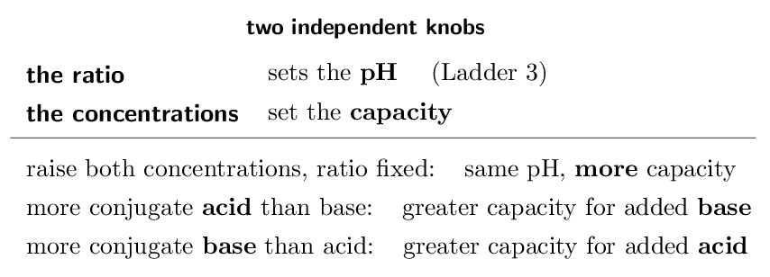

> 📘 **I do: same pH, different staying power**
>
> **Buffer A is 0.10 M in HA and
> 0.10 M in A-. Buffer B is 1.0 M in each.
> Compare them.**
> 
> **Same pH.** Both have ratio 1, so both sit at p$K_{a}$. The
> Henderson–Hasselbalch equation cannot tell them apart.
> 
> **Very different capacity.** Buffer B contains ten times as many
> moles of each component per litre, so it can absorb ten times as much
> added acid or base before either component runs out. This is CED
> 8.10.A.1: raising the concentrations while holding the ratio constant
> keeps the pH and increases the capacity.
> 
> **Now the asymmetry, which is 8.10.A.2 and less obvious.** A
> buffer with *more conjugate acid than base* has more HA
> available to react with added OH- — so it has greater capacity
> for added **base**. A buffer with more conjugate base than acid has
> more A- to react with added H+, so greater capacity for added
> **acid**. The component in excess defends against the species it
> reacts with.
> 
> **Which is worth saying slowly**, because the intuition often runs
> backwards. Extra *acid* in the buffer protects against added
> *base*, not against added acid — because it is the acid
> component that consumes hydroxide.
> 
> **And the practical consequence.** Capacity is greatest when the
> two components are roughly equal *and* both concentrated: equal
> amounts give balanced protection in both directions, and high
> concentration gives a lot of it. That is why buffers are normally made
> at p$K_{a}$ and at the highest concentration the experiment tolerates.

> ✏️ **YOUR TURN 5 — four questions**
>
> 1. Two buffers have ratio 1, one at 0.05 M and one at
>    0.50 M. Which has the higher pH?
>    *(working space)*
> 2. Which has the greater capacity? 
>    *(working space)*
> 3. A buffer has more A- than HA. Is it better at
>    absorbing added acid or added base?
>    *(working space)*
> 4. What two conditions give the greatest overall capacity?
>    *(working space)*
> 
> > **check:** (a) neither — same pH     (b) the 0.50 M one
>     (c) added acid     (d) equal amounts, both concentrated

## Ladder 6 • Strong acid $+$ strong base

`ZUM §15.4`

The simplest mixture, and the template for all the others: do the
stoichiometry first, then look at what is left.

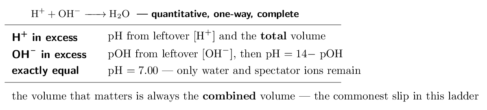

> 📌 **AP scope: a narrow exclusion, easy to over-read**
>
> CED topic 8.9 excludes *“computation of the change in pH
> resulting from the addition of an acid or a base to a buffer”*. Read
> that precisely: what is excluded is being handed an existing buffer and
> asked how much the pH *changes*. Computing the pH of a mixture
> made by combining a weak acid with a strong base is topic
> **8.4.A.2** and **is** assessed — the CED says so
> explicitly. Ladders 7–10 are that required material. The two
> calculations look almost identical, so do not let the exclusion
> frighten you off the titration work; it is the bulk of Unit 8's marks.

> 📘 **I do: mix and find the leftover**
>
> **Mix 50.0 mL of 0.100 M HCl
> with 30.0 mL of 0.100 M NaOH. Find the
> pH.**
> 
> **Step 1 — moles, not concentrations.**
> 
> $$ n(\text{H+}) = 0.0500 \times 0.100 = 5.00e-3\,\mathrm{mol} $$
> 
> $$ n(\text{OH-}) = 0.0300 \times 0.100 = 3.00e-3\,\mathrm{mol} $$
> 
> **Step 2 — react them completely.** They cancel one for one:
> 
> $$ \text{excess } \text{H+} = 5.00 \times 10^{-3} - 3.00 \times 10^{-3}    = 2.00e-3\,\mathrm{mol} $$
> 
> **Step 3 — divide by the TOTAL volume.**
> 
> $$ V_{\text{total}} = 50.0 + 30.0 = 80.0\,\mathrm{mL}    = 0.0800\,\mathrm{L} $$
> 
> $$ [\text{H+}] = \frac{2.00e-3}{0.0800}    = 0.0250\,\mathrm{M} $$
> 
> **Step 4 — take the logarithm.**
> 
> $$ \text{pH} = -\log(0.0250) = \mathbf{1.60} $$
> 
> **The two habits this ladder is for.** Work in **moles**
> through the stoichiometry, because concentrations change when you mix.
> And divide by the **combined** volume at the end — using
> 50.0 mL here would give pH 1.40 and be wrong by
> 0.2 units.
> 
> **Sanity check.** We started with excess acid, so the result must
> be acidic; pH 1.60 is, and it is higher than the original
> 0.100 M HCl (pH 1.00) because some acid was neutralised
> and the rest diluted. Both effects push the same way.

> ✏️ **YOUR TURN 6 — four questions**
>
> 1. Mix 25.0 mL of 0.200 M HCl
>    with 25.0 mL of 0.100 M NaOH.
>    Find the excess in moles.
>    *(working space)*
> 2. Find the pH of that mixture. 
>    *(working space)*
> 3. Mix equal volumes of 0.100 M HCl and
>    0.100 M NaOH. Give the pH.
>    *(working space)*
> 4. Why must you use the combined volume?
>    *(working space)*
> 
> > **check:** (a) 2.50e-3 mol H+     (b) 1.30     (c)
> 7.00     (d) the solution is diluted on mixing

## Ladder 7 • Weak acid $+$ strong base:
the stoichiometry step

`ZUM §15.4`

Now the reaction that generates a buffer. The strong base is consumed
*completely*, so this step is stoichiometry — no equilibrium
yet.

HA + OH- → A- + H₂O

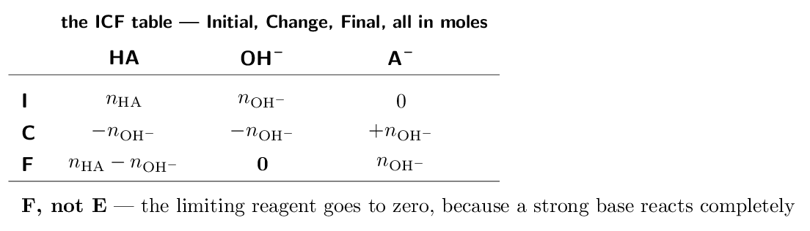

> ⚠️ **AP trap**
>
> **It is an IC*F* table, not an IC*E* table.** The strong
> base is not in equilibrium with anything — it is consumed to
> **zero**. Writing “$-x$” here, or leaving leftover OH- in an
> equilibrium expression, confuses two different steps. Do the
> stoichiometry to completion first; *then*, if a weak species
> remains, do the equilibrium.

> 📘 **I do: what is in the flask?**
>
> **50.0 mL of 0.100 M acetic acid is
> treated with 20.0 mL of 0.100 M NaOH.
> What is present afterwards?**
> 
> **Moles first.**
> 
> $$ n(\text{HA}) = 0.0500 \times 0.100 = 5.00e-3\,\mathrm{mol} $$
> 
> $$ n(\text{OH-}) = 0.0200 \times 0.100 = 2.00e-3\,\mathrm{mol} $$
> 
> **The ICF table.**
> 
> | (mol) | HA | OH- | A- |
> |---|---|---|---|
> | **I** | 5.00e-3 | 2.00e-3 | 0 |
> | **C** | $-2.00e-3$ | $-2.00e-3$ | $+2.00e-3$ |
> | **F** | 3.00e-3 | **0** | 2.00e-3 |

**Read the F row and name the situation.** Both HA and
A- are present in appreciable amounts — **this is a
buffer**. The hydroxide is gone.

**So the pH comes from Henderson–Hasselbalch**, using the mole
amounts directly (Ladder 3 showed the volume cancels):

$$ \text{pH} = 4.74 + \log\!\left(\frac{2.00e-3}{3.00e-3}\right)    = 4.74 - 0.18 = \mathbf{4.56} $$

**The F row tells you which method to use**, and that is the real
skill:

- HA and A- both present $\Rightarrow$ buffer, use H–H
- only A- left $\Rightarrow$ equivalence point, use $K_{b}$
   (Ladder 9)
- OH- left over $\Rightarrow$ past equivalence, use excess
   hydroxide (Ladder 8)

Every weak-acid titration question is one of these three, and the ICF
table decides which.

> ✏️ **YOUR TURN 7 — four questions**
>
> 50.0 mL of 0.100 M HA
> ($\text{p}K_{a} = 4.74$) is treated with 0.100 M NaOH.
> 
> 1. After 10.0 mL of base, give the moles of
>    HA and A-.
>    *(working space)*
> 2. Find the pH at that point. 
>    *(working space)*
> 3. After 25.0 mL, give the moles of each and the
>    pH.
>    *(working space)*
> 4. Why is it an ICF and not an ICE table?
>    *(working space)*
> 
> > **check:** (a) 4.00e-3  and 1.00e-3 mol     (b) 4.14
>     (c) 2.50e-3  each, pH 4.74     (d) the strong base is
> consumed completely

## Ladder 8 • The three regions of a
titration

`ZUM §15.4`

One titration, three different calculations, and the ICF table tells
you which you are in.

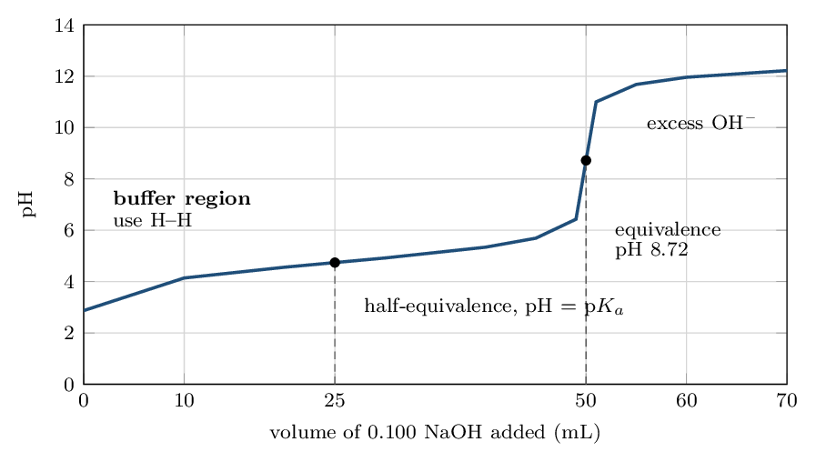

> 📘 **I do: past the equivalence point**
>
> **Continue the titration from Ladder 7 to
> 60.0 mL of 0.100 M NaOH. Find the pH.**
> 
> **ICF first, as always.**
> 
> $$ n(\text{HA}) = 5.00e-3    \qquad    n(\text{OH-}) = 0.0600 \times 0.100 = 6.00e-3 $$
> 
> The base is now in excess:
> 
> $$ \text{excess } \text{OH-} = 6.00 \times 10^{-3} - 5.00 \times 10^{-3}    = 1.00e-3\,\mathrm{mol} $$
> 
> **Read the F row.** There is leftover *strong* base. Strong
> base overwhelms the weak conjugate base A- that is also present —
> by several orders of magnitude — so the acetate contributes nothing
> worth counting and the pH comes from the excess hydroxide alone.
> 
> **Divide by the total volume and finish.**
> 
> $$ V = 50.0 + 60.0 = 110.0\,\mathrm{mL} = 0.110\,\mathrm{L} $$
> 
> $$ [\text{OH-}] = \frac{1.00e-3}{0.110}    = 9.09e-3\,\mathrm{M} $$
> 
> $$ \text{pOH} = 2.04    \qquad    \text{pH} = 14.00 - 2.04 = \mathbf{11.96} $$
> 
> **Notice this is Ladder 6's calculation.** Once strong base is in
> excess, a weak-acid titration behaves exactly like a strong-acid one —
> which is why the two curves in Ladder 11 converge after the equivalence
> point.
> 
> **The three regions, one last time.** Before equivalence: buffer,
> use H–H. At equivalence: only A-, use its $K_{b}$ (Ladder 9).
> After equivalence: excess OH-, use it directly. Identify the region
> from the ICF table and the method chooses itself.

> ✏️ **YOUR TURN 8 — four questions**
>
> 50.0 mL of 0.100 M HA
> (p$K_{a} = 4.74$) with 0.100 M NaOH.
> 
> 1. Which region is 40.0 mL in, and what is the pH?
>    *(working space)*
> 2. Which region is 55.0 mL in?
>    *(working space)*
> 3. Find the pH at 55.0 mL.
>    *(working space)*
> 4. Why does the acetate present after equivalence not affect the
>    pH?
>    *(working space)*
> 
> > **check:** (a) buffer, pH 5.34     (b) past equivalence     (c)
> 11.68     (d) the strong base overwhelms it

## Ladder 9 • pH at the equivalence point

`ZUM §15.4`

At equivalence the acid is exactly consumed and *only the
conjugate base remains*. That is a weak-base problem — Chapter 14,
Ladder 11.

> ⚠️ **AP trap**
>
> **The equivalence point of a weak acid titration is not pH 7.** It
> is *basic*, because the solution at that moment is a solution of
> A-, which is a weak base. Answering “7” is the standard error and
> costs the whole part. Only a *strong* acid with a strong base
> gives 7.

> 📘 **I do: the equivalence point, in full**
>
> **Find the pH at the equivalence point of the Ladder 7 titration:
> 50.0 mL of 0.100 M acetic acid with
> 0.100 M NaOH. $K_{a} = 1.8e-5$.**
> 
> **Step 1 — how much base, and what is left?** Equivalence needs
> 5.00e-3 mol of OH-, which is
> 50.0 mL. The F row is: no HA, no OH-, and
> 5.00e-3 mol of A-.
> 
> **Step 2 — concentration of the conjugate base**, using the
> **total** volume:
> 
> $$ [\text{A-}] = \frac{5.00e-3}{0.100\;\mathrm{L}}    = 0.0500\,\mathrm{M} $$
> 
> The dilution is real — the acetate sits in twice the original volume.
> 
> **Step 3 — treat it as the weak base it is.**
> 
> $$ K_{b} = \frac{K_{w}}{K_{a}}    = \frac{1.0e-14}{1.8e-5} = 5.6e-10 $$
> 
> $$ x = \sqrt{K_{b}c} = \sqrt{(5.6e-10)(0.0500)}      = 5.3e-6\,\mathrm{M} = [\text{OH-}] $$
> 
> Check: $5.3e-6/0.0500$ is far below 5%. ✓
> 
> **Step 4 — convert to pH**, remembering $x$ is $[\text{OH-}]$:
> 
> $$ \text{pOH} = 5.28    \qquad    \text{pH} = 14.00 - 5.28 = \mathbf{8.72} $$
> 
> **Basic, as it must be.** And note the two dilution traps this
> problem contains: the volume doubled, and $x$ gave pOH rather than pH.
> Either slip alone produces a wrong answer that still *looks*
> plausible.
> 
> **The four-step shape is worth memorising** — moles to
> equivalence, concentration in the total volume, $K_{b}$ from $K_{a}$,
> then the weak-base ICE. It is the same shape for a weak base titrated
> with strong acid (Ladder 10), with acid and base interchanged.

> ✏️ **YOUR TURN 9 — four questions**
>
> 1. Is the equivalence pH of a weak acid $+$ strong base titration
>    above or below 7? Why?
>    *(working space)*
> 2. What volume of 0.100 M NaOH reaches
>    equivalence for 25.0 mL of 0.100 M
>    HA?
>    *(working space)*
> 3. At that equivalence point, give $[\text{A-}]$.
>    *(working space)*
> 4. Which constant do you use at the equivalence point, $K_{a}$ or
>    $K_{b}$?
>    *(working space)*
> 
> > **check:** (a) above 7 — A- is a weak base     (b)
> 25.0 mL     (c) 0.0500 M     (d)
> $K_{b}$

## Ladder 10 • Weak base $+$ strong acid

`ZUM §15.4`

The mirror image. Same three regions, same two-step method, everything
reflected about pH 7.

B + H+ → BH+

> 📘 **I do: ammonia titrated with hydrochloric acid**
>
> **50.0 mL of 0.100 M NH₃
> ($K_{b} = 1.8e-5$) is titrated with 0.100 M HCl.**
> 
> **First convert to the acid constant you will need.** The buffer
> here is NH₃/NH₄+, and Henderson–Hasselbalch is written for a
> conjugate acid:
> 
> $$ K_{a}(\text{NH₄+}) = \frac{1.0e-14}{1.8e-5}    = 5.6e-10    \qquad    \text{p}K_{a} = 9.26 $$
> 
> **At half-equivalence (25.0 mL of acid):** the ICF
> row gives 2.50e-3 mol each of NH₃ and NH₄+, so
> 
> $$ \text{pH} = 9.26 + \log 1 = \mathbf{9.26} $$
> 
> Still basic — the buffer region of a weak-base titration sits above 7.
> 
> **At equivalence (50.0 mL):** everything is
> NH₄+, at
> 
> $$ [\text{NH₄+}] = \frac{5.00e-3}{0.100} = 0.0500\,\mathrm{M} $$
> 
> NH₄+ is a weak *acid*, so
> 
> $$ x = \sqrt{(5.6e-10)(0.0500)} = 5.3e-6 = [\text{H+}] $$
> 
> $$ \text{pH} = \mathbf{5.28} $$
> 
> **Acidic at equivalence**, which is the mirror of Ladder 9's 8.72
> — and notice $8.72 + 5.28 = 14.00$ exactly, because acetic acid's
> $K_{a}$ and ammonia's $K_{b}$ happen to be the same number. That
> symmetry is a good check when a problem is built from that pair.
> 
> **The rule for equivalence-point pH, in one line.** Strong$+$strong
> gives 7; weak acid $+$ strong base gives above 7; weak base $+$ strong
> acid gives below 7. The *weak* partner determines which way, and
> its conjugate is what remains in the flask.

> ✏️ **YOUR TURN 10 — four questions**
>
> NH₃, $K_{b} = 1.8e-5$, p$K_{a}(\text{NH₄+}) = 9.26$.
> 
> 1. Is the equivalence pH above or below 7? Why?
>    *(working space)*
> 2. In the buffer region, which two species are present?
>    *(working space)*
> 3. 50.0 mL of 0.100 M NH₃ plus
>    20.0 mL of 0.100 M HCl: find
>    the pH.
>    *(working space)*
> 4. Which constant do you need for the H–H equation here, and why?
>    *(working space)*
> 
> > **check:** (a) below 7 — NH₄+ is a weak acid     (b) NH₃
> and NH₄+     (c) 9.44     (d) $K_{a}$ of NH₄+

## Ladder 11 • Reading titration curves

`ZUM §15.4–15.5`

Two curves, one titrant, and the differences are all diagnostic.

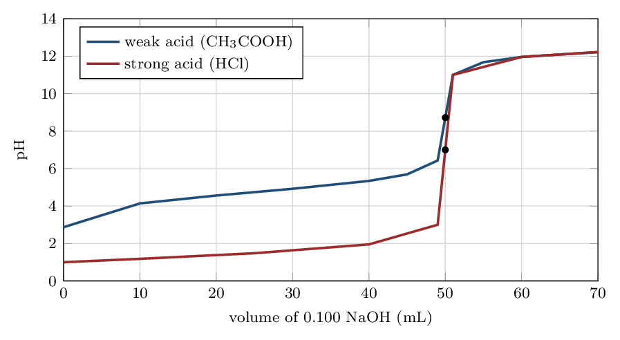

> 📘 **I do: four things a curve tells you**
>
> **Compare the two curves above. Both titrate
> 50.0 mL of a 0.100 M acid with the same
> base.**
> 
> **1. The starting pH.** The weak acid starts at 2.87, the strong
> acid at 1.00. A high starting pH for a given concentration is the first
> sign of a weak acid.
> 
> **2. The buffer plateau.** The weak-acid curve has a long, gentle
> stretch between about 10 and 40 mL where the pH barely
> moves. The strong-acid curve has no such region — there is no
> conjugate pair to buffer it. **A flat middle region means a weak
> acid.**
> 
> **3. The equivalence pH.** 8.72 for the weak acid, 7.00 for the
> strong. Above 7 identifies a weak acid immediately.
> 
> **4. The equivalence *volume* is the same for both:**
> 50.0 mL. This is the point students find surprising —
> the volume depends only on *moles* of acid, not on strength. A weak
> acid needs exactly as much base as a strong one at the same
> concentration. Strength changes the *shape* of the curve, not
> where the equivalence point falls.
> 
> **And after equivalence the curves coincide**, because both
> solutions are then just excess NaOH diluted into a similar volume.
> Whatever acid you started with stops mattering once it is gone.
> 
> **The steep jump is what makes titration work as a measurement.**
> Near equivalence, a fraction of a millilitre swings the pH by several
> units, so the endpoint is sharp and easy to detect — which is Ladder
> 13's business.

> ✏️ **YOUR TURN 11 — four questions**
>
> 1. Two acids of the same concentration are titrated. One curve
>    starts at pH 1.0 and one at 3.0. Which is weak?
>    *(working space)*
> 2. A titration curve has equivalence pH 9.0. What kind of acid was
>    it?
>    *(working space)*
> 3. Does a weak acid need more, less, or the same volume of base to
>    reach equivalence as a strong acid of the same concentration?
>    *(working space)*
> 4. What feature of the curve shows a buffer region?
>    *(working space)*
> 
> > **check:** (a) the one starting at 3.0     (b) weak     (c) the
> same     (d) the flat, gently sloping stretch

## Ladder 12 • The half-equivalence point

`ZUM §15.4`

The single most useful point on any weak-acid curve.

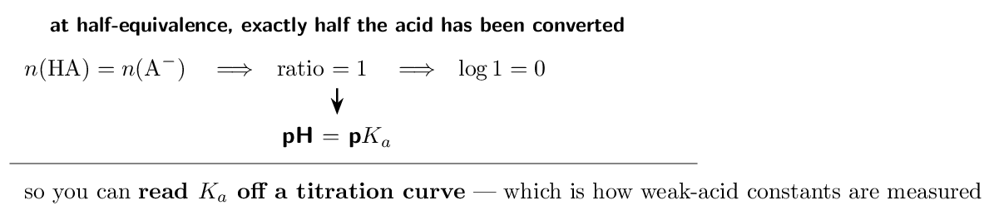

> 📘 **I do: measuring $K_{a}$ from a graph**
>
> **A weak acid is titrated. The equivalence point is at
> 40.0 mL of base, and the pH at
> 20.0 mL is 5.20. Find $K_{a}$.**
> 
> **Locate half-equivalence.** Half of 40.0 mL is
> 20.0 mL — so the given point *is* the
> half-equivalence point.
> 
> **Apply the identity.** There, $[\text{HA}] = [\text{A-}]$, so the
> logarithm vanishes and
> 
> $$ \text{pH} = \text{p}K_{a} = 5.20 $$
> 
> **Convert.**
> 
> $$ K_{a} = 10^{-5.20} = \mathbf{6.3e-6} $$
> 
> **This is a real laboratory method**, not a textbook trick. Titrate
> a weak acid, find the equivalence volume from the steep jump, halve it,
> read the pH there, and you have p$K_{a}$ — no separate experiment
> required.
> 
> **Why the point is flat, which is the practical payoff.** At
> half-equivalence the curve is at its most horizontal, so a small error
> in reading the volume produces almost no error in the pH. The
> measurement is unusually forgiving, which is exactly what you want from
> a method.
> 
> **Two cautions.** Half-equivalence is half the volume *to
> equivalence*, not half the total volume added, and not the middle of the
> graph. And this identity holds only for a weak acid or base — a strong
> acid has no buffer region and no p$K_{a}$ to read.

> ✏️ **YOUR TURN 12 — four questions**
>
> 1. Equivalence is at 30.0 mL. Where is
>    half-equivalence?
>    *(working space)*
> 2. The pH there is 4.20. Give p$K_{a}$ and $K_{a}$.
>    *(working space)*
> 3. Why does the logarithm term vanish at half-equivalence?
>    *(working space)*
> 4. Can you use this method on a strong acid? Explain.
>    *(working space)*
> 
> > **check:** (a) 15.0 mL     (b) 4.20 and
> 6.3e-5     (c) the ratio is 1     (d) no — no buffer
> region

## Ladder 13 • Choosing an indicator

`ZUM §15.5`

An indicator is itself a weak acid whose two forms differ in colour. It
changes over roughly $\text{p}K_{a} \pm 1$.

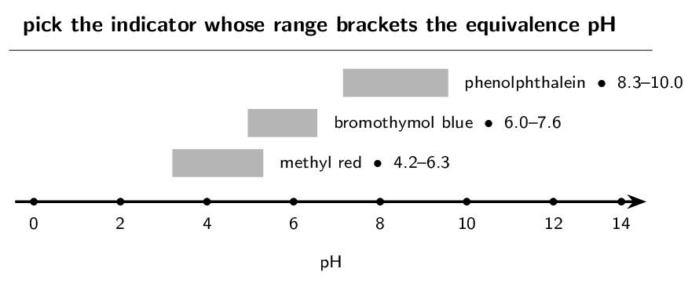

> 📘 **I do: three titrations, three indicators**
>
> **The rule: the indicator's colour-change range must contain the
> equivalence pH, so the colour change coincides with the steep jump.**
> 
> **Strong acid $+$ strong base**, equivalence pH 7.00.
> **Bromothymol blue** (6.0–7.6) brackets it neatly. Phenolphthalein
> also works in practice, because the jump at equivalence is so nearly
> vertical that it passes through 8.3 within a fraction of a drop.
> 
> **Weak acid $+$ strong base**, equivalence pH 8.72 (Ladder 9).
> **Phenolphthalein** (8.3–10.0) is the correct choice. Methyl red
> would change colour around pH 5 — long before equivalence — and
> would report a badly low volume.
> 
> **Weak base $+$ strong acid**, equivalence pH 5.28 (Ladder 10).
> **Methyl red** (4.2–6.3). Phenolphthalein would change far too
> late.
> 
> **Why the steep jump makes this work at all.** Near equivalence the
> pH moves several units within a fraction of a millilitre, so any
> indicator whose range lies inside that jump changes colour at
> essentially the right volume. The steeper the jump, the more forgiving
> the choice — which is why a strong–strong titration tolerates almost
> any indicator and a weak–weak titration is not worth attempting.
> 
> **Endpoint versus equivalence point.** The **equivalence
> point** is where the moles match — a fact about the chemistry. The
> **endpoint** is where the indicator changes — what you actually
> observe. A well-chosen indicator makes them nearly coincide; a poor one
> makes them differ, and that difference is systematic experimental error.

> ✏️ **YOUR TURN 13 — four questions**
>
> 1. Which indicator suits an equivalence pH of 9.0?
>    *(working space)*
> 2. Which suits an equivalence pH of 5.0?
>    *(working space)*
> 3. Distinguish the endpoint from the equivalence point.
>    *(working space)*
> 4. Why can a strong–strong titration tolerate almost any
>    indicator?
>    *(working space)*
> 
> > **check:** (a) phenolphthalein     (b) methyl red     (c) observed
> colour change vs where moles match     (d) the pH jump is very steep

## Ladder 14 • Polyprotic titration curves

`ZUM §15.6`

A diprotic acid gives up its protons in stages, so its curve has
**two** equivalence points.

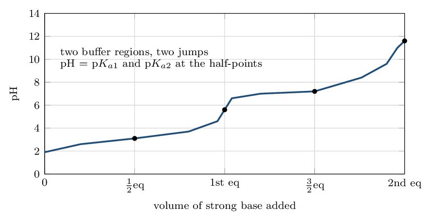

> 📌 **AP scope: shapes yes, species computations no**
>
> CED topic 8.5's exclusion: *“Computation of the concentration of
> each species present in the titration curve for polyprotic acids will
> not be assessed on the AP Exam.”* The same sentence goes on to say
> that these computations *are* in scope for **monoprotic**
> acids (that is Ladders 7–10), *“as is qualitative reasoning
> regarding what species are present”*. So for polyprotic acids: read
> the curve, identify the equivalence points, say which species dominates
> where — but do not expect to calculate concentrations.

> 📘 **I do: reading a diprotic curve**
>
> **A diprotic acid H₂A is titrated with strong base. What
> happens, in order?**
> 
> **First stage.** H₂A + OH- → HA- + H₂O consumes the first
> proton. The buffer region here is H₂A/HA-, and at its
> half-point pH $=$ p$K_{a1}$.
> 
> **First equivalence point.** All the acid is now HA-. This
> species is **amphoteric** — it can lose another proton or gain
> one back — and it sits at the first jump.
> 
> **Second stage.** HA- + OH- → A²⁻ + H₂O takes the second
> proton. The buffer region is now HA-/A²⁻, and its half-point
> gives pH $=$ p$K_{a2}$.
> 
> **Second equivalence point.** Everything is A²⁻, a
> reasonably strong base, so the pH is well above 7.
> 
> **Two features to point out on a graph.** The second equivalence
> volume is exactly *twice* the first, because the second proton
> needs as much base as the first. And the first jump is usually smaller
> and less sharp than the second, because $K_{a1}$ and $K_{a2}$ are
> typically only a few orders of magnitude apart — the two stages
> overlap slightly.
> 
> **What you will be asked.** Identify the equivalence points; say
> which species predominates in each region; explain why the second
> equivalence pH is higher. What you will *not* be asked is to
> compute the concentration of each species — the exclusion note above
> says so explicitly.

> ✏️ **YOUR TURN 14 — four questions**
>
> 1. How many equivalence points does a diprotic acid curve have?
>    *(working space)*
> 2. If the first is at 20.0 mL, where is the
>    second?
>    *(working space)*
> 3. Which species predominates between the two equivalence points?
>    *(working space)*
> 4. What does the pH equal at the first half-equivalence point?
>    *(working space)*
> 
> > **check:** (a) two     (b) 40.0 mL     (c)
> HA-     (d) p$K_{a1}$

## Mixed set • ten questions, no labels

> 📌 **Why this section exists**
>
> Every question so far arrived with its ladder attached. These ten do
> not — and in this chapter the first decision is almost always
> *which region am I in*: excess strong reagent, buffer, or
> equivalence. Build the ICF table and the region names itself.

> ✏️ **MIXED SET — first five**
>
> 1. A buffer is 0.20 M HA and 0.10 M
>    A-, p$K_{a} = 4.74$. Find the pH.
>    *(working space)*
> 2. Mix 40.0 mL of 0.100 M HCl
>    with 20.0 mL of 0.100 M NaOH.
>    Find the pH.
>    *(working space)*
> 3. Which is a buffer: NH₃/NH₄Cl or
>    NaOH/NaCl?
>    *(working space)*
> 4. Equivalence is at 36.0 mL and the pH at
>    18.0 mL is 3.80. Find $K_{a}$.
>    *(working space)*
> 5. Two buffers have the same ratio; one is five times more
>    concentrated. Compare their pH and capacity.
>    *(working space)*
> 
> > **check:** (a) 4.44     (b) 1.48     (c) NH₃/NH₄Cl    
> (d) 1.6e-4     (e) same pH, 5x capacity

> ✏️ **MIXED SET — last five**
>
> 1. 50.0 mL of 0.100 M HA
>    (p$K_{a} = 4.74$) plus 30.0 mL of
>    0.100 M NaOH: find the pH.
>    *(working space)*
> 2. The same acid plus 50.0 mL of base: name the
>    region and say whether the pH is above or below 7.
>    *(working space)*
> 3. Which indicator would you use for that titration?
>    *(working space)*
> 4. A weak base is titrated with strong acid. Is the equivalence pH
>    above or below 7?
>    *(working space)*
> 5. A diprotic acid's first equivalence is at
>    15.0 mL. Where is the second, and which species
>    dominates between them?
>    *(working space)*
> 
> > **check:** (a) 4.92     (b) equivalence, above 7     (c)
> phenolphthalein     (d) below 7     (e)
> 30.0 mL; HA-

## Mastery tracker

Tick a row only if **all four** YOUR TURN questions were right on
the first attempt. Two rows carry CED exclusions — see the scope notes
in Ladders 6 and 14 — but both exclusions are narrow, and everything
else here is fully assessed.

| **First try?** | **Skill** | **Ladder** | **If not, re-read…** |
|---|---|---|---|
| $\square$ | the common-ion effect | 1 | adding a product shifts left |
| $\square$ | what a buffer is | 2 | both halves of one pair |
| $\square$ | Henderson–Hasselbalch | 3 | base on top, use p$K_{a}$ |
| $\square$ | designing a buffer | 4 | pick p$K_{a}$ near the target |
| $\square$ | buffer capacity | 5 | ratio sets pH, amount sets capacity |
| $\square$ | strong $+$ strong | 6 | moles first, total volume |
| $\square$ | the ICF stoichiometry step | 7 | F, not E |
| $\square$ | the three regions | 8 | the F row picks the method |
| $\square$ | the equivalence point | 9 | not pH 7 — use $K_{b}$ |
| $\square$ | weak base $+$ strong acid | 10 | convert $K_{b}$ to $K_{a}$ |
| $\square$ | reading titration curves | 11 | same volume, different shape |
| $\square$ | the half-equivalence point | 12 | pH $=$ p$K_{a}$ |
| $\square$ | choosing an indicator | 13 | bracket the equivalence pH |
| $\square$ | polyprotic curves | 14 | shapes yes, computations no |
| $\square$ | **mixed set** (8 of 10) | — | whichever it exposed |

> 📌 **Scoring yourself honestly**
>
> 14/14 and the mixed set: Unit 8 is complete, and it is the largest
> single block of marks in the course after Unit 3.
> 
> 10–13: look at *where*. Ladders 1–5 are buffers and repair
> quickly. Ladders 6–10 are the two-step method, and nearly every miss
> there is one of two things: forgetting the **total** volume, or
> trying to do stoichiometry and equilibrium in the same table. Both are
> mechanical and both are fixable in an afternoon.
> 
> 9 or fewer: do not practise more problems yet. Go back to Ladder 7 and
> build the ICF table for five different volumes of the same titration,
> stopping each time at the F row without computing a pH. The skill this
> chapter actually tests is *recognising which of three situations
> you are in*; the arithmetic afterwards is Chapter 14's and you already
> have it.
> 
> **Where this sits.** Chapters 14 and 15 together are Unit 8 —
> 11–15% of the exam. With this chapter done, the self-study series is
> complete: every chapter of Zumdahl that the CED assesses now has one.

---

*AP Chemistry course materials • student edition • CC BY-NC-SA 4.0*
