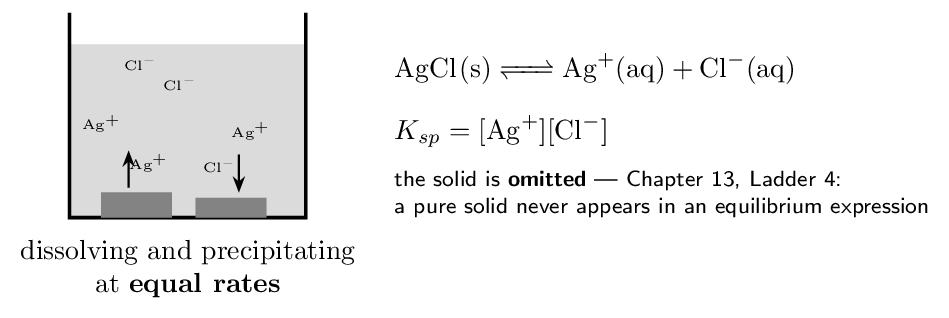
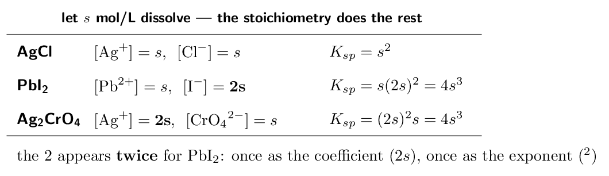
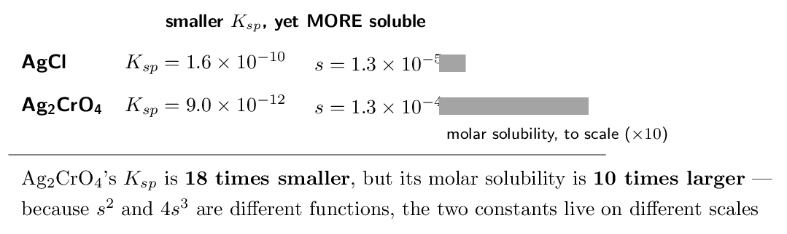
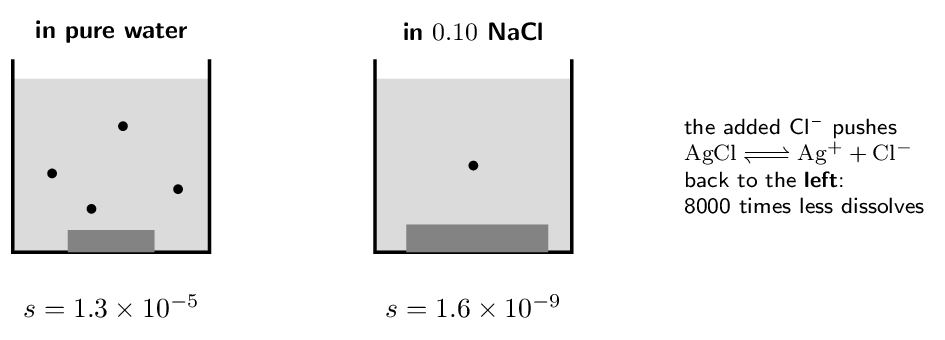
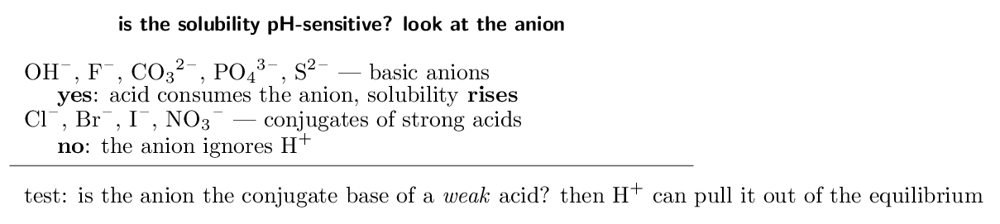
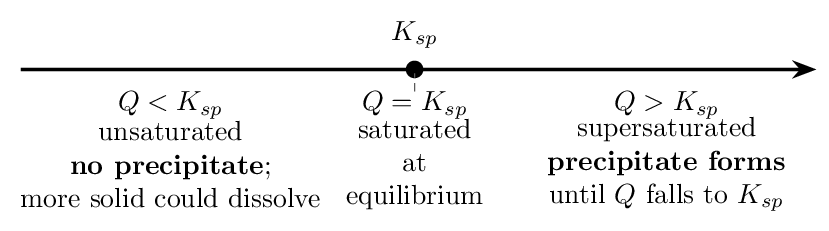
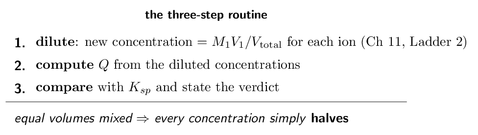
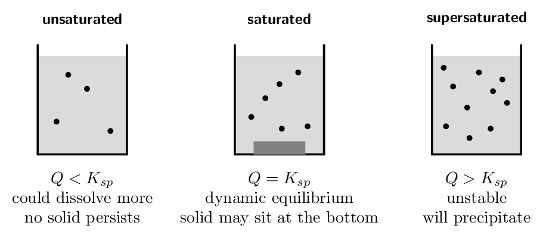

# Self-Study • Chapter 16, I do / You do

*Chapter 16 • Solubility Equilibria*  
Zumdahl §16.1 $+$ §16.2 (Q vs $K_sp$) • PDF pp. 805–819

[← all lessons](../index.md)

---

> 📌 **How to use these notes — read this first**
>
> Each skill is a **ladder**: a fully worked example in the
> solid-framed box, then **four** YOUR TURN questions in the dashed
> box — same skill, new numbers, no help. Work all four before checking
> the gray *check:* line; a tracker tick needs all four right first
> time. A ten-question **mixed set** follows Ladder 9.
> 
> **What is in and what is out — checked against the CED
> itself.** §16.1 ($K_{sp}$, molar solubility, the common-ion effect, pH
> and solubility) is fully assessed: CED topics 7.11, 7.12 and 8.11.
> From §16.2, predicting whether a **precipitate forms** by
> comparing $Q$ with $K_{sp}$ is assessed — it is Chapter 13's $Q$
> machinery applied to dissolving. The rest of §16.2 (selective
> precipitation schemes, qualitative analysis) and all of §16.3
> (complex ions) do not appear anywhere in the CED and are not treated
> here.
> 
> **What you must bring with you.** Chapter 13, again. A $K_{sp}$
> problem is an equilibrium problem where the ICE table is so simple it
> barely deserves the name — the initial concentrations are zero and
> everything is written in one unknown. If heterogeneous equilibria
> (Chapter 13, Ladder 4) and $Q$ versus $K$ (Ladder 6) are solid, this
> chapter is two ideas and some algebra.
> 
> **The one idea underneath everything.** A “saturated” solution
> is not a solution where dissolving has stopped — it is a
> **dynamic equilibrium** where dissolving and precipitating run at
> equal rates, and $K_{sp}$ is just the equilibrium constant for it.

## Ladder 1 • The dissolution equilibrium
and $K_{sp}$

`ZUM §16.1`

Drop solid AgCl into water. A little dissolves, then the solution
saturates — and from that moment ions leave the crystal exactly as
fast as they return to it.

> ⚠️ **AP trap**
>
> $K_{sp}$ expressions have **no denominator**. The only thing on
> the left of the dissolution equation is a pure solid, and pure solids
> are omitted — so nothing is left to divide by. Writing
> $[\text{Ag+}][\text{Cl-}]/[\text{AgCl}]$ is the error this ladder exists to
> prevent.

> 📘 **I do: three expressions, mind the exponents**
>
> **(a) BaSO₄(s) ⇌ Ba²⁺(aq) + SO₄²⁻(aq)**
> 
> $$ K_{sp} = [\text{Ba²⁺}][\text{SO₄²⁻}] $$
> 
> **(b) PbI₂(s) ⇌ Pb²⁺(aq) + 2I-(aq)**
> 
> $$ K_{sp} = [\text{Pb²⁺}][\text{I-}]^{2} $$
> 
> The coefficient 2 on iodide becomes an exponent — exactly as in every
> equilibrium expression since Chapter 13.
> 
> **(c) Ca₃(PO₄)₂(s) ⇌ 3Ca²⁺(aq) + 2PO₄³⁻(aq)**
> 
> $$ K_{sp} = [\text{Ca²⁺}]^{3}[\text{PO₄³⁻}]^{2} $$
> 
> **The procedure is always the same two steps.** Write the
> dissolution equation — solid on the left, ions on the right, with the
> subscripts of the formula becoming the coefficients of the ions. Then
> write the product of the ion concentrations, each raised to its
> coefficient. There is nothing else to it, and there is no denominator.
> 
> **Why $K_{sp}$ values are so small.** These are all salts your
> solubility rules call “insoluble”. Insoluble does not mean zero
> dissolves — it means the equilibrium lies far to the left, which is
> exactly the statement $K_{sp} \ll 1$. The solubility rules of Chapter 4
> are the qualitative shadow of this chapter's numbers: $K_{sp} > 1$
> corresponds to the salts the rules call soluble.

> ✏️ **YOUR TURN 1 — four questions**
>
> Write the dissolution equation and the $K_{sp}$ expression.
> 
> 1. AgBr 
>    *(working space)*
> 2. CaF₂ 
>    *(working space)*
> 3. Ag₂CrO₄ 
>    *(working space)*
> 4. Why does the solid not appear in the expression?
>    *(working space)*
> 
> > **check:** (a) $[\text{Ag+}][\text{Br-}]$     (b)
> $[\text{Ca²⁺}][\text{F-}]^{2}$     (c)
> $[\text{Ag+}]^{2}[\text{CrO₄²⁻}]$     (d) pure solids are omitted

## Ladder 2 • Molar solubility — one
unknown does everything

`ZUM §16.1`

**Molar solubility**, $s$, is the number of moles of the solid
that dissolve per litre of saturated solution. Every ion concentration
is a multiple of it.

> ⚠️ **AP trap**
>
> **“Doubled AND squared” feels like counting twice. It is not.**
> $[\text{I-}] = 2s$ because each formula unit releases two iodides —
> that is stoichiometry. $[\text{I-}]$ is then *squared* because the
> equilibrium expression demands the coefficient as an exponent — that
> is the law of mass action. Two different rules, applied once each.
> Dropping either one is the most common $K_{sp}$ error on the exam.

> 📘 **I do: from measured solubility to $K_{sp}$**
>
> **(a) The molar solubility of AgCl is
> 1.3e-5 M at 25 °C. Find $K_{sp}$.**
> 
> Each dissolved formula unit gives one Ag+ and one Cl-:
> 
> $$ [\text{Ag+}] = [\text{Cl-}] = s = 1.3e-5 $$
> 
> $$ K_{sp} = s^{2} = (1.3e-5)^{2} = \mathbf{1.7e-10} $$
> 
> **(b) The molar solubility of PbI₂ is
> 1.5e-3 M. Find $K_{sp}$.**
> 
> Here $[\text{Pb²⁺}] = s$ and $[\text{I-}] = 2s = 3.0e-3$:
> 
> $$ K_{sp} = s(2s)^{2} = 4s^{3}           = 4(1.5e-3)^{3}           = 4 \times 3.375e-9           = \mathbf{1.4e-8} $$
> 
> **Check the setup before the arithmetic.** The commonest wrong
> answer here is $s \times (2s)$ without the square, or
> $s \times s^{2}$ without the doubling. Write the two ion
> concentrations explicitly first — $s$ and $2s$ — then substitute
> into the $K_{sp}$ expression you wrote in Ladder 1. Setup first,
> numbers second.
> 
> **Where these measurements come from.** Evaporate a litre of the
> saturated solution and weigh what is left, or measure the conductivity,
> or use a spectrometer — molar solubility is an experimental quantity,
> and $K_{sp}$ tables are built from exactly this calculation.

> ✏️ **YOUR TURN 2 — four questions**
>
> 1. The molar solubility of AgBr is 7.1e-7 M.
>    Find $K_{sp}$.
>    *(working space)*
> 2. The molar solubility of PbF₂ is 2.0e-3 M.
>    Find $K_{sp}$.
>    *(working space)*
> 3. For CaF₂ dissolving with molar solubility $s$, give
>    $[\text{Ca²⁺}]$ and $[\text{F-}]$ in terms of $s$.
>    *(working space)*
> 4. In the PbF₂ calculation, why is the fluoride concentration
>    both doubled and squared?
>    *(working space)*
> 
> > **check:** (a) 5.0e-13     (b) 3.2e-8     (c) $s$ and
> $2s$     (d) stoichiometry doubles it; the mass-action law squares it

## Ladder 3 • From $K_{sp}$ to solubility

`ZUM §16.1`

The reverse direction: given the tabulated constant, how much actually
dissolves?

> 📘 **I do: two stoichiometries, two algebra shapes**
>
> **(a) $K_{sp}(\text{BaSO₄}) = 1.5e-9$. Find the molar
> solubility.**
> 
> 1:1 salt, so $K_{sp} = s^{2}$:
> 
> $$ s = \sqrt{1.5e-9} = \mathbf{3.9e-5\,\mathrm{M}} $$
> 
> **(b) $K_{sp}(\text{CaF₂}) = 4.0e-11$. Find the molar
> solubility.**
> 
> 1:2 salt, so $K_{sp} = 4s^{3}$:
> 
> $$ s^{3} = \frac{4.0e-11}{4} = 1.0e-11    \qquad    s = \sqrt[3]{1.0e-11} = \mathbf{2.2e-4\,\mathrm{M}} $$
> 
> **The no-calculator cube root.** $1.0e-11 = 10e-12$, and $\sqrt[3]{10e-12} = \sqrt[3]{10} \times 10^{-4} \approx 2.2 \times 10^{-4}$. Rewriting so the exponent is a
> multiple of 3 is the whole trick, and MCQ items are built to allow it.
> 
> **Convert to grams if asked.** For BaSO₄
> ($M = 233.4\,\mathrm{g/mol}$):
> 
> $$ 3.9e-5 \times 233.4 \approx 9.0e-3\,\mathrm{g/L} $$
> 
> — about nine milligrams dissolving in a litre, which is why barium
> sulfate can be swallowed for X-ray imaging even though barium ion is
> toxic: the $K_{sp}$ keeps almost all of it solid.
> 
> **And note which direction is which.** Ladder 2 went measurement
> $\to$ constant. This ladder goes constant $\to$ prediction. The exam
> asks both, in both stoichiometries — four variants of one skill.

> ✏️ **YOUR TURN 3 — four questions**
>
> 1. A 1:1 salt has $K_{sp} = 4.0e-12$. Find its molar
>    solubility.
>    *(working space)*
> 2. A 1:2 salt MX₂ has $K_{sp} = 3.2e-11$. Find its
>    molar solubility.
>    *(working space)*
> 3. For the salt in (a), find $[\text{M+}]$ in the saturated
>    solution.
>    *(working space)*
> 4. Which algebra shape — $s^{2}$ or $4s^{3}$ — goes with which
>    formula type, and what decides it?
>    *(working space)*
> 
> > **check:** (a) 2.0e-6 M     (b) 2.0e-4 M    
> (c) 2.0e-6 M     (d) 1:1 gives $s^{2}$; 1:2 gives
> $4s^{3}$ — the formula's stoichiometry

## Ladder 4 • Comparing solubilities —
the trap in the tables

`ZUM §16.1`

“Which salt is more soluble?” sounds like “which $K_{sp}$ is
bigger?” — and *that is only true when the formulas have the
same shape.*

> 📘 **I do: when you may compare, and when you must
calculate**
>
> **Rule 1 — same formula type: compare $K_{sp}$ directly.**
> AgCl ($1.6e-10$), AgBr ($5.0e-13$), AgI
> ($1.5e-16$) are all 1:1, so the ranking of $K_{sp}$ *is* the
> ranking of solubility: $\text{AgCl} > \text{AgBr} > \text{AgI}$. No
> calculation needed — and this is CED 7.11.A.2's “predict the
> relative solubility” skill.
> 
> **Rule 2 — different formula types: you must compute $s$ for
> each.** Compare AgCl with Ag₂CrO₄:
> 
> $$ s(\text{AgCl}) = \sqrt{1.6e-10} = 1.3e-5 $$
> 
> $$ s(\text{Ag₂CrO₄}) = \sqrt[3]{\frac{9.0e-12}{4}}    = \sqrt[3]{2.25e-12} = 1.3e-4 $$
> 
> The chromate is **ten times more soluble** despite a $K_{sp}$
> eighteen times smaller. A bare comparison of the constants gives the
> *wrong* answer here, which is precisely why exam writers love this
> pairing.
> 
> **Why the inversion happens.** For a 1:1 salt $s$ scales as
> $K_{sp}^{1/2}$; for a 2:1 salt it scales as $K_{sp}^{1/3}$. A cube
> root climbs much faster than a square root at these tiny values, so a
> 2:1 salt squeezes more dissolution out of a smaller constant. You do
> not need that sentence on the exam — you need the habit it protects:
> **different shapes, do the arithmetic.**

> ✏️ **YOUR TURN 4 — four questions**
>
> 1. Rank AgCl ($K_{sp} = 1.6e-10$), AgBr
>    ($5.0e-13$), AgI ($1.5e-16$) by solubility.
>    Justify the shortcut.
>    *(working space)*
> 2. May you rank BaSO₄ ($1.5e-9$) against CaF₂
>    ($4.0e-11$) by comparing the constants? Why or why not?
>    *(working space)*
> 3. Compute both molar solubilities from question 2 and give the
>    ranking.
>    *(working space)*
> 4. A student concludes Ag₂CrO₄ is less soluble than AgCl
>    “because its $K_{sp}$ is smaller”. What went wrong?
>    *(working space)*
> 
> > **check:** (a) AgCl $>$ AgBr $>$ AgI — same type    
> (b) no — different types     (c) CaF₂ ($2.2e-4$) $>$
> BaSO₄ ($3.9e-5$)     (d) compared constants across
> formula types

## Ladder 5 • The common-ion effect

`ZUM §16.1`

Dissolve AgCl not in pure water but in salt water — water that
already contains Cl-. Le Ch\^atelier says the equilibrium is
pushed back toward the solid, and the arithmetic says by how much.

> 📘 **I do: solubility with a common ion**
>
> **Find the molar solubility of AgCl
> ($K_{sp} = 1.6e-10$) in 0.10 M NaCl.**
> 
> **Set up the equilibrium with the chloride head start.** Let $s$
> dissolve. Then $[\text{Ag+}] = s$, but chloride starts at 0.10:
> 
> $$ K_{sp} = [\text{Ag+}][\text{Cl-}] = s\,(0.10 + s) $$
> 
> **Approximate, Chapter 13 style.** $s$ will be tiny against 0.10
> (the $K_{sp}$ is $10^{-10}$), so $0.10 + s \approx 0.10$:
> 
> $$ 1.6e-10 = s \times 0.10    \qquad\Longrightarrow\qquad    s = \mathbf{1.6e-9\,\mathrm{M}} $$
> 
> Check: $1.6e-9/0.10 \times 100$ is far below 5% — the
> approximation is comfortably valid.
> 
> **Compare with pure water.** There $s = 1.3e-5$; here
> $s = 1.6e-9$ — the common ion suppressed the solubility by a
> factor of about **8000**. Qualitatively that is Le Ch\^atelier
> (added product pushes the equilibrium left); quantitatively it falls
> straight out of the $K_{sp}$ expression, because $[\text{Cl-}]$ is pinned
> at 0.10 and $[\text{Ag+}]$ must shrink until the product is back to
> $K_{sp}$.
> 
> **The setup difference is the whole skill.** In pure water both
> ions are written in terms of $s$. With a common ion, one concentration
> has a *head start* that dwarfs $s$. Notice which ion the added
> salt supplies, give it the head start, and the rest is Chapter 13.
> 
> **Both directions of the CED skill.** 7.12 also asks it backwards:
> given the measured solubility in a solution of known common-ion
> concentration, recover $K_{sp} = s \times c$. Same equation, solved for
> the other symbol.

> ✏️ **YOUR TURN 5 — four questions**
>
> 1. In which does BaSO₄ dissolve more: pure water or
>    0.10 M Na₂SO₄? Explain with
>    Le Ch\^atelier.
>    *(working space)*
> 2. Find the molar solubility of BaSO₄
>    ($K_{sp} = 1.5e-9$) in 0.10 M Na₂SO₄.
>    *(working space)*
> 3. Find the molar solubility of AgBr
>    ($K_{sp} = 5.0e-13$) in 0.010 M NaBr.
>    *(working space)*
> 4. Does the common ion change $K_{sp}$? Explain.
>    *(working space)*
> 
> > **check:** (a) pure water — added sulfate pushes left     (b)
> 1.5e-8 M     (c) 5.0e-11 M     (d) no —
> only temperature changes $K_{sp}$

## Ladder 6 • pH and solubility —
qualitative by decree

`ZUM §16.1`

Some salts dissolve better in acid. Which ones, and why, is assessed;
*how much better* is explicitly not.

> 📌 **AP scope: this ladder is deliberately non-numerical**
>
> CED topic 8.11's exclusion: *“Computations of solubility as a
> function of pH will not be assessed on the AP Exam.”* What is
> assessed is the **qualitative** call — identifying *whether*
> a salt's solubility is pH-sensitive and *which way* it moves,
> argued through Le Ch\^atelier. That is exactly what this ladder
> practises, and no more.

> 📘 **I do: why acid dissolves limestone but not
silver chloride**
>
> **CaCO₃ in acid.** The dissolution equilibrium is
> CaCO₃(s) ⇌ Ca²⁺ + CO₃²⁻. Carbonate is the conjugate base of
> the weak acid HCO₃-, so added H+ reacts with it:
> CO₃²⁻ + H+ → HCO₃-. That **removes a product** of the
> dissolution equilibrium, and by Le Ch\^atelier the system shifts
> right — more limestone dissolves. This is why acid rain eats marble
> statues and why geologists drip HCl on rocks to identify
> carbonates by the fizz.
> 
> **AgCl in acid.** Chloride is the conjugate base of the
> *strong* acid HCl — which is to say, essentially no base at
> all. Added H+ does not react with it, nothing is removed from the
> equilibrium, and the solubility does not change. AgCl is as
> insoluble in acid as in water.
> 
> **The one-sentence exam answer.** “The anion is the conjugate
> base of a weak acid, so H+ reacts with it and removes it from
> solution; by Le Ch\^atelier the dissolution equilibrium shifts toward
> the ions, increasing solubility.” Name the anion, name the removal,
> name the shift — three clauses, full credit.
> 
> **Mg(OH)₂ is the cleanest case of all:** the anion *is*
> hydroxide, and H+ + OH- → H₂O is the most familiar removal
> reaction in the course. Milk of magnesia dissolving in stomach acid is
> this ladder in your medicine cabinet.

> ✏️ **YOUR TURN 6 — four questions**
>
> 1. Is CaF₂ more soluble in acid than in water? Explain.
>    *(working space)*
> 2. Is AgBr more soluble in acid than in water? Explain.
>    *(working space)*
> 3. Write the reaction by which H+ increases the solubility of
>    Mg(OH)₂.
>    *(working space)*
> 4. What single question about the anion decides pH sensitivity?
>    *(working space)*
> 
> > **check:** (a) yes — F- is a weak-acid conjugate     (b) no
> — Br- is a strong-acid conjugate     (c)
> H+ + OH- → H₂O     (d) is it the conjugate base of a weak
> acid?

## Ladder 7 • $Q$ versus $K_{sp}$ — will
a precipitate form?

`ZUM §16.2`

Chapter 13's reaction quotient, pointed at dissolution. Compute the ion
product from the concentrations you actually have and compare it with
$K_{sp}$.

> 📘 **I do: three verdicts on one salt**
>
> **$K_{sp}(\text{AgCl}) = 1.6e-10$. For each mixture, decide
> what happens.**
> 
> **(a) $[\text{Ag+}] = 1.0e-6$, $[\text{Cl-}] = 1.0e-6$.**
> 
> $$ Q = (1.0e-6)(1.0e-6) = 1.0e-12 $$
> 
> $Q  K_{sp}$ by a factor of ten: **a precipitate forms**, and it
> keeps forming — consuming ions — until the product of what remains
> in solution has fallen back to $1.6e-10$.
> 
> **(c) $[\text{Ag+}] = 1.6e-5$, $[\text{Cl-}] = 1.0e-5$.**
> 
> $$ Q = 1.6e-10 = K_{sp} $$
> 
> Exactly saturated: the solution sits at equilibrium, holding as much as
> it ever will. Note the two concentrations are *not equal* — only
> their product matters.
> 
> **Two habits from Chapter 13 carry over unchanged.** First, $Q$
> uses the same expression as $K$ — coefficients as exponents, solids
> omitted. Second, the system always moves so as to push $Q$ toward
> $K_{sp}$: too big, precipitate (removes ions, lowers $Q$); too small,
> dissolve (adds ions, raises $Q$). You never memorise which way —
> you read it off the fraction.

> ✏️ **YOUR TURN 7 — four questions**
>
> $K_{sp}(\text{BaSO₄}) = 1.5e-9$.
> 
> 1. $[\text{Ba²⁺}] = 1.0e-5$ and $[\text{SO₄²⁻}] =         1.0e-5$. Precipitate? 
>    *(working space)*
> 2. $[\text{Ba²⁺}] = 1.0e-4$ and $[\text{SO₄²⁻}] =         1.0e-4$. Precipitate? 
>    *(working space)*
> 3. For PbI₂ ($K_{sp} = 1.4e-8$):
>    $[\text{Pb²⁺}] = 1.0e-5$, $[\text{I-}] = 1.0e-3$.
>    Precipitate? (Mind the exponent.)
>    *(working space)*
> 4. What physically happens, and to which quantity, when
>    $Q > K_{sp}$?
>    *(working space)*
> 
> > **check:** (a) $Q = 1.0e-10$, no     (b) $Q = 1.0e-8$,
> yes     (c) $Q = 1.0e-11$, no     (d) ions leave solution as
> solid until $Q$ falls to $K_{sp}$

## Ladder 8 • The mixing problem

`ZUM §16.2`

The exam's favourite disguise for Ladder 7: two solutions are poured
together. Mixing **dilutes both** before any chemistry happens,
and forgetting the dilution is the built-in trap.

> 📘 **I do: mix, dilute, decide**
>
> **100. mL of 4.0e-4 M AgNO₃ is
> mixed with 100. mL of 4.0e-4 M NaCl.
> Does AgCl precipitate? ($K_{sp} = 1.6e-10$)**
> 
> **Step 1 — dilution.** The total volume is
> 200. mL, so each ion's concentration halves:
> 
> $$ [\text{Ag+}] = [\text{Cl-}]    = 4.0e-4 \times \frac{100.}{200.}    = 2.0e-4\;\mathrm{M} $$
> 
> **Step 2 — compute $Q$.**
> 
> $$ Q = (2.0e-4)(2.0e-4) = 4.0e-8 $$
> 
> **Step 3 — compare.**
> 
> $$ 4.0e-8 > 1.6e-10    \qquad\Longrightarrow\qquad    \textbf{a precipitate forms} $$
> 
> $Q$ exceeds $K_{sp}$ by a factor of 250, so most of the silver ends up
> as solid AgCl.
> 
> **The trap, run deliberately.** Skip the dilution and you compute
> $Q = (4.0e-4)^{2} = 1.6e-7$ — still a “yes” here, but
> four times too large, and on a question built closer to the boundary
> the undiluted $Q$ gives the *wrong verdict*. The dilution step is
> where the marks live; distractors are manufactured from exactly this
> omission.
> 
> **Sig-fig sanity.** Everything here is two significant figures,
> and the comparison spans two orders of magnitude — so no rounding
> choice can flip the answer. Exam items are built with that same
> robustness, which is why a clean setup matters more than calculator
> precision.

> ✏️ **YOUR TURN 8 — four questions**
>
> 1. Equal volumes of 2.0e-3 M Pb(NO₃)₂ and
>    2.0e-3 M KI are mixed. Give the diluted
>    $[\text{Pb²⁺}]$ and $[\text{I-}]$.
>    *(working space)*
> 2. Compute $Q$ for PbI₂ from those diluted values.
>    *(working space)*
> 3. $K_{sp}(\text{PbI₂}) = 1.4e-8$. Does a precipitate form?
>    *(working space)*
> 4. Why must the dilution come *before* the $Q$ calculation?
>    *(working space)*
> 
> > **check:** (a) 1.0e-3 each     (b) $Q = 1.0e-9$    
> (c) no — $Q  $Q$ must be computed from

## Ladder 9 • Reading and representing
saturation

`ZUM §16.1–16.2`

CED 7.8's “representations” skill, applied to solubility: particulate
diagrams, and the vocabulary of saturation, said precisely.

> 📘 **I do: the sentences that earn credit**
>
> **FRQ prompts in this unit ask you to *explain*, and partial
> sentences lose partial credit. Four statements, said exactly.**
> 
> **What “saturated” means.** “The solution is in dynamic
> equilibrium with the solid: dissolution and precipitation continue at
> equal rates, so the ion concentrations remain constant and
> $[\text{Ag+}][\text{Cl-}] = K_{sp}$.” The word *dynamic* — and the
> equal-rates clause backing it — is the same mark as Chapter 13,
> Ladder 1.
> 
> **Why adding more solid changes nothing.** “The solid does not
> appear in the equilibrium expression; as long as some solid is present,
> adding more changes neither the ion concentrations nor the position of
> equilibrium.” (Chapter 13, Ladder 4 — now in its natural habitat.)
> 
> **What a particulate diagram must show for *saturated*.**
> Free ions in the ratio of the formula — two Ag+ drawn for every
> CrO₄²⁻ if the salt is Ag₂CrO₄ — with excess solid drawn as
> a lattice at the bottom. Drawing intact “AgCl molecules”
> floating in solution is the standard wrong answer: a dissolved ionic
> compound is *ions*, full stop.
> 
> **What happens on evaporation.** “Removing water raises the ion
> concentrations, so $Q$ rises above $K_{sp}$ and solid precipitates
> until $Q$ returns to $K_{sp}$.” Evaporation questions are Ladder 7
> wearing a lab coat: the comparison, not the water, is the chemistry.

> ✏️ **YOUR TURN 9 — four questions**
>
> 1. A saturated AgCl solution sits over excess solid. Are
>    dissolution and precipitation still occurring? Explain.
>    *(working space)*
> 2. In a particulate diagram of saturated CaF₂ solution, what
>    ratio of free ions must appear?
>    *(working space)*
> 3. Half the water in a saturated BaSO₄ solution (no excess
>    solid) evaporates. What happens, in $Q$-versus-$K_{sp}$
>    language?
>    *(working space)*
> 4. Why is drawing dissolved “NaCl units” in a particulate
>    diagram wrong?
>    *(working space)*
> 
> > **check:** (a) yes — at equal rates     (b) two F- per
> Ca²⁺     (c) concentrations double, $Q > K_{sp}$, precipitate
> forms     (d) dissolved ionic compounds exist as separate ions

## Mixed set • ten questions, no labels

> 📌 **Why this section exists**
>
> Every question so far told you which ladder it belonged to. These ten
> do not — deciding *which* skill a solubility question wants is
> most of the difficulty on the real exam.

> ✏️ **MIXED SET — first five**
>
> 1. Write the $K_{sp}$ expression for Fe(OH)₃.
>    *(working space)*
> 2. A 1:1 salt has molar solubility 2.0e-4 M. Find
>    $K_{sp}$.
>    *(working space)*
> 3. $K_{sp}(\text{MX₂}) = 4.0e-9$. Find the molar solubility.
>    *(working space)*
> 4. Salt A (1:1) has $K_{sp} = 1.0e-10$; salt B (1:2) has
>    $K_{sp} = 1.0e-11$. May you conclude A is more soluble?
>    *(working space)*
> 5. Is SrCO₃ more soluble at pH 4 than at pH 7? One sentence.
>    *(working space)*
> 
> > **check:** (a) $[\text{Fe³⁺}][\text{OH-}]^{3}$     (b) 4.0e-8
>     (c) 1.0e-3 M     (d) no — different formula
> types     (e) yes — carbonate is a weak-acid conjugate

> ✏️ **MIXED SET — last five**
>
> 1. Find the molar solubility of AgCl
>    ($K_{sp} = 1.6e-10$) in 0.20 M KCl.
>    *(working space)*
> 2. $[\text{Ca²⁺}] = 2.0e-4$ and $[\text{F-}] = 2.0e-4$
>    in a mixture; $K_{sp}(\text{CaF₂}) = 4.0e-11$. Precipitate?
>    *(working space)*
> 3. Equal volumes of 2.0e-4 M AgNO₃ and
>    2.0e-4 M NaBr are mixed;
>    $K_{sp}(\text{AgBr}) = 5.0e-13$. Precipitate?
>    *(working space)*
> 4. Adding solid NaCl to a saturated AgCl solution makes
>    more AgCl precipitate. Explain in one sentence.
>    *(working space)*
> 5. A saturated solution of Ag₂CrO₄ has $[\text{CrO₄²⁻}] =         1.3e-4$. What is $[\text{Ag+}]$, and what $K_{sp}$ does
>    this give?
>    *(working space)*
> 
> > **check:** (a) 8.0e-10 M     (b) $Q = 8.0e-12$, no
>     (c) $Q = 1.0e-8$, yes     (d) common ion pushes the
> equilibrium left     (e) 2.6e-4; $K_{sp} \approx 8.8e-12$

## Mastery tracker

Tick a row only if **all four** YOUR TURN questions were right on
the first attempt. Every row is assessed — the off-CED parts of this
chapter (selective precipitation, qualitative analysis, complex ions)
were cut rather than included, and Ladder 6 is deliberately qualitative
because the CED excludes the computation.

| **First try?** | **Skill** | **Ladder** | **If not, re-read…** |
|---|---|---|---|
| $\square$ | writing $K_{sp}$ expressions | 1 | no denominator |
| $\square$ | solubility $\to$ $K_{sp}$ | 2 | doubled AND squared |
| $\square$ | $K_{sp}$ $\to$ solubility | 3 | $s^{2}$ or $4s^{3}$ |
| $\square$ | comparing solubilities | 4 | same type, or compute |
| $\square$ | the common-ion effect | 5 | give one ion a head start |
| $\square$ | pH and solubility | 6 | weak-acid conjugate anions |
| $\square$ | $Q$ versus $K_{sp}$ | 7 | the verdict is a comparison |
| $\square$ | the mixing problem | 8 | dilute first, always |
| $\square$ | representing saturation | 9 | dynamic, ions, ratio |
| $\square$ | **mixed set** (8 of 10) | — | whichever it exposed |

> 📌 **Scoring yourself honestly**
>
> 9/9 and the mixed set: solubility equilibria are banked — and note
> how little was genuinely new. Ladders 1 and 9 were Chapter 13 restated;
> 5 was the small-$x$ approximation; 7 and 8 were $Q$ versus $K$. This
> chapter is a reunion, not a new subject.
> 
> 6–8: if the misses are Ladders 2–4, the issue is the $s$/$2s$/$4s^{3}$
> algebra — redo those three in sequence, writing the ion
> concentrations explicitly every time. If the misses are 7–8, go back
> to Chapter 13 Ladder 6, because $Q$ reasoning is upstream of both.
> 
> 5 or fewer: re-read Chapter 13 Ladders 4 and 6 before touching this
> chapter again — every difficulty here is one of those two in
> disguise.

---

*AP Chemistry course materials • student edition • CC BY-NC-SA 4.0*
