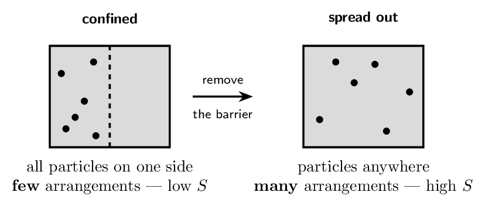
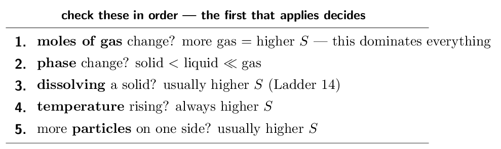
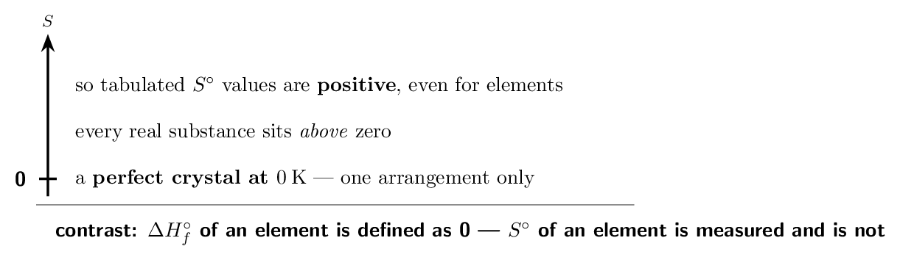
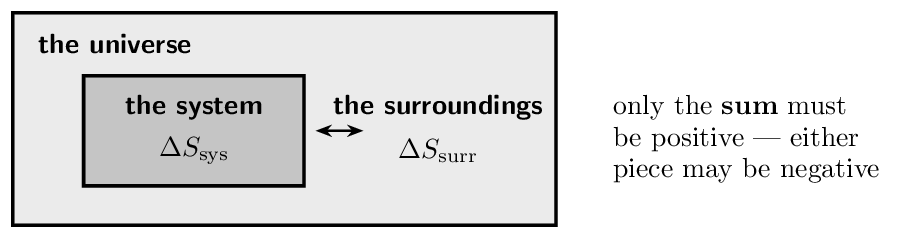
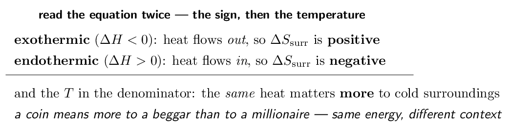
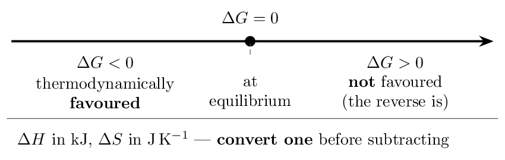
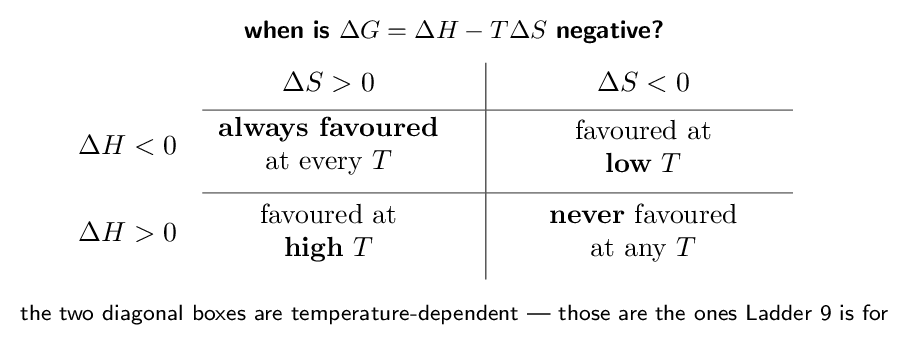
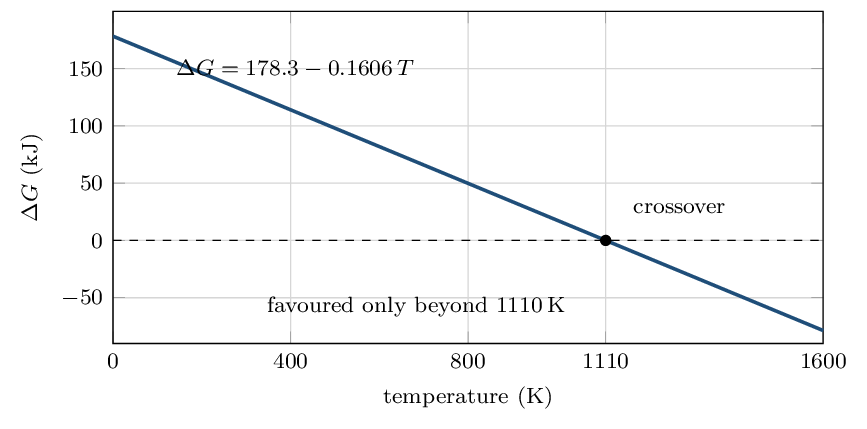
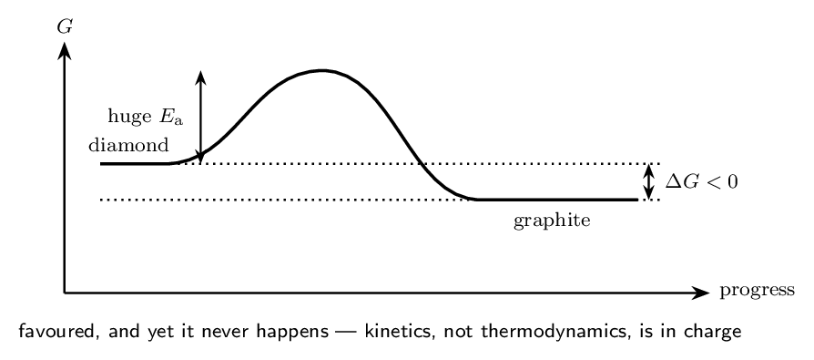
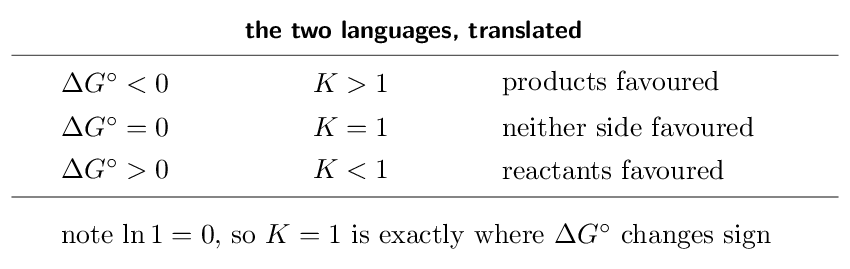

# Self-Study • Chapter 17, I do / You do

*Chapter 17 • Spontaneity, Entropy, and Free Energy*  
Zumdahl §17.1–17.10 • PDF pp. 835–869

[← all lessons](../index.md)

---

> 📌 **How to use these notes — read this first**
>
> Each skill is a **ladder**: a fully worked example in the
> solid-framed box, then **four** YOUR TURN questions in the dashed
> box — same skill, new numbers, no help. Work all four before checking
> the gray *check:* line; a tracker tick needs all four right first
> time. A ten-question **mixed set** follows Ladder 15.
> 
> **Nothing in this chapter is skipped, and nothing is excluded.**
> CED topics 9.1 to 9.7 carry no exclusion statements at all — unusual,
> and worth knowing. Where other chapters have material you can safely
> skim, this one does not.
> 
> **The question this chapter answers.** Chapter 12 asked
> *how fast*. Chapter 13 asked *how far*. This chapter asks the
> one underneath both: **why does anything happen at all?** Why does
> ice melt in a warm room and never freeze in one? Why do gases mix and
> never unmix?
> 
> **The vocabulary warning that will cost you marks if ignored.**
> The CED says **“thermodynamically favoured”**, not
> “spontaneous”. Zumdahl says spontaneous. They mean the same thing —
> $\Delta G  “happens immediately” and a thermodynamically favoured reaction can
> take geological time (Ladder 11). Use the CED's phrase in answers.

## Ladder 1 • What entropy actually is

`ZUM §17.1`

Entropy, $S$, measures how many ways the energy and matter of a system
can be arranged. More available arrangements means higher entropy.

> ⚠️ **AP trap**
>
> **“Entropy is disorder” is a slogan, not a definition, and it
> misleads.** A crystal growing from solution looks more ordered, yet the
> total entropy still rises — because the heat released disperses into
> the surroundings. Say **“the number of ways energy and matter
> can be arranged”** or **“dispersal of energy”**. Answers built on
> “messiness” lose marks the moment a question involves the
> surroundings.

> 📘 **I do: why the gas never goes back**
>
> **Remove the barrier above and the gas fills the container. Wait
> a year and it never returns to one side. Why not?**
> 
> **Nothing forbids it.** No law of motion prevents every molecule
> from happening to be on the left at the same instant. The molecules do
> not know where the barrier used to be.
> 
> **It is overwhelmingly improbable.** For one molecule the chance
> of being on the left is $1/2$. For $n$ molecules all being on the left
> at once, it is $(1/2)^{n}$. For a mole — $6 \times 10^{23}$ molecules
> — that probability is zero for every practical purpose.
> 
> **So entropy is a counting statement.** The spread-out
> arrangement is not *preferred* by any force; there are simply
> vastly more ways to be spread out than to be bunched. Systems drift
> toward the arrangement with the most ways of happening, and with $10^{23}$
> particles that drift is irreversible.
> 
> **Three consequences worth carrying.** Gases expanding into a
> vacuum, two gases mixing, and heat flowing from hot to cold are all the
> same phenomenon: energy and matter spreading over more available
> arrangements. None of the three requires a force pushing them; each is
> just the more numerous outcome winning.

> ✏️ **YOUR TURN 1 — four questions**
>
> 1. Define entropy without using the word “disorder”.
>    *(working space)*
> 2. Two gases in connected flasks mix and never unmix. Explain
>    using arrangements.
>    *(working space)*
> 3. Does anything physically *forbid* the gas returning to one
>    side? Explain.
>    *(working space)*
> 4. Which has higher entropy: 1 mol of Ar in
>    1 L or in 10 L? Why?
>    *(working space)*
> 
> > **check:** (a) the number of ways energy and matter can be arranged
>     (b) far more mixed arrangements exist     (c) no — it is
> merely overwhelmingly improbable     (d) 10 L — more
> positions available

## Ladder 2 • Predicting the sign of
$\Delta S$

`ZUM §17.1`

You can call the sign of $\Delta S$ without a single number, and the
exam asks you to constantly.

> 📘 **I do: four calls, no calculations**
>
> **Give the sign of $\Delta S$ for each.**
> 
> **(a) 2NO₂(g) → N₂O₄(g).** Two moles of gas become one.
> Fewer gas particles means fewer arrangements: $\Delta S$ is
> **negative**. Counting gas moles is the first thing to check and
> usually the last thing you need.
> 
> **(b) H₂O(l) → H₂O(g).** A liquid becomes a gas —
> molecules go from touching to flying free. Strongly **positive**,
> and this is the single biggest entropy change in ordinary chemistry.
> 
> **(c) CaCO₃(s) → CaO(s) + CO₂(g).** No gas on the left,
> one mole of gas on the right. **Positive** — and note that the
> two solids barely matter. Creating gas from no gas is decisive.
> 
> **(d) 2H₂(g) + O₂(g) → 2H₂O(l).** Three moles of gas
> become zero. Strongly **negative**.
> 
> **The hierarchy is what makes this fast.** If the number of gas
> moles changes, that answers the question — stop there. Only when gas
> moles are equal on both sides do you go looking at phases, particle
> counts or dissolving. Students who weigh all five factors equally get
> slow and get it wrong.
> 
> **And when gas moles are equal, expect a small $\Delta S$.** For
> H₂(g) + I₂(g) → 2HI(g), two moles of gas become two: whatever
> $\Delta S$ turns out to be, it will be near zero, and you should be
> suspicious of any calculation that says otherwise.

> ✏️ **YOUR TURN 2 — four questions**
>
> Give the sign of $\Delta S$ and one-line reasoning.
> 
> 1. 2SO₂(g) + O₂(g) → 2SO₃(g) 
>    *(working space)*
> 2. H₂O(s) → H₂O(l) 
>    *(working space)*
> 3. NH₄NO₃(s) → NH₄+(aq) + NO₃-(aq)
>    *(working space)*
> 4. N₂(g) + 3H₂(g) → 2NH₃(g) 
>    *(working space)*
> 
> > **check:** (a) negative — 3 gas mol to 2     (b) positive — solid
> to liquid     (c) positive — solid to dissolved ions     (d)
> negative — 4 gas mol to 2

## Ladder 3 • The third law and absolute
entropies

`ZUM §17.2`

Entropy has something enthalpy does not: a true zero. That makes $S$
values **absolute**, not relative.

> ⚠️ **AP trap**
>
> **$S^{\circ}$ for an element is not zero.** $\Delta H_{f}^{\circ}$
> of O₂(g) is zero by definition; $S^{\circ}$ of O₂(g) is
> 205.1 J/mol/K, a measured quantity. Setting
> element entropies to zero in a $\Delta S^{\circ}$ calculation is the
> standard wrong answer in Ladder 4, and it comes from carrying a
> Chapter 6 habit into Chapter 17.

> 📘 **I do: reading an $S^{\circ}$ table**
>
> **Three patterns you can predict before looking anything up.**
> 
> **Phase dominates.** For water: $S^{\circ}(\text{s}) = 41$,
> $S^{\circ}(\text{l}) = 69.9$, $S^{\circ}(\text{g}) = 188.8\,\mathrm{J/mol/K}$. The gas is nearly three times
> the liquid. Whenever you compare two substances, check the phases
> first.
> 
> **Bigger and more complex means higher.** $S^{\circ}(\text{CH₄}) = 186$ but $S^{\circ}(\text{C₂H₆}) = 229.5\,\mathrm{J/mol/K}$. More atoms means more ways to
> vibrate and rotate, so more arrangements of the same energy.
> 
> **Harder solids have lower entropy.** Diamond sits at
> 2.4 J/mol/K — almost nothing — because its
> rigid covalent network leaves atoms very few ways to move. Graphite,
> with its sliding sheets, is 5.7 . The Chapter 10 structure
> argument reappears as a number.
> 
> **Why this matters for the third law.** A perfect crystal at
> 0 K has exactly one arrangement, so $S = 0$ exactly. Every
> other state has more, so every real $S^{\circ}$ is positive. That is
> what makes entropy absolute — and it is why you never see a negative
> $S^{\circ}$ in a table, though $\Delta S^{\circ}$ for a reaction is
> negative all the time.

> ✏️ **YOUR TURN 3 — four questions**
>
> 1. State the third law of thermodynamics. 
>    *(working space)*
> 2. Why is $S^{\circ}(\text{O₂}) \neq 0$ when
>    $\Delta H_{f}^{\circ}(\text{O₂}) = 0$?
>    *(working space)*
> 3. Which is larger, $S^{\circ}(\text{H₂O(l)})$ or
>    $S^{\circ}(\text{H₂O(g)})$?
>    *(working space)*
> 4. Which is larger, $S^{\circ}(\text{CH₄})$ or
>    $S^{\circ}(\text{C₃H₈})$? Why?
>    *(working space)*
> 
> > **check:** (a) a perfect crystal at 0 K has $S = 0$    
> (b) $S$ is absolute; $\Delta H_{f}$ is a defined reference     (c)
> the gas     (d) C₃H₈ — more atoms, more arrangements

## Ladder 4 • Calculating
$\Delta S^{\circ}_{\text{rxn}}$

`ZUM §17.6`

Same shape as Hess's law from Chapter 6 — products minus reactants,
each scaled by its coefficient.

$$ \Delta S^{\circ}_{\text{rxn}}    = \sum n\,S^{\circ}(\text{products})    - \sum n\,S^{\circ}(\text{reactants}) $$

> 📘 **I do: a calculation whose sign you already knew**
>
> **For 2H₂(g) + O₂(g) → 2H₂O(l), find
> $\Delta S^{\circ}$. Use $S^{\circ}$: H₂(g) $= 130.7$,
> O₂(g) $= 205.1$, H₂O(l) $= 69.9\,\mathrm{J/mol/K}$.**
> 
> **Predict the sign first.** Three moles of gas become zero moles
> of gas. $\Delta S^{\circ}$ must be strongly negative — so if the
> arithmetic comes out positive, the arithmetic is wrong.
> 
> **Products:**
> 
> $$ 2 \times 69.9 = 139.8\,\mathrm{J/K} $$
> 
> **Reactants:**
> 
> $$ 2 \times 130.7 + 205.1 = 261.4 + 205.1    = 466.5\,\mathrm{J/K} $$
> 
> **Subtract:**
> 
> $$ \Delta S^{\circ} = 139.8 - 466.5    = \mathbf{-326.7\,\mathrm{J/K}} $$
> 
> Negative, as predicted, and large — consistent with destroying three
> moles of gas.
> 
> **Two habits.** Predict the sign before you compute; it costs five
> seconds and catches every subtraction reversal. And watch the
> **units**: $S^{\circ}$ is tabulated in
> J/mol/K while $\Delta H$ is in
> kJ/mol. Ladder 7 mixes the two in one equation, and
> that unit mismatch is the most expensive error in this chapter.
> 
> **Do not set element entropies to zero.** H₂ and O₂ are
> elements, but their $S^{\circ}$ values are 130.7 and 205.1, not 0.
> Dropping them here would give $\Delta S^{\circ} = +139.8\,\mathrm{J/K}$ — positive, for a reaction that
> destroys three moles of gas. The sign check catches it instantly.

> ✏️ **YOUR TURN 4 — four questions**
>
> Use $S^{\circ}$ (J/mol/K): N₂(g) $= 191.6$,
> H₂(g) $= 130.7$, NH₃(g) $= 192.5$, CaCO₃(s) $= 92.9$,
> CaO(s) $= 39.8$, CO₂(g) $= 213.7$.
> 
> 1. Predict the sign of $\Delta S^{\circ}$ for
>    N₂ + 3H₂ → 2NH₃.
>    *(working space)*
> 2. Compute it. 
>    *(working space)*
> 3. Compute $\Delta S^{\circ}$ for
>    CaCO₃(s) → CaO(s) + CO₂(g).
>    *(working space)*
> 4. Why may you not treat $S^{\circ}(\text{N₂})$ as zero?
>    *(working space)*
> 
> > **check:** (a) negative     (b) -198.7 J/K    
> (c) +160.6 J/K     (d) $S^{\circ}$ is absolute,
> not a defined reference

## Ladder 5 • The second law:
$\Delta S_{\text{universe}}$

`ZUM §17.2`

The actual criterion for a favoured process is not about the system at
all.

$$ \Delta S_{\text{univ}}    = \Delta S_{\text{sys}} + \Delta S_{\text{surr}} > 0    \quad\text{for a thermodynamically favoured process} $$

> 📘 **I do: how order can increase**
>
> **Water freezing at -10 °C is thermodynamically
> favoured. Yet liquid becomes solid — $\Delta S_{\text{sys}}$ is
> clearly negative. How can that be?**
> 
> **Because the system is not the universe.** Freezing releases heat
> — the enthalpy of fusion, outward — and that heat disperses into the
> surrounding air. Dispersing energy into the surroundings *raises*
> $\Delta S_{\text{surr}}$.
> 
> **Below 0 °C the surroundings win.** The heat released
> raises $\Delta S_{\text{surr}}$ by more than $\Delta S_{\text{sys}}$
> falls, so $\Delta S_{\text{univ}} > 0$ and freezing is favoured.
> 
> **Above 0 °C it does not.** Ladder 6 shows why:
> $\Delta S_{\text{surr}} = -\Delta H/T$, so the same released heat buys
> *less* entropy in warmer surroundings. At high enough $T$ the
> surroundings' gain no longer covers the system's loss, and melting —
> the reverse — becomes the favoured direction instead.
> 
> **So 0 °C is not a magic temperature.** It is simply
> where the two terms exactly cancel, $\Delta S_{\text{univ}} = 0$, and
> neither direction is favoured. That is the definition of a phase
> equilibrium, and it is the same idea as $\Delta G = 0$ in Ladder 7.
> 
> **The exam version of this idea:** whenever a question shows an
> apparently order-increasing process happening on its own — freezing,
> crystallising, a protein folding — the answer involves heat released
> to the surroundings.

> ✏️ **YOUR TURN 5 — four questions**
>
> 1. State the second law in terms of $\Delta S_{\text{univ}}$.
>    *(working space)*
> 2. Can a favoured process have $\Delta S_{\text{sys}}  **check:** (a) $\Delta S_{\text{univ}} > 0$ for a favoured process
>     (b) yes, if $\Delta S_{\text{surr}}$ is more positive     (c)
> sys negative, surr positive     (d) zero

## Ladder 6 • $\Delta S_{\text{surr}}$ from
$\Delta H$

`ZUM §17.2`

The surroundings only ever see the heat the system gives or takes, so
their entropy change follows one small equation.

$$ \Delta S_{\text{surr}} = \frac{-\Delta H_{\text{sys}}}{T} $$

> 📘 **I do: the temperature in the denominator**
>
> **The Haber reaction has $\Delta H = -92.2\,\mathrm{kJ/mol}$. Find $\Delta S_{\text{surr}}$ at
> 298 K.**
> 
> **Convert to joules first** — $\Delta S$ is always in joules per
> kelvin, never kilojoules:
> 
> $$ \Delta S_{\text{surr}}    = \frac{-(-92200\;\mathrm{J/mol})}{298\,\mathrm{K}}    = \mathbf{+309\,\mathrm{J/mol/K}} $$
> 
> Positive, because an exothermic reaction dumps heat into the
> surroundings and spreads it there.
> 
> **Now the same reaction at 700 K:**
> 
> $$ \Delta S_{\text{surr}} = \frac{92200}{700}    = +132\,\mathrm{J/mol/K} $$
> 
> **Less than half, from identical heat.** That is the whole content
> of the $T$ in the denominator: hot surroundings are already full of
> dispersed energy, so a given quantity of heat adds proportionally fewer
> new arrangements.
> 
> **And this is why exothermic reactions stop being favoured when
> heated.** $\Delta S_{\text{sys}}$ does not care much about temperature,
> but $\Delta S_{\text{surr}}$ shrinks as $T$ rises. Eventually it can no
> longer carry a negative $\Delta S_{\text{sys}}$, and the reaction
> reverses — exactly the Haber-process compromise from Chapter 13,
> Ladder 12, now derived rather than asserted.
> 
> **This equation is also where $\Delta G$ comes from.** Multiply
> $\Delta S_{\text{univ}} = \Delta S_{\text{sys}} - \Delta H/T$ through by
> $-T$ and you get $-T\Delta S_{\text{univ}} = \Delta H - T\Delta S$ —
> the right-hand side is $\Delta G$. Ladder 7 uses it; it is not a new
> idea, just a rearrangement.

> ✏️ **YOUR TURN 6 — four questions**
>
> 1. A reaction has $\Delta H = -50.0\,\mathrm{kJ/mol}$.
>    Find $\Delta S_{\text{surr}}$ at 250 K.
>    *(working space)*
> 2. Same reaction at 500 K. 
>    *(working space)*
> 3. Give the sign of $\Delta S_{\text{surr}}$ for an endothermic
>    process.
>    *(working space)*
> 4. Why does the same released heat produce a larger
>    $\Delta S_{\text{surr}}$ at low temperature?
>    *(working space)*
> 
> > **check:** (a) +200 J/mol/K     (b)
> +100 J/mol/K     (c) negative     (d) cold
> surroundings hold less dispersed energy already

## Ladder 7 • Gibbs free energy

`ZUM §17.3–17.4`

$\Delta G$ bundles the system and the surroundings into a single
number you can compute from system properties alone.

$$ \Delta G = \Delta H - T\,\Delta S $$

> ⚠️ **AP trap**
>
> **The unit mismatch is the single most expensive error in this
> chapter.** $\Delta H$ is tabulated in **kilojoules**;
> $\Delta S$ in **joules** per kelvin. In $\Delta H - T\Delta S$ you
> must convert one to match the other. Forget, and $T\Delta S$ comes out a
> thousand times too large — which usually flips the sign of $\Delta G$
> and therefore the entire conclusion.

> 📘 **I do: is limestone decomposition favoured at room
temperature?**
>
> **For CaCO₃(s) → CaO(s) + CO₂(g), $\Delta H^{\circ} = +178.3\,\mathrm{kJ}$ and $\Delta S^{\circ} = +160.6\,\mathrm{J/K}$. Find $\Delta G^{\circ}$ at
> 298 K.**
> 
> **Convert $\Delta S$ to kilojoules** so both terms match:
> 
> $$ \Delta S^{\circ} = 160.6\,\mathrm{J/K}    = 0.1606\,\mathrm{kJ/K} $$
> 
> **Substitute:**
> 
> $$ \Delta G^{\circ} = 178.3 - (298)(0.1606)    = 178.3 - 47.9 = \mathbf{+130.4\,\mathrm{kJ}} $$
> 
> **Positive, so not favoured at 298 K** — limestone
> does not spontaneously crumble into quicklime on a shelf, which
> matches every cathedral still standing.
> 
> **But look at the structure of the answer.** $\Delta H$ is
> positive (unfavourable) and $\Delta S$ is positive (favourable). They
> oppose each other, and at 298 K the enthalpy term is nearly
> four times larger, so enthalpy wins.
> 
> **Raise the temperature and that changes.** $T\Delta S$ grows in
> proportion to $T$ while $\Delta H$ barely moves — so at some
> temperature the entropy term overtakes and $\Delta G$ turns negative.
> Ladder 9 finds exactly where. This is why lime kilns are heated: not to
> make the reaction faster, but to make it *favoured at all*.

> ✏️ **YOUR TURN 7 — four questions**
>
> 1. $\Delta H = -100.0\,\mathrm{kJ}$, $\Delta S =         +50.0\,\mathrm{J/K}$, $T = 298\,\mathrm{K}$. Find
>    $\Delta G$.
>    *(working space)*
> 2. $\Delta H = +40.0\,\mathrm{kJ}$, $\Delta S =         +100.0\,\mathrm{J/K}$, $T = 298\,\mathrm{K}$. Find
>    $\Delta G$ and say whether it is favoured.
>    *(working space)*
> 3. What does $\Delta G = 0$ mean? 
>    *(working space)*
> 4. Before computing, why must you convert units?
>    *(working space)*
> 
> > **check:** (a) -114.9 kJ     (b)
> +10.2 kJ, not favoured     (c) equilibrium     (d)
> $\Delta H$ is in kJ, $\Delta S$ in J

## Ladder 8 • The four sign combinations

`ZUM §17.4`

Two signs, four cases, and only two of them depend on temperature.

> 📘 **I do: reading the table without memorising it**
>
> **You never need to memorise these four boxes. Read them off
> $\Delta G = \Delta H - T\Delta S$ directly.**
> 
> **$\Delta H  0$.** The first term is negative and
> $-T\Delta S$ is also negative. Both terms push $\Delta G$ negative, so
> it is negative at every temperature. *Example:* combustion.
> 
> **$\Delta H > 0$, $\Delta S  0$, $\Delta S > 0$.** Enthalpy hurts, entropy helps
> and grows with $T$. Favoured once $T$ is **large** enough.
> *Example:* limestone decomposition (Ladder 7), or ice melting.
> 
> **The one-line rule that regenerates the whole table:**
> *$T$ multiplies only the entropy term, so raising the temperature
> always strengthens whatever entropy is arguing for.* If $\Delta S$ is
> positive, heat helps; if negative, heat hurts. Everything else follows.

> ✏️ **YOUR TURN 8 — four questions**
>
> 1. $\Delta H  0$: at what temperatures is it
>    favoured?
>    *(working space)*
> 2. $\Delta H > 0$, $\Delta S > 0$: at what temperatures?
>    *(working space)*
> 3. A reaction is favoured only below 400 K. Give the
>    signs of $\Delta H$ and $\Delta S$.
>    *(working space)*
> 4. Why does raising $T$ always favour whatever $\Delta S$ is
>    arguing for?
>    *(working space)*
> 
> > **check:** (a) all     (b) high $T$ only     (c) both negative
>     (d) $T$ multiplies only the entropy term

## Ladder 9 • The crossover temperature

`ZUM §17.4`

For the two temperature-dependent cases, there is one temperature where
$\Delta G$ passes through zero. Set $\Delta G = 0$ and solve.

$$ 0 = \Delta H - T\Delta S    \qquad\Longrightarrow\qquad    T = \frac{\Delta H}{\Delta S} $$

> 📘 **I do: at what temperature will limestone
decompose?**
>
> **Using $\Delta H^{\circ} = +178.3\,\mathrm{kJ}$ and
> $\Delta S^{\circ} = +160.6\,\mathrm{J/K}$ from Ladder 7,
> find the crossover temperature.**
> 
> **Set $\Delta G = 0$ and solve, converting units as always:**
> 
> $$ T = \frac{\Delta H}{\Delta S}      = \frac{178300\,\mathrm{J}}{160.6\,\mathrm{J/K}}      = \mathbf{1110\,\mathrm{K}} $$
> 
> That is about 837 °C.
> 
> **Check it against reality.** Industrial lime kilns run at roughly
> 900 °C — just above our crossover, as they must be. The
> calculation predicted a real engineering constraint from two tabulated
> numbers.
> 
> **Now say which side is which.** $\Delta S$ is positive, so the
> entropy term grows with $T$; the reaction is therefore favoured
> *above* 1110 K and not below. If $\Delta S$ had been
> negative, the inequality would flip and the reaction would be favoured
> *below* the crossover.
> 
> **Two cautions.** First, $T = \Delta H / \Delta S$ only makes sense
> when $\Delta H$ and $\Delta S$ have the *same* sign — otherwise
> there is no crossover, because the reaction is favoured either always or
> never (Ladder 8), and the formula returns a meaningless negative
> temperature. Second, the answer is in **kelvin**, always; convert
> to celsius only if the question asks.
> 
> **And a caveat worth stating on an FRQ:** this assumes
> $\Delta H^{\circ}$ and $\Delta S^{\circ}$ are temperature-independent.
> They are not exactly, but over ordinary ranges the approximation is
> good, and it is what the exam expects.

> ✏️ **YOUR TURN 9 — four questions**
>
> 1. $\Delta H = +30.0\,\mathrm{kJ}$, $\Delta S =         +100.0\,\mathrm{J/K}$. Find the crossover
>    temperature.
>    *(working space)*
> 2. Is that reaction favoured above or below it? Why?
>    *(working space)*
> 3. $\Delta H = -40.0\,\mathrm{kJ}$, $\Delta S =         -80.0\,\mathrm{J/K}$. Find the crossover and say
>    which side is favoured.
>    *(working space)*
> 4. Why does $T = \Delta H/\Delta S$ give nothing useful when the
>    two signs differ?
>    *(working space)*
> 
> > **check:** (a) 300 K     (b) above — $\Delta S$ is
> positive     (c) 500 K, favoured below     (d) there is
> no crossover; it is favoured always or never

## Ladder 10 • $\Delta G^{\circ}$ from
formation values

`ZUM §17.4`

A second route to $\Delta G^{\circ}$, identical in shape to Hess's law
and to Ladder 4.

$$ \Delta G^{\circ}_{\text{rxn}}    = \sum n\,\Delta G_{f}^{\circ}(\text{products})    - \sum n\,\Delta G_{f}^{\circ}(\text{reactants}) $$

> 📘 **I do: two routes, one answer**
>
> **You now have two ways to reach $\Delta G^{\circ}$, and knowing
> which to use is half the skill.**
> 
> **Route 1 — $\Delta G^{\circ} = \Delta H^{\circ} - T\Delta S^{\circ}$.** Use this when the question gives you $\Delta H$
> and $\Delta S$, or when it asks about a temperature *other than*
> 298 K. It is the only route that can handle a temperature
> change.
> 
> **Route 2 — formation values.** Use this when the question hands
> you a $\Delta G_{f}^{\circ}$ table. It works only at
> 298 K, because that is the temperature the table was
> compiled at.
> 
> **Worked: Fe₂O₃(s) + 3CO(g) → 2Fe(s) + 3CO₂(g)**, with
> $\Delta G_{f}^{\circ}$ (kJ/mol):
> Fe₂O₃ $= -742.2$, CO $= -137.2$, CO₂ $= -394.4$,
> Fe $= 0$.
> 
> **Products:**
> 
> $$ 2(0) + 3(-394.4) = -1183.2\,\mathrm{kJ} $$
> 
> **Reactants:**
> 
> $$ -742.2 + 3(-137.2) = -742.2 - 411.6 = -1153.8\,\mathrm{kJ} $$
> 
> **Subtract:**
> 
> $$ \Delta G^{\circ} = -1183.2 - (-1153.8)    = \mathbf{-29.4\,\mathrm{kJ}} $$
> 
> Negative, so iron smelting in a blast furnace is thermodynamically
> favoured — as several thousand years of ironworking suggest.
> 
> **Elements are zero here.** $\Delta G_{f}^{\circ}(\text{Fe}) = 0$
> because iron in its standard state is the reference — exactly like
> $\Delta H_{f}^{\circ}$ in Chapter 6. This is the *opposite* of
> Ladder 4's rule for $S^{\circ}$, and keeping the two straight is what
> this ladder tests.

> ✏️ **YOUR TURN 10 — four questions**
>
> $\Delta G_{f}^{\circ}$ (kJ/mol): NH₃(g) $= -16.4$, NO(g) $= +86.6$, H₂O(g) $= -228.6$, elements $= 0$.
> 
> 1. Find $\Delta G^{\circ}$ for N₂(g) + 3H₂(g) → 2NH₃(g).
>    *(working space)*
> 2. Find $\Delta G^{\circ}$ for N₂(g) + O₂(g) → 2NO(g).
>    *(working space)*
> 3. Which of the two is thermodynamically favoured at
>    298 K?
>    *(working space)*
> 4. Why is $\Delta G_{f}^{\circ}$ of an element zero when
>    $S^{\circ}$ of an element is not?
>    *(working space)*
> 
> > **check:** (a) -32.8 kJ     (b)
> +173.2 kJ     (c) the first     (d)
> $\Delta G_{f}$ is a defined reference; $S$ is absolute

## Ladder 11 • Thermodynamic versus kinetic
control

`ZUM §17.7`

$\Delta G$ says whether a reaction *can* go. It says nothing at all
about whether it *will* in your lifetime.

> 📘 **I do: diamonds are not forever, technically**
>
> **C(diamond) → C(graphite) has $\Delta G^{\circ} = -2.9\,\mathrm{kJ/mol}$. Every diamond in existence is
> thermodynamically unstable. Why do jewellers sleep at night?**
> 
> **Because $\Delta G$ is not a rate.** A negative $\Delta G$ says
> the products sit lower in free energy, so the conversion is favoured. It
> says nothing about the barrier between them.
> 
> **And that barrier is enormous.** Converting diamond to graphite
> means breaking a rigid three-dimensional network of covalent bonds and
> rebuilding it as sheets. The activation energy is so large that at room
> temperature the rate is immeasurably slow — far slower than the age of
> the universe.
> 
> **So the reaction is under *kinetic control*.** What you
> observe is decided by the barrier, not by the free-energy difference.
> The diamond is not stable; it is **metastable** — trapped behind
> a hill it cannot climb.
> 
> **Two more cases of the same thing.** A hydrogen–oxygen mixture
> has $\Delta G^{\circ} \approx -457\,\mathrm{kJ/mol}$ and sits
> unchanged for years without a spark (Chapter 13, Ladder 5, said this in
> $K$ language). Petrol in air is likewise wildly favoured and entirely
> safe until ignited.
> 
> **The exam sentence.** “The reaction is thermodynamically
> favoured ($\Delta G  energy is large, so the rate is negligible at this temperature.” Both
> halves, or you have only answered half the question.

> ✏️ **YOUR TURN 11 — four questions**
>
> 1. A reaction has $\Delta G^{\circ} = -200\,\mathrm{kJ}$ but
>    no observable change occurs. Explain.
>    *(working space)*
> 2. Does a catalyst change $\Delta G^{\circ}$? Explain.
>    *(working space)*
> 3. What does “metastable” mean? 
>    *(working space)*
> 4. Which quantity would you change to make the reaction in (a)
>    actually proceed?
>    *(working space)*
> 
> > **check:** (a) large $E_{\mathrm{a}}$ — kinetic control     (b) no
> — it changes only the rate     (c) favoured but trapped behind a
> barrier     (d) $E_{\mathrm{a}}$, via a catalyst or heat

## Ladder 12 • $\Delta G^{\circ}$ and $K$

`ZUM §17.9`

Chapter 13's equilibrium constant and this chapter's free energy are
the same information in two currencies.

$$ \Delta G^{\circ} = -RT \ln K    \qquad    R = 8.314\;\mathrm{J\,mol^{-1}\,K^{-1}} $$

> 📘 **I do: both directions of the translation**
>
> **(a) A reaction has $K = 1.0e6$ at 298 K. Find
> $\Delta G^{\circ}$.**
> 
> $$ \Delta G^{\circ} = -RT \ln K    = -(8.314)(298)\ln(1.0e6) $$
> 
> $$ = -(2478)(13.82) = -34200\,\mathrm{J}    = \mathbf{-34.2\,\mathrm{kJ}} $$
> 
> Large $K$, negative $\Delta G^{\circ}$ — the two statements agree, as
> they must.
> 
> **(b) A reaction has $\Delta G^{\circ} = +20.0\,\mathrm{kJ}$ at 298 K. Find $K$.**
> 
> Rearrange:
> 
> $$ \ln K = \frac{-\Delta G^{\circ}}{RT}          = \frac{-20000}{(8.314)(298)}          = \frac{-20000}{2478} = -8.07 $$
> 
> $$ K = e^{-8.07} = \mathbf{3.1e-4} $$
> 
> Positive $\Delta G^{\circ}$, $K$ well below 1 — reactants favoured,
> consistent again.
> 
> **The sign check that catches everything.** Before computing,
> decide which side of 1 the answer should fall on. Negative
> $\Delta G^{\circ}$ gives $K > 1$; positive gives $K  3.1e-4 for a positive $\Delta G^{\circ}$ passes; a $K$ of 3200
> would not, and would mean a dropped minus sign.
> 
> **Units, again.** $R$ is in **joules**, so $\Delta G^{\circ}$
> must be in joules too. Feeding kilojoules into this equation is the same
> mistake as Ladder 7's, in a new place.
> 
> **Why the relationship exists at all.** $\Delta G^{\circ}$ is the
> free-energy difference between pure reactants and pure products, and $K$
> measures where the mixture settles between them. They are two
> descriptions of one thing — which is why Chapter 13, Ladder 5's
> “$K \gg 1$ means products favoured” and this chapter's
> “$\Delta G^{\circ}  sentence.

> ✏️ **YOUR TURN 12 — four questions**
>
> Use $T = 298\,\mathrm{K}$, $RT = 2478\,\mathrm{J/mol}$.
> 
> 1. $K = 1.0$. Find $\Delta G^{\circ}$. 
>    *(working space)*
> 2. $\Delta G^{\circ} = -10.0\,\mathrm{kJ}$. Is $K$ greater or
>    less than 1?
>    *(working space)*
> 3. $K = 1.0e-3$. Find $\Delta G^{\circ}$.
>    *(working space)*
> 4. A student computes $K = 500$ from $\Delta G^{\circ} =         +15\,\mathrm{kJ}$. What went wrong?
>    *(working space)*
> 
> > **check:** (a) 0     (b) greater than 1     (c)
> +17.1 kJ     (d) sign error — positive
> $\Delta G^{\circ}$ needs $K  ⚠️ **AP trap**
>
> **$\Delta G^{\circ} = 0$ and $\Delta G = 0$ mean completely
> different things.** $\Delta G = 0$ means *this particular mixture*
> is at equilibrium — extremely common. $\Delta G^{\circ} = 0$ means
> $K = 1$ exactly — rare, and a much stronger claim. A reaction with
> $\Delta G^{\circ} = +50\,\mathrm{kJ}$ still reaches equilibrium;
> it just does so with very little product.

> 📘 **I do: why a positive $\Delta G^{\circ}$ still
produces something**
>
> **A reaction has $\Delta G^{\circ} = +20.0\,\mathrm{kJ}$, so
> $K = 3.1e-4$ (Ladder 12). Start with pure reactants and no
> product. What happens?**
> 
> **At the very start, $Q = 0$.** And $\ln Q \to -\infty$, so
> 
> $$ \Delta G = \Delta G^{\circ} + RT\ln Q $$
> 
> is enormously negative. **The reaction runs forward** — even
> though $\Delta G^{\circ}$ is positive.
> 
> **As product accumulates, $Q$ rises** and $RT \ln Q$ climbs from
> $-\infty$ toward zero and beyond. $\Delta G$ becomes less and less
> negative.
> 
> **When $Q$ reaches $K$, $\Delta G$ hits zero** and the reaction
> stops changing. Because $K$ is small, that happens with very little
> product formed — but it is not zero product.
> 
> **So the standard confusion resolves like this.** A positive
> $\Delta G^{\circ}$ does *not* mean nothing happens. It means the
> equilibrium position lies toward reactants. Some product always forms,
> because starting from $Q = 0$ the forward direction is always initially
> favoured.
> 
> **And the reverse case.** A reaction with a large negative
> $\Delta G^{\circ}$ started with mostly *product* will run
> *backwards* — because $Q > K$ makes $\Delta G$ positive. Which
> direction a mixture moves is a $Q$-versus-$K$ question (Chapter 13,
> Ladder 6), and this equation is that comparison written in energy
> units.

> ✏️ **YOUR TURN 13 — four questions**
>
> 1. State the difference between $\Delta G$ and
>    $\Delta G^{\circ}$.
>    *(working space)*
> 2. What is $\Delta G$ at equilibrium? 
>    *(working space)*
> 3. A reaction has $\Delta G^{\circ} > 0$ and starts with pure
>    reactants. Does any product form? Explain.
>    *(working space)*
> 4. If $Q > K$, what is the sign of $\Delta G$, and which way does
>    the reaction run?
>    *(working space)*
> 
> > **check:** (a) standard conditions vs the actual mixture     (b) zero
>     (c) yes — at $Q = 0$, $\Delta G$ is negative     (d)
> positive; it runs in reverse

## Ladder 14 • Free energy of dissolution

`ZUM §17.5`

Chapter 11's question — why does anything dissolve? — finally gets
its quantitative answer.

> 📘 **I do: the salt that dissolves while cooling the
beaker**
>
> **NaCl dissolving has $\Delta H = +3.9\,\mathrm{kJ/mol}$ and $\Delta S = +43\,\mathrm{J/mol/K}$. Is it favoured at
> 298 K?**
> 
> $$ \Delta G = 3.9 - (298)(0.043)    = 3.9 - 12.8 = \mathbf{-8.9\,\mathrm{kJ/mol}} $$
> 
> Negative, so yes — and note *how* it is negative. The enthalpy
> term is unfavourable; the entropy term carries the whole reaction.
> 
> **This is the answer Chapter 11 owed you.** Ladder 5 there showed
> that dissolving NaCl is slightly endothermic — the beaker cools
> — and asked why it happens anyway. The answer is that ions going from
> a rigid lattice to freely moving hydrated particles is a large entropy
> increase, and $T\Delta S$ beats a small positive $\Delta H$.
> 
> **The three-step cycle, now in free-energy terms.** Breaking the
> lattice and opening the solvent both cost enthalpy; solvation returns
> it. Whatever small residue is left over, the entropy term usually
> overwhelms — which is why most salts dissolve at all.
> 
> **When it fails.** For a salt with a large lattice energy and a
> strongly positive $\Delta H_{\text{soln}}$, the entropy term cannot
> cover it and $\Delta G > 0$ — the salt is insoluble. That is
> Chapter 16's $K_{sp} \ll 1$, and via $\Delta G^{\circ} = -RT\ln K$
> it is literally the same statement: a positive $\Delta G^{\circ}$ for
> dissolution *is* a small $K_{sp}$.
> 
> **And the temperature prediction.** Since $\Delta S$ is usually
> positive for dissolving, $T\Delta S$ grows with heat, so most solids
> become more soluble when warmed — Chapter 10, Ladder 9's solubility
> curves, predicted rather than tabulated.

> ✏️ **YOUR TURN 14 — four questions**
>
> 1. A salt dissolves with $\Delta H = +25.0\,\mathrm{kJ/mol}$
>    and $\Delta S = +100.0\,\mathrm{J/mol/K}$. Find
>    $\Delta G$ at 298 K.
>    *(working space)*
> 2. Is it favoured? What is driving it? 
>    *(working space)*
> 3. Why is $\Delta S$ almost always positive for dissolving a
>    solid?
>    *(working space)*
> 4. A salt has $\Delta G^{\circ} > 0$ for dissolution. What does
>    that say about $K_{sp}$?
>    *(working space)*
> 
> > **check:** (a) -4.8 kJ/mol     (b) yes —
> entropy     (c) lattice to free hydrated ions     (d)
> $K_{sp}  📘 **I do: how your cells cheat thermodynamics**
>
> **Phosphorylating glucose is uphill:**
> 
> $$ \text{glucose + Pi → glucose-6-phosphate}    \qquad \Delta G^{\circ} = +13.8\,\mathrm{kJ/mol} $$
> 
> On its own it essentially does not happen.
> 
> **ATP hydrolysis is downhill:**
> 
> $$ \text{ATP + H₂O → ADP + Pi}    \qquad \Delta G^{\circ} = -30.5\,\mathrm{kJ/mol} $$
> 
> **Couple them — they share Pi** — and add:
> glucose + ATP → glucose-6-phosphate + ADP
> 
> $$ \Delta G^{\circ} = +13.8 - 30.5    = \mathbf{-16.7\,\mathrm{kJ/mol}} $$
> 
> Negative, so the coupled reaction is favoured, and this is the first
> step of glycolysis — happening in your cells right now.
> 
> **No law was broken.** The uphill reaction did not become
> favourable; it was *paid for* by a larger downhill one. The
> combined process still has $\Delta G  satisfied. Coupling is bookkeeping, not magic.
> 
> **The two requirements.** The reactions must **share a
> common species** — here Pi, which cancels when you add them —
> and the favourable $\Delta G^{\circ}$ must be **larger in
> magnitude** than the unfavourable one.
> 
> **The industrial version** appeared in Ladder 10: iron oxide
> reduction on its own is hugely unfavourable
> ($\Delta G^{\circ} = +742\,\mathrm{kJ}$), but coupled to carbon
> monoxide oxidation it comes out at -29.4 kJ. A blast
> furnace is a coupled reaction the size of a building.

> ✏️ **YOUR TURN 15 — four questions**
>
> 1. Reaction A has $\Delta G^{\circ} = +25\,\mathrm{kJ}$ and
>    reaction B has $-40\,\mathrm{kJ}$. Find $\Delta G^{\circ}$
>    for the coupled process.
>    *(working space)*
> 2. Is the coupled process favoured? 
>    *(working space)*
> 3. What two conditions must hold for coupling to work?
>    *(working space)*
> 4. Does coupling violate the second law? Explain.
>    *(working space)*
> 
> > **check:** (a) -15 kJ     (b) yes     (c) a shared
> species, and the favourable $\Delta G$ must be larger     (d) no —
> the total $\Delta G$ is still negative

## Mixed set • ten questions, no labels

> 📌 **Why this section exists**
>
> Every question so far arrived with its ladder attached. These ten do
> not — and in this chapter the first decision is usually *which
> equation*: $\Delta H - T\Delta S$, formation values, $-RT\ln K$, or
> $\Delta G^{\circ} + RT\ln Q$.

> ✏️ **MIXED SET — first five**
>
> 1. Give the sign of $\Delta S$ for
>    2H₂O₂(l) → 2H₂O(l) + O₂(g).
>    *(working space)*
> 2. $\Delta H = -80.0\,\mathrm{kJ}$, $\Delta S =         -200.0\,\mathrm{J/K}$. Find $\Delta G$ at
>    298 K.
>    *(working space)*
> 3. For that reaction, find the crossover temperature and say
>    which side is favoured.
>    *(working space)*
> 4. $K = 2.0e-5$ at 298 K
>    ($RT = 2478\,\mathrm{J/mol}$). Find $\Delta G^{\circ}$.
>    *(working space)*
> 5. A reaction has $\Delta G^{\circ} = -150\,\mathrm{kJ}$ yet
>    nothing observable happens. Explain.
>    *(working space)*
> 
> > **check:** (a) positive     (b) -20.4 kJ     (c)
> 400 K, favoured below     (d)
> +26.8 kJ     (e) kinetic control

> ✏️ **MIXED SET — last five**
>
> 1. Using $S^{\circ}$ (J/mol/K):
>    N₂O₄(g) $= 304.3$, NO₂(g) $= 240.1$, find
>    $\Delta S^{\circ}$ for N₂O₄(g) → 2NO₂(g).
>    *(working space)*
> 2. A reaction has $\Delta H > 0$ and $\Delta S  **check:** (a) +175.9 J/K     (b) never    
> (c) -27 kJ     (d) $K = 1$     (e) $T\Delta S$ —
> lattice to free ions

## Mastery tracker

Tick a row only if **all four** YOUR TURN questions were right on
the first attempt. Every row is assessed — CED topics 9.1 to 9.7
carry no exclusion statements at all, so nothing here is optional.

| **First try?** | **Skill** | **Ladder** | **If not, re-read…** |
|---|---|---|---|
| $\square$ | what entropy is | 1 | arrangements, not mess |
| $\square$ | predicting the sign of $\Delta S$ | 2 | count gas moles first |
| $\square$ | the third law, absolute $S$ | 3 | elements are not zero |
| $\square$ | calculating $\Delta S^{\circ}$ | 4 | predict the sign first |
| $\square$ | the second law | 5 | only the sum must rise |
| $\square$ | $\Delta S_{\text{surr}}$ from $\Delta H$ | 6 | $-\Delta H/T$ |
| $\square$ | Gibbs free energy | 7 | convert kJ and J |
| $\square$ | the four sign cases | 8 | $T$ scales entropy only |
| $\square$ | the crossover temperature | 9 | $T = \Delta H/\Delta S$ |
| $\square$ | $\Delta G^{\circ}$ from formation | 10 | elements ARE zero here |
| $\square$ | thermodynamic vs kinetic | 11 | extent is not speed |
| $\square$ | $\Delta G^{\circ}$ and $K$ | 12 | $-RT\ln K$, joules |
| $\square$ | $\Delta G$ versus $\Delta G^{\circ}$ | 13 | $Q$ versus $K$ |
| $\square$ | free energy of dissolution | 14 | entropy usually wins |
| $\square$ | coupled reactions | 15 | the values add |
| $\square$ | **mixed set** (8 of 10) | — | whichever it exposed |

> 📌 **Scoring yourself honestly**
>
> 15/15 and the mixed set: you have Unit 9's thermodynamics half, and
> Chapter 18 will lean on Ladders 12 and 13 constantly — cell potential
> is free energy wearing different units.
> 
> 11–14: check where the misses fall. Ladders 1–6 are conceptual and
> repair by re-reading. Ladders 7–10 are the calculation core, and the
> overwhelming majority of errors there are the **kJ/J unit
> mismatch** rather than any misunderstanding. If that is your pattern,
> the fix is mechanical: write the units next to every number before
> substituting.
> 
> 10 or fewer: the likeliest single cause is treating $\Delta G$ as a
> statement about *speed*. Re-read Ladders 7 and 11 together, then
> Ladder 12 — “favoured” means the equilibrium lies toward products,
> and nothing more. Everything else in this chapter is arithmetic on top
> of that one distinction.
> 
> **One thing to carry into Chapter 18.** $\Delta G^{\circ} = -nFE^{\circ}$ is coming, and it is Ladder 12 with a different constant.
> If $\Delta G^{\circ} = -RT\ln K$ is solid, electrochemistry's
> thermodynamics is already half learned.

---

*AP Chemistry course materials • student edition • CC BY-NC-SA 4.0*
