# Self-Study • Chapter 18, I do / You do

*Chapter 18 • Electrochemistry*  
Zumdahl §18.1–18.4, §18.7 • PDF pp. 882–911

[← all lessons](../index.md)

---

> 📌 **How to use these notes — read this first**
>
> Each skill is a **ladder**: a fully worked example in the
> solid-framed box, then **four** YOUR TURN questions in the dashed
> box — same skill, new numbers, no help. Work all four before checking
> the gray *check:* line; a tracker tick needs all four right first
> time. A ten-question **mixed set** follows Ladder 14.
> 
> **What is in and what is out.** §18.1–18.4 and §18.7 are
> assessed (CED 9.8–9.11). §18.5–18.6 (batteries, corrosion) and
> §18.8 (commercial electrolysis) are not on the CED and are not treated
> here — skip those pages of Zumdahl.
> 
> **Two things the CED explicitly will not ask you.** First:
> *“Labeling an electrode as positive or negative will not be
> assessed”* (9.8). Learn **anode** and **cathode**, which are
> always assessed; the $+$/$-$ signs flip between cell types and the exam
> sensibly avoids them. Second: *“The meaning of the terms
> `reducing agent' and `oxidizing agent' will not be assessed”* (4.7).
> Say “Zn is oxidised” rather than “Zn is the reducing
> agent” and you are always safe.
> 
> **This chapter is Chapter 17 in different units.** $\Delta G^{\circ} = -nFE^{\circ}$ is the bridge, and once you have it, every
> “is this favoured?” question you already know how to answer in free
> energy you can answer in volts. Ladder 9 is the hinge of the whole
> chapter.

## Ladder 1 • Oxidation numbers

`ZUM §18.1`

Everything in this chapter starts with knowing which atoms changed.
Oxidation numbers are the bookkeeping that tells you.

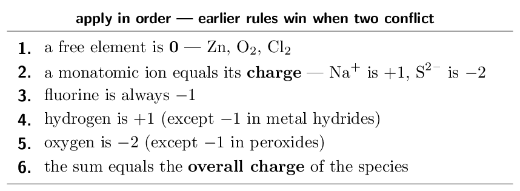

> 📘 **I do: three assignments**
>
> **(a) Find the oxidation number of Mn in MnO₄-.**
> 
> Oxygen is $-2$ and there are four of them, so they contribute $-8$. The
> whole ion carries $-1$, so by rule 6:
> 
> $$ x + (-8) = -1 \quad\Longrightarrow\quad x = \mathbf{+7} $$
> 
> **(b) Find the oxidation number of Cr in Cr₂O₇²⁻.**
> 
> Seven oxygens give $-14$; the ion is $-2$:
> 
> $$ 2x - 14 = -2 \quad\Longrightarrow\quad 2x = 12    \quad\Longrightarrow\quad x = \mathbf{+6} $$
> 
> Note the division by 2 — the answer is per chromium atom, not for
> both together.
> 
> **(c) Find the oxidation number of S in H₂SO₄.**
> 
> Two hydrogens give $+2$, four oxygens give $-8$, and the molecule is
> neutral:
> 
> $$ 2 + x - 8 = 0 \quad\Longrightarrow\quad x = \mathbf{+6} $$
> 
> **Why this matters here.** An element whose oxidation number
> *rises* has been **oxidised**; one whose number *falls*
> has been **reduced**. That is the only definition you need, and it
> works even when no oxygen or hydrogen is involved.
> 
> **The mnemonic, if you want one.** **OIL RIG**: Oxidation Is
> Loss of electrons, Reduction Is Gain. Losing electrons makes an atom
> more positive, which is exactly why its oxidation number rises.

> ✏️ **YOUR TURN 1 — four questions**
>
> 1. Find the oxidation number of N in NO₃-.
>    *(working space)*
> 2. Find the oxidation number of S in SO₃²⁻.
>    *(working space)*
> 3. Find the oxidation number of Cl in ClO₄-.
>    *(working space)*
> 4. An element's oxidation number goes from $+2$ to $+4$. Was it
>    oxidised or reduced?
>    *(working space)*
> 
> > **check:** (a) $+5$     (b) $+4$     (c) $+7$     (d) oxidised

## Ladder 2 • Half-reactions and balancing
in acid

`ZUM §18.1`

Split the reaction into the part that loses electrons and the part that
gains them, balance each separately, then recombine.

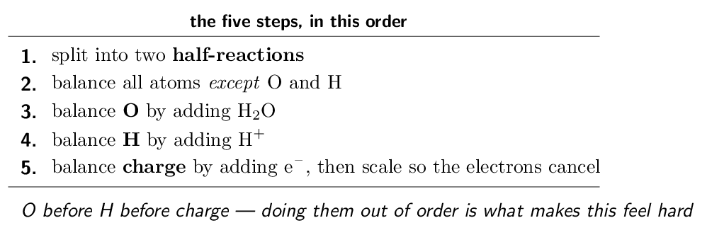

> 📘 **I do: permanganate and iron(II) in acid**
>
> **Balance MnO₄- + Fe²⁺ → Mn²⁺ + Fe³⁺ in acidic
> solution.**
> 
> **Step 1 — split.** Manganese goes from $+7$ to $+2$ (reduced);
> iron goes from $+2$ to $+3$ (oxidised).
> 
> $$ \text{MnO₄- → Mn²⁺}    \qquad    \text{Fe²⁺ → Fe³⁺} $$
> 
> **Steps 2–4 on the manganese half.** Mn is already balanced. Four
> oxygens on the left need four waters on the right; that puts eight
> hydrogens on the right, so add eight H+ on the left:
> MnO₄- + 8H+ → Mn²⁺ + 4H₂O
> 
> **Step 5 — charge.** Left is $-1 + 8 = +7$; right is $+2$. Add
> five electrons to the left:
> MnO₄- + 8H+ + 5e- → Mn²⁺ + 4H₂O
> 
> **The iron half is short.** Fe²⁺ → Fe³⁺ + e-.
> 
> **Scale and add.** The manganese half needs five electrons, the
> iron half supplies one — so multiply the iron half by 5:
> MnO₄- + 8H+ + 5Fe²⁺ → Mn²⁺ + 4H₂O + 5Fe³⁺
> 
> **Check both, always.** Atoms: 1 Mn, 4 O, 8 H, 5 Fe on each side.
> ✓ Charge: left $= -1 + 8 + 10 = +17$; right $= +2 + 0 + 15 = +17$. ✓ A balanced redox equation must balance
> *charge* as well as atoms, and checking it catches almost every
> error this ladder can produce.

> ✏️ **YOUR TURN 2 — four questions**
>
> 1. Balance the half-reaction Cr₂O₇²⁻ → Cr³⁺ in acid.
>    *(working space)*
> 2. How many electrons appear in that half-reaction, and on which
>    side?
>    *(working space)*
> 3. Balance Zn → Zn²⁺ as a half-reaction.
>    *(working space)*
> 4. Why must charge balance as well as atoms?
>    *(working space)*
> 
> > **check:** (a) Cr₂O₇²⁻ + 14H+ + 6e- → 2Cr³⁺ + 7H₂O     (b)
> 6, on the left     (c) Zn → Zn²⁺ + 2e-     (d) electrons
> are conserved

## Ladder 3 • Balancing in base

`ZUM §18.1`

One extra move at the end: neutralise the H+ you added.

> 📘 **I do: the add-hydroxide trick**
>
> **Balance MnO₄- + I- → MnO₂ + I₂ in basic solution.**
> 
> **First balance it as though it were acidic.** The manganese half:
> MnO₄- + 4H+ + 3e- → MnO₂ + 2H₂O
> The iodide half:
> 2I- → I₂ + 2e-
> Scale by 2 and 3 so six electrons cancel:
> 2MnO₄- + 8H+ + 6I- → 2MnO₂ + 4H₂O + 3I₂
> 
> **Now convert to base.** There are eight H+, so add eight
> OH- to *both* sides:
> 2MnO₄- + 8H+ + 8OH- + 6I- → 2MnO₂ + 4H₂O + 3I₂ + 8OH-
> 
> **Combine.** On the left, 8H+ + 8OH- becomes
> 8H₂O:
> 2MnO₄- + 8H₂O + 6I- → 2MnO₂ + 4H₂O + 3I₂ + 8OH-
> 
> **Cancel the water that appears on both sides.** Eight on the
> left, four on the right — subtract four from each:
> 2MnO₄- + 4H₂O + 6I- → 2MnO₂ + 3I₂ + 8OH-
> 
> **Check.** Charge: left $= -2 + 0 - 6 = -8$; right $= 0 + 0 - 8 = -8$. ✓ Atoms: Mn 2, I 6, O $8+4 = 12$ on the left against
> $4 + 8 = 12$ on the right, H 8 against 8. ✓
> 
> **Why the trick works.** Adding the same thing to both sides never
> changes an equation. You are simply using H+ + OH- → H₂O to
> convert an acidic form into an equivalent basic one — which is
> legitimate because in basic solution H+ is not available in any
> meaningful quantity.

> ✏️ **YOUR TURN 3 — four questions**
>
> 1. After acid-balancing, an equation has 6 H+ on the left.
>    How many OH- do you add, and where?
>    *(working space)*
> 2. What do the H+ and OH- combine to form?
>    *(working space)*
> 3. Why is it valid to add OH- to both sides?
>    *(working space)*
> 4. In basic solution, which species should *not* appear in
>    your final answer?
>    *(working space)*
> 
> > **check:** (a) 6, to both sides     (b) H₂O     (c) adding
> equally to both sides preserves the equation     (d) H+

## Ladder 4 • The galvanic cell

`ZUM §18.1`

A galvanic (voltaic) cell separates the two half-reactions so the
electrons must travel through a wire — which is what makes it useful.

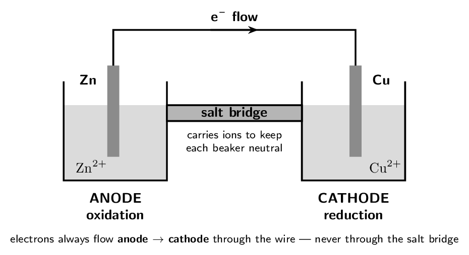

> 📌 **AP scope: learn anode and cathode, not $+$ and $-$**
>
> CED topic 9.8's exclusion: *“Labeling an electrode as positive or
> negative will not be assessed on the AP Exam.”* Good — the signs
> reverse between galvanic and electrolytic cells and cause more
> confusion than they resolve. What **is** assessed, and never
> changes: **oxidation always happens at the anode, reduction
> always at the cathode**, in every cell of every kind. Learn that pair and
> you never need the signs.

> 📘 **I do: reading a cell**
>
> **Take the zinc–copper cell above. Identify each part and say
> why it is there.**
> 
> **The anode is zinc**, because zinc is oxidised:
> Zn → Zn²⁺ + 2e-. The electrode slowly dissolves and the solution
> gains Zn²⁺.
> 
> **The cathode is copper**, because copper(II) is reduced:
> Cu²⁺ + 2e- → Cu. Copper metal plates onto the electrode, which
> gains mass, and the blue colour of the solution fades as Cu²⁺ is
> consumed.
> 
> **Electrons flow from anode to cathode** through the external
> wire. They are produced where oxidation happens and consumed where
> reduction happens, so the direction is forced.
> 
> **The salt bridge exists because of charge build-up.** Without it,
> the anode compartment would accumulate positive charge (Zn²⁺
> entering solution) and the cathode compartment negative charge
> (Cu²⁺ leaving). Within seconds that imbalance would stop the
> reaction. The bridge lets spectator ions migrate — anions toward the
> anode, cations toward the cathode — keeping both sides neutral.
> 
> **Two memory hooks worth having.** **An Ox** and
> **Red Cat**: *An*ode–*Ox*idation, *Red*uction–
> *Cat*hode. And both words in each pair start with the same kind of
> letter — **a**node and **o**xidation are both vowels,
> **c**athode and **r**eduction both consonants.

> ✏️ **YOUR TURN 4 — four questions**
>
> 1. At which electrode does oxidation occur, in *any* cell?
>    *(working space)*
> 2. Which way do electrons flow through the external wire?
>    *(working space)*
> 3. What would happen without a salt bridge?
>    *(working space)*
> 4. Does the anode of a zinc–copper cell gain or lose mass?
>    Explain.
>    *(working space)*
> 
> > **check:** (a) the anode     (b) anode to cathode     (c) charge
> builds up and the reaction stops     (d) loses — Zn dissolves

## Ladder 5 • Cell notation

`ZUM §18.1`

A one-line shorthand for a whole cell diagram. It has a fixed grammar.

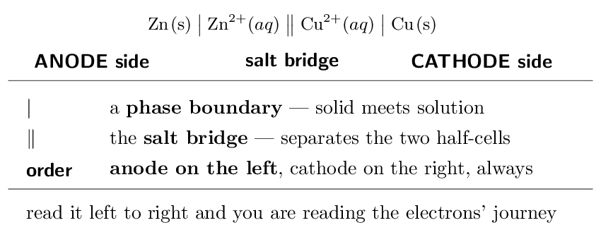

> 📘 **I do: writing and reading notation**
>
> **(a) Write the notation for a cell in which
> Mg → Mg²⁺ + 2e- and Ag+ + e- → Ag.**
> 
> Magnesium is oxidised, so it is the anode and goes on the left; silver
> is reduced, so it is the cathode and goes on the right:
> 
> $$ \text{Mg(s)} \;\big|\; \text{Mg²⁺}(aq) \;\big\|\;    \text{Ag+}(aq) \;\big|\; \text{Ag(s)} $$
> 
> **(b) Read $\text{Fe(s)}|\text{Fe²⁺}\|\text{Cu²⁺}|\text{Cu(s)}$.**
> 
> Iron is on the left, so iron is the anode and is oxidised:
> Fe → Fe²⁺ + 2e-. Copper is on the right, so Cu²⁺ is
> reduced: Cu²⁺ + 2e- → Cu. Overall:
> Fe + Cu²⁺ → Fe²⁺ + Cu.
> 
> **When a species is not a solid, you need an inert electrode.**
> For a half-cell like $\text{Fe³⁺}/\text{Fe²⁺}$ — both species dissolved
> — there is no metal to serve as the electrode, so platinum is used and
> written into the notation:
> 
> $$ \text{Pt(s)} \;\big|\; \text{Fe²⁺}, \text{Fe³⁺} \;\big\|\; \ldots $$
> 
> The comma separates two species in the *same* phase; the single
> bar is reserved for a genuine phase boundary.
> 
> **The one rule that prevents most errors:** anode on the left.
> Everything else follows from it — and if you write the cell backwards,
> your $E^{\circ}_{\text{cell}}$ in Ladder 7 will come out negative for a
> reaction that is actually favoured.

> ✏️ **YOUR TURN 5 — four questions**
>
> 1. In cell notation, which electrode is written on the left?
>    *(working space)*
> 2. What does the double bar represent? 
>    *(working space)*
> 3. Write the notation for a cell with Ni → Ni²⁺ + 2e- and
>    Ag+ + e- → Ag.
>    *(working space)*
> 4. Why is an inert platinum electrode sometimes needed?
>    *(working space)*
> 
> > **check:** (a) the anode     (b) the salt bridge     (c)
> $\text{Ni}|\text{Ni²⁺}\|\text{Ag+}|\text{Ag}$     (d) when no solid is
> present to conduct

## Ladder 6 • Standard reduction potentials

`ZUM §18.2`

Every half-reaction is tabulated as a **reduction**, measured
against the hydrogen electrode, which is defined as exactly zero.

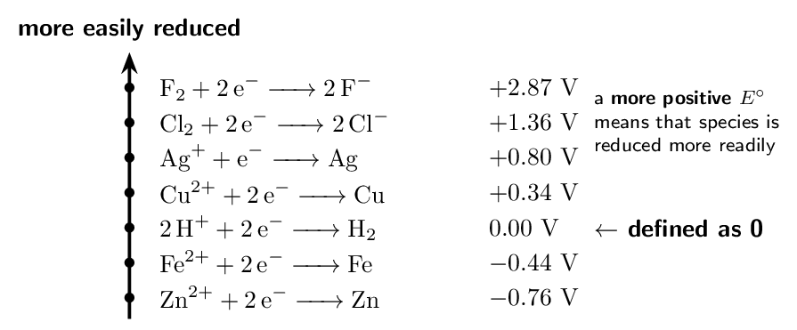

> ⚠️ **AP trap**
>
> **When you reverse a half-reaction, flip the sign of
> $E^{\circ}$ — but do *not* multiply it when you scale the
> coefficients.** Doubling Zn → Zn²⁺ + 2e- does not double its
> potential. $E^{\circ}$ is an *intensive* property, like density or
> temperature: it does not depend on how much you have. This is the one
> place where electrochemistry breaks the Hess's-law habit of scaling
> everything.

> 📘 **I do: what the table is telling you**
>
> **Everything in the table is written as a reduction, so a
> positive value means “this happens readily as written”.**
> 
> **Fluorine, $+2.87$ V.** The most positive value on any standard
> table — F₂ is reduced with enormous willingness, which is why
> elemental fluorine is so ferociously reactive.
> 
> **Zinc, $-0.76$ V.** Negative, so Zn²⁺ → Zn is
> *unfavourable* as written. Run it backwards —
> Zn → Zn²⁺ + 2e-, oxidation — and the sign flips to $+0.76$ V,
> which is favourable. Zinc prefers to be oxidised.
> 
> **Hydrogen, exactly $0.00$ V.** Not measured but *defined*:
> every other potential is measured relative to the standard hydrogen
> electrode. Same logical move as $\Delta H_{f}^{\circ}$ of an element
> being zero in Chapter 6 — a reference point, not a physical fact.
> 
> **How to use the table for a spontaneity question.** The species
> higher on the table (more positive) is reduced; the one lower down runs
> in reverse and is oxidised. In a zinc–copper cell, copper is higher, so
> Cu²⁺ is reduced and zinc is oxidised. That single reading gives
> you the anode, the cathode, and the direction — before you compute
> anything.
> 
> **The terminology caution.** You may see this table described as
> ranking “oxidising agents”. The CED's topic 4.7 exclusion states that
> *“the meaning of the terms `reducing agent' and `oxidising agent'
> will not be assessed”*, so phrase your answers as “Cu²⁺ is
> reduced” rather than “Cu²⁺ is the oxidising agent”. The
> chemistry is identical; only the wording is safer.

> ✏️ **YOUR TURN 6 — four questions**
>
> Use the table above.
> 
> 1. Which is more readily reduced, Ag+ or Cu²⁺?
>    *(working space)*
> 2. Give $E^{\circ}$ for Zn → Zn²⁺ + 2e-.
>    *(working space)*
> 3. Give $E^{\circ}$ for 2Zn → 2Zn²⁺ + 4e-.
>    *(working space)*
> 4. Why is the hydrogen half-reaction exactly $0.00$ V?
>    *(working space)*
> 
> > **check:** (a) Ag+     (b) $+0.76$ V     (c) still $+0.76$ V
>     (d) it is a defined reference

## Ladder 7 • Calculating
$E^{\circ}_{\text{cell}}$

`ZUM §18.2`

$$ E^{\circ}_{\text{cell}}    = E^{\circ}_{\text{cathode}} - E^{\circ}_{\text{anode}} $$

where both values are read straight off the table as *reductions*
— no sign flipping needed.

> 📘 **I do: the Daniell cell, two ways**
>
> **Find $E^{\circ}_{\text{cell}}$ for the zinc–copper cell.**
> 
> **Method 1 — cathode minus anode.** Copper is reduced (cathode,
> $+0.34$ V); zinc is oxidised (anode, tabulated as $-0.76$ V):
> 
> $$ E^{\circ}_{\text{cell}} = 0.34 - (-0.76)    = \mathbf{+1.10\;\text{V}} $$
> 
> Note you subtract the *tabulated* anode value, minus sign and all.
> Do not flip it first — the formula already does that.
> 
> **Method 2 — flip and add, if you prefer.** Write the oxidation
> explicitly and flip its sign:
> 
> $$ \text{Zn → Zn²⁺ + 2e-} \qquad +0.76\;\text{V} $$
> 
> $$ \text{Cu²⁺ + 2e- → Cu} \qquad +0.34\;\text{V} $$
> 
> $$ E^{\circ}_{\text{cell}} = 0.76 + 0.34 = +1.10\;\text{V} $$
> 
> Same answer. Use whichever you find harder to get wrong — but never
> mix them, which is where sign errors come from.
> 
> **The electrons must cancel, and they do so without scaling
> $E^{\circ}$.** Both half-reactions here involve two electrons, so nothing
> needs multiplying. Even if they had not — say a silver half-cell
> needing $\times 2$ — you would scale the *equation* but leave
> $E^{\circ}$ untouched.
> 
> **Sanity check.** A positive $E^{\circ}_{\text{cell}}$ means the
> cell as written runs on its own, which is exactly what a battery does.
> If your answer is negative, either you have the anode and cathode
> swapped, or the reaction genuinely needs to be driven (Ladder 13).

> ✏️ **YOUR TURN 7 — four questions**
>
> Use $E^{\circ}$: Ag+/Ag $= +0.80$, Cu²⁺/Cu $= +0.34$, Fe²⁺/Fe $= -0.44$, Zn²⁺/Zn $= -0.76$ V.
> 
> 1. Find $E^{\circ}_{\text{cell}}$ for a Zn/Ag cell.
>    *(working space)*
> 2. Find $E^{\circ}_{\text{cell}}$ for a Fe/Cu cell.
>    *(working space)*
> 3. In the Fe/Cu cell, which metal is the anode?
>    *(working space)*
> 4. If you doubled every coefficient, what happens to
>    $E^{\circ}_{\text{cell}}$?
>    *(working space)*
> 
> > **check:** (a) $+1.56$ V     (b) $+0.78$ V     (c) iron     (d)
> nothing — it is unchanged

## Ladder 8 • Spontaneity from
$E^{\circ}_{\text{cell}}$

`ZUM §18.3`

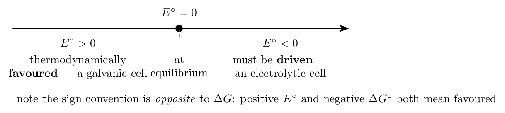

> ⚠️ **AP trap**
>
> **The signs run opposite ways, and that is the trap.** Favoured
> means $\Delta G^{\circ}  0$. The minus sign in
> $\Delta G^{\circ} = -nFE^{\circ}$ is what flips them, and mixing the two
> conventions is the commonest error in Unit 9. When in doubt, remember a
> battery: it works on its own, and it has a *positive* voltage.

> 📘 **I do: predicting whether a reaction happens**
>
> **Will copper metal dissolve in a solution of Zn²⁺?**
> 
> **Write the proposed reaction.** If it happened, copper would be
> oxidised and zinc(II) reduced:
> Cu + Zn²⁺ → Cu²⁺ + Zn
> 
> **Assign the electrodes as proposed.** Zinc is being reduced, so it
> would be the cathode ($-0.76$ V); copper is oxidised, so the anode
> ($+0.34$ V):
> 
> $$ E^{\circ}_{\text{cell}} = -0.76 - 0.34 = -1.10\;\text{V} $$
> 
> **Negative, so it does not happen.** Copper will not dissolve in
> zinc(II) solution. And note the answer is exactly the negative of
> Ladder 7's $+1.10$ V — because it is the same reaction written
> backwards.
> 
> **Now the reverse, which does happen.** Drop zinc metal into
> Cu²⁺ solution and $E^{\circ} = +1.10$ V: the zinc dissolves, copper
> plates onto it, and the blue colour fades. This is a standard
> demonstration and a standard exam question.
> 
> **The shortcut, once you trust the table.** A metal will displace
> any metal ion *below* it in the table. Zinc is below copper, so
> zinc displaces Cu²⁺; copper does not displace Zn²⁺. That
> single reading answers most “will this reaction occur” questions
> without arithmetic.

> ✏️ **YOUR TURN 8 — four questions**
>
> Use the $E^{\circ}$ values from Ladder 7.
> 
> 1. Will zinc metal displace Ag+ from solution? Show the
>    potential.
>    *(working space)*
> 2. Will silver metal displace Cu²⁺? Show the potential.
>    *(working space)*
> 3. What is the sign of $\Delta G^{\circ}$ when $E^{\circ}$ is
>    positive?
>    *(working space)*
> 4. Why do a positive $E^{\circ}$ and a negative $\Delta G^{\circ}$
>    mean the same thing?
>    *(working space)*
> 
> > **check:** (a) yes, $+1.56$ V     (b) no, $-0.46$ V     (c)
> negative     (d) the minus sign in $\Delta G = -nFE$

## Ladder 9 • $\Delta G^{\circ} = -nFE^{\circ}$

`ZUM §18.3`

The hinge of the chapter — the equation that makes electrochemistry a
branch of Chapter 17.

$$ \Delta G^{\circ} = -n F E^{\circ}    \qquad    F = 96485\,\mathrm{C/mol} $$

$n$ is the number of moles of electrons transferred in the balanced
equation.

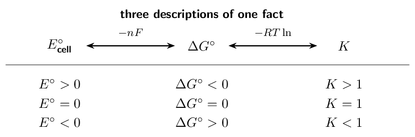

> 📘 **I do: volts to kilojoules and back**
>
> **(a) The zinc–copper cell has $E^{\circ} = +1.10$ V and
> transfers 2 mol of electrons. Find $\Delta G^{\circ}$.**
> 
> $$ \Delta G^{\circ} = -nFE^{\circ}    = -(2)(96485)(1.10) $$
> 
> $$ = -212000\,\mathrm{J} = \mathbf{-212\,\mathrm{kJ}} $$
> 
> Negative, as a positive $E^{\circ}$ requires — and large, which is why
> this cell is a usable battery.
> 
> **Units check.** A volt is a joule per coulomb, so
> $\text{mol} \times \text{C/mol} \times \text{J/C}$ leaves joules.
> Convert to kilojoules at the end; forgetting to leaves an answer a
> thousand times too large.
> 
> **(b) A reaction transferring 2 mol of electrons has
> $\Delta G^{\circ} = -96.5\,\mathrm{kJ}$. Find $E^{\circ}$.**
> 
> Rearrange:
> 
> $$ E^{\circ} = \frac{-\Delta G^{\circ}}{nF}    = \frac{96500}{(2)(96485)}    = \mathbf{+0.500\;\text{V}} $$
> 
> Note the numbers were chosen so $F$ nearly cancels — exam items often
> are.
> 
> **Finding $n$ is the step people skip.** It is the number of
> electrons that actually cancel when you combine the half-reactions —
> *not* the number in either half alone. For
> 2Al + 3Cu²⁺ → 2Al³⁺ + 3Cu, aluminium gives up 3 each and
> copper takes 2 each, so the balanced equation transfers
> $2 \times 3 = 6$ moles of electrons: $n = 6$.

> ✏️ **YOUR TURN 9 — four questions**
>
> Use $F = 96485\,\mathrm{C/mol}$.
> 
> 1. $E^{\circ} = +0.50$ V and $n = 2$. Find $\Delta G^{\circ}$ in
>    kJ.
>    *(working space)*
> 2. $E^{\circ} = -0.25$ V and $n = 1$. Find $\Delta G^{\circ}$ and
>    say whether it is favoured.
>    *(working space)*
> 3. For 2Al + 3Cu²⁺ → 2Al³⁺ + 3Cu, what is $n$?
>    *(working space)*
> 4. Why does a positive $E^{\circ}$ always give a negative
>    $\Delta G^{\circ}$?
>    *(working space)*
> 
> > **check:** (a) -96.5 kJ     (b)
> +24.1 kJ, not favoured     (c) 6     (d) the minus
> sign, with $n$ and $F$ positive

## Ladder 10 • $E^{\circ}$ and $K$

`ZUM §18.3`

Combine Ladder 9 with Chapter 17's $\Delta G^{\circ} = -RT\ln K$ and the
free energy drops out:

$$ E^{\circ} = \frac{0.0592}{n}\,\log K    \qquad\text{at 298\,\mathrm{K}} $$

> 📘 **I do: how far does a battery reaction go?**
>
> **Find $K$ for the zinc–copper cell, where $E^{\circ} = 1.10$ V
> and $n = 2$.**
> 
> Rearrange for $\log K$:
> 
> $$ \log K = \frac{n E^{\circ}}{0.0592}           = \frac{(2)(1.10)}{0.0592}           = \frac{2.20}{0.0592} = 37.2 $$
> 
> $$ K = 10^{37.2} \approx \mathbf{10^{37}} $$
> 
> **That is an enormous number**, and it should be. A cell potential
> of 1.10 V is large, so the reaction runs essentially to completion —
> which is why the cell delivers current until one reactant is exhausted
> rather than fading to an equilibrium mixture.
> 
> **Notice how little voltage it takes.** Just 1.10 V corresponds to
> $K \approx 10^{37}$. The logarithm compresses ferociously: every
> $0.0592/n$ volts is one power of ten in $K$. A cell with
> $E^{\circ} = 0.10$ V and $n = 2$ has $\log K = 3.4$, so $K \approx 10^{3}$ — still product-favoured, but a billion billion billion times
> less so.
> 
> **Where the $0.0592$ comes from.** It is $2.303\,RT/F$ evaluated at
> 25 °C — that is 298.15 K, which is why the
> constant is $0.0592$ and not the $0.0591$ you get from a rounded
> 298 K. It is a temperature-specific shortcut, so state the
> assumption if a question gives you a different temperature.
> 
> **Sanity check, always.** Positive $E^{\circ}$ gives
> $\log K > 0$, so $K > 1$ and products are favoured. Negative
> $E^{\circ}$ gives $K  figure means any two of $E^{\circ}$, $\Delta G^{\circ}$ and $K$ let you
> check the third.

> ✏️ **YOUR TURN 10 — four questions**
>
> Use $E^{\circ} = (0.0592/n)\log K$ at 298 K.
> 
> 1. $E^{\circ} = +0.0592$ V and $n = 1$. Find $\log K$ and $K$.
>    *(working space)*
> 2. $E^{\circ} = +0.30$ V and $n = 2$. Find $\log K$.
>    *(working space)*
> 3. If $E^{\circ}$ is negative, is $K$ greater or less than 1?
>    *(working space)*
> 4. Why is the constant $0.0592$ only valid at
>    298 K?
>    *(working space)*
> 
> > **check:** (a) $\log K = 1$, $K = 10$     (b) $\log K = 10.1$    
> (c) less than 1     (d) it contains $T$

## Ladder 11 • The Nernst equation

`ZUM §18.4`

Real cells rarely sit at standard conditions. The Nernst equation
corrects $E^{\circ}$ for the concentrations you actually have.

$$ E = E^{\circ} - \frac{0.0592}{n}\,\log Q    \qquad\text{at 298\,\mathrm{K}} $$

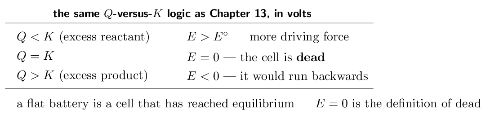

> 📘 **I do: a cell away from standard conditions**
>
> **For the zinc–copper cell ($E^{\circ} = 1.10$ V, $n = 2$), find
> $E$ when $[\text{Zn²⁺}] = 0.10\,\mathrm{M}$ and $[\text{Cu²⁺}] = 1.0\,\mathrm{M}$.**
> 
> **Write $Q$ for the cell reaction** Zn + Cu²⁺ → Zn²⁺ +
> Cu. Solids are omitted, exactly as in Chapter 13:
> 
> $$ Q = \frac{[\text{Zn²⁺}]}{[\text{Cu²⁺}]}      = \frac{0.10}{1.0} = 0.10 $$
> 
> **Substitute.**
> 
> $$ E = 1.10 - \frac{0.0592}{2}\log(0.10)      = 1.10 - (0.0296)(-1) $$
> 
> $$ = 1.10 + 0.0296 = \mathbf{+1.13\;\text{V}} $$
> 
> **Higher than standard, and that makes sense.** There is less
> product (Zn²⁺) than standard and a full complement of reactant, so
> the reaction has further to go and pushes harder. Le Ch\^atelier, read
> as a voltage.
> 
> **The two things to get right.** First, **solids and pure
> liquids do not appear in $Q$** — so Zn and Cu metal are
> absent. Second, watch the sign: $\log$ of a number below 1 is negative,
> and subtracting a negative *raises* $E$. Sign slips here are the
> main source of wrong answers.
> 
> **And the limiting case.** As the cell runs, Zn²⁺ builds up
> and Cu²⁺ is consumed, so $Q$ rises. When $Q$ finally reaches $K$,
> the correction term exactly cancels $E^{\circ}$ and $E = 0$. The battery
> is flat — not because it ran out of chemicals, but because it reached
> equilibrium.

> ✏️ **YOUR TURN 11 — four questions**
>
> Use $E^{\circ} = 1.10$ V, $n = 2$ for the Zn/Cu cell.
> 
> 1. Find $E$ when $[\text{Zn²⁺}] = 1.0\,\mathrm{M}$ and
>    $[\text{Cu²⁺}] = 0.010\,\mathrm{M}$.
>    *(working space)*
> 2. Does raising $[\text{Cu²⁺}]$ raise or lower $E$? Why?
>    *(working space)*
> 3. What is $E$ when the cell reaches equilibrium?
>    *(working space)*
> 4. Which species are omitted from $Q$, and why?
>    *(working space)*
> 
> > **check:** (a) $+1.04$ V     (b) raises it — more reactant    
> (c) 0     (d) solids and pure liquids

## Ladder 12 • Concentration cells

`ZUM §18.4`

The strangest cell in the course: identical electrodes, identical
chemistry on both sides, and it still produces a voltage.

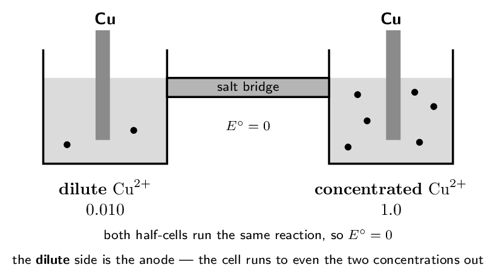

> 📘 **I do: voltage from concentration alone**
>
> **A copper concentration cell has 0.010 M Cu²⁺
> on one side and 1.0 M on the other. Find $E$.**
> 
> **Start with $E^{\circ} = 0$.** Both half-reactions are
> Cu²⁺ + 2e- → Cu, so the cathode and anode values are identical
> and cancel exactly. Whatever voltage appears comes entirely from the
> Nernst correction.
> 
> **Decide which side is the anode.** The cell will act to
> *reduce* the difference, so the dilute side must gain Cu²⁺
> — meaning copper dissolves there. Dilute side is the anode; the
> concentrated side is the cathode, where Cu²⁺ plates out.
> 
> **Write $Q$ as (anode concentration) over (cathode
> concentration)**, since the anode species is the product:
> 
> $$ Q = \frac{0.010}{1.0} = 0.010 $$
> 
> **Apply Nernst with $n = 2$.**
> 
> $$ E = 0 - \frac{0.0592}{2}\log(0.010)      = -(0.0296)(-2) = \mathbf{+0.0592\;\text{V}} $$
> 
> **Small but real.** Concentration cells produce tens of millivolts,
> not volts — but they are the principle behind the pH meter, where a
> known reference concentration is compared against an unknown one and the
> voltage reports the difference.
> 
> **The check that costs nothing.** $E$ must come out
> *positive* if you assigned the anode correctly. A negative answer
> means you put the concentrated side as the anode; swap them. And when
> the two concentrations become equal, $Q = 1$, $\log Q = 0$ and
> $E = 0$ — the cell dies exactly when the difference disappears.

> ✏️ **YOUR TURN 12 — four questions**
>
> 1. What is $E^{\circ}$ for any concentration cell? Why?
>    *(working space)*
> 2. In a concentration cell, which side is the anode?
>    *(working space)*
> 3. Find $E$ for a copper concentration cell with
>    0.10 M and 1.0 M ($n = 2$).
>    *(working space)*
> 4. What happens to $E$ as the two concentrations approach each
>    other?
>    *(working space)*
> 
> > **check:** (a) 0 — both half-cells are identical     (b) the dilute
> side     (c) $+0.0296$ V     (d) it falls to zero

## Ladder 13 • Electrolytic cells

`ZUM §18.7`

Run electricity *into* a cell and you can force an unfavourable
reaction to happen. Same vocabulary, opposite energetics.

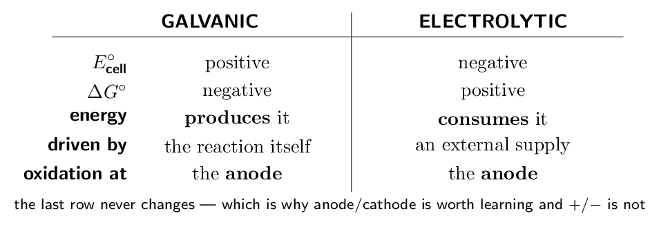

> 📘 **I do: forcing a reaction uphill**
>
> **The zinc–copper reaction has $E^{\circ} = +1.10$ V. What
> happens if you apply an external voltage greater than 1.10 V in the
> opposite direction?**
> 
> **You drive the reaction backwards.** Copper dissolves and zinc
> plates out — the exact reverse of what the cell does on its own. This
> is electrolysis: using electrical energy to force a thermodynamically
> unfavourable reaction.
> 
> **Why more than 1.10 V?** You must overcome the cell's own
> tendency to run forward. Applying less than 1.10 V lets the cell keep
> discharging; applying exactly 1.10 V holds it at balance; applying more
> overpowers it.
> 
> **Three examples that matter industrially.** Electroplating
> deposits a thin metal layer on an object at the cathode. The
> Hall–H\'eroult process reduces Al³⁺ to aluminium metal —
> impossible chemically, because aluminium is so easily oxidised, and the
> reason aluminium was once more precious than gold. And electrolysing
> water gives hydrogen and oxygen, which will not form from water on their
> own.
> 
> **What does *not* change.** Oxidation still happens at the
> anode and reduction still at the cathode. The electrode *signs*
> reverse between cell types, which is precisely why the CED excludes them
> and why you should reason with anode/cathode instead.
> 
> **And note the scope boundary.** Zumdahl's §18.8 covers commercial
> electrolysis in detail — the Downs cell, chlor-alkali, aluminium
> production. That section is not on the CED. Understand the
> *principle* of electrolysis, which is 9.11; do not memorise
> industrial plant designs.

> ✏️ **YOUR TURN 13 — four questions**
>
> 1. What is the sign of $E^{\circ}_{\text{cell}}$ for an
>    electrolytic cell?
>    *(working space)*
> 2. At which electrode does reduction occur in an electrolytic
>    cell?
>    *(working space)*
> 3. Why must the applied voltage exceed the cell's own potential?
>    *(working space)*
> 4. Give one reason aluminium is produced electrolytically rather
>    than chemically.
>    *(working space)*
> 
> > **check:** (a) negative     (b) the cathode     (c) to overpower
> the reverse tendency     (d) Al³⁺ is too hard to reduce
> chemically

## Ladder 14 • Faraday's law

`ZUM §18.7`

The quantitative side of electrolysis: how much substance a given
current deposits in a given time.

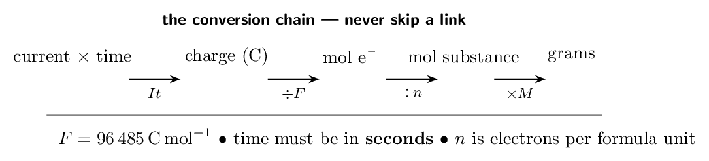

> 📘 **I do: electroplating silver**
>
> **A current of 2.00 A runs for 30.0 min
> through a solution of Ag+. What mass of silver plates out?**
> 
> **Step 1 — time to seconds.**
> 
> $$ 30.0\;\text{min} \times 60 = 1800\,\mathrm{s} $$
> 
> **Step 2 — charge.**
> 
> $$ Q = It = (2.00)(1800) = 3600\,\mathrm{C} $$
> 
> **Step 3 — moles of electrons.**
> 
> $$ \frac{3600}{96485} = 0.0373\,\mathrm{mol}\;\text{e-} $$
> 
> **Step 4 — moles of silver.** The half-reaction is
> Ag+ + e- → Ag, so one electron per silver:
> 
> $$ 0.0373\;\text{mol}\;\text{Ag} $$
> 
> **Step 5 — grams.**
> 
> $$ 0.0373 \times 107.87 = \mathbf{4.02\,\mathrm{g}} $$
> 
> **The step that separates silver from copper.** For
> Cu²⁺ + 2e- → Cu you would divide the moles of electrons by
> **two**, because each copper needs two. Getting $n$ from the
> half-reaction — not guessing it — is the whole skill.
> 
> **Two unit traps.** Time must be in **seconds**; a current in
> amperes is coulombs per second, so minutes or hours must be converted
> first. And an ampere-hour is not a coulomb — multiply by 3600 if a
> question gives you one.
> 
> **Sanity check by scale.** Roughly 96500 C deposits
> one mole of a singly charged metal. We passed 3600 C,
> about 1/27 of that, so we should get about 1/27 of a mole of silver —
> roughly 4 g. It does.

> ✏️ **YOUR TURN 14 — four questions**
>
> Use $F = 96485\,\mathrm{C/mol}$, $M(\text{Cu}) = 63.55\,\mathrm{g/mol}$.
> 
> 1. How many coulombs pass in 20.0 min at
>    1.50 A?
>    *(working space)*
> 2. How many moles of electrons is that? 
>    *(working space)*
> 3. What mass of copper plates out from Cu²⁺?
>    *(working space)*
> 4. Why must you divide by 2 for copper but not for silver?
>    *(working space)*
> 
> > **check:** (a) 1800 C     (b) 0.0187 mol    
> (c) 0.593 g     (d) Cu²⁺ needs two electrons

## Mixed set • ten questions, no labels

> 📌 **Why this section exists**
>
> Every question so far arrived with its ladder attached. These ten do
> not — and in this chapter the first decision is usually *which
> relationship*: the table, $E^{\circ}_{\text{cell}}$, $-nFE^{\circ}$,
> $(0.0592/n)\log K$, Nernst, or Faraday.

> ✏️ **MIXED SET — first five**
>
> 1. Find the oxidation number of Mn in MnO₂.
>    *(working space)*
> 2. Using $E^{\circ}$: Ag+/Ag $= +0.80$,
>    Ni²⁺/Ni $= -0.25$ V, find
>    $E^{\circ}_{\text{cell}}$ for a Ni/Ag cell.
>    *(working space)*
> 3. For that cell, $n = 2$. Find $\Delta G^{\circ}$ in kJ.
>    *(working space)*
> 4. Which electrode is written on the left in cell notation, and
>    what happens there?
>    *(working space)*
> 5. A cell has $E^{\circ} = -0.40$ V. Is it galvanic or
>    electrolytic?
>    *(working space)*
> 
> > **check:** (a) $+4$     (b) $+1.05$ V     (c)
> -203 kJ     (d) the anode; oxidation     (e)
> electrolytic

> ✏️ **MIXED SET — last five**
>
> 1. A cell has $E^{\circ} = +0.0592$ V with $n = 2$. Find
>    $\log K$.
>    *(working space)*
> 2. Balance Cr₂O₇²⁻ → Cr³⁺ in acid.
>    *(working space)*
> 3. A Zn/Cu cell ($E^{\circ} = 1.10$ V, $n = 2$) has
>    $[\text{Zn²⁺}] = 1.0\,\mathrm{M}$ and $[\text{Cu²⁺}] =         0.10\,\mathrm{M}$. Find $E$.
>    *(working space)*
> 4. 1.00 A flows for 96485 s through
>    Ag+. How many moles of silver plate out?
>    *(working space)*
> 5. In an electrolytic cell, where does reduction occur?
>    *(working space)*
> 
> > **check:** (a) 2     (b) Cr₂O₇²⁻ + 14H+ + 6e- → 2Cr³⁺ +
> 7H₂O     (c) $+1.07$ V     (d) 1.00 mol     (e) the
> cathode

## Mastery tracker

Tick a row only if **all four** YOUR TURN questions were right on
the first attempt. Every row is assessed, within the scope stated at the
top: §18.5–18.6 and §18.8 are off the CED and are not here, and the
two exclusion statements (electrode $+$/$-$ labelling, agent
terminology) are honoured throughout.

| **First try?** | **Skill** | **Ladder** | **If not, re-read…** |
|---|---|---|---|
| $\square$ | oxidation numbers | 1 | the sum equals the charge |
| $\square$ | balancing in acid | 2 | O, then H, then charge |
| $\square$ | balancing in base | 3 | add OH- to both sides |
| $\square$ | the galvanic cell | 4 | An Ox, Red Cat |
| $\square$ | cell notation | 5 | anode on the left |
| $\square$ | reduction potentials | 6 | do not scale $E^{\circ}$ |
| $\square$ | $E^{\circ}_{\text{cell}}$ | 7 | cathode minus anode |
| $\square$ | spontaneity | 8 | signs run opposite to $\Delta G$ |
| $\square$ | $\Delta G^{\circ} = -nFE^{\circ}$ | 9 | find $n$ properly |
| $\square$ | $E^{\circ}$ and $K$ | 10 | $(0.0592/n)\log K$ |
| $\square$ | the Nernst equation | 11 | solids omitted from $Q$ |
| $\square$ | concentration cells | 12 | $E^{\circ} = 0$, dilute is anode |
| $\square$ | electrolytic cells | 13 | driven, not driving |
| $\square$ | Faraday's law | 14 | seconds, and $n$ per formula unit |
| $\square$ | **mixed set** (8 of 10) | — | whichever it exposed |

> 📌 **Scoring yourself honestly**
>
> 14/14 and the mixed set: Unit 9 is complete, and with it the whole
> course. Every self-study chapter is now behind you.
> 
> 10–13: check where the misses fall. Ladders 1–3 are redox bookkeeping
> carried over from Chapter 4 and repair with practice. Ladders 6–8 are
> sign conventions, and almost every error there is a **sign** rather
> than a misunderstanding — write “cathode minus anode” at the top of
> your working every time. Ladders 9–12 are Chapter 17 in new units; if
> they missed, the problem may be upstream.
> 
> 9 or fewer: the likeliest single cause is the opposite sign conventions
> of $E^{\circ}$ and $\Delta G^{\circ}$. Re-read Ladders 8 and 9 together
> and fix one sentence in your head — *a battery works on its own
> and has a positive voltage, so favoured means $E^{\circ} > 0$ and
> $\Delta G^{\circ}  from getting that pair the right way round.
> 
> **Where this sits in the course.** Unit 9 combines thermodynamics
> (Chapter 17) and electrochemistry (this one) into a single 7–9% unit.
> If both chapters are solid, you have finished the content and what
> remains is review.

---

*AP Chemistry course materials • student edition • CC BY-NC-SA 4.0*
