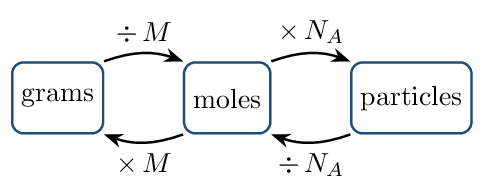
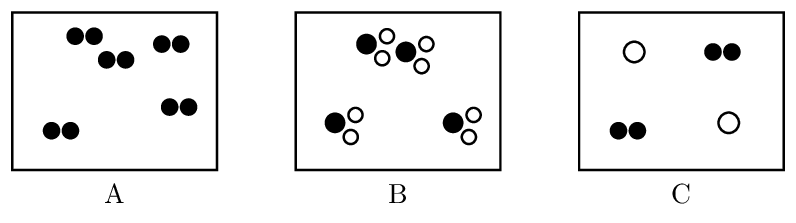
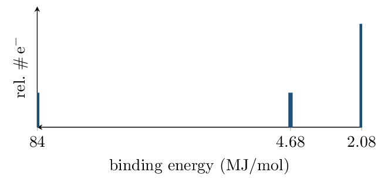

# Guided Notes

*Unit 1 • Atomic Structure and Properties*  
CED 1.1–1.8 • Zumdahl §3.2–3.7, §7.5–7.12, §8.4

[← all lessons](../index.md)

---

## Moles and Mass Spectra Wed Aug 12

> 📌 **By the end you can…**
>
> - Convert among grams, moles, and particles using molar mass and
>    Avogadro's number.
> - Compute an average atomic mass from a mass spectrum and identify
>    the element.

**Read:** Zumdahl §3.2–3.5 • PDF pp. 112–123

> 📌 **Retrieval warm-up**
>
> 1. Express 0.00520 in scientific notation:
>    $5.20\times10^{-3}$
> 2. How many significant figures in 100.0 g?
>    4
> 3. Name MgCl₂: magnesium chloride

#### INSTRUCTION A • The mole: chemistry's counting unit 25 min

### Why count by weighing `CED 1.1`

`SP 5`

Atoms are too small to count directly, so we count them the way a bank counts
coins: by weighing. The bridge between mass and count is the
mole:
1 mol $= 6.022\times10^{23}$ particles $\qquad\text{(Avogadro's number, } N_A\text{)}$

#### Molar mass

The molar mass $M$ (g/mol) is numerically equal to the
average atomic mass on the periodic table. For a compound, add the atoms:

CaCO₃:     $M = 40.08 + 12.01 + 3(16.00) =$
100.09 g/mol

#### The mole road map

> 📌 **Note**
>
> Every path runs *through moles*. There is no direct road from grams to
> particles — that shortcut is where setups go wrong.

> 📘 **Worked example: three-step conversion**
>
> How many oxygen *atoms* are in 10.0 g of CaCO₃?
> 
> $$ \begin{align*}   n &= \frac{10.0\,\mathrm{g}}{100.09\,\mathrm{g/mol}}      = 9.99e-2\,\mathrm{mol}\ \text{CaCO₃}\\   N &= (9.99\times10^{-2})(6.022\times10^{23})      = 6.02\times10^{22}\ \text{formula units}\\   N_{\text{O}} &= 3 \times 6.02\times10^{22} = 1.80\times10^{23}\ \text{O atoms} \end{align*} $$

#### GUIDED PRACTICE • Mole conversions — you drive 15 min

1. Moles in 4.50 g of H₂O:
   0.250 mol
2. Mass of 0.30 mol of NaCl:
   17.5 g ($\approx$ 18 g)
3. Molecules in 0.25 mol of CO₂:
   $1.5\times10^{23}$
4. Hydrogen atoms in 1.0 mol of NH₃:
   $1.8\times10^{24}$

#### INSTRUCTION B • Mass spectra: where atomic masses come from 20 min

### Isotopes and average atomic mass `CED 1.2`

`SP 4`

Most elements are mixtures of isotopes — same protons, different
neutrons. The periodic-table mass is a
weighted average:
$\bar{m} =$ $\sum(\text{abundance} \times \text{mass})$

#### Reading a mass spectrum

A mass spectrometer vaporizes and ionizes a sample, then sorts ions by
mass. On the spectrum:

- peak position (x-axis) $\to$ isotope mass
- peak height/area (y-axis) $\to$ relative abundance
- number of peaks $\to$ number of isotopes

> 📘 **Worked example: magnesium**
>
> A magnesium spectrum shows peaks at 24 u (79%), 25 u (10%), and 26 u (11%).
> 
> $$ \bar{m} = 0.79(24) + 0.10(25) + 0.11(26) = 24.3\,\mathrm{} $$
> 
> The average sits *near 24* because ²⁴Mg dominates — a weighted
> average always leans toward the most abundant isotope.

> ⚠️ **AP trap**
>
> “Average the peak masses” — $(24+25+26)/3 = 25$ — ignores abundance and
> is the single most common Unit 1 error. The AP answer requires the
> *weighted* setup even when the arithmetic is easy.

#### APPLICATION • Spectrum interpretation 20 min

An element's spectrum shows exactly two peaks: 69 u (60.1%) and 71 u (39.9%).

1. Estimate the average atomic mass *before computing*: closer to 69
   or 71? Why?
   
2. Compute it. 
   *(working space)*
3. A student claims the sample must contain two different elements
   because there are two peaks. Refute in one sentence.
   

> 📌 **Exit ticket**
>
> Boron: ¹⁰B 19.9%, ¹¹B 80.1%. Estimate the average atomic
> mass to one decimal and justify the direction it leans.

## Formulas from Data Fri Aug 14

> 📌 **By the end you can…**
>
> - Compute percent composition from a formula, and a formula from
>    percent composition.
> - Distinguish empirical from molecular formulas and connect them via
>    molar mass.
> - Classify matter as pure substance or mixture from particulate
>    diagrams.

**Read:** Zumdahl §3.6–3.7 • PDF pp. 123–132   **Read:** §1.10 • PDF pp. 53–57

> 📌 **Retrieval warm-up**
>
> 1. Molar mass of CO₂: 44.01 g/mol
> 2. Moles in 9.0 g H₂O: 0.50 mol
> 3. Mass spectrum peaks at 63 u and 65 u, heights 7 : 3. Which isotope is
>    more abundant? ⁶³Cu (63 u)

#### INSTRUCTION A • Percent composition and empirical formulas 25 min

### Percent composition `CED 1.3`

`SP 5`

$\%\,\text{element} =$ $\dfrac{\text{mass of element in 1 mol}}{\text{molar mass}}\times 100\%$

H₂O:     $\%\,\text{O} = \dfrac{16.00}{18.02}\times100\% =$
88.8%

#### From percent to formula: the four-step recipe

1. Assume a 100 g sample $\to$ percents become grams.
2. Convert each element to moles.
3. Divide every mole value by the smallest of them.
4. If ratios aren't whole, multiply all by a small integer
   ( .5 $\to\times2$,  .33 $\to\times3$ ).

> 📘 **Worked example: vitamin C**
>
> 40.9% C, 4.58% H, 54.5% O; molar mass $\approx 176\,\mathrm{g/mol}$.
> 
> $$ \begin{align*}   \text{C}&: 40.9/12.01 = 3.41 & \text{H}&: 4.58/1.008 = 4.54 & \text{O}&: 54.5/16.00 = 3.41\\   \text{C}&: 3.41/3.41 = 1     & \text{H}&: 4.54/3.41 = 1.33  & \text{O}&: 3.41/3.41 = 1 \end{align*} $$
> 
> $\times 3$: empirical C₃H₄O₃ ($M_{emp}=88.06$).
> Since $176/88.06 = 2$, molecular formula = C₆H₈O₆.

> ⚠️ **AP trap**
>
> Never round 1.33 to 1. Ratios ending in .25, .33, .5, .67, .75 are signals to
> multiply, not round. Rounding is only for values within $\sim$0.05 of a whole
> number.

#### GUIDED PRACTICE • Formula determination 15 min

A compound is 75.0% C and 25.0% H by mass.

1. Empirical formula: 
   *(working space)*
2. If the molar mass is 16 g/mol, the molecular formula is
   CH₄ — empirical and molecular can be the
   same.

#### INSTRUCTION B • Pure substances, mixtures, and hydrates 20 min

### Classifying matter at the particle level `CED 1.4`

`SP 1`

Diagram A shows a pure element (diatomic);
B shows a pure compound;
C shows a mixture.
The test: a pure substance has only one kind of particle.

#### Mixtures have variable composition

For a mixture, composition is a *measured* quantity, not a formula.
A 5.0 g mixture containing 2.0 g NaCl is
40% NaCl by mass.

#### APPLICATION • Hydrate analysis 20 min

MgSO₄ . 7 H₂O (Epsom salt) is a compound — water molecules sit in fixed
ratio inside the crystal.

1. Molar mass of MgSO₄ . 7 H₂O: 
   *(working space)*
2. Percent water by mass: 
   *(working space)*
3. Heating drives off the water. Is the white powder left behind the same
   substance you started with? Justify at the particle level.
   

> 📌 **Exit ticket**
>
> A compound is 50.0% S and 50.0% O by mass. Find its empirical formula.

## Electron Configurations and Coulomb's Law Mon Aug 17

> 📌 **By the end you can…**
>
> - Write ground-state configurations for atoms and ions; recognize
>    excited states.
> - Use Coulomb's law, shielding, and effective nuclear charge to compare
>    electron energies.

**Read:** Zumdahl §7.5, 7.8–7.11 • PDF pp. 346–364

> 📌 **Retrieval warm-up**
>
> 1. Average mass from peaks 6 u (7.6%) and 7 u (92.4%):
>    6.9  (Li)
> 2. Empirical formula of C₆H₁₂O₆: CH₂O
> 3. Moles of O atoms in 0.50 mol CO₂:
>    1.0 mol
> 4. Protons / neutrons in ³⁷Cl: 17 / 20

#### INSTRUCTION A • Where electrons live 25 min

### Shells, subshells, and the filling order `CED 1.5`

`SP 1`

Electrons occupy shells ($n = 1, 2, 3\ldots$) divided into
subshells (s, p, d, f) holding at most
2, 6,
10, and 14 electrons.

Three rules govern ground states:

- Aufbau: fill from lowest energy upward
- Pauli: max 2 electrons per orbital, opposite spins
- Hund: within a subshell, spread out singly before pairing

> 📘 **Worked example: sulfur three ways**
>
> **Full:** S (16 e$^-$): $1s^2\,2s^2\,2p^6\,3s^2\,3p^4$  
> 
> **Noble-gas shorthand:** $[\text{Ne}]\,3s^2\,3p^4$  
> 
> **Orbital diagram (3p only):**
> $\uparrow\downarrow\ \ \uparrow\ \ \uparrow$ — Hund's rule leaves two
> unpaired.

Practice — write shorthand configurations:

1. P: $[\text{Ne}]\,3s^2\,3p^3$
2. K: $[\text{Ar}]\,4s^1$
3. Ca²⁺: $[\text{Ar}]$ (18 e$^-$)
4. S²⁻: $[\text{Ar}]$ — isoelectronic with Ca²⁺

> 📌 **Note**
>
> Ions first, then configure. Ca²⁺ means *remove two electrons from
> Ca*, not “calcium's configuration plus a label.” Species with identical
> configurations are isoelectronic.

> ⚠️ **AP trap**
>
> An excited state obeys Pauli but violates Aufbau:
> $1s^2\,2s^1\,2p^4$ is excited nitrogen (an electron promoted before 2s
> filled). If any lower orbital is short while a higher one is occupied, it's
> excited — a favorite AP multiple-choice disguise.

#### GUIDED PRACTICE • Configuration checks 15 min

For each, ground state, excited state, or impossible?

$1s^2\,2s^2\,2p^5$: ground state (F)

$1s^2\,2s^1\,2p^6$: excited (2s not full, 2p occupied)

$1s^2\,2s^3\,2p^4$: impossible (2s holds max 2)

#### INSTRUCTION B • Coulomb's law: the engine behind everything 20 min

### Attraction, distance, and shielding `CED 1.5`

`SP 6`

Coulomb's law, qualitatively: attraction between charges grows with
larger charges and shrinks with
greater distance.

For an electron in an atom, the pull it feels is the effective nuclear
charge $Z_{\text{eff}}$:
$Z_{\text{eff}} \approx Z -$ S \text (shielding by inner electrons)

Core electrons shield well; electrons in the
*same* shell shield poorly.

> 📘 **Worked example: why 3p loses before 3s**
>
> In sulfur, 3p electrons are higher in energy than 3s: same shell, but the p
> subshell penetrates less, so it is shielded slightly more and held slightly
> less tightly. Energy ordering *within* an atom is set by the tug-of-war
> between $Z$ and shielding — this is exactly what PES will let us
> *measure* on Wednesday.

#### APPLICATION • Ranking with reasons 20 min

Which electron is held more tightly: a 2p in F or a 2p in O? Two-part
        answer: claim, then Coulombic reason.
        

Na's 3s electron vs Na's 2p electrons: which is easier to remove, and
        why?
        

> 📌 **Exit ticket**
>
> Write the shorthand configuration of Al³⁺ and name one species it is
> isoelectronic with.

## Photoelectron Spectroscopy Wed Aug 19

> 📌 **By the end you can…**
>
> - Explain what a PES experiment measures and how.
> - Read a PES spectrum: position $\to$ binding energy, area $\to$
>    electron count; identify elements.

**Read:** Zumdahl §7.12 • PDF pp. 368–369

> 📌 **Retrieval warm-up**
>
> 1. Shorthand configuration of Mg: $[\text{Ne}]\,3s^2$
> 2. Which is held more tightly, a 1s or 2s electron in the same atom?
>    Why, in five words or fewer? 1s — closer to
>    nucleus
> 3. ²⁵Mg has how many neutrons? 13

#### INSTRUCTION A • The experiment 25 min

### Knocking electrons out and timing them `CED 1.6`

`SP 4`

In photoelectron spectroscopy, high-energy photons strike a sample and
eject electrons. We measure each ejected electron's kinetic energy. Energy
conservation gives the electron's binding energy:
$BE =$ $h\nu - KE_{\text{electron}}$

A tightly held electron exits slowly (low KE, high BE);
a loosely held electron exits fast.

#### Anatomy of the spectrum

- x-axis: binding energy (usually decreasing rightward)
- each peak: one subshell
- peak area: number of electrons in that subshell

> 📘 **Worked example: neon**
>
> 

Three peaks $\to$ three subshells. Areas 2 : 2 : 6 $\to$
$1s^2\,2s^2\,2p^6$ $\to$ **neon**. The 1s peak sits at enormous binding
energy because those electrons are nearest an unshielded nucleus.

> ⚠️ **AP trap**
>
> Height is *electron count*, not stability; position is *binding
> energy*, not abundance. Students who learn mass spectra first often transplant
> “height = abundance” onto PES. Different instrument, different axis.

#### GUIDED PRACTICE • Read one yourself 15 min

A spectrum shows peaks at 273, 26.8, 20.2, 2.44, 1.25 MJ/mol with areas
2 : 2 : 6 : 2 : 5.

Configuration: $1s^2\,2s^2\,2p^6\,3s^2\,3p^5$

Element: chlorine

Which peak represents the electrons lost first in ionization?
        1.25 MJ/mol (3p)

#### INSTRUCTION B • What PES proves 20 min

### Evidence for shells and subshells `CED 1.6`

`SP 6`

PES is the experimental receipt for the shell model:

- Discrete peaks $\to$ electrons occupy discrete
   energy levels, not a continuum.
- 2s and 2p peaks are *close but distinct* $\to$ shells contain
   subshells.
- Across a period, every peak shifts to higher BE
   — more protons, same shielding.

> 📘 **Worked example: boron vs fluorine 1s**
>
> B 1s: 19.3 MJ/mol. F 1s: 67.2 MJ/mol. Same subshell, same shielding
> ($\approx$ none for 1s) — but F has 9 protons to B's 5. Binding energy
> tracks $Z_{\text{eff}}$, and nothing shields the 1s.

#### APPLICATION • Full spectrum analysis 20 min

Phosphorus: peaks at 208, 18.7, 13.5, 1.95, 1.06 MJ/mol.

Label each peak with its subshell and electron count.
        

Predict how sulfur's spectrum differs. Two specific changes.
        

Sketch space — draw P's spectrum with correct relative areas:
        

*(working space)*

> 📌 **Exit ticket**
>
> One PES peak of element X sits at 0.74 MJ/mol with area 2; the next peak is at
> 5.31 MJ/mol. X's 0.74 peak is 3s. Identify X and justify from the areas.

## Periodic Trends and Ionic Compounds Fri Aug 21

> 📌 **By the end you can…**
>
> - Explain — not just state — trends in radius, ionization energy,
>    and electronegativity.
> - Use successive ionization energies to locate an element's group.
> - Predict ionic charges and write ionic formulas.

**Read:** Zumdahl §7.12 • PDF pp. 364–371   **Read:** §8.4 • PDF pp. 400–404

> 📌 **Retrieval warm-up**
>
> 1. PES: peak area tells you electron count in subshell
> 2. Configuration of O²⁻: $1s^2 2s^2 2p^6$ ($=[\text{Ne}]$)
> 3. Percent O in CO₂ (nearest whole): 73%

#### INSTRUCTION A • The trends, with their engine 25 min

### Radius, ionization energy, electronegativity `CED 1.7`

`SP 6`

Every trend explanation on the AP exam is built from the same three levers:
nuclear charge $Z$, distance/shell $n$, and shielding.

| **Property** | **Trend** | **Coulombic reason** |
|---|---|---|
| Atomic radius | down: up  
 across: down | down: more shells; across: same shells, rising $Z_{\text{eff}}$ pulls
    cloud inward |
| Ionization energy | down: down  
 across: up | valence electron closer to a stronger pull is
    harder to remove |
| Electronegativity | down: down  
 across: up | same engine: $Z_{\text{eff}}$ up, distance down |

> ⚠️ **AP trap**
>
> “F is more electronegative because it wants a full octet” scores
> **zero**. Octet language is not an explanation; the rubric wants nuclear
> charge, distance, and shielding. Practice saying the Coulombic sentence.

#### The two famous IE anomalies (period 2)

- B $

Radius, largest first: Na, Mg, Al:
        Na $>$ Mg $>$ Al

First IE, largest first: Ne, Na, Ar:
        Ne $>$ Ar $>$ Na

Which is larger, Cl or Cl-? One-line reason.
        Cl- — same $Z$, more e$^-$/repulsion

#### INSTRUCTION B • Successive IE and ionic compounds 20 min

### Reading a successive-ionization table `CED 1.7`

`SP 4`

Removing electrons one at a time, IE rises gradually — until you hit the
core. The giant jump marks the end of the valence electrons.

> 📘 **Worked example: locate the group**
>
> Element X (kJ/mol): $IE_1 = 578$, $IE_2 = 1817$, $IE_3 = 2745$,
> $IE_4 = 11{,}577$. The cliff sits between $IE_3$ and $IE_4$ $\to$ 3 valence
> electrons $\to$ group 13. (X is aluminum.)

### From configurations to ionic formulas `CED 1.8`

`SP 5`

Main-group atoms gain or lose electrons to reach a noble-gas configuration:
metals lose (cations), nonmetals
gain (anions). The compound's formula balances total
charge to zero.

Ca + Br $\to$ CaBr₂

Al + O $\to$ Al₂O₃

Mg + N $\to$ Mg₃N₂

#### APPLICATION • Data-based reasoning 20 min

An element has $IE_1 = 738$, $IE_2 = 1451$, $IE_3 = 7733$ kJ/mol.
        State its group and the formula of its chloride.
        

Rank K+, Cl-, Ca²⁺ by radius (all are isoelectronic
        with Ar) and give the Coulombic reason.
        

> 📌 **Exit ticket**
>
> Why is Na+ much smaller than Na? One Coulombic sentence.

---

*AP Chemistry course materials • student edition • CC BY-NC-SA 4.0*
