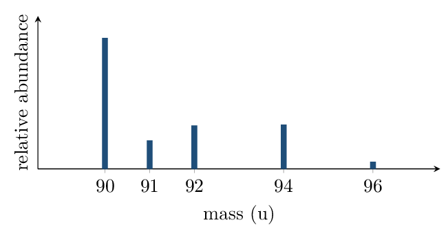

# Worksheet 2 • Mass Spectra & Particulate Reasoning

*Unit 1 • Atomic Structure and Properties*  
Type B conceptual • CED 1.2, 1.4 • drawings and justifications, not just answers

[← all lessons](../index.md)

---

> 📌 **Directions & data**
>
> Answers without reasoning earn no credit here — this sheet trains
> the justification sentences the FRQs grade. Keep every explanation to one or
> two sentences built on evidence.

**1.** The mass spectrum of zirconium:

1. How many naturally occurring isotopes does Zr have?
   5
2. Without computing, is the average atomic mass closer to 90 or 93?
   Justify from the spectrum.
   
3. Write — but do not evaluate — the full expression for the average
   atomic mass. 
4. ⁹⁰Zr and ⁹⁴Zr: identical, in one column; different,
   in the other. Fill both.
   

**2.** Antimony has two isotopes: ¹²¹Sb and ¹²³Sb. The
periodic table lists Sb as 121.76 . Which isotope is more abundant,
and *approximately* what fraction is it? Reason without long
computation. 

**3.** In the box below, draw a particulate diagram of a mixture of
diatomic element $X_2$ (filled circles) and compound $XY$ (filled–open
pairs). Include at least 3 particles of each. 

*(working space)*

**4.** A sample contains only H₂O molecules. A student claims it
must be a mixture because it contains two different elements. Evaluate the
claim. 

**5.** Chlorine gas is made of Cl₂ molecules built from
³⁵Cl (75.8%) and ³⁷Cl (24.2%). The mass spectrum of
Cl₂ (molecular ions) shows peaks at 70, 72, and 74 u. Explain where the
72 u peak comes from. 

> 📌 **Spiral review • Block 1 • mole drill**
>
> 1. Moles in 8.0 g of O₂: 0.25 mol
> 2. Mass of $6.02\times10^{22}$ atoms of Na: 2.3 g
> 3. % C in CH₄ (nearest whole): 75%
> 4. Empirical formula of N₂O₄: NO₂
> 5. An element's spectrum has one peak. What does that tell you?
>    only one stable isotope

---

*AP Chemistry course materials • student edition • CC BY-NC-SA 4.0*
