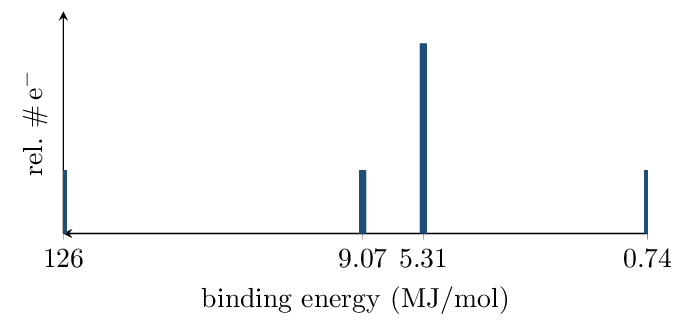

# Worksheet 3 • Configurations & PES

*Unit 1 • Atomic Structure and Properties*  
CED 1.5, 1.6 • configurations cold, spectra warm

[← all lessons](../index.md)

---

> 📌 **Directions & data**
>
> Configurations from memory — no periodic-table peeking until you
> check. PES answers must cite peak position or area as evidence.

**1.** Write shorthand ground-state configurations:

1. Si: $[\text{Ne}]\,3s^2\,3p^2$
2. K+: $[\text{Ar}]$
3. N³⁻: $[\text{Ne}]$ ($1s^22s^22p^6$)
4. Se: $[\text{Ar}]\,4s^2\,3d^{10}\,4p^4$

**2.** Classify each as ground state, excited state, or impossible —
and name the element where one exists:

1. $1s^2\,2s^2\,2p^2$: ground — carbon
2. $1s^2\,2s^2\,2p^7$: impossible (p max 6)
3. $1s^2\,2s^2\,2p^5\,3s^1$: excited neon (10 e$^-$)

**3.** How many *unpaired* electrons in a ground-state N atom?
Draw the 2p orbital diagram to support your count. 

*(working space)*

**4.** The complete PES spectrum of an unknown element:

1. Assign every peak to a subshell:
   126 $\to 1s^2$; 9.07 $\to 2s^2$; 5.31 $\to 2p^6$;
   0.74 $\to 3s^2$
2. Identify the element, citing total electron count as evidence:
   $2+2+6+2 = 12$ e$^-$ $\to$ magnesium
3. Why does the 2p peak sit at *lower* binding energy than 2s, even
   though both are in shell 2? 
4. Predict two specific changes in this spectrum for the *next*
   element (Al). 

**5.** The 1s binding energy of C is 28.6 MJ/mol; of O it is 54.4
MJ/mol. Explain the difference in one Coulombic sentence — no octet
language. 

> 📌 **Spiral review • Blocks 1–2 • keep it warm**
>
> 1. Average mass, peaks at 85 u (72%) and 87 u (28%):
>    85.6 u (Rb)
> 2. Moles of Al in 5.4 g: 0.20 mol
> 3. Empirical formula: 80.0% C, 20.0% H:
>    CH₃
> 4. If its molar mass is 30 g/mol, molecular formula:
>    C₂H₆
> 5. One-particle-type diagram with two-atom units of different elements:
>    element, compound, or mixture? compound

---

*AP Chemistry course materials • student edition • CC BY-NC-SA 4.0*
