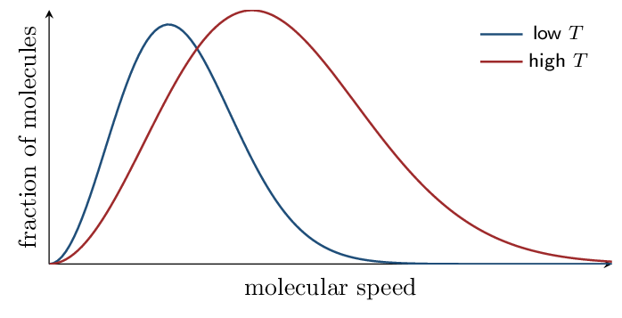
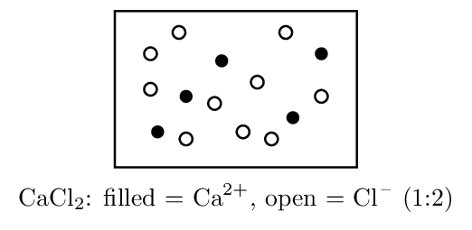

# Guided Notes

*Unit 3 • Properties of Substances and Mixtures*  
CED 3.1–3.13 • Zumdahl §1.10, §4.1–4.3, §5.2–5.9, §7.1–7.2, §10–11, App. 3

[← all lessons](../index.md)

---

## Intermolecular Forces Fri Sep 11

> 📌 **By the end you can…**
>
> - Identify all intermolecular forces present in a substance.
> - Rank substances by IMF strength, accounting for both polarity and
>    polarizability.

**Read:** Zumdahl §10.1 • PDF pp. 493–498

> 📌 **Retrieval warm-up**
>
> 1. Is CCl₄ polar? Why? no — tetrahedral,
>    dipoles cancel
> 2. Geometry of H₂O: bent
> 3. Which is more electronegative, N or H?
>    N

#### INSTRUCTION A • The forces between particles 25 min

### Interparticle forces, weakest to strongest `CED 3.1`

`SP 1`

| **Force** | **Present in** | **Origin** |
|---|---|---|
| London dispersion (LDF) | ALL substances | instantaneous, temporary dipoles from electron motion |
| Dipole–dipole | polar molecules | permanent $\delta^+$ attracted to $\delta^-$ |
| Hydrogen bonding | H bonded to N, O, or F | an especially strong dipole–dipole case |
| Ion–dipole | ion $+$ polar solvent | drives dissolving of salts |

> 📌 **Note**
>
> Dispersion forces exist in *everything*, including polar molecules and
> ions. The question is never “does it have LDF” but “how strong are
> they.” Strength grows with the number of electrons — more electrons means
> a more polarizable electron cloud.

#### Hydrogen bonding is not a bond

It is an intermolecular attraction, roughly 5–10% as
strong as a covalent bond. It requires H bonded *directly* to N, O, or
F — CH₃OH qualifies through its O–H;
CH₃OCH₃ does not (no H on O).

> 📘 **Worked example: when dispersion wins**
>
> Zumdahl's Table 10.3 compares three molecules:
> 
> | Molecule | Forces present | bp ( | deg;C) |
> |---|---|---|---|
> | BI₃ | LDF only | 209.5 |
> | PCl₃ | LDF + dipole–dipole | 76.1 |
> | NH₃ | LDF + hydrogen bonding | $-33.0$ |

BI₃ is nonpolar yet boils highest — its huge electron count makes
dispersion overwhelming. **Never rank by force *type* alone.**
Compare molar mass first when the sizes differ greatly.

#### GUIDED PRACTICE • Identify and rank 15 min

List every IMF present:

1. CH₄: LDF only
2. HCl: LDF + dipole–dipole
3. H₂O: LDF + dipole–dipole + H-bonding
4. NaCl in water: ion–dipole

Rank boiling points, highest first: CH₄, H₂O, Kr
H₂O $>$ Kr $>$ CH₄

#### INSTRUCTION B • What IMFs control 20 min

### Properties that track IMF strength `CED 3.1`

`SP 6`

Stronger IMFs $\to$ higher boiling point,
higher surface tension,
higher viscosity, and
lower vapor pressure.

> ⚠️ **AP trap**
>
> Vapor pressure runs *opposite* to the others. Strong IMFs hold
> molecules in the liquid, so fewer escape — low vapor pressure. A liquid
> that evaporates readily (high vapor pressure) is called
> volatile and has *weak* IMFs.

#### APPLICATION • Structure to property 20 min

1. C₂H₅OH (bp 78 °C) vs CH₃OCH₃
   (bp -24 °C). Same formula C₂H₆O. Explain the
   100 °C gap. 
2. F₂, Cl₂, Br₂, I₂ are all nonpolar, yet their
   boiling points rise steadily down the group. Explain.
   

> 📌 **Exit ticket**
>
> Which has the higher vapor pressure at room temperature: water or ethanol
> (bp 100 °C vs 78 °C)? Justify.

## Solids and Phase Changes Mon Sep 14

> 📌 **By the end you can…**
>
> - Classify solids by particle type and predict their properties.
> - Explain phase changes and vapor pressure at the particle level.

**Read:** Zumdahl §10.2–10.7 • PDF pp. 498–523

> 📌 **Retrieval warm-up**
>
> 1. Strongest IMF in NH₃: hydrogen bonding
> 2. Do nonpolar molecules have LDF? yes
> 3. Higher bp: Ne or Xe? Why?
>    Xe — more electrons, stronger LDF
> 4. Vapor pressure and IMF strength are related how?
>    inversely

#### INSTRUCTION A • Four kinds of solid 25 min

### Classifying solids `CED 3.2`

`SP 1`

| **Type** | **Particles** | **Held by** | **Properties** |
|---|---|---|---|
| Ionic | cations, anions | electrostatic attraction | high mp, brittle, conducts only molten/aqueous |
| Metallic | cations $+$ e$^-$ sea | delocalized electrons | conducts always, malleable, lustrous |
| Covalent network | atoms | covalent bonds | very high mp, hard, usually nonconducting (SiO₂, diamond) |
| Molecular | molecules | IMFs | low mp, soft, nonconducting (ice, CO₂) |

> ⚠️ **AP trap**
>
> Melting a *molecular* solid breaks intermolecular forces, never
> covalent bonds. Ice melting does not break O–H bonds — it breaks hydrogen
> bonds between molecules. Saying otherwise scores zero on the FRQ.

#### GUIDED PRACTICE • Classify from properties 15 min

1. mp 1610 °C, hard, does not conduct:
   covalent network
2. mp 801 °C, conducts when dissolved:
   ionic
3. mp -57 °C, soft, nonconducting:
   molecular
4. mp 1085 °C, conducts as a solid:
   metallic

#### INSTRUCTION B • Phase changes and vapor pressure 20 min

### Energy and the phase diagram of behavior `CED 3.3`

`SP 4`

During a phase change, added energy goes into
overcoming IMFs, not raising temperature — so the
heating curve shows a plateau.

Vapor pressure is the pressure of vapor in equilibrium with its
liquid. It increases with temperature and decreases
with stronger IMFs.

A liquid boils when its vapor pressure equals the
external pressure — which is why water boils below
100 °C at altitude.

#### APPLICATION • Reasoning about phases 20 min

1. SiO₂ melts at 1610 °C; CO₂ sublimes at
   -78 °C. Both are “oxides of a group 14 element.”
   Explain the enormous difference.
   
2. A sealed flask of water at 25 °C is warmed to
   50 °C. Describe what happens to the vapor pressure and
   why, at the particle level. 

> 📌 **Exit ticket**
>
> Why does ice float on water? Answer at the level of structure and forces.

## The Gas Laws Wed Sep 16

> 📌 **By the end you can…**
>
> - Apply the ideal gas law and the combined gas law.
> - Use Dalton's law of partial pressures and mole fractions.

**Read:** Zumdahl §5.2–5.5 • PDF pp. 229–251

> 📌 **Retrieval warm-up**
>
> 1. Type of solid: graphite (conducts, very high mp):
>    covalent network
> 2. Melting ice breaks what?
>    hydrogen bonds (not O–H bonds)
> 3. Molar mass of O₂: 32.00 g/mol

#### INSTRUCTION A • The ideal gas law 25 min

### $PV = nRT$ `CED 3.4`

`SP 5`

$PV = nRT \qquad R =$ 0.08206 L·atm/mol/K

Temperature must *always* be in kelvin:
$T(\mathrm{K}) = T(^\circ\mathrm{C}) + 273.15$.

> ⚠️ **AP trap**
>
> Forgetting the kelvin conversion is the single most common gas-law error.
> A Celsius temperature can be zero or negative — and $PV = nRT$ with
> $T = 0$ predicts zero pressure, which should immediately look wrong.

#### Combined gas law — when conditions change

$\frac{P_1V_1}{n_1T_1} =$ $\dfrac{P_2V_2}{n_2T_2}$

Drop any quantity held constant. At constant $n$ and $T$: $P_1V_1 = P_2V_2$
(Boyle). At constant $n$ and $P$: $V_1/T_1 = V_2/T_2$
(Charles).

> 📘 **Worked example**
>
> What volume does 2.00 mol of gas occupy at 27 °C and
> 1.50 atm?
> 
> $$ V = \frac{nRT}{P} = \frac{(2.00)(0.08206)(300.)}{1.50} = 32.8\,\mathrm{L} $$

#### GUIDED PRACTICE • Gas calculations 15 min

1. 1.00 mol gas at STP (273 K, 1.00 atm)
   occupies: 22.4 L
2. A gas at 2.0 atm and 4.0 L is compressed to
   1.0 L at constant $T$. New pressure:
   8.0 atm
3. 0.500 mol gas in 5.00 L at
   25 °C. Pressure? 2.45 atm

#### INSTRUCTION B • Mixtures of gases 20 min

### Dalton's law of partial pressures `CED 3.4`

`SP 5`

Each gas in a mixture exerts pressure independently:
$P_{\text{total}} =$ $P_1 + P_2 + P_3 + \cdots$ $\qquad   P_A =$ $\chi_A P_{\text{total}}$
where the mole fraction $\chi_A =$
$n_A/n_{\text{total}}$.

> 📘 **Worked example**
>
> A container holds 0.20 mol N₂ and 0.30 mol O₂ at a
> total pressure of 2.5 atm.
> 
> $$ \chi_{\text{O₂}} = \frac{0.30}{0.50} = 0.60   \qquad P_{\text{O₂}} = 0.60 \times 2.5 = 1.5\,\mathrm{atm} $$

#### APPLICATION • Gas reasoning 20 min

1. Two identical flasks at the same $T$ and $P$ hold He and
   Ne. Compare the number of molecules and the total mass.
   
2. A gas sample is heated from 27 °C to
   327 °C at constant pressure. By what factor does its
   volume change? 

> 📌 **Exit ticket**
>
> A 3.0 L flask holds 1.0 mol N₂ and 2.0 mol
> He. What fraction of the total pressure comes from helium?

## Kinetic Molecular Theory Fri Sep 18

> 📌 **By the end you can…**
>
> - State the KMT assumptions and use them to explain gas laws.
> - Interpret Maxwell–Boltzmann distribution curves.

**Read:** Zumdahl §5.6–5.7 • PDF pp. 251–260

> 📌 **Retrieval warm-up**
>
> 1. Convert 25 °C to kelvin: 298 K
> 2. $P_A$ if $\chi_A = 0.25$ and $P_{\text{tot}} = 4.0\,\mathrm{atm}$:
>    1.0 atm
> 3. Volume of 2.0 mol at STP: 44.8 L

#### INSTRUCTION A • The model behind the law 25 min

### KMT assumptions `CED 3.5`

`SP 1`

An ideal gas is modeled as particles that:

are in constant, random motion;

have negligible volume compared with the
        container;

exert no attractive forces on one another;

collide elastically (no kinetic energy lost);

have average kinetic energy proportional to
        absolute temperature.

$KE_{\text{avg}} = \tfrac32 k_B T   \qquad\Rightarrow\qquad   u_{\text{rms}} =$ $\sqrt{\dfrac{3RT}{M}}$

> 📌 **Note**
>
> At a given temperature, *all* gases have the same average kinetic
> energy — but not the same speed. Since $KE = \frac12mu^2$, heavier
> molecules must move slower to carry the same energy.

#### GUIDED PRACTICE • Explaining laws with the model 15 min

Why does pressure rise when volume decreases at constant $T$?
        

Why does pressure rise when temperature rises at constant $V$?
        

#### INSTRUCTION B • Maxwell–Boltzmann distributions 20 min

### Reading the speed distribution `CED 3.5`

`SP 4`

As temperature rises the curve becomes broader and
flatter, with its peak shifted
right. The *area* under both curves is the same
because it represents the total number of molecules.

> ⚠️ **AP trap**
>
> The peak is the *most probable* speed, not the average, and not the
> maximum. And a heavier gas at the same temperature gives a narrower curve
> shifted left — same energy, less speed.

#### APPLICATION • Distribution reasoning 20 min

He and Ar are at the same temperature. Sketch how their
        distributions compare and justify. 

*(working space)*

        

Explain why raising the temperature increases the *fraction* of
        molecules above any given speed threshold.
        

> 📌 **Exit ticket**
>
> Two gases at the same $T$: which has the greater average kinetic energy,
> H₂ or O₂? Which moves faster?

## Real Gases Mon Sep 21

> 📌 **By the end you can…**
>
> - Predict the conditions under which real gases deviate from ideality.
> - Explain deviations in terms of molecular volume and attractions.

**Read:** Zumdahl §5.8–5.9 • PDF pp. 260–264

> 📌 **Retrieval warm-up**
>
> 1. Which KMT assumption says gas particles don't attract each other?
>    assumption 3
> 2. Faster at the same $T$: N₂ or Kr?
>    N₂
> 3. Area under a Maxwell–Boltzmann curve represents:
>    total molecules
> 4. $PV = nRT$: solve for $n$. $n = PV/RT$

#### INSTRUCTION A • Where the model breaks 25 min

### Deviations from ideal behavior `CED 3.6`

`SP 6`

Two ideal assumptions fail under stress:

| **Failed assumption** | **When it matters** | **Effect on measured $PV/nRT$** |
|---|---|---|
| Particles have no volume | high pressure | actual volume is larger than ideal $\to$ ratio $>1$ |
| Particles don't attract | low temperature | attractions soften collisions, lowering $P$ $\to$ ratio
  $ 📌 **Note**
>
> Gases behave most ideally at high temperature and
> low pressure — particles are far apart (volume
> negligible) and fast-moving (attractions negligible).

#### Which gases deviate most?

Those with the strongest IMFs and largest molecules — so H₂O and
NH₃ deviate far more than He or H₂. This connects directly
back to `CED 3.1`: deviation is an IMF story.

#### GUIDED PRACTICE • Predict the deviation 15 min

Most ideal behavior: He at 500 K & 0.1 atm,
        or NH₃ at 200 K & 50 atm?
        He (hot, dilute, weak IMFs)

At very high pressure, is measured $V$ larger or smaller than ideal
        predicts? larger

Which deviates more, CH₄ or H₂O? Why in five words?
        H₂O — hydrogen bonding

#### INSTRUCTION B • Connecting to the equation 20 min

### Correcting the ideal gas law `CED 3.6`

`SP 5`

The van der Waals equation adjusts both failures:

$$ \left(P + \frac{an^2}{V^2}\right)(V - nb) = nRT $$

The $a$ term corrects for attractions; the $b$ term
corrects for particle volume.

You will not be asked to compute with this on the AP exam, but you should be
able to say *which term addresses which failure*.

#### APPLICATION • Explain the graph 20 min

A plot of $PV/nRT$ versus $P$ for CH₄ at 200 K dips below
1 at moderate pressure, then rises above 1 at high pressure.

Explain the initial dip. 

Explain the rise at high pressure. 

Predict how the curve changes at 500 K.
        

> 📌 **Exit ticket**
>
> Under what two conditions does a real gas behave most ideally, and why?

## Solutions and Concentration Wed Sep 23

> 📌 **By the end you can…**
>
> - Calculate molarity and perform dilution calculations.
> - Interpret and draw particulate representations of solutions.

**Read:** Zumdahl §4.1–4.3 • PDF pp. 169–182   **Read:** §11.1–11.3 • PDF pp. 545–563

> 📌 **Retrieval warm-up**
>
> 1. Gases are most ideal at what $T$ and $P$?
>    high $T$, low $P$
> 2. Which deviates more, Ne or NH₃?
>    NH₃
> 3. Moles in 58.5 g NaCl:
>    1.00 mol

#### INSTRUCTION A • Molarity 25 min

### Concentration `CED 3.7`

`SP 5`

$M =$ $\dfrac{\text{moles of solute}}{\text{liters of solution}}$

Note “liters of *solution*,” not liters of solvent — dissolving
changes the volume.

> 📘 **Worked example**
>
> What is the molarity of a solution made from 11.7 g NaCl
> diluted to 250.0 mL?
> 
> $$ n = \frac{11.7}{58.44} = 0.200\,\mathrm{mol}   \qquad M = \frac{0.200}{0.2500} = 0.800\,\mathrm{M} $$

#### Dilution

Adding solvent changes volume but not
moles of solute:
$M_1V_1 =$ $M_2V_2$

#### Electrolyte dissociation

NaCl(aq) gives 2 mol of ions per mole dissolved;
CaCl₂(aq) gives 3. So 0.10 M
CaCl₂ is 0.20 M in Cl-.

#### GUIDED PRACTICE • Concentration drill 15 min

Molarity of 0.50 mol in 2.0 L:
        0.25 M

Moles in 500. mL of 0.20 M:
        0.10 mol

Dilute 50.0 mL of 6.0 M to
        300. mL. New $M$:
        1.0 M

$[\text{K+}]$ in 0.15 M K₂SO₄:
        0.30 M

#### INSTRUCTION B • Particulate representations 20 min

### Drawing what's really there `CED 3.8`

`SP 1`

AP asks you to *draw* solutions. The rules:

- Show ionic compounds as separated ions, never as
   intact NaCl units.
- Show molecular solutes (sugar, ethanol) as
   whole molecules.
- Keep the correct ratio of ions.
- Water is usually omitted for clarity — say so in a caption.

#### APPLICATION • Solution reasoning 20 min

How would you prepare 250. mL of
        0.100 M KNO₃ from solid? Give the mass and the
        procedure. 

Draw the particulate view of 0.10 M Na₂SO₄, showing
        the correct ion ratio. 

*(working space)*

        

> 📌 **Exit ticket**
>
> A student prepares a solution by adding 0.10 mol solute to exactly
> 1.00 L of water and calls it 0.10 M. What is wrong?

## Solubility and Separation Fri Sep 25

> 📌 **By the end you can…**
>
> - Predict solubility from structure using “like dissolves like.”
> - Match a separation technique to the property it exploits.

**Read:** Zumdahl §11.2 • PDF pp. 551–559   **Read:** §1.10 • PDF pp. 53–57

> 📌 **Retrieval warm-up**
>
> 1. $[\text{Cl-}]$ in 0.20 M MgCl₂:
>    0.40 M
> 2. Dilute 10. mL of 2.0 M to
>    100. mL: 0.20 M
> 3. Strongest IMF in CH₃OH: hydrogen bonding

#### INSTRUCTION A • Like dissolves like 25 min

### Why things dissolve `CED 3.10`

`SP 6`

Dissolving happens when solute–solvent attractions are comparable to the
solute–solute and solvent–solvent attractions being replaced. So
polar solvents dissolve polar and ionic solutes, and
nonpolar solvents dissolve nonpolar solutes.

> 📘 **Worked example: two vitamins**
>
> Zumdahl contrasts vitamin A and vitamin C. Vitamin A is mostly C and H
> — essentially nonpolar — so it dissolves in body fat but not water
> (hydrophobic). Vitamin C carries many O–H and C–O bonds, making it
> polar and water-soluble (hydrophilic). This is why fat-soluble
> vitamins accumulate in tissue while excess vitamin C is excreted.

For a long-chain alcohol, solubility in water *falls* as the carbon
chain grows, because the nonpolar chain increasingly
outweighs the polar O–H group.

#### GUIDED PRACTICE • Predict and justify 15 min

More soluble in water? Give the structural reason.

CH₃OH or CH₃CH₂CH₂CH₂CH₃:
        CH₃OH — H-bonds with water

NaCl or I₂: NaCl — ion–dipole

I₂ in water or in CCl₄:
        CCl₄ — both nonpolar

#### INSTRUCTION B • Separation techniques 20 min

### Exploiting a difference `CED 3.9`

`SP 4`

Every separation exploits a *difference in one physical property*:

| **Technique** | **Property exploited** | **Use** |
|---|---|---|
| Filtration | particle size | solid from liquid |
| Distillation | boiling point | liquids that vaporize at
  different $T$ |
| Chromatography | relative attraction to mobile vs
  stationary phase | mixtures of similar substances |

#### Chromatography in one sentence

A component with stronger attraction to the stationary phase moves
slower; one attracted more to the mobile phase
travels farther.

#### APPLICATION • Choose and justify 20 min

Sand in salt water: name the technique(s) and the order.
        

On a paper chromatogram (polar stationary phase, nonpolar solvent),
        which pigment travels farther — polar or nonpolar? Justify.
        

> 📌 **Exit ticket**
>
> Ethanol (bp 78 °C) and water (bp 100 °C) are mixed.
> Name the separation technique and the property it exploits.

## Spectroscopy and Beer–Lambert Mon Sep 28

> 📌 **By the end you can…**
>
> - Relate wavelength, frequency, and photon energy.
> - Match a region of the spectrum to the molecular transition it probes.
> - Use $A = \epsilon bc$ and a calibration curve.

**Read:** Zumdahl §7.1–7.2 • PDF pp. 332–340   **Read:** Appendix 3 • PDF pp. 1142–1144

> 📌 **Retrieval warm-up**
>
> 1. More soluble in water: C₆H₁₄ or C₂H₅OH?
>    C₂H₅OH
> 2. Chromatography separates by: relative attraction
> 3. $[\text{NO₃-}]$ in 0.050 M Ca(NO₃)₂:
>    0.10 M
> 4. Distillation exploits differences in:
>    boiling point

#### INSTRUCTION A • Light and photons 25 min

### The electromagnetic spectrum `CED 3.11–3.12`

`SP 5`

$c = \lambda\nu \qquad E = h\nu =$ $\dfrac{hc}{\lambda}$
with $c = 3.00e8\,\mathrm{m/s}$ and
$h = 6.626e-34\,\mathrm{J\cdot s}$.

Short wavelength $\to$ high frequency $\to$
high energy.

| **Region** | **Energy** | **Transition probed** |
|---|---|---|
| Microwave | lowest | molecular rotation |
| Infrared | low | bond vibration |
| UV–visible | high | electronic transitions |

> ⚠️ **AP trap**
>
> The equations sheet gives $E = h\nu$ but not $\nu = c/\lambda$ — you must
> supply that step yourself when given a wavelength. Watch units: $\lambda$
> must be in meters.

#### GUIDED PRACTICE • Photon calculations 15 min

Frequency of 500 nm light:
        $6.00\times10^{14}$ s$^{-1}$

Energy of one such photon:
        $3.98\times10^{-19}$ J

Which has more energy per photon, red (700 nm) or blue (450 nm)?
        blue

#### INSTRUCTION B • Beer–Lambert law 20 min

### Concentration from absorbance `CED 3.13`

`SP 4`

$A =$ $\epsilon b c$
$A$ absorbance (unitless), $\epsilon$ molar absorptivity, $b$ path length,
$c$ concentration.

Because $A$ is directly proportional to $c$, a plot of $A$ versus $c$ is a
straight line through the origin with slope
$\epsilon b$. That plot is a
calibration curve: measure a set of known standards, then read an
unknown off the line.

> 📘 **Worked example**
>
> Standards give a calibration line $A = 12.0\,c$ (with $c$ in
> mol/L, $b = 1.0\,\mathrm{cm}$). An unknown reads
> $A = 0.60$.
> 
> $$ c = \frac{A}{\epsilon b} = \frac{0.60}{12.0} = 0.050\,\mathrm{M} $$

> ⚠️ **AP trap**
>
> The slope is $\epsilon b$, not the concentration. To find $c$ you
> *divide* the unknown's absorbance by the slope — a very common
> mis-step under time pressure.

#### APPLICATION • Full spectroscopic analysis 20 min

A student measures these standards at 525 nm in a
1.00 cm cell:

| $c$ (M) | 0.0020 | 0.0040 | 0.0060 |
|---|---|---|---|
| $A$ | 0.150 | 0.300 | 0.450 |

Determine the slope, with units. 

*(working space)*

        

An unknown gives $A = 0.375$. Find its concentration.
        0.0050 M

Why must all measurements use the same wavelength and cell?
        

> 📌 **Exit ticket**
>
> A solution's absorbance doubles. What happened to its concentration, and
> why?

---

*AP Chemistry course materials • student edition • CC BY-NC-SA 4.0*
