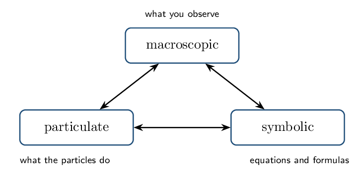

# Guided Notes

*Unit 4 • Chemical Reactions*  
CED 4.1–4.9 • Zumdahl §1.10, §3.8–3.11, §4.4–4.11

[← all lessons](../index.md)

---

## Physical and Chemical Change Fri Oct 9

> 📌 **By the end you can…**
>
> - Distinguish physical from chemical change at the particle level.
> - Evaluate observational evidence for a chemical reaction critically.

**Read:** Zumdahl §1.10 • PDF pp. 53–57   **Read:** §3.8 • PDF pp. 132–134

> 📌 **Retrieval warm-up**
>
> 1. Melting ice breaks what kind of force?
>    hydrogen bonds (IMFs)
> 2. Balance: Na + Cl₂ → NaCl:
>    2 Na + Cl₂ → 2 NaCl
> 3. Moles in 18.0 g H₂O: 1.00 mol

#### INSTRUCTION A • What actually changed? 25 min

### The particle-level test `CED 4.4`

`SP 1`

The distinction is not about how dramatic the change looks. It is about
whether the *substances themselves* changed identity:

|  | **Physical change** | **Chemical change** |
|---|---|---|
| What changes | arrangement or spacing of particles | which atoms are bonded |
| Bonds | intermolecular forces broken/formed | covalent or ionic bonds broken/formed |
| Identity | unchanged | new substances exist |
| Example | H₂O(l) → H₂O(g) | 2 H₂O → 2 H₂ + O₂ |

> ⚠️ **AP trap**
>
> Dissolving is the classic hard case. Dissolving sugar is *physical* —
> C₁₂H₂₂O₁₁ molecules simply disperse. Dissolving NaCl is treated as
> physical too, though ionic bonds are disrupted, because no new substance
> forms and the process reverses on evaporation. But dissolving HCl gas
> in water is *chemical* — it ionizes to H+ and Cl-, species
> that did not exist before.

#### GUIDED PRACTICE • Classify with justification 15 min

1. Iron rusting: chemical — new compound
   Fe₂O₃
2. Dry ice subliming: physical — still CO₂
3. Magnesium burning: chemical — forms MgO
4. Salt dissolving: physical — ions dispersed,
   reversible

#### INSTRUCTION B • Evidence — and its limits 20 min

### Reading experimental evidence `CED 4.1`

`SP 2`

Common indicators that a chemical reaction has occurred:

- formation of a precipitate
- evolution of a gas
- a temperature change (energy released or
   absorbed)
- a persistent colour change

> 📌 **Note**
>
> Every one of these can mislead. Bubbles may be dissolved air escaping on
> warming. A colour change may be dilution or an indicator responding to pH
> rather than a new substance. A temperature change accompanies dissolving
> too. **Good evidence is a combination, plus a plausible product.** AP
> rewards students who name the ambiguity.

#### APPLICATION • Evaluate the claim 20 min

1. A student adds a colourless solution to another colourless solution
   and the mixture turns faintly yellow. They claim a reaction
   occurred. Give one reason this may be right and one reason it may
   not be. 
2. Heating a sealed flask of water produces vigorous bubbling. Is this
   chemical? Justify. 

> 📌 **Exit ticket**
>
> Give one observation that would be strong evidence of a chemical change and
> explain why it is hard to explain physically.

## Representations of Reactions Mon Oct 12

> 📌 **By the end you can…**
>
> - Translate among symbolic, particulate, and macroscopic
>    representations.
> - Draw particulate diagrams that conserve atoms and charge.

**Read:** Zumdahl §4.6–4.7 • PDF pp. 188–192

> 📌 **Retrieval warm-up**
>
> 1. Physical or chemical: sugar dissolving?
>    physical
> 2. Evidence of reaction that gases can fake:
>    bubbling
> 3. Balance: H₂ + O₂ → H₂O:
>    2 H₂ + O₂ → 2 H₂O
> 4. $[\text{Cl-}]$ in 0.20 M MgCl₂:
>    0.40 M

#### INSTRUCTION A • Three levels of description 25 min

### The AP triangle `CED 4.3`

`SP 1`

Every chemical idea can be described at three levels, and AP asks you to
move fluently among them:

#### Rules for a correct particulate diagram

1. Conserve atoms — count each type on both
   sides.
2. Conserve charge — total charge before equals
   total charge after.
3. Show ionic compounds in solution as
   separated ions.
4. Show the correct ratio of particles.
5. Leftover excess reactant *stays in the picture* — do not
   quietly delete it.

> 📘 **Worked example: reading a particulate diagram**
>
> A box before reaction shows 6 filled circles (A) and 2 open pairs
> (B₂). After reaction it shows 4 AB units and 2 leftover filled
> circles.
> 
> Atom check: before, 6 A and 4 B; after, $4 + 2 = 6$ A and 4 B. ✓  
> 
> Equation: 2 A + B₂ → 2 AB.   
> 
> Limiting reactant: B₂ — it is entirely consumed while 2 A remain.

#### GUIDED PRACTICE • Symbolic to particulate 15 min

Draw the particulate picture of 0.1 M Na₂SO₄ reacting with
0.1 M BaCl₂, showing 3 formula units of each.

*(working space)*

#### INSTRUCTION B • Common drawing errors 20 min

### What graders look for `CED 4.3`

`SP 1`

> ⚠️ **AP trap**
>
> The four errors that cost the most points:
> 
> 1. Drawing NaCl as bonded pairs in solution instead of free ions.
> 2. Losing or inventing atoms between the before and after boxes.
> 3. Omitting the excess reactant from the “after” picture.
> 4. Drawing a precipitate as scattered ions rather than a clustered
>    solid.

#### APPLICATION • Diagnose and redraw 20 min

1. A student's “after” box for Zn + 2 HCl → ZnCl₂ + H₂ shows
   ZnCl₂ as one bonded unit floating in solution, and no
   H₂. Name both errors.
   
2. Explain why a particulate diagram of a precipitation reaction should
   show the solid as a cluster rather than dispersed particles.
   

> 📌 **Exit ticket**
>
> Why must charge as well as atoms be conserved in a particulate drawing of an
> ionic reaction?

## Net Ionic Equations Wed Oct 14

> 📌 **By the end you can…**
>
> - Write formula, complete ionic, and net ionic equations.
> - Justify which species are written as ions.

**Read:** Zumdahl §4.6 • PDF pp. 188–190

> 📌 **Retrieval warm-up**
>
> 1. Conserve what two things in a particulate drawing?
>    atoms and charge
> 2. Is AgCl soluble? no
> 3. Strong or weak electrolyte: HC₂H₃O₂?
>    weak

#### INSTRUCTION A • The splitting rule 25 min

### What gets written as ions `CED 4.2`

`SP 1`

- **Split**: soluble ionic compounds, strong acids, strong bases
   — all strong electrolytes.
- **Keep whole**: solids (s), liquids (l), gases
   (g), weak electrolytes,
   nonelectrolytes.

Ions unchanged on both sides are spectator ions and are
cancelled.

> 📘 **Worked example: the full sequence**
>
> **Formula:** Pb(NO₃)₂(aq) + 2 KI(aq) → PbI₂(s) + 2 KNO₃(aq)  
> 
> **Complete ionic:**
> Pb²⁺(aq) + 2 NO₃⁻(aq) + 2 K+(aq) + 2 I⁻(aq) → PbI₂(s) + 2 K+(aq) + 2 NO₃⁻(aq)  
> 
> **Spectators:** K+, NO₃-  
> 
> **Net ionic:** Pb²⁺(aq) + 2 I⁻(aq) → PbI₂(s)

#### GUIDED PRACTICE • Write the net ionic 15 min

1. AgNO₃(aq) + NaBr(aq):
   Ag+ + Br⁻ → AgBr(s)
2. HCl(aq) + KOH(aq):
   H+ + OH⁻ → H₂O(l)
3. K₂CO₃(aq) + CaCl₂(aq):
   Ca²⁺ + CO₃²⁻ → CaCO₃(s)

#### INSTRUCTION B • Why it matters 20 min

### One equation, many disguises `CED 4.2`

`SP 6`

Because spectators vanish, the net ionic equation reveals that many
different-looking reactions are chemically identical. AgNO₃ with
NaCl, with KCl, or with NH₄Cl all reduce to
Ag+ + Cl⁻ → AgCl(s).

> ⚠️ **AP trap**
>
> Never split water, and never split a weak acid or weak base. HF,
> HC₂H₃O₂, and NH₃ all appear as whole molecules — they are barely
> ionized, so the molecular form is what is actually present.

#### APPLICATION • Harder cases 20 min

1. Write the net ionic equation for HF(aq) with NaOH(aq) and
   explain how it differs from the HCl case.
   
2. Ba(OH)₂(aq) reacts with H₂SO₄(aq). Explain why this
   reaction has *no* spectator ions.
   

> 📌 **Exit ticket**
>
> Mixing NaNO₃(aq) and KCl(aq) produces no net ionic equation.
> What does that tell you physically?

## Types of Reactions and Precipitation Fri Oct 16

> 📌 **By the end you can…**
>
> - Classify reactions by type and predict products.
> - Use solubility rules to predict precipitates.

**Read:** Zumdahl §4.4–4.5 • PDF pp. 182–188

> 📌 **Retrieval warm-up**
>
> 1. Net ionic for AgNO₃ + NaCl:
>    Ag+ + Cl⁻ → AgCl(s)
> 2. Do you split NH₃ in an ionic equation?
>    no
> 3. Soluble? BaSO₄ no

#### INSTRUCTION A • The three AP reaction types 25 min

### Classification `CED 4.7`

`SP 1`

The CED organizes reactions into three families you must recognize on sight:

| **Type** | **Signature** | **Net ionic pattern** |
|---|---|---|
| Precipitation | two soluble salts mixed; an insoluble product forms | cation $+$ anion $\to$ solid |
| Acid–base | proton transfer | H+ + OH⁻ → H₂O (strong/strong) |
| Redox | oxidation states change | electron transfer between species |

#### Solubility rules — the working set

- Always soluble: NO₃-, alkali metals,
   NH₄+
- Usually soluble: Cl-, Br-, I- except with
   Ag+, Pb²⁺; SO₄²⁻ except with
   Ba²⁺, Pb²⁺, Ca²⁺
- Usually insoluble: CO₃²⁻, PO₄³⁻, S²⁻,
   OH- — unless paired with the always-soluble cations

#### GUIDED PRACTICE • Predict and classify 15 min

Ba(NO₃)₂(aq) + K₂SO₄(aq):
        precipitation — BaSO₄(s)

HNO₃(aq) + NaOH(aq):
        acid–base — water forms

Mg(s) + 2 HCl(aq):
        redox — Mg oxidized, H reduced

#### INSTRUCTION B • Predicting products by ion interchange 20 min

### The procedure `CED 4.7`

`SP 4`

List the ions present after mixing.

Swap partners: pair each cation with the
        other's anion.

Balance the charges to get correct formulas.

Apply the solubility rules; the insoluble one is the
        precipitate.

> 📌 **Note**
>
> “No reaction” is a legitimate answer. If both possible products are
> soluble, nothing happens — the beaker just contains four kinds of ion.
> Being willing to write that is part of the skill.

#### APPLICATION • Full prediction 20 min

Predict the products of Pb(NO₃)₂(aq) + Na₂CO₃(aq), write the
        balanced formula and net ionic equations, and name the precipitate.
        

A student mixes KNO₃(aq) and NaCl(aq) and reports a
        precipitate. What most likely happened?
        

> 📌 **Exit ticket**
>
> Which is the precipitate when CaCl₂(aq) meets Na₃PO₄(aq), and what
> rule decides it?

## Acid–Base Reactions Mon Oct 19

> 📌 **By the end you can…**
>
> - Apply Arrhenius and Bronsted–Lowry definitions.
> - Write net ionic equations for strong and weak acid neutralizations.

**Read:** Zumdahl §4.8 • PDF pp. 192–199

> 📌 **Retrieval warm-up**
>
> 1. Precipitate from Pb²⁺ and I-:
>    PbI₂
> 2. Reaction type for Zn + CuSO₄:
>    redox
> 3. Always-soluble anion: nitrate
> 4. Moles in 25.0 mL of 0.200 M:
>    5.00e-3 mol

#### INSTRUCTION A • Two definitions 25 min

### Arrhenius and Bronsted–Lowry `CED 4.8`

`SP 1`

- Arrhenius: acid produces H+;
   base produces OH-.
- Bronsted–Lowry: acid is a proton
   donor; base is a proton
   acceptor — broad enough to cover NH₃.

The six strong acids: HCl, HBr, HI, HNO₃,
H₂SO₄, HClO₄. Strong bases: group 1
hydroxides plus Ca(OH)₂, Sr(OH)₂, Ba(OH)₂. Everything else is
weak.

#### GUIDED PRACTICE • Strong or weak 15 min

H₂SO₄: strong acid

HF: weak acid

NH₃: weak base

Ba(OH)₂: strong base

#### INSTRUCTION B • Neutralization net ionic equations 20 min

### Two cases `CED 4.8`

`SP 6`

> 📘 **Strong acid + strong base**
>
> HNO₃(aq) + KOH(aq): both fully ionized, K+ and NO₃- are
> spectators.
> H+(aq) + OH⁻(aq) → H₂O(l)
> This is the net ionic equation for *every* strong/strong
> neutralization.

> 📘 **Weak acid + strong base**
>
> HC₂H₃O₂(aq) + NaOH(aq): the acid is weak, so it stays whole.
> HC₂H₃O₂(aq) + OH⁻(aq) → C₂H₃O₂⁻(aq) + H₂O(l)
> Only Na+ is a spectator.

#### APPLICATION • Reasoning about neutralization 20 min

Equal volumes of 0.10 M HCl and 0.10 M
        HC₂H₃O₂ are each titrated with 0.10 M NaOH.
        Do they require the same volume of base? Explain.
        

Why does the HC₂H₃O₂ solution have a much higher pH before
        titration begins? 

> 📌 **Exit ticket**
>
> Write the net ionic equation for HCl(aq) reacting with NH₃(aq).

## Oxidation–Reduction Wed Oct 21

> 📌 **By the end you can…**
>
> - Assign oxidation states and identify redox reactions.
> - Name the oxidizing and reducing agents correctly.

**Read:** Zumdahl §4.9–4.10 • PDF pp. 199–210

> 📌 **Retrieval warm-up**
>
> 1. Net ionic, strong acid + strong base:
>    H+ + OH⁻ → H₂O
> 2. Weak acid in a net ionic is written how?
>    intact
> 3. Oxidation state of O (usual): $-2$

#### INSTRUCTION A • Oxidation states 25 min

### The rules `CED 4.9`

`SP 5`

Free element: 0

Monatomic ion: its charge

Oxygen: $-2$ (peroxides $-1$)

Hydrogen: $+1$ (metal hydrides $-1$)

Fluorine: $-1$

Sum $=$ 0 for a compound, or the ion charge

> 📘 **Worked example**
>
> Cr₂O₇²⁻: seven oxygens give $-14$. The ion is $2-$, so two chromiums
> must total $+12$ — each Cr is $+6$.  
> 
> MnO₄-: four oxygens give $-8$; ion is $1-$; Mn is $+7$.

#### GUIDED PRACTICE • Assign 15 min

N in NO₃-: $+5$

S in SO₄²⁻: $+6$

C in CO₂: $+4$

Cl in ClO₄-: $+7$

#### INSTRUCTION B • Agents 20 min

### Who lost, who gained `CED 4.9`

`SP 6`

|  | **Oxidation** | **Reduction** |
|---|---|---|
| Electrons | lost | gained |
| Oxidation state | increases | decreases |
| That species is the | reducing agent | oxidizing agent |

> ⚠️ **AP trap**
>
> The labels are backwards from intuition: the species *oxidized* is the
> *reducing* agent. Read it as “the thing that causes reduction in
> something else.” **OIL RIG**: Oxidation Is Loss, Reduction Is Gain.

#### APPLICATION • Full redox analysis 20 min

For Fe₂O₃(s) + 3 CO(g) → 2 Fe(s) + 3 CO₂(g), identify all
        oxidation state changes and both agents.
        

Explain how you can tell at a glance that
        2 Na + Cl₂ → 2 NaCl is redox.
        

> 📌 **Exit ticket**
>
> In Zn(s) + Cu²⁺(aq) → Zn²⁺(aq) + Cu(s), name the oxidizing agent and
> justify with oxidation states.

## Stoichiometry and Titration Fri Oct 23

> 📌 **By the end you can…**
>
> - Carry out solution stoichiometry, including limiting reactant.
> - Analyze titration data and curves.

**Read:** Zumdahl §3.9–3.11 • PDF pp. 134–153   **Read:** §4.11 • PDF pp. 210–212

> 📌 **Retrieval warm-up**
>
> 1. Oxidizing agent in 2 Mg + O₂ → 2 MgO:
>    O₂
> 2. Moles in 40.0 mL of 0.250 M:
>    0.0100 mol
> 3. Theoretical yield comes from which reactant?
>    the limiting one

#### INSTRUCTION A • Solution stoichiometry 25 min

### Volume and molarity to moles `CED 4.5`

`SP 5`

The only new step versus ordinary stoichiometry: convert
volume $\times$ molarity into moles at the start, and
back to volume or mass at the end.

> 📘 **Worked example: limiting reactant in solution**
>
> 50.0 mL of 0.200 M Pb(NO₃)₂ is mixed with
> 50.0 mL of 0.300 M KI.
> 
> $$ \begin{align*}   n(\text{Pb²⁺}) &= (0.0500)(0.200) = 0.0100\,\mathrm{mol}\\   n(\text{I-}) &= (0.0500)(0.300) = 0.0150\,\mathrm{mol}\\   &\text{Pb²⁺ + 2 I⁻ → PbI₂(s)} \end{align*} $$
> 
> Pb²⁺ could make 0.0100 mol of solid; I- could make
> $0.0150/2 = 0.00750$ mol. **Iodide is limiting.**
> Mass $= 0.00750 \times 461.0 = 3.46\,\mathrm{g}$.

#### GUIDED PRACTICE • Solution stoichiometry drill 15 min

Moles of Ag+ in 30.0 mL of
        0.150 M AgNO₃:
        4.50e-3 mol

Mass of AgCl ($M = 143.32$) if all of it precipitates:
        0.645 g

#### INSTRUCTION B • Titration 20 min

### Finding an unknown concentration `CED 4.6`

`SP 4`

At the equivalence point, moles of titrant added exactly satisfy the
reaction stoichiometry. The endpoint is where the
indicator changes — chosen to fall as close to the equivalence point as
possible.

> 📘 **Worked example**
>
> 25.0 mL of H₂SO₄ needs 40.0 mL of
> 0.200 M NaOH.
> 
> $$ \begin{align*}   n(\text{OH-}) &= (0.0400)(0.200) = 8.00e-3\,\mathrm{mol}\\   n(\text{H₂SO₄}) &= \tfrac12(8.00\times10^{-3}) = 4.00e-3\,\mathrm{mol}\\   [\text{H₂SO₄}] &= \frac{4.00\times10^{-3}}{0.0250} = 0.160\,\mathrm{M} \end{align*} $$
> 
> The factor of $\tfrac12$ is because H₂SO₄ is
> diprotic.

> ⚠️ **AP trap**
>
> The most common titration error in this unit is using a 1:1 ratio for a
> diprotic acid, which halves the reported concentration. Always write the
> balanced neutralization equation before dividing.

#### APPLICATION • Titration analysis 20 min

20.0 mL of NaOH requires
        18.5 mL of 0.150 M HCl. Find
        $[\text{NaOH}]$. 

*(working space)*

        

A student overshoots the endpoint by several drops. Does the
        reported acid concentration come out too high or too low? Explain.
        

> 📌 **Exit ticket**
>
> Why must the balanced equation be written before doing titration
> arithmetic?

---

*AP Chemistry course materials • student edition • CC BY-NC-SA 4.0*
