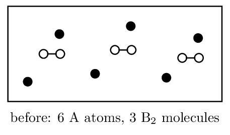

# Worksheet 1 • Change and Representation

*Unit 4 • Chemical Reactions*  
CED 4.1, 4.3, 4.4 • drawing counts as much as calculating here

[← all lessons](../index.md)

---

> 📌 **Directions & data**
>
> Every particulate drawing must conserve atoms and charge. Label
> what your circles represent — an unlabelled diagram earns nothing.

**1.** Classify each as physical or chemical change and give the
particle-level reason:

1. Water boiling: physical — H₂O molecules
   separate
2. Copper turning green outdoors:
   chemical — new carbonate compound
3. Sugar dissolving in tea: physical — molecules
   disperse intact
4. Baking soda fizzing in vinegar:
   chemical — CO₂ gas produced

**2.** Dissolving NaCl is classified as a physical change, yet
ionic bonds are disrupted. Reconcile these two statements.

**3.** A student mixes two clear solutions; the mixture becomes
warm and slightly cloudy.

1. Name two pieces of evidence suggesting a chemical reaction.
   
2. Give one alternative explanation for each observation that does
   *not* require a chemical reaction.
   
3. What single additional test would most strengthen the claim?
   

**4.** The box below shows a mixture before reaction. Filled circles
are A atoms; open circles joined in pairs are B₂ molecules.

1. The reaction is 2 A + B₂ → 2 AB. How many AB units form?
   6
2. Which reactant is limiting? neither — exact
   ratio
3. Draw the “after” box. 
   *(working space)*

**5.** Draw the particulate representation of what is present when
K₂SO₄(s) dissolves in water. Show 3 formula units' worth and label your
symbols; omit water molecules but say so.

*(working space)*

**6.** A student's “after” diagram for
AgNO₃(aq) + NaCl(aq) → AgCl(s) + NaNO₃(aq) shows scattered Ag+
and Cl- ions plus bonded NaNO₃ pairs. Identify both errors.

> 📌 **Spiral review • Units 1–3 • spiral**
>
> 1. Strongest IMF in CH₃OH: hydrogen bonding
> 2. Shape of NH₃: trigonal pyramidal
> 3. $PV/nRT 4. PES areas 2:2:6:1 — element? Na
> 5. Moles in 9.0 g H₂O: 0.50 mol

---

*AP Chemistry course materials • student edition • CC BY-NC-SA 4.0*
