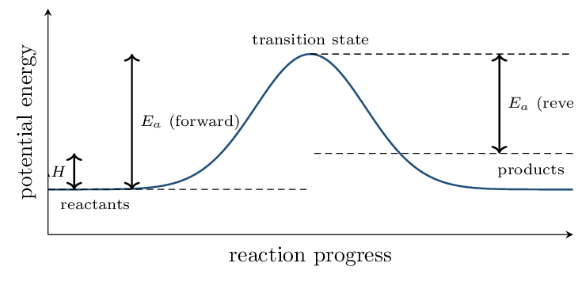
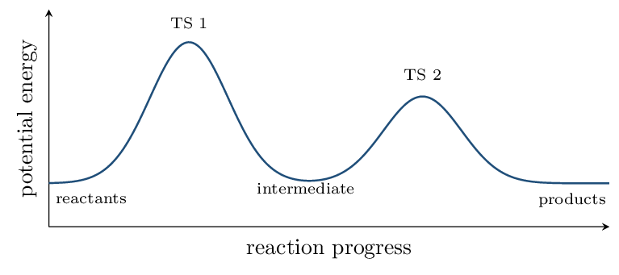
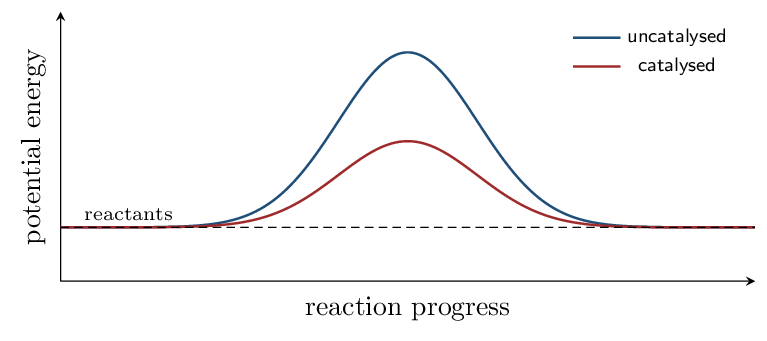

# Guided Notes

*Unit 5 • Kinetics*  
CED 5.1–5.11 • Zumdahl Ch 12 • 7 blocks

[← all lessons](../index.md)

---

> 📌 **The one idea this unit runs on**
>
> Thermodynamics (Unit 9) will tell you *whether* a reaction is favored.
> Equilibrium (Unit 7) will tell you *how far* it goes. Neither says
> anything about *how fast*.
> 
> Rate is a separate question with a separate answer, and the answer is
> always experimental. **You cannot read a rate law off a balanced
> equation.** Zumdahl's own example: 2N₂O₅ → 4NO₂ + O₂ has a
> coefficient of 2 and is *first* order in N₂O₅.
> 
> The single exception is an elementary step — one actual molecular
> event — where the molecularity does give the order. Recognizing which case
> you are in is the skill this unit is really testing.

## Reaction Rates CED 5.1 • Zumdahl §12.1

> 📌 **By the end you can…**
>
> - Express a rate in terms of any species in the equation.
> - Distinguish average, instantaneous, and initial rate.

**Read:** Zumdahl §12.1 • PDF pp. 594–598

> 📌 **Retrieval warm-up**
>
> 1. Units of concentration: mol/L (M)
> 2. Slope of a graph is: rise over run
> 3. In 2A → B, A is consumed how fast relative to B?
>    twice as fast
> 4. Rate must always be a positive quantity.

#### INSTRUCTION A • Defining a rate 25 min

### Rate is a change per unit time `CED 5.1`

`SP 4`

Reaction rate is the change in concentration of a species per unit
time. Because reactants disappear, a minus sign is used to keep the rate
positive:

$$ \text{rate} = -\frac{\Delta[\text{reactant}]}{\Delta t}    = +\frac{\Delta[\text{product}]}{\Delta t} $$

> ⚠️ **AP trap**
>
> **Divide by the coefficient.** For aA + bB → cC + dD,
> 
> $$ \text{rate} = -\frac{1}{a}\frac{\Delta[\text{A}]}{\Delta t}    = -\frac{1}{b}\frac{\Delta[\text{B}]}{\Delta t}    = +\frac{1}{c}\frac{\Delta[\text{C}]}{\Delta t}    = +\frac{1}{d}\frac{\Delta[\text{D}]}{\Delta t} $$
> 
> Without the coefficients, “the rate” has a different value depending on
> which species you watched — which is exactly the confusion the convention
> exists to prevent. This is the most common lost point in Block 1.

> 📘 **Worked example 1: one reaction, three rates**
>
> For 2N₂O₅(g) → 4NO₂(g) + O₂(g), oxygen is forming at
> 2.0e-3 M/s. Find the rate of the reaction and the rate
> of disappearance of N₂O₅.
> 
> Oxygen has coefficient 1, so the *reaction rate* is
> $2.0e-3\,\mathrm{M/s}$.
> 
> N₂O₅ has coefficient 2, so it disappears *twice* as fast:
> 
> $$ -\frac{\Delta[\text{N₂O₅}]}{\Delta t} = 2(2.0\times10^{-3})    = \mathbf{4.0\times10^{-3}}~\mathrm{M/s} $$
> 
> and NO₂ appears four times as fast,
> $8.0e-3\,\mathrm{M/s}$.

#### GUIDED PRACTICE • Three kinds of rate 15 min

A plot of $[\text{reactant}]$ against time is a curve that starts steep and
flattens.

1. Average rate over an interval is the slope of the
   straight line between two points.
2. Instantaneous rate at one moment is the slope of the
   tangent there.
3. Initial rate is the instantaneous rate at
   $t = 0$.
4. Why does the curve flatten? 
5. Why do rate-law experiments use the *initial* rate?
   

#### APPLICATION • Rate conversions 20 min

1. For N₂ + 3H₂ → 2NH₃, H₂ is consumed at
   0.030 M/s. Find the rate of the reaction and the
   rate of formation of NH₃.
   *(working space)*
2. A student reports “the rate is
   0.030 M/s” after watching H₂. What is
   missing from that statement? 

> 📌 **Exit ticket**
>
> For 2A → 3B, if B appears at 6.0e-4 M/s, how
> fast does A disappear?

## Rate Laws and Orders CED 5.2 • Zumdahl §12.2–12.3

> 📌 **By the end you can…**
>
> - Write a rate law and identify reaction orders.
> - Determine orders and $k$ from initial-rate data.

**Read:** Zumdahl §12.2–12.3 • PDF pp. 598–604

> 📌 **Retrieval warm-up**
>
> 1. Rate for 2A → B in terms of A:
>    $-\tfrac{1}{2}\Delta[\text{A}]/\Delta t$
> 2. Initial rate is measured at: $t = 0$
> 3. Orders come from: experiment

#### INSTRUCTION A • The form of a rate law 25 min

### Rate law, orders, and the rate constant `CED 5.2`

`SP 5`

$$ \text{rate} = k[\text{A}]^m[\text{B}]^n $$

- $k$ is the rate constant: constant with concentration,
   *not* with temperature.
- $m$ and $n$ are the orders — determined
   experimentally, never from coefficients.
- The overall order is $m + n$.

> ⚠️ **AP trap**
>
> **Orders are not coefficients.** This is the single most-tested
> misconception in the unit. Zumdahl's counterexample is worth memorizing:
> 2N₂O₅ → 4NO₂ + O₂ carries a coefficient of 2 and is experimentally
> *first* order in N₂O₅.
> 
> A related trap: the units of $k$ change with the overall order, so they are
> a free check on your work. First order gives
> /s; second order /M/s; zero order
> M/s.

### The method of initial rates `CED 5.2`

Change one concentration at a time and see what the rate does. If doubling
$[\text{A}]$ multiplies the rate by $2^m$, then $m$ is the order in A.

| **Double [A] and the rate…** | **order in A** |  |
|---|---|---|
| does not change | 0 | $2^0 = 1$ |
| doubles | 1 | $2^1 = 2$ |
| quadruples | 2 | $2^2 = 4$ |

> 📘 **Worked example 2: reading orders from a table**
>
> | **Exp** | $[\text{A}]_0$ | $[\text{B}]_0$ | **initial rate** (M/s) |
> |---|---|---|---|
> | 1 | 0.10 | 0.10 | $2.0\times10^{-3}$ |
> | 2 | 0.20 | 0.10 | $8.0\times10^{-3}$ |
> | 3 | 0.10 | 0.20 | $4.0\times10^{-3}$ |

**Order in A** — compare 1 and 2, where only $[\text{A}]$ changed.
Doubling A multiplied the rate by 4, so $m = \mathbf{2}$.

**Order in B** — compare 1 and 3. Doubling B doubled the rate, so
$n = \mathbf{1}$.

$$ \text{rate} = k[\text{A}]^2[\text{B}] \qquad\text{overall order } 3 $$

**Find $k$** from any row:

$$ k = \frac{2.0\times10^{-3}}{(0.10)^2(0.10)}      = \mathbf{2.0}~\mathrm{/M^2/s} $$

Units of $\mathrm{M\cdot s}$ confirm third order overall.

#### GUIDED PRACTICE • A second data set 15 min

| **Exp** | $[\text{X}]_0$ | $[\text{Y}]_0$ | **rate** (M/s) |
|---|---|---|---|
| 1 | 0.20 | 0.10 | $1.5\times10^{-2}$ |
| 2 | 0.40 | 0.10 | $3.0\times10^{-2}$ |
| 3 | 0.20 | 0.20 | $1.5\times10^{-2}$ |

1. Order in X: 1
2. Order in Y: 0
3. Rate law: rate $= k[\text{X}]$
4. $k =$ 0.075 /s
5. What does zero order in Y mean physically?
   

#### APPLICATION • Using a rate law 20 min

1. For rate $= k[\text{A}]^2[\text{B}]$ with
   $k = 2.0\,\mathrm{/M^2/s}$, find the rate when
   $[\text{A}] = 0.30$ and $[\text{B}] = 0.20$.
   *(working space)*
2. In that same reaction, what happens to the rate if $[\text{A}]$ is
   tripled and $[\text{B}]$ halved? 
3. A student writes rate $= k[\text{A}]^2[\text{B}]$ for
   2A + B → C “because of the coefficients.” Explain why the
   reasoning is wrong even though the answer happens to match.
   

> 📌 **Exit ticket**
>
> Give the units of $k$ for a zero-order, first-order, and second-order
> reaction, and say why the units are a useful check.

## Concentration Over Time CED 5.3 • Zumdahl §12.4

> 📌 **By the end you can…**
>
> - Identify order from which plot is linear.
> - Apply integrated rate laws and half-life.

**Read:** Zumdahl §12.4 • PDF pp. 604–615

> 📌 **Retrieval warm-up**
>
> 1. A rate law gives rate in terms of:
>    concentration
> 2. Order in Y is 0 means the rate:
>    does not depend on Y
> 3. Units of $k$ for first order:
>    /s

#### INSTRUCTION A • Three orders, three straight lines 25 min

### Integrated rate laws `CED 5.3`

`SP 5`

A rate law tells you the rate *now*; the integrated form tells you the
concentration *at time $t$*. Each order gives a different straight-line
plot, and that is how order is identified from data.

| **Order** | **Integrated law** | **Linear plot** | **Half-life** |
|---|---|---|---|
| 0 | $[\text{A}] = -kt + [\text{A}]_0$ | $[\text{A}]$ vs $t$ | $t_{1/2} = [\text{A}]_0/2k$ |
| 1 | $\ln[\text{A}] = -kt + \ln[\text{A}]_0$ | $\ln[\text{A}]$ vs $t$ | $t_{1/2} = 0.693/k$ |
| 2 | $1/[\text{A}] = kt + 1/[\text{A}]_0$ | $1/[\text{A}]$ vs $t$ | $t_{1/2} = 1/(k[\text{A}]_0)$ |

In every case the slope is $\pm k$ — negative for zero and first order,
positive for second order.

> ⚠️ **AP trap**
>
> **“The graph is linear” is not an answer.** You must say
> *which quantity* was plotted. “The plot of $\ln[\text{A}]$ against time
> is linear, therefore the reaction is first order” earns the point;
> “the graph is a straight line” does not.
> 
> **Only first-order half-life is constant.** $t_{1/2} = 0.693/k$
> contains no $[\text{A}]_0$, so a first-order reaction takes the same time to
> halve no matter where you start. For zero and second order the half-life
> depends on concentration — so a constant half-life is itself evidence of
> first order.

> 📘 **Worked example 3: a first-order decay**
>
> $k = 0.0250\,\mathrm{/s}$ and $[\text{A}]_0 = 0.500\,\mathrm{M}$.
> 
> **Concentration after 60.0 s:**
> 
> $$ \ln[\text{A}] = -(0.0250)(60.0) + \ln(0.500) = -1.50 - 0.693 = -2.193 $$
> 
> $$ [\text{A}] = e^{-2.193} = \mathbf{0.112}~\mathrm{M} $$
> 
> **Half-life:** $t_{1/2} = 0.693/0.0250 = \mathbf{27.7}~\mathrm{s}$.
> 
> **Sanity check:** two half-lives is 55.4 s, at which point
> $[\text{A}]$ should be $0.125$ M. Our 60 s value of $0.112$ is a
> little below that — consistent.

#### GUIDED PRACTICE • Second and zero order 15 min

1. Second order, $k = 0.15\,\mathrm{/M/s}$,
   $[\text{A}]_0 = 0.20\,\mathrm{M}$. Find $[\text{A}]$ after
   100 s.
   *(working space)*
2. Its half-life: 33 s
3. Zero order, $k = 0.020\,\mathrm{M/s}$,
   $[\text{A}]_0 = 1.00\,\mathrm{M}$. Find $t_{1/2}$ and
   $[\text{A}]$ after 30 s.
   *(working space)*

#### APPLICATION • Identifying order from data 20 min

1. A reaction's half-life is 25.0 min at the start and
   25.0 min again after half the reactant is gone. What is
   the order, and what is $k$?
   *(working space)*
2. Data for a decomposition give a curved plot of $[\text{A}]$ vs $t$, a
   curved plot of $\ln[\text{A}]$ vs $t$, and a straight plot of
   $1/[\text{A}]$ vs $t$ with slope $+0.42$. State the order, $k$, and
   the rate law. 
3. Why is a constant half-life such strong evidence of first order?
   

> 📌 **Exit ticket**
>
> Which plot is linear for each order, and what is the slope in each case?

## Elementary Steps and Mechanisms CED 5.4, 5.7, 5.8 • Zumdahl §12.5

> 📌 **By the end you can…**
>
> - Write the rate law for an elementary step from its molecularity.
> - Test whether a proposed mechanism is acceptable.

**Read:** Zumdahl §12.5 • PDF pp. 615–620

> 📌 **Retrieval warm-up**
>
> 1. Orders normally come from:
>    experiment
> 2. First-order half-life $=$ $0.693/k$
> 3. Second order gives which linear plot?
>    $1/[\text{A}]$ vs $t$

#### INSTRUCTION A • The one place coefficients do give orders 25 min

### Elementary steps `CED 5.4`

`SP 5`

A mechanism is the sequence of elementary steps — single
molecular events — that add up to the overall reaction.

> 
For an **elementary step only**, the coefficients *are* the
orders.   

This is the only exception in the entire unit.

Molecularity is the number of particles colliding in that step:

| **Molecularity** | **Step** | **Rate law** |
|---|---|---|
| unimolecular | A → products | rate $= k[\text{A}]$ |
| bimolecular | A + B → products | rate $= k[\text{A}][\text{B}]$ |
| bimolecular | 2A → products | rate $= k[\text{A}]^2$ |
| termolecular | A + B + C → products | rate $= k[\text{A}][\text{B}][\text{C}]$ |

Termolecular steps are very rare — three particles
colliding simultaneously with the right orientation is improbable.

### Two species with special roles `CED 5.7`

- An intermediate is
   produced then consumed — it does not appear
   in the overall equation, and it must **never** appear in a
   final rate law.
- A catalyst is consumed then regenerated
   — it appears in the first step and is returned in a later one.

#### INSTRUCTION B • Testing a mechanism 20 min

### The two requirements `CED 5.8`

`SP 6`

A proposed mechanism is acceptable only if **both** hold:

The steps sum to the overall balanced equation
        (intermediates cancel).

Its predicted rate law matches the
        experimental rate law.

Even then the mechanism is only *consistent* with the data — never
proven. Several mechanisms can predict the same rate law.

> 📘 **Worked example 4: slow first step**
>
> Overall: 2NO₂ + F₂ → 2NO₂F, experimentally
> rate $= k[\text{NO₂}][\text{F₂}]$.
> 
> Proposed:
> 
> $$ \begin{align*}   \text{Step 1 (slow):} &\quad \text{NO₂ + F₂ → NO₂F + F} \\   \text{Step 2 (fast):} &\quad \text{NO₂ + F → NO₂F} \end{align*} $$
> 
> **Do they sum?** Adding gives
> 2NO₂ + F₂ → 2NO₂F, with the F atom cancelling. ✓
> 
> **Predicted rate law?** The slow step is
> rate-determining, and it is elementary, so its rate law is
> rate $= k[\text{NO₂}][\text{F₂}]$. ✓ Matches.
> 
> Note that F is an **intermediate** — made in step 1, used in step 2 —
> and correctly does not appear in the rate law.

> ⚠️ **AP trap**
>
> **When the slow step is first, the rate law is just that step's.**
> That is the easy case, and it is the one most exam questions use. The hard
> case — a *fast* first step — is Block 6.
> 
> If your derived rate law contains an intermediate, you are not finished.

#### APPLICATION • Evaluating mechanisms 20 min

Overall 2NO + O₂ → 2NO₂ has experimental
        rate $= k[\text{NO}]^2[\text{O₂}]$. Is a single termolecular step a
        plausible mechanism? 

For the mechanism A₂ → 2A (slow),
        A + B → AB (fast), give the overall equation and predicted
        rate law. 

Identify the intermediate and the catalyst:
        X + C → XC, then XC + Y → XY + C.
        XC intermediate; C catalyst

> 📌 **Exit ticket**
>
> State the two tests a proposed mechanism must pass, and say why passing
> both still does not prove it.

## Collision Model and Energy Profiles CED 5.5, 5.6 • Zumdahl §12.6

> 📌 **By the end you can…**
>
> - Explain rate in terms of collision frequency, energy, and
>    orientation.
> - Read and draw a reaction energy profile.

**Read:** Zumdahl §12.6 • PDF pp. 620–626

> 📌 **Retrieval warm-up**
>
> 1. Molecularity gives the order only for:
>    an elementary step
> 2. An intermediate is: produced then consumed
> 3. Raising temperature does what to rate?
>    increases it

#### INSTRUCTION A • Why most collisions do nothing 25 min

### Three requirements for a reactive collision `CED 5.5`

`SP 6`

The particles must collide.

They must collide with at least the
        activation energy, $E_a$.

They must collide with the correct
        orientation.

Only a tiny fraction of collisions satisfy all three, which is why rates are
so much smaller than collision frequencies.

### Temperature and the Arrhenius equation `CED 5.5`

$$ k = Ae^{-E_a/RT} $$

Raising the temperature does *not* mainly work by making collisions
more frequent — that effect is small. It works because the distribution of
molecular kinetic energies broadens, so a much larger
fraction of collisions clears $E_a$.

> 📘 **Worked example 5: a ten-degree rise**
>
> A reaction has $E_a = 50.0\,\mathrm{kJ/mol}$. By what factor does
> $k$ change from 300 K to 310 K?
> 
> $$ \ln\frac{k_2}{k_1} = -\frac{E_a}{R}\left(\frac{1}{T_2} -    \frac{1}{T_1}\right)    = -\frac{50000}{8.314}\left(\frac{1}{310} - \frac{1}{300}\right)    = 0.647 $$
> 
> $$ \frac{k_2}{k_1} = e^{0.647} = \mathbf{1.9} $$
> 
> A 10 K rise nearly **doubles** the rate — the familiar
> rule of thumb, and now derived rather than asserted.
> 
> With $E_a = 100\,\mathrm{kJ/mol}$ the same rise multiplies $k$ by
> **3.6**: the larger the barrier, the more temperature-sensitive the
> reaction.

#### INSTRUCTION B • Reading the energy profile 20 min

### What the diagram shows `CED 5.6`

`SP 3`

- $E_a$ is measured from the *reactants* up to the
   transition state.
- $\Delta H$ is the difference between
   products and reactants — independent of the
   barrier height.
- $E_a(\text{forward}) - E_a(\text{reverse}) =$
   $\Delta H$.

> ⚠️ **AP trap**
>
> $E_a$ and $\Delta H$ are independent. A strongly exothermic reaction can
> have an enormous barrier and be immeasurably slow — diamond to graphite is
> the standard example. Do not use “very exothermic” as evidence that a
> reaction is fast, or a large $E_a$ as evidence that it is endothermic.

#### APPLICATION • Profiles and barriers 20 min

A reaction has $E_a(\text{fwd}) = 80\,\mathrm{kJ}$ and
        $E_a(\text{rev}) = 120\,\mathrm{kJ}$. Find $\Delta H$ and
        classify the reaction. $-40$ kJ; exothermic

Another has $E_a(\text{fwd}) = 150\,\mathrm{kJ}$ and
        $\Delta H = +60\,\mathrm{kJ}$. Find $E_a(\text{rev})$.
        90 kJ

Explain, in terms of the energy distribution, why raising the
        temperature by 10 K can nearly double a rate when it
        raises the average kinetic energy by only about 3%.
        

> 📌 **Exit ticket**
>
> Two reactions have the same $\Delta H$ but different $E_a$. What differs
> between them, and what does not?

## Fast First Steps and Multistep Profiles CED 5.9, 5.10 • Zumdahl §12.5–12.6

> 📌 **By the end you can…**
>
> - Derive a rate law when the first step is a fast equilibrium.
> - Interpret a multistep energy profile.

**Read:** Zumdahl §12.5–12.6 • PDF pp. 615–626

> 📌 **Retrieval warm-up**
>
> 1. A final rate law must never contain:
>    an intermediate
> 2. $E_a(\text{fwd}) - E_a(\text{rev}) =$
>    $\Delta H$
> 3. The slow step is called the:
>    rate-determining step

#### INSTRUCTION A • When the slow step is not first 25 min

### The pre-equilibrium approximation `CED 5.9`

`SP 5`

If the *first* step is fast and reversible and the second is slow, the
first step reaches equilibrium before the second consumes much of the
intermediate. Write the rate law for the slow step, then use the
equilibrium of step 1 to eliminate the intermediate.

> 📘 **Worked example 6: eliminating an intermediate**
>
> Overall 2NO + O₂ → 2NO₂, experimental
> rate $= k[\text{NO}]^2[\text{O₂}]$.
> 
> $$ \begin{align*}   \text{Step 1 (fast, equilibrium):} &\quad \text{2NO ⇌ N₂O₂} \\   \text{Step 2 (slow):} &\quad \text{N₂O₂ + O₂ → 2NO₂} \end{align*} $$
> 
> **Start with the slow step:**
> rate $= k_2[\text{N₂O₂}][\text{O₂}]$. But N₂O₂ is an intermediate, so this
> is not yet a valid rate law.
> 
> **Use the equilibrium:** for step 1,
> $K_1 = \dfrac{[\text{N₂O₂}]}{[\text{NO}]^2}$, so
> $[\text{N₂O₂}] = K_1[\text{NO}]^2$.
> 
> **Substitute:**
> 
> $$ \text{rate} = k_2K_1[\text{NO}]^2[\text{O₂}] = k[\text{NO}]^2[\text{O₂}] $$
> 
> where the observed $k$ is the product $k_2K_1$. This matches experiment,
> and the intermediate is gone. ✓

> ⚠️ **AP trap**
>
> The observed rate constant is a *combination* of constants
> ($k = k_2K_1$ here), which is why a measured $k$ need not correspond to any
> single elementary step. That is also why the same rate law can arise from
> more than one mechanism.

#### INSTRUCTION B • Multistep energy profiles 20 min

### Reading a two-hump diagram `CED 5.10`

`SP 3`

Each elementary step contributes one hump. The
number of humps equals the number of steps, and the
valley between them is the intermediate.

> 
The **rate-determining step** is the one with the
**highest hump** — the largest activation energy measured from the
species preceding it.

In the diagram above, the first step is
rate-determining.

#### APPLICATION • Putting the pieces together 20 min

For the mechanism A + B ⇌ C (fast equilibrium),
        C + B → D (slow), derive the rate law.
        

*(working space)*

        

A two-step profile shows a first hump of 95 kJ and a
        second of 60 kJ above the intermediate. Which step
        is rate-determining, and what would the rate law depend on?
        

Explain why a valid mechanism can have a rate law containing a
        species that does not appear in the slow step.
        

> 📌 **Exit ticket**
>
> Why must an intermediate be eliminated from a rate law, and how is it done?

## Catalysis CED 5.11 • Zumdahl §12.7

> 📌 **By the end you can…**
>
> - Explain how a catalyst increases rate.
> - State precisely what a catalyst does and does not change.

**Read:** Zumdahl §12.7 • PDF pp. 626–632

> 📌 **Retrieval warm-up**
>
> 1. A catalyst is consumed then regenerated
> 2. The rate-determining step is the one with the:
>    highest barrier
> 3. $k = Ae^{-E_a/RT}$; lowering $E_a$ does what to $k$?
>    increases it

#### INSTRUCTION A • A different route, not a smaller hill 25 min

### How catalysis works `CED 5.11`

`SP 6`

A catalyst provides an **alternative reaction pathway** with a
lower activation energy. It does not push the reactants over the original
barrier — it gives them a different, lower one.

Notice what the two curves share: the same
start and the same finish.

| **A catalyst changes** | $E_a$, the mechanism, and therefore the
  **rate** |
|---|---|
| **A catalyst does not change** | $\Delta H$, $\Delta G^\circ$, $K$, or
  the position of equilibrium |

> ⚠️ **AP trap**
>
> **“A catalyst shifts the equilibrium” is always wrong.** It lowers
> $E_a$ for the forward *and* reverse reactions by the same amount, so
> both rates increase equally and the equilibrium position is untouched. A
> catalyst gets you to the same equilibrium *sooner*; it never moves it.
> 
> Equally wrong: “a catalyst makes the reaction more thermodynamically
> favorable.” $\Delta G^\circ$ is fixed by the reactants and products alone.

#### GUIDED PRACTICE • Types and identification 15 min

A homogeneous catalyst is in the
        same phase as the reactants; a
        heterogeneous catalyst is in a
        different phase.

How do you spot a catalyst in a mechanism?
        it appears in an early step and reappears later

How do you spot an intermediate?
        it is produced first, then consumed

Enzymes are catalysts that are highly
        specific to their substrate.

#### APPLICATION • Catalysis reasoning 20 min

A catalyst lowers $E_a$ from 120 kJ/mol to
        60 kJ/mol. What happens to $\Delta H$, to $K$,
        and to the time needed to reach equilibrium?
        

In the mechanism H₂O₂ + I- → H₂O + IO-, then
        H₂O₂ + IO- → H₂O + O₂ + I-, identify the catalyst and the
        intermediate, and give the overall equation.
        

A student says “the catalyst was used up, so it must have been a
        reactant.” What observation would settle it?
        

> 📌 **Exit ticket**
>
> Name three things a catalyst changes and three it does not.

---

*AP Chemistry course materials • student edition • CC BY-NC-SA 4.0*
