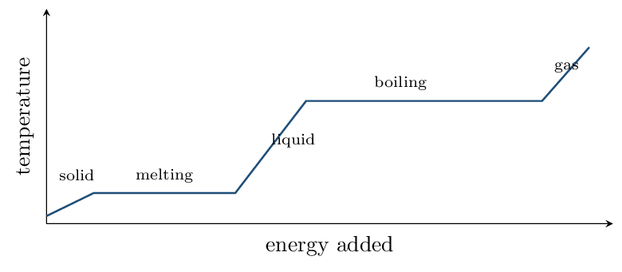

# Guided Notes

*Unit 6 • Thermochemistry*  
CED 6.1–6.9 • Zumdahl Ch 6, §8.8, §10.8 • 5 blocks

[← all lessons](../index.md)

---

> 📌 **The one habit this unit runs on**
>
> Nearly every error in thermochemistry is a **sign** error, and nearly
> every sign error comes from losing track of *whose* point of view you
> are taking.
> 
> Fix the convention now and use it without exception: signs are always
> written **from the system's point of view**. Heat entering the system
> is positive; heat leaving is negative. When a reaction warms the water in a
> calorimeter, the water gained heat ($q_{\text{water}} > 0$) and the reaction
> lost it ($q_{\text{rxn}}  sides, and the exam will ask for both.

## Energy, Heat, and Direction CED 6.1–6.3 • Zumdahl §6.1

> 📌 **By the end you can…**
>
> - Classify processes as endothermic or exothermic and assign signs.
> - Explain heat transfer and thermal equilibrium at the particle level.

**Read:** Zumdahl §6.1 • PDF pp. 283–290

> 📌 **Retrieval warm-up**
>
> 1. Units of energy: joules (J)
> 2. Temperature measures the average
>    kinetic energy of particles.
> 3. Breaking a bond requires energy or releases it?
>    requires
> 4. Which has more energy, a gas or the same substance as a liquid?
>    gas

#### INSTRUCTION A • System, surroundings, and sign 25 min

### The convention that prevents most errors `CED 6.1`

`SP 5`

The system is the part you are studying — usually the reaction. The
surroundings are everything else, including the solvent, the
calorimeter, and the thermometer.

| **Process** | **Heat** | $q_{\text{system}}$ | **Surroundings** |
|---|---|---|---|
| Exothermic | released by the system | **negative** | warm up |
| Endothermic | absorbed by the system | **positive** | cool down |

> ⚠️ **AP trap**
>
> **The thermometer measures the surroundings, not the system.** A
> reaction that makes the beaker feel hot is *exothermic*, so its
> $\Delta H$ is negative — even though the temperature
> you measured went *up*.
> 
> This inversion is the most-missed idea in the unit. When a question gives
> you a temperature change, your first move should be to write down which
> thing changed temperature.

### Energy diagrams `CED 6.2`

An energy diagram plots potential energy against reaction progress.

- Products *below* reactants $\Rightarrow$
   exothermic, $\Delta H  0$.
- $\Delta H$ is the difference between
   products and reactants — and it says nothing
   about how fast the reaction goes.

#### INSTRUCTION B • Heat transfer and thermal equilibrium 20 min

### What actually moves `CED 6.3`

`SP 6`

Put a hot metal block into cool water. At the particle level:

- Fast-moving metal atoms collide with slower water molecules and
   transfer kinetic energy.
- Energy flows from hot to cold — always, and
   never the reverse on its own.
- Transfer continues until both reach the same
   temperature: thermal equilibrium.
- At equilibrium the transfer has not *stopped* — collisions
   continue, but energy now flows both ways at
   equal rates.

> 📌 **Heat is not a substance a body contains**
>
> Say “heat is transferred,” not “the block has a lot of heat.” Heat is
> energy *in transit* because of a temperature difference. What a body
> contains is internal energy; heat is what crosses the boundary.
> 
> The exam does penalize “the hot object gives its heat to the cold object”
> when the question asks for a particle-level explanation — it wants
> collisions and kinetic-energy transfer.

#### APPLICATION • Signs and directions 20 min

1. Ammonium nitrate dissolves and the beaker becomes noticeably cold.
   Give the sign of $q$ for the dissolving process, the sign for the
   water, and classify it. 
2. Two blocks of the same metal, one at 80 °C and one at
   20 °C, are placed in contact and left. Describe the
   final state and what is happening in it. 

> 📌 **Exit ticket**
>
> A reaction is run in solution and the thermometer reading rises from
> 22.0 °C to 28.4 °C. State the sign of
> $q_{\text{water}}$, the sign of $\Delta H_{\text{rxn}}$, and explain why
> they differ.

## Heat Capacity and Calorimetry CED 6.4 • Zumdahl §6.2

> 📌 **By the end you can…**
>
> - Use $q = mc\Delta T$ in both directions.
> - Determine $\Delta H$ per mole from calorimetry data.

**Read:** Zumdahl §6.2 • PDF pp. 290–297

> 📌 **Retrieval warm-up**
>
> 1. Exothermic means $q_{\text{system}}$ is:
>    negative
> 2. Heat flows from: hot to cold
> 3. Specific heat of water: 4.18 J/g/°C

#### INSTRUCTION A • The workhorse equation 25 min

### $q = mc\Delta T$ `CED 6.4`

`SP 5`

$$ q = mc\Delta T \qquad \Delta T = T_{\text{final}} - T_{\text{initial}} $$

Specific heat $c$ is the energy needed to raise 1 g by
1 °C. Water's is unusually
large at 4.18 J/g/°C, which is
why it is used as the absorbing medium in calorimetry and why coastal
climates are mild.

> 📘 **Worked example 1: straight substitution**
>
> How much energy raises 50.0 g of water from 20.0 °C
> to 80.0 °C?
> 
> $$ q = (50.0)(4.18)(60.0) = 12{,}540~\text{J} =    \mathbf{12.5}~\text{kJ} $$
> 
> Positive, because the water absorbed energy.

#### INSTRUCTION B • Calorimetry: from $q$ to $\Delta H$ per mole 20 min

### The two-step chain `CED 6.4`

`SP 5`

A calorimeter measures the temperature change of the *water*. Getting
to $\Delta H$ takes two moves:

1. $q_{\text{water}} = mc\Delta T$, then $q_{\text{rxn}}$ equals
   $-q_{\text{water}}$.
2. Divide by the moles of the limiting reactant to get
   kJ/mol.

> 📘 **Worked example 2: a full calorimetry problem**
>
> A reaction is run in 100.0 g of water in a coffee-cup
> calorimeter. The temperature rises by 5.20 °C, and
> 0.0250 mol of the limiting reactant was used.
> 
> **Step 1 — heat absorbed by the water:**
> 
> $$ q_{\text{water}} = (100.0)(4.18)(5.20) = 2174~\text{J} $$
> 
> The water *gained* it, so the reaction *lost* it:
> $q_{\text{rxn}} = -2174$ J.
> 
> **Step 2 — per mole:**
> 
> $$ \Delta H = \frac{-2174~\text{J}}{0.0250~\text{mol}}    = -86{,}900~\mathrm{J/mol} =    \mathbf{-86.9}~\mathrm{kJ/mol} $$
> 
> Negative, as the temperature rise already told us.

> ⚠️ **AP trap**
>
> Two habits worth building here. First, **the minus sign in step 1 is
> not optional** — omitting it reports an exothermic reaction as
> endothermic. Second, **$\Delta H$ is per mole**; a bare answer in
> kilojoules with no “per mole” loses the point even when the arithmetic is
> right.
> 
> Note also that we used the *water's* mass and specific heat, not the
> reactants'. The water is the surroundings, and it is what the thermometer
> was in.

#### APPLICATION • Thermal equilibrium calculations 20 min

1. A 50.0 g metal block at 100.0 °C is dropped
   into 100.0 g of water at 22.0 °C. The final
   temperature is 24.6 °C. Find the specific heat of the
   metal.
   *(working space)*
2. Why does the water's temperature change so little while the metal's
   changes by more than 75 °C?
   

> 📌 **Exit ticket**
>
> In a calorimetry problem, whose mass and whose specific heat go into
> $q = mc\Delta T$, and why?

## Energy of Phase Changes CED 6.5 • Zumdahl §10.8

> 📌 **By the end you can…**
>
> - Calculate the energy of a phase change.
> - Read a heating curve and choose the right equation for each region.

**Read:** Zumdahl §10.8 • PDF pp. 523–530

> 📌 **Retrieval warm-up**
>
> 1. $q = mc\Delta T$ applies when what is changing?
>    temperature
> 2. $\Delta H_{\text{fus}}$ for water:
>    6.02 kJ/mol
> 3. $\Delta H_{\text{vap}}$ for water:
>    40.7 kJ/mol

#### INSTRUCTION A • Temperature does not change during a phase change 25 min

### Two different equations `CED 6.5`

`SP 5`

> 
**Temperature changing, one phase:** $q = mc\Delta T$   

**Phase changing, temperature constant:**
$q = n\Delta H_{\text{fus}}$ or $n\Delta H_{\text{vap}}$

> ⚠️ **AP trap**
>
> **You cannot use $q = mc\Delta T$ during a phase change**, because
> $\Delta T$ is zero — it would give $q = 0$, which is
> plainly wrong for melting a block of ice.
> 
> During melting or boiling, the added energy goes into overcoming
> **intermolecular forces**, not into speeding the particles up. That is
> why the temperature holds steady on a heating curve, and it is the
> explanation the exam wants.

> 📘 **Worked example 3: melting and boiling**
>
> **Melt 36.0 g of ice at 0 °C.**
> $n = 36.0/18.02 = 2.00\,\mathrm{mol}$;
> $q = (2.00)(6.02) = \mathbf{12.0}~\text{kJ}$.
> 
> **Vaporize 18.0 g of water at 100 °C.**
> $n = 1.00\,\mathrm{mol}$; $q = (1.00)(40.7) = \mathbf{40.7}~\text{kJ}$.
> 
> Vaporizing one mole costs nearly **seven times** as much as melting
> one mole — because melting only loosens the lattice, while boiling
> separates the molecules entirely.

#### INSTRUCTION B • Reading a heating curve 20 min

### Five regions, five calculations `CED 6.5`

`SP 4`

The **sloped** regions use $q = mc\Delta T$; the
**flat** regions use $q = n\Delta H$.

The boiling plateau is always much longer than the
melting plateau, for the same reason vaporization costs more energy.

> 📘 **Worked example 4: ice to steam, all five regions**
>
> Take 25.0 g of ice from -10.0 °C to steam at
> 110.0 °C. ($c_{\text{ice}} = 2.09$,
> $c_{\text{water}} = 4.18$, $c_{\text{steam}} = 2.03$
> J/g/°C; $n = 25.0/18.02 = 1.39\,\mathrm{mol}$)
> 
> | **Region** | **Equation** | **$q$ (kJ)** |
> |---|---|---|
> | warm ice $-10 \to 0$ | $mc\Delta T$ | 0.52 |
> | melt at 0 | thinsp; | deg;C | $n\Delta H_{\text{fus}}$ | 8.35 |
> | warm water $0 \to 100$ | $mc\Delta T$ | 10.45 |
> | boil at 100 | thinsp; | deg;C | $n\Delta H_{\text{vap}}$ | **56.47** |
> | warm steam $100 \to 110$ | $mc\Delta T$ | 0.51 |
> | **Total** |  | **76.30** |

Boiling alone is **74%** of the total. If a heating-curve question
asks which step dominates, that is nearly always the answer.

#### APPLICATION • Phase-change reasoning 20 min

1. Calculate the energy to melt 90.0 g of ice at
   0 °C.
   *(working space)*
2. Explain, in terms of intermolecular forces, why the temperature
   stays constant while ice melts even though energy is being added.
   
3. Why is a steam burn worse than a burn from the same mass of water
   at 100 °C? 

> 📌 **Exit ticket**
>
> Which region of a heating curve requires the most energy for water, and
> why?

## Enthalpy of Reaction and Hess's Law CED 6.6, 6.9 • Zumdahl §6.2–6.3

> 📌 **By the end you can…**
>
> - Scale $\Delta H$ with the amount of substance reacting.
> - Combine reactions using Hess's law.

**Read:** Zumdahl §6.2–6.3 • PDF pp. 290–301

> 📌 **Retrieval warm-up**
>
> 1. During a phase change, $\Delta T$ is:
>    zero
> 2. $\Delta H_{\text{vap}}$ is larger than
>    $\Delta H_{\text{fus}}$ because:
>    boiling separates molecules entirely
> 3. Exothermic $\Delta H$ is: negative

#### INSTRUCTION A • $\Delta H$ is an extensive quantity 25 min

### Enthalpy scales with amount `CED 6.6`

`SP 5`

A thermochemical equation carries its $\Delta H$ for the amounts written:

$$ \text{CH₄(g) + 2O₂(g) → CO₂(g) + 2H₂O(l)} \qquad    \Delta H = -890.5~\text{kJ} $$

means 890.5 kJ released per *one mole* of CH₄.

- Double the coefficients $\Rightarrow$ $\Delta H$
   doubles.
- Reverse the reaction $\Rightarrow$ $\Delta H$
   changes sign.
- Half a mole of CH₄ releases
   445.3 kJ.

#### INSTRUCTION B • Hess's law 20 min

### Enthalpy is a state function `CED 6.9`

`SP 5`

> 
$\Delta H$ depends only on the initial and final states,   

never on the route taken.   

So reactions can be added, and their $\Delta H$ values add with them.

Two rules when manipulating:

1. Reverse a reaction $\Rightarrow$
   flip the sign of $\Delta H$.
2. Multiply a reaction by $n$ $\Rightarrow$
   multiply $\Delta H$ by $n$.

> 📘 **Worked example 5: finding an unmeasurable $\Delta H$**
>
> Burning carbon straight to CO cannot be done cleanly — some
> CO₂ always forms. But these two *can* be measured:
> 
> $$ \begin{align*}   (1)&\quad \text{C(gr) + O₂(g) → CO₂(g)}      &\Delta H &= -393.5~\text{kJ} \\   (2)&\quad \text{CO(g) + tfrac{1}{2}O₂(g) → CO₂(g)}      &\Delta H &= -283.0~\text{kJ} \end{align*} $$
> 
> **Target:** C(gr) + tfrac{1}{2}O₂(g) → CO(g).
> 
> Take (1) as written, and *reverse* (2) so CO ends up as a
> product — flipping its sign:
> 
> $$ \begin{align*}   \text{C(gr) + O₂ & → CO₂} &\Delta H &= -393.5 \\   \text{CO₂ & → CO + tfrac{1}{2}O₂} &\Delta H &= +283.0 \\   \hline   \text{C(gr) + tfrac{1}{2}O₂ & → CO} &\Delta H &= \mathbf{-110.5}~\text{kJ} \end{align*} $$
> 
> CO₂ cancels, and half the oxygen cancels. The answer matches the
> tabulated $\Delta H_f^\circ$ of CO exactly — a good check.

#### APPLICATION • Scaling and combining 20 min

1. For 2CO(g) + O₂(g) → 2CO₂(g),
   $\Delta H = -566$ kJ. How much energy is released by
   1.00 mol of CO? 283 kJ
2. Give $\Delta H$ for 2CO₂(g) → 2CO(g) + O₂(g).
   $+566$ kJ
3. A student combining reactions forgets to flip the sign when
   reversing one. If the correct answer is $-110.5$ kJ, what do they
   report, and what is the size of the error?
   

> 📌 **Exit ticket**
>
> Why does Hess's law work — what property of enthalpy makes it valid?

## Bond and Formation Enthalpies CED 6.7, 6.8 • Zumdahl §8.8, §6.4

> 📌 **By the end you can…**
>
> - Estimate $\Delta H$ from average bond enthalpies.
> - Calculate $\Delta H^\circ$ from enthalpies of formation.

**Read:** Zumdahl §8.8 • PDF pp. 412–415 **Read:** Zumdahl §6.4 • PDF pp. 301–308

> 📌 **Retrieval warm-up**
>
> 1. Reversing a reaction does what to $\Delta H$?
>    flips the sign
> 2. Breaking bonds is endothermic or exothermic?
>    endothermic
> 3. $\Delta H_f^\circ$ of O₂(g): 0

#### INSTRUCTION A • Two routes with opposite conventions 25 min

### Bond enthalpies `CED 6.7`

`SP 5`

Breaking a bond always requires energy; forming one
always releases it. So:

$$ \boxed{\;\Delta H = \sum D(\text{bonds broken})    - \sum D(\text{bonds formed})\;} $$

> ⚠️ **AP trap**
>
> **Broken minus formed** — the reverse of every other convention in
> this unit, where it is products minus reactants. Bonds broken are on the
> reactant side, so the order looks inverted, and students who have just
> finished Hess's law reliably flip it.
> 
> A sanity check that costs nothing: if more energy is released forming bonds
> than was spent breaking them, the reaction is exothermic and your answer
> must come out *negative*.

> 📘 **Worked example 6: hydrogen and chlorine**
>
> H₂(g) + Cl₂(g) → 2HCl(g), using
> $D(\text{H-H}) = 432$, $D(\text{Cl-Cl}) = 239$, $D(\text{H-Cl}) = 427$
> kJ/mol.
> 
> **Broken:** $432 + 239 = 671$ kJ.   
> 
> **Formed:** $2(427) = 854$ kJ.
> 
> $$ \Delta H = 671 - 854 = \mathbf{-183}~\text{kJ} $$
> 
> Exothermic, as the negative sign should confirm.

### Enthalpies of formation `CED 6.8`

$\Delta H_f^\circ$ is the enthalpy change forming **one mole** of a
compound from its elements in their standard states. By definition, an
element in its standard state has $\Delta H_f^\circ =$
0.

$$ \Delta H^\circ_{\text{rxn}} = \sum n\Delta H_f^\circ(\text{products})    - \sum n\Delta H_f^\circ(\text{reactants}) $$

> 📘 **Worked example 7: the same reaction, two routes**
>
> CH₄(g) + 2O₂(g) → CO₂(g) + 2H₂O(g)
> 
> **From $\Delta H_f^\circ$** (CH₄ $-75$, CO₂ $-393.5$,
> H₂O(g) $-242$, O₂ $0$):
> 
> $$ \Delta H^\circ = [-393.5 + 2(-242)] - [-75 + 0] =    -877.5 + 75 = \mathbf{-802.5}~\text{kJ} $$
> 
> **From bond enthalpies:** broken $4(413) + 2(495) = 2642$;
> formed $2(799) + 4(467) = 3466$; $\Delta H = \mathbf{-824}$ kJ.
> 
> **They disagree by about 22 kJ — and that is expected.** Bond
> enthalpies are *averages* over many molecules and ignore the specific
> molecular environment. Formation enthalpies are measured for the actual
> substances. When a question gives you both, use $\Delta H_f^\circ$; use
> bond enthalpies when that is all you have, and call the result an estimate.

#### APPLICATION • Both routes 20 min

Calculate $\Delta H^\circ$ for N₂ + 3H₂ → 2NH₃ from
        $\Delta H_f^\circ(\text{NH₃}) = -46$ kJ/mol. 

*(working space)*

        

Now estimate it from bond enthalpies
        (N#N 941, H-H 432, N-H 391).
        

*(working space)*

        

Account for the difference between your two answers.
        

> 📌 **Exit ticket**
>
> State the two enthalpy expressions used in this block and say which one
> runs backwards relative to the other.

---

*AP Chemistry course materials • student edition • CC BY-NC-SA 4.0*
