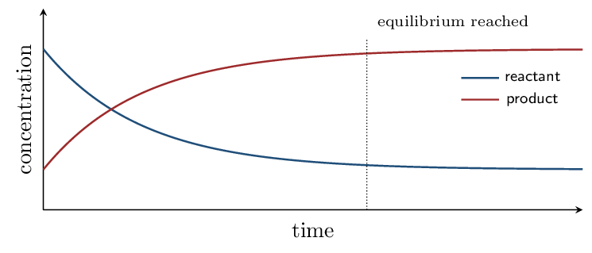

# Guided Notes

*Unit 7 • Equilibrium*  
CED 7.1–7.12 • Zumdahl Ch 13, §16.1 • 8 blocks

[← all lessons](../index.md)

---

> 📌 **The comparison this whole unit runs on**
>
> One question answers almost everything in this unit:
> **how does $Q$ compare with $K$?**
> 
> | $Q  K$ | too many products | shifts **left** |

That single comparison tells you which way a fresh mixture will move,
whether a system has arrived, what a disturbance will do, and — in the
last block — whether a precipitate forms. Le Ch\^atelier's principle is a
shortcut for it, not a separate idea.

## Dynamic Equilibrium CED 7.1–7.2 • Zumdahl §13.1

> 📌 **By the end you can…**
>
> - Describe equilibrium as equal forward and reverse rates.
> - Interpret concentration-time graphs approaching equilibrium.

**Read:** Zumdahl §13.1 • PDF pp. 651–654

> 📌 **Retrieval warm-up**
>
> 1. A reversible reaction is written with what symbol?
>    $\rightleftharpoons$
> 2. Rate depends on: concentration
> 3. As reactant is consumed, the forward rate:
>    decreases
> 4. As product builds up, the reverse rate:
>    increases

#### INSTRUCTION A • What “equilibrium” actually means 25 min

### Equal rates, not equal amounts `CED 7.1`

`SP 6`

Start with pure reactants. The forward rate is at its
maximum and the reverse rate is
zero. As the reaction proceeds:

- Reactant concentration falls, so the forward rate
   falls.
- Product concentration rises, so the reverse rate
   rises.
- When the two rates become equal, concentrations
   stop changing. That is dynamic equilibrium.

> ⚠️ **AP trap**
>
> **Equilibrium does not mean equal concentrations.** It means equal
> *rates*. The concentrations at equilibrium are almost never equal —
> their ratio is fixed by $K$, which can be $10^{-10}$ or $10^{10}$.
> 
> It also does not mean the reaction has stopped. Both directions continue at
> the same rate, which is why the word is *dynamic*. A question asking
> “what is happening at equilibrium?” wants that sentence.

Both curves level off — and they level off at
*different* heights, which is the graphical version of the trap above.

#### APPLICATION • Reading the graph 20 min

1. At the moment equilibrium is reached, compare the forward and
   reverse rates, and compare the concentrations.
   
2. A student says “the reaction stopped.” Correct them.
   
3. How would the graph differ for a reaction with a very large $K$?
   

> 📌 **Exit ticket**
>
> Give two things that are equal at equilibrium and one thing that generally
> is not.

## $Q$, $K$, and Calculating Them CED 7.3–7.4 • Zumdahl §13.2–13.4

> 📌 **By the end you can…**
>
> - Write $K$ and $Q$ expressions correctly.
> - Calculate $K$ from equilibrium data.

**Read:** Zumdahl §13.2–13.4 • PDF pp. 654–662

> 📌 **Retrieval warm-up**
>
> 1. Equilibrium means equal: rates
> 2. Coefficients become what in a $K$ expression?
>    exponents
> 3. Which species are omitted from $K$?
>    pure solids and liquids

#### INSTRUCTION A • Writing the expression 25 min

### $K$ and $Q$ have the same form `CED 7.3`

`SP 5`

For aA + bB ⇌ cC + dD:

$$ K = \frac{[\text{C}]^c[\text{D}]^d}{[\text{A}]^a[\text{B}]^b} $$

$Q$ has the *identical* form but uses concentrations at
any moment, not necessarily equilibrium ones.

> ⚠️ **AP trap**
>
> **Omit pure solids and pure liquids.** Their “concentration” does not
> vary — a bigger lump of solid is not more concentrated — so they carry
> no term. Aqueous species and gases always appear.
> 
> Watch for water: H₂O(l) as a solvent is omitted, but H₂O(g) in a
> gas-phase reaction is *included*. The state symbol is doing real work
> and is not decoration.

> 📘 **Worked example 1: expressions**
>
> $$ \begin{align*}   \text{N₂(g) + 3H₂(g) & ⇌ 2NH₃(g)}     &K &= \frac{[\text{NH₃}]^2}{[\text{N₂}][\text{H₂}]^3} \0.3em]   \text{CaCO₃(s) & ⇌ CaO(s) + CO₂(g)}     &K &= [\text{CO₂}] \0.3em]   \text{2H₂O(l) & ⇌ 2H₂(g) + O₂(g)}     &K &= [\text{H₂}]^2[\text{O₂}] \end{align*} $$
> 
> The second has only one term — both solids drop out. The third omits
> liquid water but would keep it if it were steam.

#### INSTRUCTION B • Calculating $K$ 20 min

### From equilibrium concentrations `CED 7.4`

`SP 5`

> 📘 **Worked example 2: substituting into $K$**
>
> At equilibrium a vessel contains $[\text{N₂}] = 0.50$,
> $[\text{H₂}] = 0.30$, $[\text{NH₃}] = 0.20$ M for
> N₂ + 3H₂ ⇌ 2NH₃.
> 
> $$ K = \frac{(0.20)^2}{(0.50)(0.30)^3}      = \frac{0.040}{(0.50)(0.027)} = \frac{0.040}{0.0135}      = \mathbf{3.0} $$
> 
> The cube on hydrogen is where marks are lost — $(0.30)^3 = 0.027$, not
> $0.90$.

### $K_p$ and $K_c$ `CED 7.4`

For gases, $K$ may be written with partial pressures:

$$ K_p = K_c(RT)^{\Delta n} \qquad    \Delta n = \text{mol gas products} - \text{mol gas reactants} $$

When $\Delta n = 0$, $K_p$ and $K_c$ are equal.

> 📘 **Worked example 3: converting**
>
> For N₂ + 3H₂ ⇌ 2NH₃ at 500 K with
> $K_c = 0.50$: $\Delta n = 2 - 4 = -2$.
> 
> $$ K_p = (0.50)[(0.08206)(500)]^{-2} = \frac{0.50}{(41.03)^2}    = \mathbf{3.0\times10^{-4}} $$

#### APPLICATION • Expressions and values 20 min

1. Write $K$ for 2SO₂(g) + O₂(g) ⇌ 2SO₃(g).
   $[\text{SO₃}]^2/([\text{SO₂}]^2[\text{O₂}])$
2. Write $K$ for Fe₃O₄(s) + 4H₂(g) ⇌ 3Fe(s) + 4H₂O(g).
   $[\text{H₂O}]^4/[\text{H₂}]^4$
3. At equilibrium $[\text{H₂}] = 0.20$, $[\text{I₂}] = 0.40$,
   $[\text{HI}] = 0.60$ M. Find $K$ for
   H₂ + I₂ ⇌ 2HI.
   *(working space)*

> 📌 **Exit ticket**
>
> Why do pure solids and liquids not appear in $K$, and what determines
> whether water appears?

## Magnitude and Properties of $K$ CED 7.5–7.6 • Zumdahl §13.3–13.5

> 📌 **By the end you can…**
>
> - Interpret the size of $K$.
> - Adjust $K$ when a reaction is manipulated.

**Read:** Zumdahl §13.3–13.5 • PDF pp. 658–671

> 📌 **Retrieval warm-up**
>
> 1. $K$ for CaCO₃(s) ⇌ CaO(s) + CO₂(g):
>    $[\text{CO₂}]$
> 2. $K_p = K_c(RT)^{?}$: $\Delta n$
> 3. Only what change alters the value of $K$?
>    temperature

#### INSTRUCTION A • What the number tells you 25 min

### Reading the magnitude `CED 7.5`

`SP 5`

| $K \gg 1$ (say $> 10^2$) | **products** strongly favored |
|---|---|
| $K \approx 1$ | appreciable amounts of both |
| $K \ll 1$ (say $ ⚠️ **AP trap**
>
> $K$ says *how far*, never *how fast*. A reaction with
> $K = 10^{40}$ can be immeasurably slow — that is the kinetic control you
> met in Unit 5. The two questions are independent, and the exam likes pairing
> them to see whether you have separated them.

#### INSTRUCTION B • Manipulating $K$ 20 min

### Four rules `CED 7.6`

`SP 5`

| **Change to the equation** | **New $K$** |
|---|---|
| reverse it | $1/K$ |
| multiply the coefficients by $n$ | $K^n$ |
| divide the coefficients by $n$ | $K^{1/n}$ |
| add two reactions | $K_1 \times K_2$ |

> 📘 **Worked example 4: one reaction, four values**
>
> If $K = 4.0$ for A + B ⇌ C, then:
> 
> - C ⇌ A + B has $K = 1/4.0 = \mathbf{0.25}$.
> - 2A + 2B ⇌ 2C has $K = (4.0)^2 = \mathbf{16}$.
> - tfrac{1}{2}A + tfrac{1}{2}B ⇌ tfrac{1}{2}C has
>    $K = \sqrt{4.0} = \mathbf{2.0}$.
> - Added to a second reaction with $K = 3.0$, the overall $K$ is
>    $(4.0)(3.0) = \mathbf{12}$.
> 
> Notice these are *multiplicative* operations, unlike $\Delta H$ in
> Unit 6, which was additive. Equilibrium constants multiply where enthalpies
> add.

#### APPLICATION • Using the rules 20 min

1. $K = 2.5\times10^{-3}$ for a reaction. Give $K$ for the reverse.
   $4.0\times10^{2}$
2. Classify each as products-favored, reactants-favored, or mixed:
   $K = 1\times10^{-10}$, $K = 1.5$, $K = 3\times10^{6}$.
   
3. A reaction has $K = 10^{35}$ but no observable change occurs when
   the reactants are mixed. Is the value wrong? Explain.
   

> 📌 **Exit ticket**
>
> State what happens to $K$ when a reaction is reversed and when its
> coefficients are doubled, and name the one change that alters $K$ for a
> given reaction.

## ICE Tables CED 7.7 • Zumdahl §13.6

> 📌 **By the end you can…**
>
> - Set up and solve an ICE table.
> - Apply and test the small-$x$ approximation.

**Read:** Zumdahl §13.6 • PDF pp. 671–676

> 📌 **Retrieval warm-up**
>
> 1. Reversing a reaction gives $K =$ $1/K$
> 2. $K \ll 1$ favors: reactants
> 3. BCA tables from Unit 4 tracked what?
>    moles, to completion

#### INSTRUCTION A • The table you already know 25 min

### ICE is BCA with an unknown `CED 7.7`

`SP 5`

ICE stands for Initial, Change, Equilibrium. It
is the Before/Change/After table from stoichiometry, with one difference:
the reaction stops partway, so the change is an unknown
$x$.

The change row is still driven by the coefficients —
if A has coefficient 1 and C has coefficient 2, then A changes by $-x$ and
C by $+2x$.

> 📘 **Worked example 5: the small-$x$ approximation**
>
> A ⇌ B + C with $K = 1.0\times10^{-5}$ and
> $[\text{A}]_0 = 0.100\,\mathrm{M}$.
> 
> |  | A | B | C |
> |---|---|---|---|
> | Initial | 0.100 | 0 | 0 |
> | Change | $-x$ | $+x$ | $+x$ |
> | Equilibrium | $0.100 - x$ | $x$ | $x$ |

$$ K = \frac{x^2}{0.100 - x} = 1.0\times10^{-5} $$

Because $K$ is very small, very little A reacts, so
$0.100 - x \approx 0.100$:

$$ x^2 \approx (1.0\times10^{-5})(0.100) = 1.0\times10^{-6}    \qquad x = \mathbf{1.0\times10^{-3}} $$

**Test it:** $x/[\text{A}]_0 = 1.0\%$, comfortably under 5%, so the
approximation is justified. ✓

> ⚠️ **AP trap**
>
> **The 5% check is part of the answer, not a formality.** An FRQ that
> asks you to justify an approximation wants the *number* and the
> comparison, not the assertion. “$x$ is small compared with 0.100” with no
> percentage earns nothing.
> 
> Rule of thumb: the approximation is safe when $K$ is small relative to the
> initial concentration — roughly $[\text{A}]_0/K > 400$.

#### APPLICATION • Running the table 20 min

1. A ⇌ 2B, $K = 4.0\times10^{-6}$,
   $[\text{A}]_0 = 0.50\,\mathrm{M}$. Find $[\text{B}]$ at equilibrium.
   *(working space)*
2. Why does a small $K$ make the approximation safe, in one sentence?
   

> 📌 **Exit ticket**
>
> State the two steps that must appear in a complete small-$x$ solution.

## When the Approximation Fails CED 7.7 • Zumdahl §13.6

> 📌 **By the end you can…**
>
> - Recognize when the small-$x$ approximation is invalid.
> - Solve the resulting quadratic or perfect square.

**Read:** Zumdahl §13.6 • PDF pp. 671–676

> 📌 **Retrieval warm-up**
>
> 1. The approximation threshold: 5%
> 2. ICE stands for: Initial, Change, Equilibrium
> 3. Large $K$ means the approximation is likely to be:
>    invalid

#### INSTRUCTION A • The check that saves you 25 min

### A failed approximation, quantified `CED 7.7`

`SP 5`

> 📘 **Worked example 6: the same setup, a bigger $K$**
>
> A ⇌ B + C with $[\text{A}]_0 = 0.100$ but now $K = 0.20$.
> 
> **Try the approximation:**
> $x^2 \approx (0.20)(0.100)$ gives $x = 0.141$.
> 
> **Test it:** $x/[\text{A}]_0 = 141\%$ — the “small” $x$ is larger
> than the entire initial concentration. **Invalid.**
> 
> **Solve properly:** $x^2 = 0.20(0.100 - x)$, so
> $x^2 + 0.20x - 0.020 = 0$ and
> 
> $$ x = \frac{-0.20 + \sqrt{0.040 + 0.080}}{2} = \mathbf{0.073} $$
> 
> The approximation was wrong by about **93%**. This is why the check
> is not optional.

#### INSTRUCTION B • Perfect squares 20 min

### When both sides are squares, take the root `CED 7.7`

`SP 5`

Some ICE expressions avoid the quadratic formula entirely.

> 📘 **Worked example 7: hydrogen iodide**
>
> H₂ + I₂ ⇌ 2HI, $K = 50.0$, both reactants starting at
> 1.00 M.
> 
> |  | H₂ | I₂ | HI |
> |---|---|---|---|
> | Initial | 1.00 | 1.00 | 0 |
> | Change | $-x$ | $-x$ | $+2x$ |
> | Equilibrium | $1.00-x$ | $1.00-x$ | $2x$ |

$$ K = \frac{(2x)^2}{(1.00-x)(1.00-x)}      = \left(\frac{2x}{1.00-x}\right)^2 = 50.0 $$

Both sides are perfect squares, so take the square root:

$$ \frac{2x}{1.00-x} = \sqrt{50.0} = 7.07 $$

$$ 2x = 7.07 - 7.07x \quad\Longrightarrow\quad 9.07x = 7.07    \quad\Longrightarrow\quad x = \mathbf{0.780} $$

So $[\text{H₂}] = [\text{I₂}] = \mathbf{0.220}$ and
$[\text{HI}] = \mathbf{1.56}$ M.

**Check:** $(1.56)^2/(0.220)^2 = 50.0$ ✓ — always worth
30 seconds.

#### APPLICATION • Choosing a method 20 min

1. For each, say whether the small-$x$ approximation is likely valid:
   (i) $K = 10^{-8}$, $[\text{A}]_0 = 1.0$;
   (ii) $K = 2.0$, $[\text{A}]_0 = 0.10$;
   (iii) $K = 10^{-6}$, $[\text{A}]_0 = 10^{-5}$.
   
2. Solve A ⇌ 2B with $K = 0.50$ and
   $[\text{A}]_0 = 1.00$ M, using the quadratic.
   *(working space)*

> 📌 **Exit ticket**
>
> Why is it the *ratio* $[\text{A}]_0/K$, rather than $K$ alone, that
> decides whether the approximation works?

## Representations and Le Ch\^atelier CED 7.8–7.9 • Zumdahl §13.1, §13.7

> 📌 **By the end you can…**
>
> - Interpret particulate and graphical representations of equilibrium.
> - Predict the effect of a disturbance.

**Read:** Zumdahl §13.1, §13.7 • PDF pp. 651–654, 676–683

> 📌 **Retrieval warm-up**
>
> 1. Failed approximation $\Rightarrow$ use the:
>    quadratic
> 2. At equilibrium, $Q$ equals: $K$
> 3. Only what changes $K$? temperature

#### INSTRUCTION A • Le Ch\^atelier's principle 25 min

### A system opposes the change imposed on it `CED 7.9`

`SP 6`

| **Disturbance** | **Shift** | **Does $K$ change?** |
|---|---|---|
| add reactant | right | no |
| add product | left | no |
| remove product | right | no |
| compress (smaller $V$) | toward fewer moles of gas | no |
| expand (larger $V$) | toward more moles of gas | no |
| add inert gas at constant $V$ | **no shift** | no |
| add a catalyst | **no shift** | no |
| raise $T$, endothermic forward | right | **yes, increases** |
| raise $T$, exothermic forward | left | **yes, decreases** |

> ⚠️ **AP trap**
>
> **Only temperature changes the value of $K$.** Everything else moves
> the system *along* the same curve until $Q$ returns to the unchanged
> $K$. A response saying “adding more reactant increases $K$” is marked
> wrong every time.
> 
> Two more that recur: an **inert gas** added at constant volume changes
> the total pressure but not any partial pressure or concentration, so
> nothing shifts. And a **catalyst** speeds both directions equally —
> equilibrium arrives sooner, in the same place.

### Temperature as a reactant or product `CED 7.9`

Treat energy as a term in the equation. For an exothermic reaction, write
heat as a product; adding heat then pushes the
equilibrium left, exactly as adding any other product
would.

#### INSTRUCTION B • Particulate representations 20 min

### Reading a picture of an equilibrium `CED 7.8`

`SP 1`

When a question shows before-and-after particle diagrams:

- Count particles and check that atoms are
   conserved.
- Compare the ratio of products to reactants against
   $K$.
- Two diagrams showing *no change in counts* between successive
   times indicate the system has reached
   equilibrium.

#### APPLICATION • Predicting shifts 20 min

For N₂(g) + 3H₂(g) ⇌ 2NH₃(g), $\Delta H = -92$ kJ:

1. Add N₂: shifts right
2. Remove NH₃: shifts right
3. Compress the vessel: right — 4 mol gas to 2
4. Add argon at constant volume:
   no shift
5. Raise the temperature:
   
6. Add a catalyst: no shift; equilibrium sooner

> 📌 **Exit ticket**
>
> Name the only disturbance that changes the value of $K$, and explain why
> the others do not.

## $Q$ versus $K$ Quantitatively CED 7.10 • Zumdahl §13.7

> 📌 **By the end you can…**
>
> - Calculate $Q$ and compare it with $K$ to predict direction.
> - Justify a Le Ch\^atelier prediction quantitatively.

**Read:** Zumdahl §13.7 • PDF pp. 676–683

> 📌 **Retrieval warm-up**
>
> 1. Adding a product shifts the equilibrium:
>    left
> 2. An inert gas at constant volume causes:
>    no shift
> 3. Compressing shifts toward:
>    fewer moles of gas

#### INSTRUCTION A • The calculation behind the principle 25 min

### $Q$ is the answer to “which way?” `CED 7.10`

`SP 5`

Le Ch\^atelier tells you the direction; $Q$ *proves* it. On an FRQ,
the quantitative justification is usually worth the point that the
qualitative one is not.

> 📘 **Worked example 8: predicting with $Q$**
>
> For H₂ + I₂ ⇌ 2HI, $K = 4.5$. A vessel is charged with
> $[\text{H₂}] = 0.40$, $[\text{I₂}] = 0.30$, $[\text{HI}] = 0.40$ M.
> 
> $$ Q = \frac{(0.40)^2}{(0.40)(0.30)} = \frac{0.16}{0.12} = 1.3 $$
> 
> $Q = 1.3  proceeds **to the right** until $Q$ rises to 4.5.
> 
> Note that this required no Le Ch\^atelier reasoning at all — the
> comparison settles it directly, and it works even for a fresh mixture that
> was never at equilibrium.

> ⚠️ **AP trap**
>
> Le Ch\^atelier applies to *disturbing a system already at
> equilibrium*. $Q$ versus $K$ works for **any** mixture, equilibrium or
> not. When a question gives you arbitrary starting concentrations, $Q$ is the
> tool — Le Ch\^atelier has nothing to say about a mixture that was never at
> equilibrium in the first place.

#### APPLICATION • Direction from data 20 min

$K = 4.5$ for H₂ + I₂ ⇌ 2HI. For each mixture, calculate
        $Q$ and state the direction:
        

$[\text{H₂}]=[\text{I₂}]=[\text{HI}]=0.50$
                $Q = 1.0$; shifts right

$[\text{H₂}]=0.10$, $[\text{I₂}]=0.10$, $[\text{HI}]=0.30$
                $Q = 9.0$; shifts left
        

A system at equilibrium has extra product added. Explain, using
        $Q$, why it shifts left. 

> 📌 **Exit ticket**
>
> When is $Q$ the right tool and Le Ch\^atelier's principle the wrong one?

## Solubility Equilibria CED 7.11–7.12 • Zumdahl §16.1

> 📌 **By the end you can…**
>
> - Relate $K_{sp}$ to molar solubility.
> - Explain and calculate the common-ion effect.

**Read:** Zumdahl §16.1 • PDF pp. 805–812

> 📌 **Retrieval warm-up**
>
> 1. $Q     right
> 2. Pure solids appear in $K$? no
> 3. Adding a product shifts equilibrium:
>    left

#### INSTRUCTION A • The same machinery, applied to a solid 25 min

### $K_{sp}$ is just $K$ `CED 7.11`

`SP 5`

A saturated solution is a system at equilibrium with undissolved solid:

$$ \text{CaF₂(s) ⇌ Ca²⁺(aq) + 2F⁻(aq)} \qquad    K_{sp} = [\text{Ca²⁺}][\text{F⁻}]^2 $$

The solid is omitted for the reason you already know — it is a
pure solid.

| **Type** | **$K_{sp}$ in terms of $s$** | **Solubility** |
|---|---|---|
| MX | $s^2$ | $s = \sqrt{K_{sp}}$ |
| MX₂ or M₂X | $4s^3$ | $s = \sqrt[3]{K_{sp}/4}$ |

> ⚠️ **AP trap**
>
> **$K_{sp}$ is a constant; solubility is a position.** $K_{sp}$ has one
> value at a given temperature; the solubility changes with whatever else is
> in the water.
> 
> And **$K_{sp}$ values may be compared directly only for salts
> producing the same number of ions.** CaF₂
> ($K_{sp} = 4.0\times10^{-11}$) is far more soluble than BaCrO₄
> ($8.5\times10^{-11}$) despite the smaller constant, because $s$ enters to
> different powers.

#### INSTRUCTION B • The common-ion effect 20 min

### Le Ch\^atelier, one last time `CED 7.12`

`SP 6`

Dissolve a salt in a solution already containing one of its ions and you
have added a product. The equilibrium shifts
left, so *less* dissolves — while $K_{sp}$
stays exactly the same.

> 📘 **Worked example 9: silver chloride**
>
> $K_{sp}(\text{AgCl}) = 1.6\times10^{-10}$.
> 
> **In pure water:** $s = \sqrt{1.6\times10^{-10}} = \mathbf{1.3\times10^{-5}}$ M.
> 
> **In 0.10 M NaCl:** the chloride is essentially all
> from the NaCl, so
> 
> $$ s = \frac{K_{sp}}{[\text{Cl⁻}]} = \frac{1.6\times10^{-10}}{0.10}    = \mathbf{1.6\times10^{-9}}~\text{M} $$
> 
> Suppressed by a factor of about **7900** — and $K_{sp}$ never moved.

#### APPLICATION • Solubility calculations 20 min

Calculate the molar solubility of CaF₂
        ($K_{sp} = 4.0\times10^{-11}$) in pure water.
        

*(working space)*

        

Calculate it in 0.025 M NaF.
        

*(working space)*

        

State what happened to $K_{sp}$ between (a) and (b), and why.
        

> 📌 **Exit ticket**
>
> Explain the common-ion effect using $Q$ rather than Le Ch\^atelier.

---

*AP Chemistry course materials • student edition • CC BY-NC-SA 4.0*
